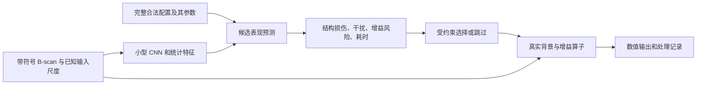

# 两类处理的跨领域 ML 研究：方法、架构与证据

日期：2026-09-23。状态：第二轮定向研究；技术路线建议，尚无本项目训练或实测性能结论。

> 后续范围调整：用户已决定依托现有非显性滑坡项目先做特化，泛用性延期。本文的方法与指标证据继续参考；第 4.1 节通用/特化双模式及跨领域泛化路线属于历史建议，不是当前实现任务。最新安排见[首版范围第 7 节](2026-09-23_v1_scope.md#7-最新决定先完成非显性滑坡场景特化)。

范围沿用[首版范围决定](2026-09-23_v1_scope.md)：仅背景与相干杂波抑制、增益与衰减补偿。跨领域文献用于回答这两类问题，不扩展成成像、去噪、检测或显示产品。配套文件为[评价协议草案](2026-09-23_v1_evaluation_protocol.md)。

后续数据安排：现有测线保留到后期，当前先做仿真开发与评价研究。新增 CR-Net 数据细节、ULCR-Net、SGC 作者预印本、WNNM 及滑坡仿真依据见[第三轮研究](2026-09-23_gprmax_simulation_first_evidence.md)；本文中的实测混合训练路线不作为当前执行任务。

## 1. 当前判断

**先学习“如何选择和配置已有算子”，是当前最合适的起步研究路线。** 先用固定流程、规则和有限搜索建立参照，再比较轻量配置选择模型。小型 CNN、多任务头和模型展开网络值得研究；是否采用，需要本项目的对照结果支持。

依据不是某一篇论文证明了这条路线在本系统最优，而是：逐实例算法选择已有成熟范式 [E03]；ISP 展示了模块选择与参数控制的可行性 [E01–E02]；GPR 已出现共享特征加任务分支的自动配置研究 [E11]。这些是方法依据，迁移后的有效性仍待验证。

本轮一个关键发现：**已有 GPR 去杂波网络的“正确输出”可能与本项目相反。** CR-Net 的多层案例明确将层间反射作为待去除成分 [E06，作者 PDF 第 12 页]。我们要保留地层，不能照搬其 clean 标签、数据构造或高分标准。

## 2. 原始来源与实际阅读范围

以下链接为原论文、作者公开稿、出版社或官方文档。所有阅读范围均截至本轮；“摘要”不能支撑未公开的网络层数、数据划分、指标实现或复现结论。没有用搜索引擎标注的抓取时间代替论文发表年份。

| ID | 原始来源 | 本轮阅读范围与可核实内容 | 本项目用途及边界 |
|---|---|---|---|
| E01 | Wang 等，**AdaptiveISP**，NeurIPS 2024；[论文 HTML](https://arxiv.org/html/2410.22939v1)、[作者代码](https://github.com/OpenImagingLab/AdaptiveISP) | 正文方法、目标及架构相关段落。CNN 策略/价值网络，离散模块与连续参数，检测奖励与计算代价。 | 借鉴受约束动作和成本；其 RGB、YOLO 奖励及 RL 收益不能直接迁到 GPR。 |
| E02 | Yu 等，**ReconfigISP**，ICCV 2021；[CVF 原文入口](https://openaccess.thecvf.com/content/ICCV2021/html/Yu_ReconfigISP_Reconfigurable_Camera_Image_Processing_Pipeline_ICCV_2021_paper.html) | 官方摘要、论文代理调优/实验相关节选。可微代理支持流程结构与参数搜索。 | 借鉴模块化搜索；小型候选库先直接运行真实算子，避免引入代理误差。 |
| E03 | Xu 等，**SATzilla: Portfolio-based Algorithm Selection for SAT**，JAIR 2008；[作者稿及期刊信息](https://arxiv.org/abs/1111.2249) | 摘要与出版信息。根据实例预测候选算法表现并选择。arXiv 入库是 2011 年，期刊是 2008 年。 | 支持“预测处理效果再选配置”的问题表述；SAT 运行时间目标不是雷达保真目标。 |
| E04 | Lindauer 等，**SMAC3**，JMLR 2022；[官方论文页](https://jmlr.org/papers/v23/21-0888.html) | 官方摘要/方法概述，面向条件参数空间的贝叶斯优化。 | 候选数变大时作为离线调参工具；它与部署时的逐测线选择器不同。 |
| E05 | Eimer 等，**DACBench**，IJCAI 2021；[会议原文](https://www.ijcai.org/proceedings/2021/230) | 官方摘要、论文引言节选，动态配置的状态、动作、奖励及基准接口。 | 借鉴统一实验预算与静态基线；只有多步决策存在增益时才引入动态策略。 |
| E06 | Sun、Cheng、Fan，**Learning to Remove Clutter in Real-World GPR Images Using Hybrid Data**，IEEE TGRS 2022；[作者论文](https://haihan-sun.github.io/files/GPR7.pdf)、[摘要](https://arxiv.org/abs/2205.08135) | 作者 PDF 第 1、8–9、11–12 页相关段落。CR-Net 为残差稠密块结合 U-Net，使用混合数据；核查了评价和多层案例。 | 学习仿真/实测混合思路与对照方法。其层间反射去除目标不符合本项目，不能原样复用监督标签。 |
| E07 | Solomon 等，**Deep Unfolded Robust PCA With Application to Clutter Suppression in Ultrasound**，IEEE TMI 2020；[作者论文](https://www.weizmann.ac.il/math/yonina/sites/math.yonina/files/deepunfold.pdf)、[作者代码](https://github.com/KrakenLeaf/CORONA) | 摘要及 PDF 第 5–6 页损失、实验段落。CORONA 将低秩/稀疏分解展开成有限层网络。 | 背景抑制的模型驱动候选；超声时间序列中的组织/微泡分离，不等于 B-scan 中地层/杂波分离。 |
| E08 | Madhusoodanan 等，**TGC-Net: A Deep Learning Model for Automatic Time Gain Compensation for Ultrasound Imaging**，ISBI 2025；[IEEE 原文入口](https://ieeexplore.ieee.org/document/10980805) | IEEE 官方摘要，通过网页读取取得；DOI 为 10.1109/ISBI60581.2025.10980805。DNN 自动调节轴向、横向增益，列出 FWHM、CNR、gCNR、SNR 评价。未取得全文。 | 与自动增益直接相关；暂不能确认内部架构、真值定义、损失、指标公式和划分方式。 |
| E09 | Rodriguez-Molares 等，**The Generalized Contrast-to-Noise Ratio: A Formal Definition for Lesion Detectability**，IEEE TUFFC 2020；[全文](https://pmc.ncbi.nlm.nih.gov/articles/PMC8354776/)、[PubMed](https://pubmed.ncbi.nlm.nih.gov/31796398/) | 正文理论、方法、讨论相关段落。用分布重叠定义 gCNR，讨论传统 CNR 的动态范围问题。 | 借鉴可分性指标及其限制；在 GPR 中先做有效性实验，不将它直接认定为通用评分。 |
| E10 | Chen、Mizutani，**Singular-value Gain Compensation**，NDT & E International 2025；[出版页](https://www.sciencedirect.com/science/article/pii/S0963869525000477) | 期刊正文访问受限，仅核实摘要。第三轮新增 2024 年 TechRxiv v1 方法正文和 gprMax 数据段节选，版本与链接见第三轮 S03。SVD 与 TGC 组合，关联 SAM 分割，报告 PSNR/IoU。 | 是与两类处理直接相关的组合方法线索；不等于 ML 自动选择器，不将预印本内容自动视为已核实终稿，也不以分割指标替代地层保留。 |
| E11 | Sun 等，**Multi-Task Learning for Automated Processing of Ground-Penetrating Radar Data**，ACES-China 2025；[IEEE 原文入口](https://ieeexplore.ieee.org/document/11332639) | 官方摘要及引言片段；正文后续需要访问权限。共享特征、算法分支和参数分支；摘要报告专家一致率与处理耗时。 | 支持研究多任务配置网络；不能据此确认是否优化顺序、用于 UAV，或证明处理质量优于专家。 |
| E12 | Cawley、Talbot，**On Over-fitting in Model Selection and Subsequent Selection Bias in Performance Evaluation**，JMLR 2010；[期刊原文入口](https://www.jmlr.org/papers/v11/cawley10a.html) | 官方摘要及公开论文节选。模型选择本身会过拟合评价样本。 | 固定独立测试集；指标、参数范围和算子库也不能反复根据测试结果调整。 |
| E13 | **scikit-image metrics 官方文档**，本轮页面版本 0.26.0；[NRMSE、PSNR、SSIM 定义](https://scikit-image.org/docs/stable/api/skimage.metrics.html) | 对应函数定义、`data_range` 和浮点数注意事项。 | 统一实现口径；工具文档不是证明图像指标足以评价地下结构的物理论据。 |
| E14 | Perez 等，**FiLM: Visual Reasoning with a General Conditioning Layer**，AAAI 2018；[作者摘要](https://arxiv.org/abs/1709.07871)、[AAAI 原文](https://cdn.aaai.org/ojs/11671/11671-13-15199-1-2-20201228.pdf) | 作者摘要及会议出版信息；摘要说明根据条件信息对特征做逐通道仿射调制。 | 支持共享网络接收任务条件的架构思路；原实验是视觉推理，不是 GPR 验证。 |
| E15 | Potlapalli 等，**PromptIR: Prompting for All-in-One Image Restoration**，NeurIPS 2023；[会议原文入口](https://papers.neurips.cc/paper_files/paper/2023/hash/e187897ed7780a579a0d76fd4a35d107-Abstract-Conference.html) | 官方摘要。以提示特征表达退化信息，支持一个恢复网络处理多类图像退化。 | 借鉴共享能力与条件适配；其退化条件不同于用户处理目的，不证明 GPR 或未见退化的无限泛化。 |

没有将摘要里的优于真值、提高百分比等表述当成本项目可达到的结果。源码链接是复现入口，不代表本轮已经执行或完整审计作者代码。

## 3. 从其他领域学什么

| 领域 | 可迁移的知识 | 迁移时必须改变的部分 |
|---|---|---|
| 相机 ISP [E01–E02] | 模块化处理、算法与参数联合选择、成本约束、允许停止 | 奖励须改成雷达结构保留与干扰控制；不使用照片审美或检测 mAP 代替任务定义。 |
| 超声杂波抑制 [E07] | 低秩分解、迭代算法展开、学习阈值/更新参数 | 重新检验低秩/稀疏假设；真实地层也可能是强低秩分量。 |
| 超声自动增益 [E08–E09] | 增益可以由网络预测；评价要同时观察对比、可分性与响应宽度 | 波传播、衰减和目标结构不同；超声指标不能未经验证就成为 UAV-GPR 的训练奖励。 |
| 算法选择与 AutoML [E03–E05] | 候选表现预测、条件参数空间、有限预算、静态与动态对照 | 将“解题速度”换成保真、干扰、增益风险与耗时；先检查每条测线是否真的需要不同配置。 |

首轮优先理解这些与问题直接相连的知识；不为覆盖领域数量而引入无关的网络或任务。

## 4. 网络架构的分级选择

以下都是本项目设计建议，而非论文已经验证的 UAV-GPR 架构。

| 层级 | 候选实现 | 为什么研究 | 进入条件 |
|---|---|---|---|
| A：先行参照 | 最佳固定配置、简单规则、有限搜索 | 给出自动配置能否带来收益、最多能获得多少收益的证据 | 先定义两类算子及指标即可；无需神经网络。 |
| B：轻量 ML | B-scan 统计特征 + 回归/树模型，为完整候选配置预测表现 | 接近逐实例算法选择 [E03]；便于检查特征与小数据表现 | 不同场景存在稳定的配置差异；标签来自实际算子运行。 |
| C：重点网络候选 | 小型二维 CNN + 沿时间/道方向的统计汇聚 + 配置评分或条件参数头 | 学习条带、局部回波与衰减特征；参考 [E01、E11] 的共享特征思想 | B 无法表达有用差异，且 C 在独立场景上有增益。 |
| D：后续背景算法候选 | 低秩/稀疏模型展开网络 | 将显式迭代结构纳入学习 [E07] | 首先证明分解不会系统性删除我们要保留的层；需要新的算子与标签审查。 |
| E：暂缓 | 大型 Transformer、GAN 直接生成结果、任意长度 RL | 本轮没有证据表明当前小型流程需要这些复杂度 | 先证明长距离依赖或多步决策是主要瓶颈，再做同预算对照。 |

优先考虑的 C 类概念结构：



- **首先预测完整配置的表现。** 独立选“最佳背景法”和“最佳增益法”再拼接，可能得到不好的组合。候选配置应包含两类算法、参数和有差异的顺序。
- 有限候选评分稳定后，再考虑连续参数预测。不同但近似等效的参数不能被强迫回归成唯一标签；分类正确率或参数 MSE 不是最终效果。
- 参数头按所选算法激活；窗口、秩、扣除强度、增益上限分别有自己的合法范围。无效参数不参与损失。
- 估计背景需要的特征和增益需要的特征可能不同，可以共享编码器再分头；是否共享及共享多少由消融决定。
- 不能只把长测线缩成固定方图而不检查弱小目标损失。首版以整条测线输出一个配置为起点，局部特征汇聚与跨窗一致性另行验证。
- 平方/绝对值特征可作辅助，但数值处理保留符号。特征标准化在训练集确定，不能把每幅待评图各自归一化后再算保真指标。
- 低置信度回退需要校准和独立失败样本。模型自己给出的高分不是输出正确的证据。

对称的固定道均值扣除与共用固定时间增益可交换，推导见[范围决定第 4 节](2026-09-23_v1_scope.md)。这类顺序不重复作为学习动作；SVD、AGC 等存在数据依赖时再比较。

### 4.1 补充方向：通用默认处理与场景特化选项

本节记录此前讨论；最新决定已改为先完成场景专用处理，暂不实现下述双模式与条件化架构。

用户进一步提出面向广泛测线的通用 ML，并为当前非显性滑坡场景提供特化选项。以下是实现建议，具体模式、网络和阈值尚未冻结；首版仍只执行背景抑制与增益。

“保留地层”指保留地下界面/结构相关的有效反射信息及其到时、形态和合理幅度关系，不是让算法预先知道全部地质，也不是强制保持水平或连续。通用默认处理同时保护层状结构与局部目标；场景特化再调整重点。不能仅因某回波水平、连续或弱就将其定义为杂波。

| 建议选项 | 处理目标 | 评价重点 |
|---|---|---|
| 通用默认 | 在多种结构和干扰条件下保守处理，兼顾层状与局部响应 | 各结构类型保真、干扰降低、增益风险、失败率；不能只报告平均收益。 |
| 非显性滑坡场景特化 | 在明确场景资料后，提高相关界面、弱反射及真实结构变化的保护优先级 | 除通用指标外，单独观察倾斜/弯曲/断续响应和弱界面的损伤；具体地质目标待独立证据定义。 |

该特化选项不会自动识别滑坡或认定滑动面，也不能按预期将断续反射补成连续曲线。当前不得把本项目的具体地质成因、滑带位置或地下水条件当成已知事实。

配置选择可以写成 `配置 = π(B-scan, 已知采集信息, 处理目的)`。数据条件与处理目的分开：前者可从可靠元数据/输入估计，后者由用户所选任务指定，不能仅凭同一张 B-scan 推断用户想看什么。

从简单到复杂实现：

1. 先共享同一算子库，给两种选项不同的保护约束、候选参数先验与评价侧重点，检查特化是否确有收益。
2. 如需学习，优先一个共享特征编码器与带任务条件的配置评分头。最简单的实现是拼接模式编码，再比较 FiLM 调制 [E14]；条件作用于决策网络，不直接修改原始波形。
3. 只有条件输入仍不足时，再比较小型专用分支或适配参数。PromptIR [E15] 提供条件适配的相关研究线索，但无需原样采用其图像恢复网络。

训练记录要保存处理目的、保护对象与评价规则。同一输入可以对应不同的合理配置；不能把目标冲突的标签混成唯一 clean。两种选项须在同一独立测试集上配对比较，并检查专用训练是否损害通用性能。营山钻孔若用于适配，就另列场地适配试验，不能同时当作独立盲测。

“泛用”分层验证：先检验本系统内跨测线、结构、干扰强度和测区，再讨论不同系统。模式选项本身不证明泛化；若特化没有独立收益，保留共享通用配置即可。

## 5. 别人的 ML 怎么评价，与我们有什么差别

| 研究 | 已核实的评价/训练指标 | 我们如何使用 |
|---|---|---|
| CR-Net [E06，第 8 页] | 仿真：MAE、MSE、PSNR、MS-SSIM；实测：目标/杂波峰值幅度比的改善因子 | 作论文可比指标；另测地层损伤。峰值比对离群值、ROI 和增益敏感，不能等同真实 SNR。 |
| CORONA [E07，第 5–6 页] | 分量 MSE 训练；ROI 的 CR、CNR 比较 | 借鉴“分离误差与对比度同时看”；其 ROI 物理含义须重定义。 |
| TGC-Net [E08，摘要] | FWHM、CNR、gCNR、SNR | 与增益研究直接相关；具体实现尚待全文核查，不能猜测定义或直接复现数值。 |
| SGC [E10，摘要节选] | PSNR 与分割 IoU | 说明处理可影响下游任务；当前不新增分割器，也不用 IoU 定义泛用处理成功。 |
| 自动配置 GPR [E11，摘要] | 与专家算法选择的一致性、处理耗时 | 一致性只作辅助；自动流程必须实际运行，并评价输出质量与节省的人工操作。 |
| AdaptiveISP [E01] | 下游检测表现与处理成本 | 借鉴任务收益/代价联合评价，不借用其检测任务作为本项目目标。 |

**不能把“文献常用”写成“权威通用标准”。** 本轮核实到了可借鉴的指标和实验方式，没有找到能直接覆盖我们两类操作、层状结构与局部目标的统一验收标准。拟采用的具体定义、ROI 和组合方式见[评价协议](2026-09-23_v1_evaluation_protocol.md)，其中明确标注项目自定部分。

## 6. 必要知识与下一步产物

按实际决策学习，不先安排与首版无关的完整课程：

| 顺序 | 要学会回答的问题 | 主要依据 | 下一项可审查产物 |
|---|---|---|---|
| 1 | 均值/SVD 会删掉什么？增益能改变什么？ | 算子线性代数、[E07、E09]、范围文档推导 | 两类最小算子卡：公式、参数、单位、边界及反例。 |
| 2 | 怎样知道杂波少了，但地层没有少？ | [E06、E09、E13] | 冻结参考数据定义、ROI、指标方向和失败样例。 |
| 3 | 为什么需要逐测线配置，而非一个固定参数？ | [E03–E05] | 不处理、单类、组合及最佳固定流程的对照表。 |
| 4 | 选择器应该学什么标签和损失？ | [E01、E03、E11] | 候选表现数据表；区分训练标签、部署可用输入和评价真值。 |
| 5 | 小网络是否足够，是否值得升级？ | [E01–E02、E07] | 树模型/小 CNN 同数据、同预算比较及失败类别。 |
| 6 | 效果是否只是调参过拟合或仿真特例？ | [E12] 与本项目划分约束 | 按母模型/完整测线分组的独立测试与迁移报告。 |

当前先完成第 1–2 项，之后再设计小规模实验。评价阈值、数据规模和网络层数目前都不编造为已确认值。TGC-Net、自动配置 GPR、SGC 的全文与可复现实现仍是后续定向检索项；不能因全文未取得而虚构细节，也不阻断已有充分依据的基础工作。

## 7. 每一步都留依据

每项正式方法决定附一张简短记录：

```text
问题与范围：这一步解决哪一类处理的什么问题？
依据：原论文/官方实现链接，定位到页、节、式或函数，阅读范围。
原文成立条件：数据域、目标定义、采集方式、评价条件。
本项目采用部分：直接采用、数学推导，还是待验证的迁移假设？
公式与接口：输入/输出、参数单位、合法范围、跳过条件。
反例与验证：可能伤害什么结构；用什么简单例子和独立数据验证？
结论状态：文献支持 / 数学成立 / 代码检查 / 仿真支持 / 实测支持。
未定项：阈值及其确定数据、缺失证据、替代方案。
```

文献支持方法来源，推导检查是否自洽，实验检验是否适用于本项目。三者互相补充；引用本身不能把新组合、阈值或泛化结论变成已验证事实。
