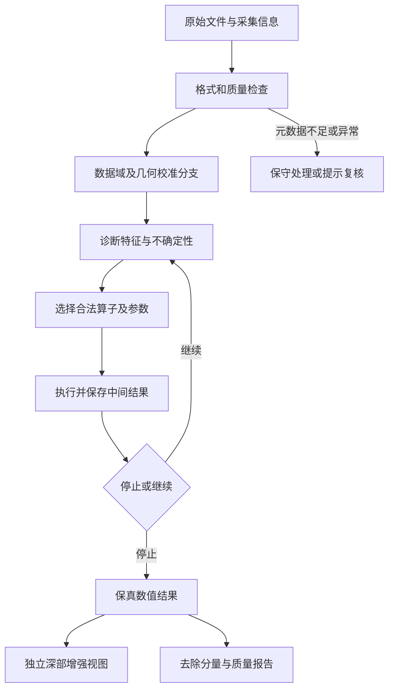

# UAV-GPR SFCW 自动处理：第一轮研究与方案草案

日期：2026-09-23。范围：本地资料审计、原始文献/官方工具调查、任务定义、训练与验证路线。状态：**研究建议；未运行处理对比、正演或训练，未证明算法增益。**

> **范围更新（2026-09-23，用户已确认）**：首版仅做“背景与相干杂波抑制”“增益与衰减补偿”。基线与仪器校正、频带滤波、航空与空间几何校正、去噪、子波整形与反卷积、成像延期；未列出的类别不纳入项目范围。本文保留最初全流程调查与证据，原来的 P0 算子范围、产品视图、扩展模块和场景预算均不再作为当前首版任务清单。实际工作以[首版范围决定](2026-09-23_v1_scope.md)及根目录 AGENTS.md 为准。

> **后续决定**：先做现有非显性滑坡场景特化，泛用性延期；现有测线留到后期，当前先研究 gprMax 仿真开发和评价。本文原先的通用优先、即时实测适配等内容属于历史建议。最新文献与路线见[gprMax 仿真优先研究](2026-09-23_gprmax_simulation_first_evidence.md)。

## 1. 推荐的研究方向

建议研究一个**能够识别数据工况、选择处理流程并判断何时停止的自动处理系统**。它的主要输出仍是可追溯的数值 B-scan，同时提供独立的深部增强视图、去除分量和质量提示。

用户已明确目标是通用处理：面对多数原始测线，削弱噪声、直达波等不需要的信息，突出地下深层结构/目标；训练主要依靠 gprMax。营山钻孔用于验证部分地下结构，不能把整项研究收缩为基岩界面检测。

推荐路线分为三步：

1. **把“好处理”定义成可检验的多项要求**：干扰下降，真实地层与目标保留，少伪影，人工时间下降，处理耗时可控。
2. **先测清楚传统流程的能力和自适应空间**：同预算比较固定流程、统计自适应、随机搜索/贝叶斯优化，确认不同数据确实需要不同流程。
3. **再学习快速决策**：先做候选流程排序/选择和参数预测，必要时升级成逐步决策策略；保留跳过、停止和保守回退。

这条路线最终可以覆盖算法、参数、顺序和长度四种自动决策。先采用较小的合法流程空间，目的是让每一次选择的物理作用可查、收益可验证，不是将顺序永远固定。

**尚待敲定的产品建议**：默认同时保留连续层状反射和局部目标；不能确定某一分量是干扰时，保守保留并在增强视图中提供对照。可选的“层状结构优先”“局部目标优先”是后续增强模式，不要求用户为每条测线手动调参数。

## 2. “通用”需要具体的范围

泛用性不等于存在一个对所有雷达、介质和目标都最优的滤波器。建议把它分成四层，逐层给出证据：

| 层次 | 要验证的变化 | 当前资料的作用 |
|---|---|---|
| 同系统、同场地 | 发射/接收条件、航高、噪声、采样密度 | 营山三功率复测、雅安多条件 |
| 同系统、跨场地 | 地形、含水、材料、地表杂物 | 营山→雅安提供初步压力测试，尚缺雅安独立真值 |
| 跨结构类型 | 平层、斜层、尖灭/断裂、局部目标、弱深反射、混合场景 | 主要由多样 gprMax 场景和后续实测补齐 |
| 跨仪器/频段 | 天线、扫频、校准、导出程序、频带 | 当前材料不足，不能宣称已覆盖 |

“多数测线”应最终用保留测试集上的成功覆盖率、损伤率和人工复核率定义。54,663 道也可能只来自少数地质剖面，不能以道数或裁片数代替独立场景数。

### 信号与干扰并不总能凭外观分开

示意上可写为 `观测 = 仪器/采集作用下的地下响应 + 直耦/地表等相干分量 + 随机干扰`。在真实多次散射条件下，这不是可以任意逐项相减的独立加性真值分解。

- 横向平直的强反射可能是直达波，也可能是重要地层。
- 小而局部的事件可能是目标，也可能是散射杂波或脉冲干扰。
- 高频细节可能是噪声，也可能是薄层/目标边缘；连续性变好也可能只是把断层抹平。
- 地表反射既是待压制的强回波，又可帮助估计高度、零时和介电性质。

因此，一个合理的通用系统必须结合时空位置、频谱、航迹/仪器信息和多个结构假设，而不能把“水平/低秩/弱/高频”直接等同于噪声。现有均值道删除及低秩分解方法正好提供了需要专门测试的反例。[GPRPy 原始实现](https://github.com/NSGeophysics/GPRPy/blob/master/gprpy/gprpy.py)、[WNNM 原论文](https://doi.org/10.3390/s23115078)

## 3. 本地资料决定的边界

完整证据、文件哈希和问题明细见[本地资料审计](2026-09-23_material_audit.md)。主要结论：

1. 现有 26 份 CSV 均为每道 501 个**导出实数 A-scan 样本**，不是可直接确认的 501 个复数频点；营山时窗 700 ns、雅安 900 ns。全部数值行已检查，结构完整、无 NaN/Inf。
2. 汇报的“20–170 MHz、1 MHz 步进、501 频点”不自洽；CSV 上游的校准、IFFT/实信号重建、窗、时轴端点及预处理历史未闭合。这使复频域路线目前只能作为未来分支。
3. `Line6origin(30).csv` 有道内位置元数据变化；不同功率数据也未逐道配准。它们不直接构成监督学习的 noisy/clean 对。
4. 钻孔可以约束地质位置，但不同界面需要分别命名。ZK08 的黏土底 7.0 m 与下部砂岩顶 14.3 m 不能合并为一个“正确界面”；汇报有 14.0/14.3 m 简化差异。
5. 初始看到的 H5 是材料几何，不是波形结果；旧输入的 Ricker 1 GHz/30 ns 与现场配置不匹配。这些旧文件在审计期间已移出，当前没有可直接沿用的正式训练包。

**可以立即开展**：数据契约、候选算子定义、合成反例与评价设计、受限流程搜索设计。**仍需补齐才能作强结论**：SFCW 采集/导出模型、标定与轨迹语义、具有独立真值的验证集。

## 4. 算法分类：从四大类扩展为十个环节

下表综合官方处理工具与研究文献，并加入本项目的物理域和风险约束。它是候选算子设计，不表示每条数据都必须执行十个步骤。[RGPR 教程](https://emanuelhuber.github.io/RGPR/02_RGPR_tutorial_basic-GPR-data-processing/)、[GPRPy](https://github.com/NSGeophysics/GPRPy)

| 类别 | 典型算法/操作 | 可学习或自动估计的量 | 主要风险/前置条件 |
|---|---|---|---|
| 1 数据质量与组织 | 异常道检测、坏频点/缺道掩码、饱和检测、方向统一、重复段检查 | 有效段、异常置信度 | 坏道插值不能伪装为实测；保留 mask |
| 2 仪器与基线校正 | DC 去除、dewow、系统延迟、响应校准、幅相均衡 | 时零、漂移窗、响应参数 | DC、低频地质信息、系统振铃不同；不能一刀切 |
| 3 空间/航空几何 | 沿线重采样、地表追踪、航高/时间漂移校正、地形校正 | 地表轨迹、校正量及不确定性 | 需要可信的坐标/高度/姿态；二维时间平移不等于完整 MoCo |
| 4 频带与子波整形 | 带通/陷波、频域窗、经正则化的反卷积、白化 | 截止频率、阶数、陷波、正则强度 | 频带必须真实；相位畸变、旁瓣、深部低频误删 |
| 5 相干背景/直达波抑制 | 参考波形扣除、局部均值/中值道、PCA/SVD、RPCA/WNNM、预测/自适应滤波、f-k | 参考权重、空间/时间窗、秩/阈值 | 平层与背景重叠；参考不匹配；规则间距要求 |
| 6 随机及脉冲去噪 | 中值/Hampel、小波阈值、非局部均值/BM3D、TV、结构导向平滑 | 噪声尺度、窗口、阈值、方向 | 细节损失、块效应、断层被连平、带内噪声残留 |
| 7 学习型恢复 | 残差 CNN/U-Net、自监督盲点、去噪与结构联合学习 | 恢复映射/条件权重 | 仿真域偏移、幻觉、错误 clean 定义、相关噪声假设 |
| 8 增益与动态范围 | 常数/t-power/指数补偿、SEC、限幅增益、AGC、SGC | 增益曲线、窗、上限 | 放大噪声；改变幅度物理意义；不能单看变亮 |
| 9 成像与深度解释 | 速度估计、Kirchhoff/BP/RTM、地形相关成像、界面/目标拾取 | 速度及不确定性、成像参数 | 并非普通滤波；错误速度会移动/制造聚焦；先作为独立验证分支 |
| 10 显示和质量控制 | 包络、dB、统一色标、裁窗、去除分量查看、置信度/失败提示 | 展示范围、可靠性 | 不训练成截图美化；包络与保相位波形分开 |

P0 候选优先包括 identity、稳健 DC/dewow、温和带限、脉冲异常处理、小波、局部背景、受限 SVD、温和深度增益。RPCA/WNNM、SGC、结构导向与学习型恢复作为扩展比较。这个优先级是工程建议，须根据现场诊断调整，不是对各算法性能的既定排名。

### 顺序不能全排列

建议使用“带前置条件的流程语法”。例如，先读取并确认数据域/轴；频域校准只接收真实复频谱；需要等距的 f-k 操作前先处理空间采样；保相位成像前不丢弃符号或只剩包络。直达波模板有时应在原始时间参考系估计，地表杂波可能需要先对齐后估计，因此也不强行规定所有背景抑制必须在几何校正之后。

在合法区域内，学习“先去噪还是先背景分离”、窗口/秩/增益参数、是否跳过和何时停止。窗口用 ns/m 定义再换算为样本数，不能固定“31 点”跨 700/900 ns 时窗使用。增益前后各保留一个数值节点，能分别评价去噪和展示效果。

## 5. 文献研究：哪些可以借鉴，哪些不能照搬

### 5.1 用户给出的 AdaptiveISP

[AdaptiveISP（NeurIPS 2024，正文）](https://arxiv.org/html/2410.22939v1) 将逐阶段模块选择和连续参数预测结合，用冻结检测器的任务损失指导 actor–critic，并加入重复使用和计算成本约束。作者提供了[代码仓库](https://github.com/OpenImagingLab/AdaptiveISP)。

可借鉴的是**保留显式处理模块、根据输入自适应、按下游效果评价、计入成本**。它的主要调节对象是相机处理域，依赖特定检测任务反馈；这些不是 GPR 结构保真的直接证据。把 B-scan 当 RGB 图、把所有数据的评价都换成一个检测器得分，会偏离我们的通用目标。停止机制、合法动作掩码和多结构保护属于本项目需设计与验证的部分。

### 5.2 更直接相关的 GPR 自动处理工作

[Sun 等，Multi-Task Learning for Automated Processing of Ground-Penetrating Radar Data](https://ieeexplore.ieee.org/document/11332639)，ACES-China 2025，DOI 10.23919/ACES-China66523.2025.11332639，是直接涉及算法选择与参数预测的先例。已核实 IEEE 官方摘要和 Crossref 题名/作者/页码；会议为 2025 年 8 月，IEEE 页面列入日期为 2026 年 1 月。

摘要描述共享特征和任务分支，作者报告 92.5% 的专家算法一致率和 45% 的处理时间下降。**本轮未取得全文**，未核实数据划分、算法集合、是否优化顺序、是否跨测区、时间指标是否包含人工成本。因此将它列为优先取得全文和复核的直接对照，不能把摘要指标作为本项目的可达承诺。“与专家一致”也不自动等于地下结构更准确。

这意味着“ML 选算法/参数”已不是可以直接宣称空白的方向。本项目潜在贡献应落在 UAV-SFCW 采集约束、多类型真实结构保护、流程与停止决策、可信评价和跨域验证上；是否有新颖性仍需进一步系统检索。

### 5.3 证据对照表

所有阅读范围均为本轮实际获得的信息；“迁移判断”是本项目推论。

| 来源 | 本轮阅读范围/对象 | 可借鉴之处 | 对本项目的限制与优先级 |
|---|---|---|---|
| [AdaptiveISP, 2024](https://arxiv.org/html/2410.22939v1) | 正文；相机/检测 | 模块、参数、阶段、成本联合决策 | 跨领域参考；P1，先重建 GPR 目标函数 |
| [Sun 等, ACES-China 2025](https://ieeexplore.ieee.org/document/11332639) | 官方摘要/元数据；GPR | 自动选择与参数预测的直接先例 | 未审全文/泛化/排序；P0 文献补读 |
| [ReconfigISP, ICCV 2021](https://openaccess.thecvf.com/content/ICCV2021/html/Yu_ReconfigISP_Reconfigurable_Camera_Image_Processing_Pipeline_ICCV_2021_paper.html) | 原始会议摘要；相机 | 可微代理与架构/参数搜索 | 代理误差和结构约束需重做；P2 |
| [SMAC3, JMLR 2022](https://jmlr.org/papers/v23/21-0888.html) | 原始论文摘要；算法配置 | 有预算的贝叶斯优化、跨实例配置 | 是搜索方法证据，不是 GPR 实效；P0 搜索基线 |
| [RGPR 官方教程](https://emanuelhuber.github.io/RGPR/02_RGPR_tutorial_basic-GPR-data-processing/) | 教程正文；传统 GPR | 分类、物理单位、过程记录、结果差分查看 | 具体示例顺序不作为 UAV 通用定律；P0 |
| [GPRPy 官方代码](https://github.com/NSGeophysics/GPRPy/blob/master/gprpy/gprpy.py) | 仓库和相关代码段 | 均值道、t-power、AGC 与历史记录 | 原生格式和接口不等于本 CSV 已兼容；P0 参考 |
| [SGC, 2025](https://doi.org/10.1016/j.ndteint.2025.103366) | 出版社摘要；GPR/SAM | SVD 与时间增益联合，处理服务下游任务 | 非完整流程策略；实测原数据不开放，层状结构保留需另测；P1 |
| [WNNM, Sensors 2023](https://doi.org/10.3390/s23115078) | 原始论文摘要/方法段；非平行收发地表 | 加权低秩/稀疏分解，处理非理想背景 | 稀疏目标假设不能覆盖所有地层；P1 对照 |
| [Diffraction denoising, 2023](https://doi.org/10.1111/1365-2478.13340) | 正文实测段；GPR/地震 | 自监督分离和真实数据实验 | 文中可把反射当噪声以突出绕射，正说明任务依赖；P1 反例 |
| [MNSSDN, ICMSP 2023](https://ieeexplore.ieee.org/document/10171094/) | IEEE 摘要；GPR | 混合干扰和自监督训练 | 单算子研究，伪标签偏差/细节保留需检验；P2 |
| [Noise2Noise, ICML 2018](https://proceedings.mlr.press/v80/lehtinen18a.html) | 原论文页面/方法线索；图像恢复 | 有条件地从多次噪声观测学习 | 复测配准和噪声统计条件不自动满足；P2 |
| [Noise2Self, ICML 2019](https://proceedings.mlr.press/v97/batson19a.html) | 原论文页面/摘要；自监督去噪 | 无 clean 时校准去噪参数 | 条件独立性关键，不能直接处理相关直达波；P2 |
| [UAV-SFCW landmine system, 2020](https://www.mdpi.com/1424-8220/20/8/2234) | 原论文摘要；低飞行高度浅目标 | 提醒纳入空气耦合、扫描高度、采集系统 | 约 0.5 m 扫描情境不能外推至本系统深部结构；P1 场景参考 |
| [UAV GPS/CDGPS MoCo, 2020](https://www.mdpi.com/2072-4292/12/20/3463) | 正文；机载脉冲雷达/地表目标 | 几何、时延对齐与沿线采样影响成像 | 非本低频 SFCW 深层验证；P1 几何参考 |
| [Automatic asphalt layer detection, 2022](https://doi.org/10.1016/j.conbuildmat.2022.129434) | 出版社摘要/引言；空耦路面雷达 | 小波、匹配滤波、振动处理可自动化 | 薄路面专用；说明传统自动方法必须作基线，P1 |
| [TIGPR 数据论文, 2025](https://pmc.ncbi.nlm.nih.gov/articles/PMC12151194/) | 原论文数据说明节；交通基础设施 | 后续检测评价素材线索 | 已做时零/去噪/增益，不能直接当本项目原始→干净训练对；P2 |
| [gprMax 官方建模指南](https://docs.gprmax.com/en/latest/gprmodelling.html) | 官方文档；FDTD | 网格、源接收分量、数值误差与物理契约 | 锁定实际求解器版本；P0 |
| [Liu/Xiao, 2021](https://doi.org/10.12677/AG.2021.114044) | 出版社论文摘要；SFCW 合成 | 冲激响应与 CW 卷积/解调合成路线 | 需独立数值校验与硬件导出适配；P1 |

检索覆盖了 processing pipeline/algorithm selection/parameter optimization/reinforcement learning、GPR clutter/denoising、UAV/SFCW/height、sim-to-real 与自监督。优先使用原论文、作者代码和官方文档；没有把目标导航 RL、单纯检测网络或 ML 模型自身超参数优化误认成“处理流程自动排序”的直接证据。此次是方案研究，不是完整系统综述或专利查新。

## 6. 推荐的 ML 接入方式

| 路线 | 优点 | 主要负担 | 本项目安排 |
|---|---|---|---|
| 固定/规则流程 | 简单、易复现、失败可分析 | 不能适配所有场景 | 必备基线与回退 |
| 每条数据在线搜索 | 不需大规模专家标签，可衡量自适应上限 | 每条搜索慢；实测评分代理不可靠 | 首先在有参考的训练/验证场景上构建流程库 |
| 流程选择/排序 + 参数预测 | 推理快、可解释、小数据更易起步 | 受候选空间约束 | **首选 ML 主线** |
| 逐阶段策略/RL | 自适应顺序、长度、停止 | 奖励被钻空子、样本效率、动作约束 | 已证实多步价值后再比较 |
| 可微处理/NAS | 连续参数联合优化 | 非可微算子的代理偏差 | 部分算子或对照分支 |
| 端到端波形恢复 | 潜在能力强 | 幻觉、域差、真值定义与可解释性 | 单独对照；不直接替代所有显式处理 |

### 6.1 先证明“选得不同”确实有用

在训练/验证集内，对每个完整场景运行同一个受约束候选库。与“全数据最优固定流程”比较每场景可达到的改进。如果最佳方案几乎总相同，或自适应收益小于评价噪声，就先使用固定/规则流程。

如果收益稳定且不同工况偏好的流程不同，再训练输入→候选质量向量/排序→参数的模型。小数据先比较稳健统计特征配合树模型，与多尺度 B-scan 编码器；不能只凭网络规模决定。对性能近似的多条方案保留近优集合/软排序，避免把搜索偶然第一名当唯一正确标签。

搜索可使用随机/低差异采样、条件贝叶斯优化和束搜索。每次候选都执行真实算子，保存中间波形；不让语言模型主观判图代替数值评价。含真值的逐场景最优结果只能称**离线可达上限**，不能当成部署时可用的在线搜索成绩。

### 6.2 输入、动作和停止

- 输入：带符号波形的多尺度片段/整线概览，频谱与相关性、奇异值分布、坏道/饱和特征、时窗/采样、可用航高/地表估计、缺失信息 mask；使用共享且可记录的幅度标定。
- 粒度：第一版以整线选择全局流程，必要时对有重叠的空间段缓慢调参。逐像素/逐道自由决策容易制造拼接缝和横向不一致，暂不作为起点。
- 动作：有限算子、连续参数、跳过、停止。域不兼容或缺前置条件的动作屏蔽；不允许无上限重复增益或超出真实频带的参数。
- 执行：返回变换后的波形、变换记录、去除分量、增益和几何变换，而不是只返回一张图。
- 可靠性：依据验证集校准置信度和适用域；代理评分低置信、明显异常或超预算时，回退到保守基线并标记，不硬给“最佳处理”。

### 6.3 通用目标函数不能只剩一个清晰度得分

建议训练时记录质量向量：`[随机噪声误差，相干杂波残留，层状结构损伤，局部目标损伤，弱反射损伤，假事件，计算成本]`。先满足预注册的结构保留和无目标伪影约束，再在可接受方案内优化去噪/耗时；不让某项高收益无限抵消另一类结构被删除。

在确有定义良好的参考波形时，可使用多尺度波形误差、频谱误差、到时/相位偏差与深浅平衡权重。深度权重应有上限，并设置无深部目标负控，避免模型靠放大晚时能量得分。根据训练数据估计的量不能访问测试标签。

若最终采用 RL，可将每步奖励设计为上述损失的改善减去实际成本和违规惩罚；结构损伤约束仍独立保留。冻结的界面/目标模型可以提供辅助信号，但至少用另一种方法、模拟真值和盲评审查，防止策略只学会取悦一个检测器。这是本项目方案，并非已有论文在我们数据上验证过的结论。

## 7. gprMax：先解决“什么算干净”，再批量仿真

### 7.1 三类标签，不能混在一起

| 训练任务 | 合理的参考 | 不成立的替代 |
|---|---|---|
| 随机电子噪声恢复 | 同一完整地下/采集模型下，明确噪声注入前后的成对波形 | 任一强功率实测作为无噪声真值 |
| 直耦/地表等确定性干扰分离 | 受控参考测量、经物理检查的成分标签、受限时间区间或明确 counterfactual | 把全场景减去无目标背景都叫通用 clean |
| 地下结构/目标保留 | 几何标签、预期到时范围、独立参考响应和负控 | 将材料分区图直接当雷达反射图 |

在对比场景的完整 Maxwell 解中，移除一个对象可能改变透射和多次散射；差分可用于归因，不自动代表互不相干的一个“纯分量”。要保留地层时，不能用删除整个地层的 H0 将其扣掉。通用 clean 的定义比“加白噪声前的图片”更复杂，首轮必须把随机去噪和结构性干扰分开检验。

### 7.2 最小场景库

建议至少包含以下八类：水平弱界面、倾斜/起伏层状结构、薄互层/尖灭、断裂/台阶、孤立目标、层状与局部目标共存、粗糙地表/散射背景、无深部目标负控。薄层若低于物理可分辨范围，应允许输出“不可判”，不能以强行分开为训练目标。

交叉变化包括材料介电常数/电导率/适用色散模型、深度和尺寸、地表粗糙度、地形、空气层、航高/姿态、收发配置、轨迹误差、仪器频响/时延、窄带干扰、色噪声、脉冲噪声、增益变化、量化/饱和和坏道。参数范围应来自现场与物理文献并记录来源；不能为了覆盖率随机生成不可能的组合。

物理求解和后处理扰动分开：地质、地表、天线/耦合变化通常要重新求解；电子噪声等可在明确假设下增加。不能任意把姿态/高度变化都简化为加噪。先用二维模型筛查，再以少量三维模型检查有限目标、横向散射和天线差异；二维的无限延伸体不等同于三维埋藏体。

### 7.3 匹配 SFCW 和当前导出域

路线 A：若获得原始复频谱，记录真实频点、相位/时延参考、驻留/扫频时间、校准与窗，在复数域处理后按正确约定重建。

路线 B：目前的实数 A-scan，以实际导出链为观测算子，把模拟场转换成同类型的带符号数值输入。若导出链尚未知，可先做物理机制/算子验证，并将不确定仪器响应作为受限扰动；这种结果不能称为已完成硬件域匹配。

Liu/Xiao 的冲激响应合成提供可研究路径，具体实现可参考已安装 `gprmax-simulation` 技能的修正模块：单位冲激响应、连续波线性卷积、正交解调、复数处理与重建。旧 Ricker 数据不能不经源约定验证就当冲激输入。原论文思路与本地修正实现的数值约定要分开引用。[Liu/Xiao 2021](https://doi.org/10.12677/AG.2021.114044)

均匀频点的复基带 IFFT 包络与恢复载频的实通带 A-scan 是不同产品；不把 `real(IFFT)` 随意冒充原始时域波形，不对复包络再机械执行 Hilbert。零填充只改变采样密度，不增加带宽/物理分辨率。SFCW 的扫频内运动也不同于每道之间的航高校正；没有扫频时序和姿态数据时，只能声明简化假设。

### 7.4 规模与计算预算

建议先做 **4 个解析/简单场景检查 + 8 类×6 个独立母场景的试验性设计**。后者共 48 个独立物理场景；每场景 4 种有效噪声/仪器变体可形成 192 份输入，但独立母场景仍为 48。数量只是便于验证数据链与流程差异的初始预算，不是充分训练或统计功效保证，也未获本轮执行授权。

在开正式批次前记录网格、目标最小尺度、最长传播时窗、PML、源谱、动态范围、原始输出精度、CPU/GPU 内存和存储预测，测得单场景耗时后再估算总成本。约 λmin/10 只作起点，敏感结论需网格/精度检验。[gprMax 官方建模指南](https://docs.gprmax.com/en/latest/gprmodelling.html)

缓存同一场景的物理输出，流程搜索/RL 在缓存波形上执行；不要每做一次滤波动作就重新运行 FDTD。只有物理变化才触发新的正演任务。

## 8. 怎样证明“处理得好”

### 8.1 评价矩阵

| 维度 | 仿真/有参考 | 实测/无完整真值 | 主要防范 |
|---|---|---|---|
| 噪声与干扰 | 分组件误差、固定 ROI 的 SCR/SNR、NRMSE | 固定规则的噪声 proxy、复测一致性 | 把目标也删掉而评分上升 |
| 层状结构保留 | 到时/相位、界面局部误差、弱层召回 | 钻孔局部约束、交叉线一致性、盲评 | 水平地层被当背景、断裂被过平滑 |
| 局部目标保留 | 定位误差、检出/漏检、形态与幅度损伤 | 已知目标/独立证据；不确定异常另列 | 模型只保一种熟悉形状 |
| 深部保真 | 深浅分层指标、无目标时假事件率 | 噪声底/低置信区提示 | 用增益“创造”深部结构 |
| 物理一致性 | 子波、频谱、波形/复杂相位、采集回投影残差 | 可观测的一致性，注明建模误差 | 超分辨率或补全先验被当证据 |
| 稳定性与成本 | 场景扰动、随机种子、计算/内存 | 完整导入→结果耗时、人工时间、重跑/失败率 | 单张快、整线慢；漏计搜索/返工 |

没有干净真值时，区域能量比要叫 SCR/SNR proxy，并公开 ROI 定义。处理前后须使用相同坐标、固定增益/色标或明确记录变换；指标主要在显示增强前计算。PSNR/SSIM 可以做辅助，不能作为唯一成功标准。真实波形比较也不能每道各自归一化抹去幅度损失。

### 8.2 必须有的负控和消融

- 无目标但有强直波/噪声：不能凭空出现深部目标。
- 只有水平真实反射、没有需删背景：检验均值/SVD/RPCA 的误删。
- 干净但很弱的深反射：处理应能选择无操作，不能“滤没”。
- 真正的断裂/尖灭：不能为了连续性得分把它补平。
- 目标与背景在时间/空间频率上重叠：允许保守失败并报告。
- 单个反射的带限旁瓣：不能把增强后的多个峰计为多个目标。
- 去掉高度输入/结构损伤约束/成本项/停止动作，分别检查其价值。
- 选择器与最佳固定流程、同预算随机/贝叶斯搜索、固定顺序动态参数、受限动态顺序分别比较，避免把所有收益都归给“RL”。

### 8.3 真正的泛化与劳动成本

先划分完整母模型、测线和区域，再生成噪声和裁片。同一场景的多功率/多噪声版本、同线重叠窗保持同组。交叉线共享地下空间，不应被包装为完全独立场景。若用营山钻孔/剖面生成训练几何，对营山的结果应称场地适配，另找未用场地做泛化验证。

真实试验中，建议冻结版本后由多名操作者在同一批保留测线上对比人工流程与自动流程；随机化展示顺序、统一色标、隐藏方法名，统计处理时间、人工活动时间、返工次数、质量盲评与分歧。操作者/场景为统计单位，不以数百万像素形成虚假的高显著性。

预注册改善目标与允许的非劣界限，按场景簇 bootstrap 或报告配对差值区间；当前仅两个测区时，需要坦诚说明跨测区证据有限。不能把“人工看着更清楚”或重复测线一致性单独当作正确性证明。

## 9. 分阶段执行与停止规则

| 阶段 | 工作及产物 | 进入下一阶段的条件 | 不通过时的动作 |
|---|---|---|---|
| P0 数据/目标契约 | 核实导出域、修复候选、保留结构定义、验证划分 | 每个输入/标签的含义和不确定性明确 | 限制结论范围，不制造假配对 |
| P1 传统算子与反例 | 可复现算子、有限合法流程、负控与成本表 | 能测出误删/伪影；至少有可靠保守基线 | 修评价/算子，再谈 ML |
| P2 仿真试点与搜索 | 多场景数据、采集适配、小预算搜索 | 自适应比最优固定流程有稳定空间 | 无收益就采用固定/规则方案 |
| P3 ML 流程预测 | 轻量选择/排序、参数、置信与回退 | 保留集质量不劣且节省总时间/人工 | 调整特征/标签或缩小适用域 |
| P4 顺序/停止策略 | 与固定顺序/动态参数公平比较 | 额外收益大于成本和失败风险 | 保留更简单选择器 |
| P5 实测冻结验证 | 营山结构证据、雅安迁移、人工成本试验 | 分结构质量、假阳性、耗时达预注册标准 | 报告适用范围及失败，不推广到未验证工况 |

当前已完成的是 P0 的资料调查和方案草案；采集契约、产品默认行为及验收门槛还没有全部敲定。代码审计脚本只证明文件结构检查已执行，不证明 P1–P5 已完成。

## 10. 建议下一轮与你敲定的三件事

1. **默认保留对象**：建议连续地层、断裂/尖灭和局部异常共同保留。用户不指定目标时不强删疑似背景，另给增强视图。这样最贴近本次“泛用性”要求。
2. **输出与使用方式**：建议同时交付可追溯数值结果、增强图、去除分量和失败提示；通常一键完成，只对超出适用域的线要求复核。第一版优先批处理整线，实时上机另作后续要求。
3. **成功标准**：建议首先证明“真实结构损伤受控 + 干扰下降 + 人工时间下降”，随后再提高自动覆盖率。具体非劣界限、耗时目标和可接受复核比例须结合人工基线与业务需要确定，暂不编造指标。

采集频点/导出说明、高度定义和坐标系是技术信息缺口；它们与上述产品选择不同。可以继续推进不依赖这些信息的反例和算子契约，但不能绕过它们作精确深度或实测普适性声明。

## 附：研究过程与可追溯性

- 本地证据见审计报告、`artifacts/initial_audit/` 及原始只读资料；PDF 中的既有性能声明没有被算作本项目的新验证结果。
- 外部资料通过原论文/官方文档检索；agent-reach 的 Exa 未配置，转用内置网页搜索及其 Jina 网页读取路径。IEEE 的直接打开失败后，通过官方页面的可公开摘要核实了 Sun 等工作；未绕过全文付费访问。
- `multitask_gpr_crossref.json` 保存了直接相关论文的登记元数据。没有下载外部数据集、改动用户原始数据、提交远程作业或训练模型。
- 下一次更新应记录新增证据和决定，保留本报告的日期与未验证状态；不要将本轮建议自动升级为冻结配置。
