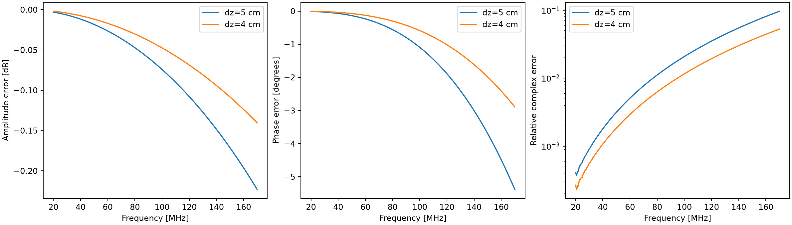

# 垂向4cm配对验证结果

## Material Passport
2026-09-24；V4-DZ4-PAIR-01；两次CUDA0/double求解和官方CPU SFCW后处理完成；未读取保留实测数据。用户授权自主设计及仿真。[事前设计](2026-09-24_dz4_design.md)。

## 结论
方向性网格细化使误差明显下降，支持先前网格色散/界面离散的解释，但不是完整三维收敛认证。无需继续重复空气、固定PML或尾窗验证；下一步先设计并预算有损粉质粘土覆盖层—砂岩模型，再评估坡地与20m地下域。

固定400ns尾渐消、官方direct、20–170MHz共501点，与此前已核验的独立全波半空间积分比较：

| 指标 | 原dz5cm | 新dz4cm |
|---|---:|---:|
| 最大幅度差 | 0.223082dB | 0.140365dB |
| 最大相位差 | 5.385942° | 2.893921° |
| 最大复数相对差 | 9.617170% | 5.259890% |
| 中位复数相对差 | 1.797796% | 1.002570% |

最大相位差下降46.27%，最大复数相对差下降45.31%。170MHz实际相位差−2.893921°，与事前轴向Yee预测全带最大残差0.02215°；幅度差−0.140365dB，与未拟合界面公式最大残差0.002899dB。没有拟合、外推校正或人为移动回波。

新空气/介质0–80ns差分仍逐样本为零。200与400ns渐消的最大逐频点复数变化为0.012204%，远小于当前离散误差；未渐消结果仍受静态尾项影响，最大相对差148.27%，不能用作合格带内响应。这些渐消选择只适用于当前校验，不能直接套入更深的晚到模型。



## 执行与检查
- AIR_dz4：669.859秒；M01_dz4：599.063秒；总计1268.922秒（21分9秒），均exit0/completed。
- 主机Job提交内存峰值分别27549515776/27548770304 bytes（约25.66GiB），均低于36GiB上限。GPU样本显示约12GiB整卡使用量、99–100%利用率；这些是采样值，不是完整峰值记录。FDTD无CPU回退。
- 每组9055样点；dt=8.836328744901541e−11s。按既定≤800ns裁取9054点后变换，保留全部原始数据。源x长度仍为5cm。
- 两组各10项原始输出检查通过，分析另检查网格尺寸、同源、时间偏移和时间轴。新脚本对旧5cm数据重算501个频点逐位相同；新结果重复后处理JSON/CSV/图哈希和全部NPZ数组一致。没有重复FDTD。
- CUDA编译日志含“compiler succeeded”告警，非求解失败；完整保留。初始准备时UTF-8/GBK读取失败和旧契约预检拒绝已记于设计目录，没有额外求解attempt。

## 复现与归档
原始HDF5、输入、启动授权、日志、supervision和审计在`artifacts/research_checks/2026-09-24_AIR_dz4/`及`2026-09-24_M01_dz4/`；分析和逐文件哈希在`2026-09-24_dz4_analysis/`；静态预算、源一致性检查与旧数据回归记录在`2026-09-24_dz4_design/`。这些目录均纳入Git。最终状态以supervision.json为准，最后live_status快照可能仍显示running。

交接检查核验399个已暂存/跟踪文件、41个入口链接，链接、产物索引、旧证据哈希与执行契约均一致，未发现凭据模式；整体仍仅因长期缺失的原设备PNG失败，未擅自恢复或提交其删除。本轮三个运行/分析归档的逐文件哈希另已全部核验。

用已记录GPU环境的Python运行后处理（无需GPU求解）：
```text
python scripts/analyze_vertical_refinement.py --air artifacts/research_checks/2026-09-24_AIR_dz4/AIR_dz4.h5 --medium artifacts/research_checks/2026-09-24_M01_dz4/M01_dz4.h5 --output <新的输出目录>
```

## 限制与下一步
仅垂向加密，横向仍5cm，dt和PML离散采样同时变化；两个网格不足严格确定收敛阶，残差仍非零。无损εr9平面点源校验不能证明有损粉质粘土、真实天线或20m探测效果。没有物理准确度合格阈值转正。

[用户讨论的地质初稿](2026-09-24_geology_preview.md)为假设值：覆盖层εr16/σ0.01S/m、砂岩εr9/σ0.001S/m、局部较湿区εr20/σ0.02S/m，约10°缓坡/3m覆盖层。先做损耗和资源预算，不直接运行：εr20时水平5cm仅约7.9格/最短无损波长，且20m地下域和15m空气高度增加内存与晚到时窗要求。当前无运行任务，无新地质执行契约。
