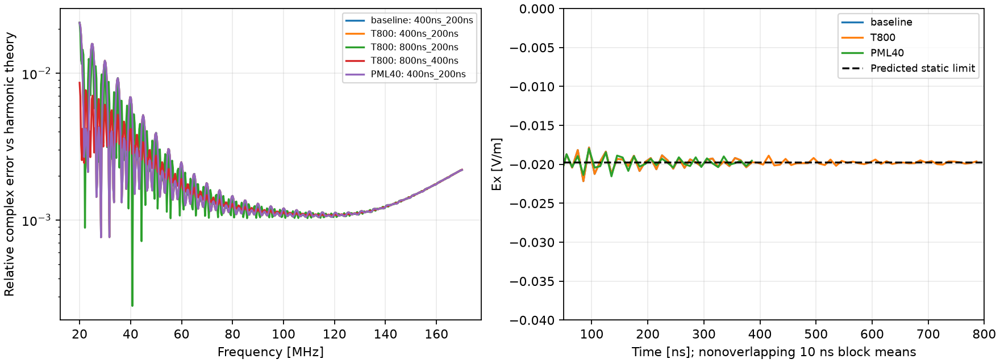

# 尾段对照结果：静电截断与带外振荡需要分开处理

## Material Passport

- 两项新增CUDA double仿真与官方CPU后处理均完成，无任务仍在求解。
- T800耗时444.938秒，PML40耗时312.140秒，均正常退出，分别通过10项原始输出核查。
- 22组时窗/固定渐消长度处理、10组同条件比较；没有使用实测测线或拟合材料。
- 全部证据：`artifacts/research_checks/2026-09-24_T800/`、`2026-09-24_PML40/`及`2026-09-24_tail_controls_analysis/`。
- 事前约定：[对照设计](2026-09-24_tail_control_design.md)。本报告不是网格收敛证明或地下探测性能评价。

## 结论与依据

**当前全空气校准的显著频谱偏差，主要与非零静电尾的有限记录截断有关。延长记录或加厚PML本身不能消除它。** 另有明显带外振荡，它会受边界配置影响；这两种成分不应混为真实地下回波。

1. T800的前4156个接收样点与原400ns记录逐位完全一致。时间延长没有改变共同前缀。
2. 理论静电残留约−0.019696V/m。原200–400ns均值−0.019754V/m，T800的600–800ns均值−0.019773V/m，加厚PML后200–400ns均值−0.019767V/m，均接近预测，并未随记录延长消失。
3. 去均值Hann周期图中，原后段主峰约5.170GHz；更晚段约5.175GHz；PML40后约3.155GHz。均远高于20–170MHz雷达频带。加厚PML使同一后段振荡标准差由0.0532降至0.0356V/m，证明带外振荡对边界配置敏感；未以网格/CFL对照进一步识别具体模式。
4. 对800ns未渐消记录，加入**事前确定、零拟合参数**的静电尾截断预测后，最大复数相对剩余差约1.244%，而直接与无限时间谐波解比较约116.296%。这支持截断解释，不代表获得了可用于任意地层的修正公式。

周期图份额仅是该分段、去均值和Hann窗下的诊断，不是严格物理能量或仪器带外抑制指标。

## 时窗与渐消长度必须分别比较

以下误差均为501个频点相对于无限真空理想赫兹偶极子谐波解的复数相对误差；不拟合幅度、相位或时间延迟。

| 记录窗 | 尾部渐消时长 | 最大误差 | 中位误差 |
|---:|---:|---:|---:|
| 400ns | 无 | 116.314% | 15.920% |
| 400ns | 100ns | 7.950% | 0.142% |
| 400ns | 200ns | 2.213% | 0.134% |
| 800ns | 无 | 116.296% | 15.938% |
| 800ns | 200ns | 2.213% | 0.133% |
| 800ns | 400ns | 0.862% | 0.136% |

窗口延长而渐消长度固定200ns，最大误差几乎不变。800ns窗口的实际益处是为更长渐消段留出空间。更長渐消降低最大误差，但中位误差不单调改善；不能宣称所有频点都同时改善。

此次按时间截取到不超过指定窗的最后样点（例如399.995556ns、799.991112ns），与前轮直接使用完整4156点略有区别；固定渐消样点数也使比例略偏离0.5。具体值在`results.json`与`candidate_recipe.json`，不将细小数值变化误称仿真不一致。

## 边界敏感性

400ns、不渐消时，PML40与基线的最大复数差除以解析参考幅度约3.420%。相同200ns渐消后，该差降至约`1.014e-8`（无量纲比值），即约`1.014e-6%`。这只表明**当前空气模型、这个频带和处理条件**对这次PML配置改变不敏感，不能推断吸收边界在全部频率都完美。

PML40保持外域不变，内吸收边界也向内移了1m；因此它不是纯粹固定内边界位置的厚度收敛试验。本轮也未运行800ns+PML40的联合条件，不宣称已直接验证该组合。

## 保存的候选设置与下一步

将T800的800ns记录、末约400ns官方raised-cosine渐消保存为**仅限当前全空气校准的候选设置**。输出`air_reference_candidate.h5`与完整`candidate_recipe.json`位于分析目录；该选择依据本轮对照结果，不冒充事前独立验证。频率仍为20–170MHz/0.3MHz、501点；不做零填充或显示时移；官方实现未修改。

复现：在GPU独立环境的Python中执行`python scripts/export_air_reference_candidate.py artifacts/research_checks/2026-09-24_tail_controls_analysis/candidate_recipe.json --output 新输出路径.h5`。该操作仅为CPU后处理，不再求解；实测重放的12个数据数组逐位一致，证据在`replay_check.json`。

当前无需继续盲目增加PML厚度或只延长时窗。下一步可以设计含地层的小规模对照，但应先估算最晚有效回波、给其后留出渐消余量，并核验介质内最短波长对应的网格精度。不能把空气模型的50%渐消比例直接用于地下数据。若需更严格的空气误差界，还应补网格/CFL敏感性；本轮没有设定事后“0.862%即合格”的通用门槛。

方法边界遵循[官方SFCW文档](https://docs.gprmax.com/en/latest/inc_SFCW.html)：数值有效频带需由网格支持，渐消不能抹除真正晚到响应。解析表达式与无拟合静电尾预测见事前设计和归档脚本。
