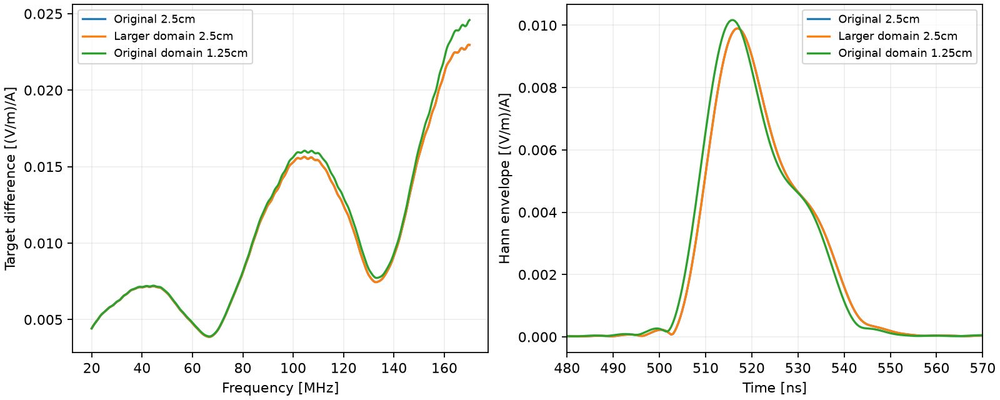

# 20m目标差分：域稳定，但全带相位未收敛

四组CUDA double均完成：WIDE背景34.875s、目标35.625s，FINE背景120.812s、目标122.187s，共313.499s。无失败重试，当前无任务。原始输出/输入/门禁/日志/终态/hash均归档。设计见[控制方案](2026-09-25_deep_controls_design.md)。

## 结果改变了可用范围

所有比较均为目标−同域同格背景的官方SFCW频谱。基准是原32×50m、2.5cm格，并非精确解。

|变化|全带复数相对L2变化|最大幅度变化|最大相位变化|
|---|---:|---:|---:|
|扩大域48×62m，仍2.5cm|9.41×10⁻⁹|2.23×10⁻⁷dB|1.53×10⁻⁶°|
|原域，细化至1.25cm|66.6647%|0.59398dB|64.8431°|

细化的分段复数L2变化：20–<70MHz为2.7408%，70–<120MHz为25.8323%，120–170MHz为87.3406%。分段仅诊断，不擅自缩减用户20–170MHz频带。谱RMS仅增加0.30119dB，说明只看能量或包络会掩盖复数相位不稳定。

扩大域变化小，支持当前这次域扩展没有可见改善；不是对所有边界参数的普适证明。细化改变明显，**2.5cm的20m全带差分不能作为高精度波形真值；1.25cm也没有被证明已收敛**。前轮平层总反射的约四倍改善不能迁移成深目标认证。旧报告中2.5cm初筛建议仅保留为粗略幅度/机制探索，不能用于高频波形保真硬标签。

近似无损轴向Yee路径（15m空气、3mε16覆盖层、16.75mε9砂岩至目标顶）预测170MHz细/粗相位差63.6043°，实测64.8431°；全频带预测最大残差1.8218°。公式 k_h=2/h asin(sqrt(εr)h/(c dt) sin(ωdt/2))，dt=h/(c√2)，预测−2Σ[k_fine−k_coarse]L。未拟合或应用相位校正；忽略损耗、斜路径和目标散射，只支持长路径网格色散机制。

200/400ns尾窗差分L2变化：扩大域0.027254%、细网格0.026164%，远低于细化影响。此时再调尾窗不能解决全带数值相位问题。

## 归档

四组原始目录为 `artifacts/research_checks/2026-09-25_DEP_BG_WIDE/`、`DEP_20_WIDE/`、`DEP_BG_FINE/`、`DEP_20_FINE/`（各目录同日期前缀）。两个细组Job峰值提交内存约5.43GB，非显存；背景细组运行时单次整卡采样2938MiB、利用率100%，不称峰值。

`scripts/analyze_deep_controls.py --output <新目录>` 使用现有GPU环境Python作CPU后处理。结果在 `artifacts/research_checks/2026-09-25_deep_controls_analysis/`：比较JSON、所有复数谱与包络NPZ、图、色散诊断和hash。复算JSON/PNG字节一致、数组一致；图已目检。所有attempt已消耗。

## 后续决策

暂停将深部全频带响应认定为数值真值，继续保留粗/细两套模型作为敏感性对照。下一单元先把已测网格差异映射到现有评价协议的 `numerically_unresolved` 状态，避免生成虚假的唯一最佳算法标签；随后开展明确标注为机制试验的背景不匹配/弱目标保护检查，同时评估达到可用相位精度的官方均匀格计算成本。不能通过人为移动时间轴、只看包络或丢弃高频来宣布收敛。

研究目标仍覆盖原20–170MHz及0–20m场景；二维、材料假设、实际天线与实测验证的限制不变。此阶段有明确数值局限，但仍可推进评价与资源方案，不构成必须等待用户的阻塞。
