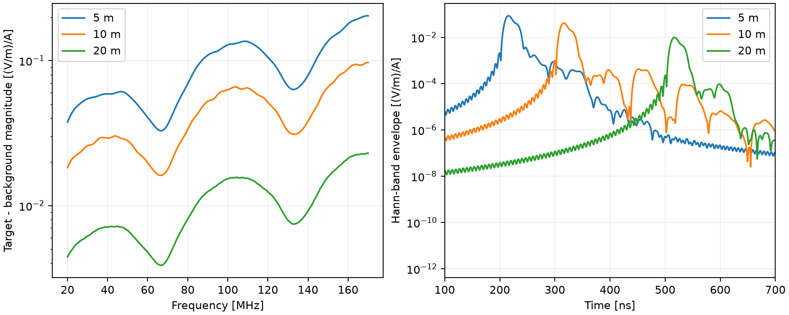

# 局部假设湿润带：5/10/20m深度初筛

按[结果前设计](2026-09-25_yz_depth_design.md)，无目标背景及5/10/20m目标四次CUDA double完成，分别23.594/24.343/17.813/17.812秒，共83.562秒；无失败重试，当前无任务运行。源、域、网格、材料、时窗及输出检查通过。Job峰值提交内存约2.91–2.95GB，未将其称为显存。

背景为3m假设粉质粘土覆盖层及砂岩；目标为横向4m、厚0.5m矩形湿润异常，沿X无限延伸，ε20、σ0.02S/m。只移动中心深度，不改变目标尺寸、材料或逐条增益。地面z30m、飞行高度15m、横向基线1.3m，记录1200ns，格距2.5cm。无真实滑坡标签或仪器噪声。

## 直接差分结果

官方SFCW源归一化后目标减背景，20–170MHz共501点。以相同Hann频带窗重构复数包络，在无损垂直中心路程±80ns内取峰；所有曲线保持原始共同幅度尺度。

|中心深度|包络主峰时间|带内差分RMS [(V/m)/A]|相对5m差分强度|差分/总背景范数|
|---|---:|---:|---:|---:|
|5m|216.06ns|0.102371|0dB|−59.14dB|
|10m|316.16ns|0.049622|−6.29dB|−65.43dB|
|20m|516.76ns|0.011915|−18.68dB|−77.82dB|

总背景含强直达波和地层响应，最后一列不是噪声底或SNR，也不是仪器动态范围的直接测量。深部目标差分可在理想同背景相减下显现，但现场无法获得完全相同的“无目标”背景。因此不能从上述无噪声图形直接推出真实20m可探测性。

相对垂直中心估计220/320/520ns，主峰略提前；目标有0.5m厚度、上下界反射及频带相位作用，不能将峰时误差直接当作深度误差。频域合成使用IFFT补零只作插值；约0.407ns绘图采样不代表物理分辨率。带限包络可出现前振铃，不等同因果提前到达；三组原始差分在100ns前均逐样本为零。

200ns与400ns尾渐消之间，差分频谱范数相对变化分别6.88×10⁻⁸、2.00×10⁻⁷和2.73×10⁻⁴。20m较敏感但目前仍小于0.03%，该结果仅排查这两种尾窗，并未排除域/PML误差。

## 归档与复现

四组原始输入/HDF5/门禁快照/日志/监督终态与hash位于 `artifacts/research_checks/2026-09-25_DEP_BG/`、`DEP_05/`、`DEP_10/`、`DEP_20/`（后三者目录同样有2026-09-25前缀）。attempt均已消耗，不重跑。

`scripts/analyze_yz_depth.py --output <新目录>` 用当前GPU环境Python做CPU分析，无FDTD。产物 `artifacts/research_checks/2026-09-25_yz_depth_analysis/`：结果JSON、频谱CSV、原始/差分/包络NPZ、图和hash。复算JSON/CSV/PNG字节相同、数组一致；图已检查，不做逐深度归一化或增益。

## 下一步与限定

优先检验最深20m差分：1.25cm目标/背景配对，以及同2.5cm但更大域的目标/背景配对。两种控制分别研究离散和边界影响；比较差分本身而非总反射。当前未建立目标差分的数值精度上限。

通过之后再用于背景抑制和衰减补偿的受控试验；需要加入可解释背景扰动，检验弱目标是否随强背景被删除。沿X不变的一组A扫不是沿航线B扫数据集，不把本轮结果包装成算法性能或三维滑坡结论。现场材料、极化、噪声/动态范围和三维验证仍待补充。
