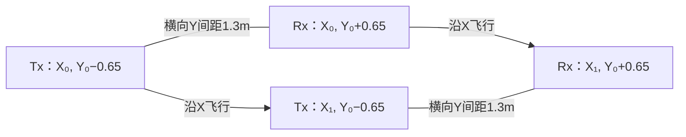

# 采集几何与SFCW开发数据约定 v1

2026-09-27。根据模型合理性审查及用户“做吧”落实。适用于新导出的C3开发侧SFCW数据；历史输入、评价结果、阈值和测试消费记录保持原样。此约定不是新FDTD执行契约，也不把假设认证为设备或现场真值。

## 坐标与真实采集

统一约定X沿飞行、Y横跨航线、Z向上。用户确认约15m飞高、横向1.3m收发距；等高、平地、基线中点在航线、哪侧是Tx均为建模约定，不由照片推断天线极化。

平地参考地面Z=30m时，第i道可用 Tx=(X_i,Y_0−0.65,45)、Rx=(X_i,Y_0+0.65,45)。沿航迹前进改变X_i，保持横向基线；示意只表示运动与位置，不代表天线振子方向或极化。

斜坡未来应分别定义地面高程与平台轨迹，不能把本次平地绝对z=45m写成所有地形下15m恒离地；两天线实际相位中心、姿态和极化仍未知。

## 现有模型允许的名称和用途

| 数据 | 实際变化坐标 | 必须保留的解释 | 不支持的解释 |
|---|---|---|---|
| BASE二维单道 | x不变，y-z计算 | 横航迹分层/异常机制基准 | 实机单道幅度标定 |
| MT33 | Tx y=15.35固定，Rx y=12.65..20.65、间距0.25m | 二维变偏移距单炮集，33接收点 | 无人机运动B-scan、固定1.3m基线 |
| CO11 | Rx y=12.65..22.65、间距1m，Tx=Rx−1.3 | 二维横航迹常偏移代理，11道 | 与真实沿X飞行等价的B-scan |
| A0有限3D | 单组Tx/Rx，横向基线，D10有限盒异常 | 三维局部机制锚点 | 完整沿航迹道集或D20探测认证 |

2D的x=invariant不保存为物理有限x位置；图和表不旋转坐标来同时声称满足飞行方向和收发基线。Ex只是当前假设极化，不能由基线方向推断实物极化。3D真实航测验证的必要几何是“保留Y基线、沿X移动、目标在X有有限变化”；本轮不生成或启动这种模型。

## 本轮SFCW适配的固定边界

首批仅使用已归档C3、D10、εr20/σ0.02、宽4m厚0.5m的CO11和MT33以及对应BG，共24个H5。排除C5/C8测试数据，排除实测数据、训练和任何求解。该有限样本验证数据转换与可复用入口，不认证整个开发库已转换。

- 官方 `load_source` / `load_receiver` / `direct_frequency_response`：保留每个源与接收器的物理时间偏移、实际源历史及相位；20MHz+300kHz×k，k=0..500，共501个复频响。
- 主导出不对记录施加尾窗；附200ns尾窗敏感性，沿用已有计数约定 `(round(200ns/dt)−0.25)/N`。无尾窗数据和原始末5%尾部诊断同时保留，不因尾窗变小宣称记录收敛。
- 官方 `reconstruct_time_response` 使用矩形频窗、归一化开启、zero_pad_factor=4、time_shift=0；固定选择便于审计，不按图像好看与否选窗。矩形频带的旁瓣/包络周期回绕必须保留解释。
- 包络周期T=1/Δf=3.333333µs；2004个重建样本，dt=1/(2004×300kHz)≈1.66334ns，采样率601.2MHz。4倍零填充仅插值，方便表达170MHz载波，不增加真实带宽、独立信息或距离分辨率。
- 首选处理表示为complex_envelope；同时保存官方复频响、complex_bandpass与real_bandpass。实部仍是理想源归一化传递响应的重建，不是校准接收电压。
- 1.2µs原始记录之后的信息未被求解；3.333µs重建区间包含有限带宽旁瓣和周期延拓，不能视为额外物理传播观测。包络周期性不表示20MHz载波调制后实信号也以该周期连续。
- 每产物保留来源哈希、官方processing源码哈希、原始采样/时间偏移、源/接收坐标、接收器身份和源有效掩码。源有效掩码全通过仅说明归一化可计算，不证明网格/物理精度。

## 评价衔接

本轮产物只建立新数据域，不套用旧20352点冲激域的窗口索引、D/N阈值，不重跑已消费的S5。下一步用物理秒重新声明开发侧窗口，并对BG/TGT配对变化与尾窗敏感性做诊断；TGT−BG仍不是无误差clean目标。G4及训练限制保持。

官方依据：[V4 SFCW](https://docs.gprmax.com/en/latest/inc_SFCW.html)；本轮以本地安装的processing.py及其导出SHA定位实际代码，不假定latest网页永久对应同一源码。
