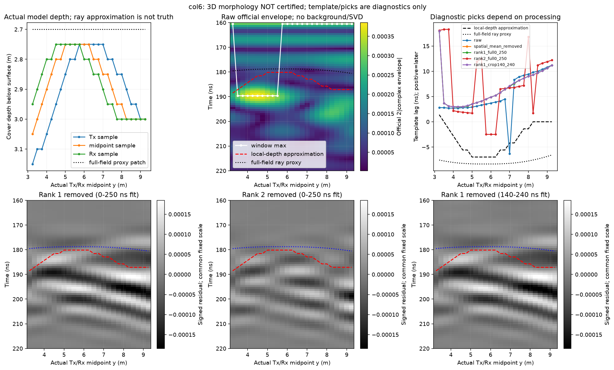

# HS4 三维 B-scan 形态核查（2026-10-03）

用户：“三维的形状就对了吗？好好核查一下”。审查基线 main `9daeeae`，应用 uavgpr-research-review 的证据分级；独立审查分支 `codex/hs4-3d-shape-audit-20261003`。本轮新增 CPU 后处理审查与记录，未改模型、算子、物理阈值或冻结契约，未启动求解器、geometry-only、训练或 C5/C8 评价。原始胶囊与旧输出不覆盖。

**结论：不能说三维形状已经正确。** “最强残差在 195 ns、位于地下候选窗”只认证其时间位置，不能认证该条带就是正确的界面形态。当前有正确的输入几何及可重复的数值重建，但没有完成地下形态的物理签认。此前“三维可作为二维排查依据”应理解为对照数据可用，不能理解为三维已经具有真值资格。

## 已核验事实

- 原 HS 胶囊全部 **99 项**清单身份在审查前后匹配。COL6 25 道及 CO13 13 道原始 H5 全部独立批量重建，保存的 ns 时间轴和带符号 B-scan **逐元素精确一致**。
- 从归档 `.in` 独立解析完整 **2304 个覆盖层箱体**，组成的 48×48 底界表与 NPZ 完全一致；38 个输入的几何箱体及数值/材料命令相同，只有采集位置/名称等指定字段变化。每组源波形、dt、时间原点一致，接收 Ex 原始 dtype 为 float64。
- COL6 实际 H5 源/接收 x 为 **1.60 m**（输入标称 1.625 m，经网格落点），截面仍位于 bin 6；地表 z=12 m、源/接收 z=27 m，空气段 15 m，偏移距 1.30 m。
- 在 COL6 采样范围内，Tx 下方覆盖层厚度为 **2.75–3.15 m**（0.40 m 起伏），收发中点下方为 **2.75–3.05 m**（0.30 m），Rx 下方为 2.75–3.00 m。它们不是同一条地质采样曲线。中点只是局部平面近似下的参考位置，也不能自动指定粗糙三维模型的真实反射点。

以上只认证输入文本、已保存 H5 及后处理身份；没有重新运行几何构建/求解，也没有取得本机该批次的实际全体材料网格快照。因此不将输入解析等同于新的求解器几何验收、网格收敛或场地验证。

## 波形/条纹是否对应界面

首先统一官方链：20–170 MHz/501 点/Hann/8 倍零填充，采用固定 SHA 的本机官方 processing。原始复包络使用 `2*abs(complex_envelope)`，没有对 signed 数据重新 Hilbert 后冒称官方包络。

| 诊断（主要窗 160–220 ns） | COL6 三维 25 道 | CO13 三维 13 道 |
|---|---:|---:|
| 原始官方复包络最大值落在窗边的道数 | **16/25** | 0/13 |
| 去一阶残差的绝对相位峰与中点局部深度近似的相关性 | **0.2583** | **−0.0236** |
| 同一残差的 signed 模板时移与局部深度近似的相关性 | **0.6890** | **0.2048** |
| 去一阶残差相对全窗居中输入的平方能量比例 | 2.3608×10⁻⁹ | 1.0025×10⁻⁹ |
| 与逐道输入位置完全匹配的 HS1/HS2 平面锚 | **无** | **仅第 7 道** |

COL6 的 16 个官方包络拾取值都在该窗最早采样点 **160.5123 ns**，余下 9 道选择约 189.62 ns；这不是已经辨识出的连续地下界面。signed 原始峰有 17 道落窗边，说明极性/相位峰与复包络最大值也不能混用。窗边值可能包含带限尾波、其他成分或事件重叠，不能在没有成分参考时一概叫噪声或纯地下回波。

这些相关性是不同拾取诊断，**没有设定物理通过阈值，也不作验收总分**。局部深度曲线只是一个近似，相关性低不能独立证明电磁仿真错误；相关性 0.69 也不能签认为“模型形状闭合”。最重要的结果是，现有原始数据和处理残差没有提供单一、方法一致、已认证的界面轨迹。

去一阶之后，COL6/CO13 与“时间去均值后再减跨道平均”的残差相对 L2 差分别只有 **0.08115% / 0.01043%**。当前 SVD 图主要展示跨道变化，它会同时消去共同的地层响应，不能直接当作完整地下回波。上述极小能量比例的分母主要由强直达/地表响应贡献，**不等于相同比例的地下目标被删除，也不证明残差只是数值噪声**。

## 检查是否由拾取或处理方式决定

固定对照五种输入：原始 signed、时间去均值后的跨道去均值、0–250 ns 窗去一阶、同窗去两阶、140–240 ns 窗去一阶。分别在 160–220 / 170–215 / 180–210 ns 三个窗作诊断，不把较好看的某一设置选作真值。

signed 模板是实际 HS1−HS2 对比响应；对每个窗去时间均值后，搜索 −20…+20 ns，通过线性插值、正向 signed 归一化相关性求时移，正值为目标更晚。逐道输出最优局部峰和替代局部峰，避免只给一个最优数。0.1 ns 是插值搜索间距，不能当作物理到时精度。

- COL6 原始时移会出现周期跳支；去一阶与跨道去均值近似相同，去两阶之后又发生跳支。不能据某一黑白条带最醒目就认定它是同一个界面事件。
- CO13 去一阶模板时移/局部深度相关性从全窗的约 0.205，变为局部 SVD 窗的约 **−0.033**。这是处理窗口敏感性，不是物理形态证据。
- 三个拾取窗和五种处理的逐道数组、窗边/搜索边界计数及相关性均保存在机器指标中；没有只登记效果较好的方法。

匹配位置的 CO13 第 7 道还进行了实际介质对比：

| 指标 | 数值 |
|---|---:|
| HS1−HS2 平界面对比响应复包络峰 | 187.12575 ns；6.0602×10⁻⁴ |
| CO13 t07−HS2 起伏对比响应复包络峰 | 190.45243 ns；3.1477×10⁻⁴ |
| 两个复包络最大值之差 | +3.32668 ns |
| 同一对比响应的最优 signed 模板时移 | +10.2 ns，相关性 0.7653 |
| 替代相关峰 | −0.7 ns，相关性 0.7062 |

不同拾取读数差异明显，说明不能将包络峰之差、相位相关峰、初至或地质变化统称为同一传播时移。匹配消融差分定义的是这一介质替换的对比响应；只有这一道的位置匹配，不能由它构造 COL6 的全线 clean 标签。

## 不用截面直线冒充完整三维真值

本轮同时计算了两类明确标为近似的几何诊断：

1. 95 MHz 单频局部平层折射射线：按已声明 Debye 复介电常数计算相位折射率及群折射率，空气段 15 m、覆盖层取各道中点下方厚度，偏移距 1.3 m；以 HS1−HS2 的实际复包络峰作为时间锚。COL6 的这条曲线约 180.14–188.52 ns，是局部近似，未纳入侧向散射和完整脉冲形变。
2. 全 48×48 界面的离散箱体中心光程最小值代理：对每个箱体点求空气/覆盖层 Snell 路径，按 95 MHz 相位光程选点，报告该路径的群传播时间。COL6 的代理约 178.77–180.55 ns，候选反射点距中点约 0.30–2.92 m；CO13 的代理候选点甚至离测线中点约 2.13–4.86 m。

第二类结果只说明**只看测线下方一条剖面可能不足**。该代理不含完整电磁反射强度、波形叠加、垂直分箱面的绕射或边界/天线误差；最短路径不必主导实际包络。两条近似均没有真值资格，不能以其中任意一条与图“更像”来宣布物理通过。图中已明确分别标注 local-depth approximation 和 full-field ray proxy。

## 当前数值控制也没有覆盖 COL6

COL6 的 x=1.60 m 距 x 向侧面 PML 内缘（x=1 m）仅 **0.60 m**。现有 HS3 域宽对照是中央 x=6 m 的单道、沿 y 扩展域，不能证明近 x 边缘 COL6 各位置的误差也足够小。这个覆盖缺口是已确认事实；**PML 是否造成当前条带是尚未证实的归因**。

当前覆盖层在 170 MHz 的相位波长约 **8.266 格**（dx=0.05 m）。官方 SFCW 文档建议通常至少十格/最短波长，并明确零填充只细化显示采样、不增加带宽/分辨率；高端频率仍需收敛检查。Hann 的高端权重下降不能代替误差预算或物理收敛签认。[gprMax 官方 SFCW 文档](https://docs.gprmax.com/en/latest/inc_SFCW.html#frequency-and-time-window-validity)（阅读相关节；网页当前为 4.0.1，运行使用本机固定哈希的 V4 代码，没有升级或迁移新 API）。

## 建议的最小后续控制

当前先恢复/建立可审查的配对参考和数值控制，保留真实带符号输出：

- 以 COL6 相同位置、极化、材料、网格与 PML 做平界面/起伏配对，明确两者差分只表示该几何替换，不删去保护的共同层响应。
- 先在端点、中间等代表位置检查沿 x 扩域且保持内域物理几何和世界坐标不变的控制，不能同时改变空气/岩土宽度或换材料后归因到 PML。
- 检查网格/尾渐消敏感性与保护事件误差预算；对到时分别定义初至、包络峰、相位/模板时移及不可评价状态，再决定是否能推广全线。

这是后续方案方向，**尚未冻结新批次或启动求解**。本轮不因为有三维数据就放行训练、调阈值或通过形态验收。

## 复现和归档

```powershell
& 'artifacts/local_checks/gprmax_v4_gpu_env/Scripts/python.exe' scripts/audit_hs4_3d_shape_v0_1.py --out artifacts/local_checks/hs4_shape_new
```

输出目录必须不存在。脚本含已知解析脉冲 4.3 ns 时移、局部深度方向/锚点、平面全域代理一致性三个数学 sanity 检查；用显式异常，优化 Python 也不能跳过这些检查。机器产物在 `artifacts/research_checks/2026-10-03_hs4_3d_shape_audit_v01/`：99 件输入身份、38 道精确重建、2304 个箱体一致性、全部拾取/替代峰、matched t07 对比、逐道 CSV、原始复包络/残差 NPZ、3 张图及 manifest。没有重复既有 182 项数组检查，也没有将此后处理审查计为求解器/物理验证。


