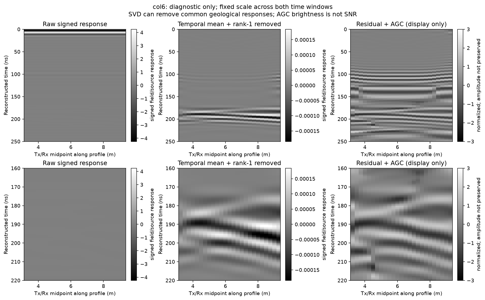

# HS4 B-scan 审查修复（2026-10-03）

用户“修复问题”授权下处理 [独立复审](2026-10-03_hs4_bscan_review.md) 的五项发现。代码、绘图及证据状态已修复；**同条件二维平面背景仍缺，台阶时移与“7 倍菲涅尔阻尼”的物理签认尚未完成**。本轮只处理已有开发侧数据，没有求解器、geometry-only、训练或 C5/C8 读取，冻结契约/G4 不变。

## 修复与验收

1. **清单兼容及输入保护**：`hs_capsule_identity.py` 同时读取历史 filename/hash 字典和当前 file/sha256/bytes 列表；拒绝重名（含重复 JSON key）、缺项、非法路径、错误哈希与字节数。HS 验收在加载前后检查身份，校验每个复包络的时间轴、形状及复数有限性，禁止输出进入输入胶囊。`run_hs_acceptance_v0_2.py` 保留原命令名，产物版本升为 **v0.3**，输出目录/图存在即拒绝，不覆盖旧 v0.1/v0.2。
2. **保留相位的域宽门禁**：使用 `2*abs(c1-c3)`，先对复包络作差，再取模；原 `abs(2|c1|-2|c3|)` 仅保留为幅度诊断。阈值仍为直达峰尺度 `1e-5`、界面对比尺度 `0.01`，没有为通过验收改阈值。当前正常原胶囊 **PASS**：三个窗中的最大差值/直达峰 `1.3333070290104794e-7`，界面窗差值/HS1-HS2 对比响应 `7.61745588617302e-5`（0.007617%）。匹配消融差分只定义该介质替换的对比响应，不称所有地下结构的 clean 真值。
3. **到时口径勘误**：当前台账撤回“二维传播早 3–6 ns”。原地表读数 98.97/102.30 ns 来自不同极性的 `argmax(abs(signed))`；四组中心道同一地表窗的官方复包络峰均为 `99.8003992015968 ns`。不将地表包络峰一致外推为全部地下运动学一致，不改用新的拾取方法来证明旧签认。生成器也撤回“默认 pml_cfs 不影响运动学”的无独立对照断言；输入生成内容未改。
4. **绘图坐标与复现**：新增 `plot_hs4_bscan_v0_2.py`，从 4 组共 **280 道原始 H5** 通过固定 SHA 的官方 SFCW 链复算，与保存矩阵最大绝对误差均为 **0**。纵轴直接使用保存时间轴的 ns 样本中心；横轴使用 H5 的实际 Tx/Rx 中点坐标。全窗 0–250 ns 与细窗 160–220 ns 同列固定色标；原始带符号幅度、逐道时间去均值后去 1 阶 SVD、仅显示用途 AGC 分列，并保存各步矩阵及增益。AGC 为 20 ns 滑动 RMS（反射边界，所有道共用最大 RMS 的 1% 下限），不声称保幅、SNR 或深度提升。旧图件和原 manifest 均保留；新图作为当前诊断产品。
5. **参考缺失与不成立的签认**：当前 registry 分开登记求解归档、官方链精确重建、目标保真和物理成因验证。COL6/二维起伏改为 `partial_validation`，台阶改为 `pending_reference`；原 summary 另存 `historical_summary`，供追溯，不再作为当前有效结论。“决定性通过”、横向位移由折射导致、所有 <10 m 起伏到时不可见及约 7 倍菲涅尔平滑均撤回签认，保留为历史声称/待检假设。

## 背景参考查找范围与限制

核对了当前二维胶囊的全部 492 项清单、本机 `artifacts/simulations` 与忽略的 local_checks 名录、建成/台阶/符号修正三个 Git 提交 `518c3af`/`f920baf`/`d6394b1` 的相关树及历史、已提交的 simulations 备份和降级清单。未发现图中 BG 的同条件输入、H5、复包络或带符号数组及互相关指标。旧 `2026-09-25_DIM23_2D_BG` 是 TMx/Ex、800 ns、非色散 er=16 覆盖层，域/源/地表位置与当前 Ey/600 ns/Debye 场景不同，不能替用。登记的异盘备份 `D:/gpr_evidence_backup/2026-10-02_simulations` 在本机不存在；没有认证另一台主机的磁盘。以上结论限于本机与 Git 可见证据，不声称原作者从未生成参考。

因此本轮**没有生成台阶互相关平台或平滑倍数**，也没有以二维各道平均、三维 HS1、SVD 残差等冒充丢失的原平面参考。恢复原参考后，需先核验同条件原始输入/源码/轴/哈希，再冻结互相关的参考角色、窗、归一化、搜索范围与亚样本处理，输出逐道结果并独立验收；新写的互相关方法不能冒充已复现旧方法。若原参考无法恢复，新控制实验需另行冻结执行方案，本轮没有启动新求解补造历史证据。

## 检查及产物

`check_hs4_bscan_repairs.py` 的 **22 项检查**在普通 Python 和 `python -O` 下均通过，包括实际列表清单端到端、历史字典、反相、幅值翻倍、8 个原始样本时移、加载期间变化、轴/复包络异常、清单错误、输入/历史输出保护及绘图时间/符号契约。反相输入在身份清单更新匹配后仍被相位门禁拒绝；幅度诊断仍近似通过，证明反例检验的是相位遗漏。两个输入胶囊检查前后字节一致。现有 **182 项数组检查**另行复跑通过；这些检查不是 FDTD 收敛、目标保真或实测性能证据。

- 新验收：`artifacts/research_checks/2026-10-03_halfspace_standard_hs_v03_acceptance/`（JSON、复包络及复差 NPZ、图、manifest）。
- 新诊断：`artifacts/research_checks/2026-10-03_hs4_bscan_diagnostic_v02/`（4 图、4 组每步数组、全输入身份、官方精确重建/窗统计及 manifest）。
- 检查证据：`artifacts/research_checks/2026-10-03_hs4_bscan_repairs_checks/`。保留普通/优化摘要、三项负控的真实门禁指标、182 项完整数组结果及 manifest/provenance；原临时副本和逐项日志仅在忽略的 local_checks，修改可由已入库检查脚本复现。

```powershell
$py = 'artifacts/local_checks/gprmax_v4_gpu_env/Scripts/python.exe'
& $py scripts/check_hs4_bscan_repairs.py
& $py -O scripts/check_hs4_bscan_repairs.py
& $py scripts/verify_workspace.py
& $py scripts/run_hs_acceptance_v0_2.py --dir artifacts/research_checks/2026-10-02_halfspace_standard_hs --out artifacts/local_checks/hs_v03_new --fig artifacts/local_checks/hs_v03_new/acceptance.png
& $py scripts/plot_hs4_bscan_v0_2.py --out artifacts/local_checks/hs4_plot_new
```

以上新输出名必须不存在。`review_bscan_hs4_20261003.py` 的旧完整入口是历史缺陷复现（断言错误通过），适用于审查提交 `d4244e1`；修复后使用新的检查入口。新绘图复用了旧脚本中独立 `analyze` 的重建/统计函数，没有运行历史反例入口；其源码身份也随新产物记录。



图件使时间窗和处理影响可核对，但没有改变原仿真模型。二维起伏最强残差仍在 107.285 ns，地表窗/地下候选窗残差能量比仍为 30.455；这一现象需要同条件背景及数值控制解释，不能用 AGC 改观代替物理修复。
