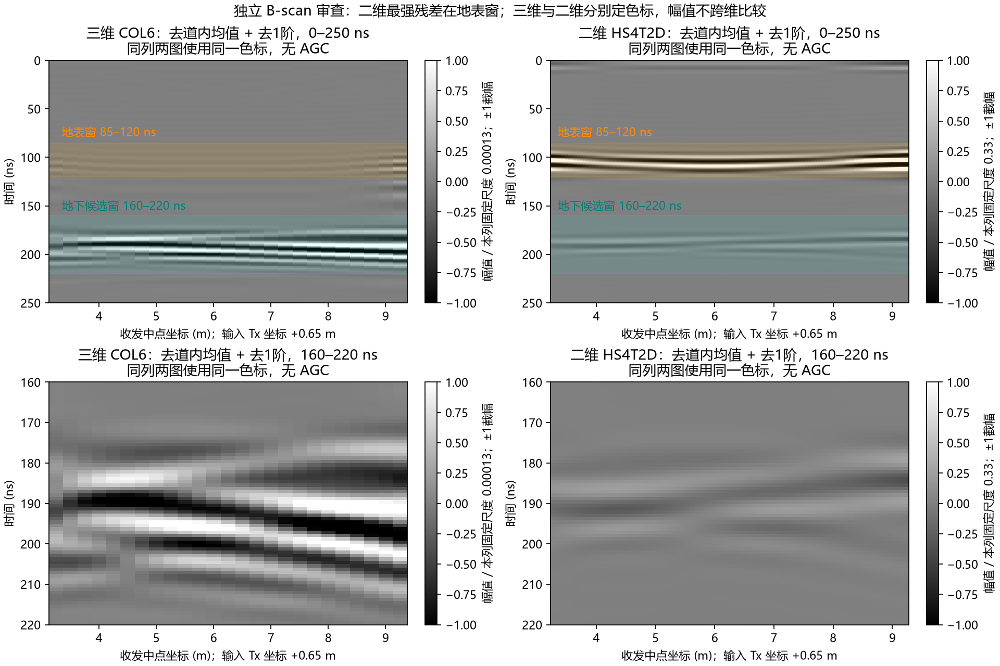

# HS4 B-scan 独立复审（2026-10-03）

用户请求：“拉取最新提交，审查，目前结果 bscan 我看着不太对”。本轮从远端同步至 main `d6394b1`，审查 `cbe203e..d6394b1` 的 HS/存储修复、三维 CO13/COL6、二维起伏及阶梯测线；应用 code-reviewer 和 uavgpr-research-review 技能。在独立分支 `codex/bscan-review-20261003` 留档，不修改作者处理算法、原始胶囊、冻结契约或门禁，不运行求解器、训练，不读取 C5/C8。

**结论：Request Changes。** 保存的带符号 B-scan 重建正确；当前图件及台账尚不能证明“地下界面形态与模型闭合”。二维最醒目的弯曲残差位于地表时间窗，AGC 放大了弱条纹；地下参考不齐、到时定义混用及验收程序回归仍需处理。现有数据不足以把问题统一归因为 15 m 航高或菲涅尔平滑，也不足以直接判定求解器错误。

## 独立核验结果

两个当前胶囊的 **99 + 492 = 591** 件 manifest 哈希全部匹配。四组 **280 道**全部读取原始 H5，校验同组 source 波形、采样间隔、时间原点和数组形状，再批量执行本机已固定 SHA 的官方 `direct_frequency_response` 与 `reconstruct_time_response`，沿用 20–170 MHz/501 点/Hann/8 倍零填充及原链的 200 ns 尾渐消。保存的时间轴、带符号矩阵与复算 **逐元素精确一致，最大绝对误差均为 0**：

| 组 | 道数 | 原始分量 | 官方带符号重建 | 中心道地表复包络峰 ns |
|---|---:|---|---|---:|
| 三维 CO13 | 13 | Ex | 完全一致 | 99.8003992016 |
| 三维 COL6 | 25 | Ex | 完全一致 | 99.8003992016 |
| 二维起伏 HS4T2D | 121 | Ey | 完全一致 | 99.8003992016 |
| 二维阶梯 HS4T2DS | 121 | Ey | 完全一致 | 99.8003992016 |

二维源沿不变轴、读取 Ey 的设置与当前输入一致。二维 Hertzian 源为线源，不能直接移植三维点源的绝对幅度结论；这也不自动证明当前到时差或全部残差的成因。[gprMax 官方源说明](https://docs.gprmax.com/en/latest/input_hash_cmds.html#hertzian-dipole)（本轮阅读相关命令节；运行和定量结论以本机固定 V4 源码及归档数据为准，不迁移最新网页中的其他语法）。

为隔离显示影响，独立实现声明清楚的检查流程：取 0–250 ns，先减去每道的时间均值，再去除第一奇异分量。没有 AGC，也没有逐窗重新定色标。同一列的全窗与局部图使用相同幅度尺度；两种维度分别定尺度，不作绝对幅度横比。

| 组 | 残差全窗最大值位置 ns | 地表窗/地下候选窗残差能量比 | 地表窗/地下窗残差峰比 |
|---|---:|---:|---:|
| CO13 | 192.1158 | 0.0001449 | 见机器记录 |
| COL6 | 195.4424 | 0.0105105 | 见机器记录 |
| 二维起伏 | **107.2854** | **30.45497** | **9.776** |
| 二维阶梯 | **107.2854** | **51.10911** | 见机器记录 |

地表窗定义 85–120 ns，地下候选窗定义 160–220 ns；表中“地表窗”是时间区域名称，不能据此把该区全部残差认定为纯地表反射。二维最强残差与目标地下窗在时间上不同；AGC 将很弱的早、晚期条纹提升到相近亮度，黑白条纹数量不等于地层数量或已恢复的界面。



这份图独立重做坐标和色标；并非声称复现了作者未入库的完整绘图实现。SVD 残差反映跨道变化，可能删去真实的共同层响应，也可能产生类似波形导数的正负条带，不能当作原始地下事件的完整保真输出。

## 需要修改的问题

### [P1] 当前正常胶囊无法通过新验收入口读取

位置：`scripts/run_hs_acceptance_v0_2.py:72`。

最新 HS 胶囊 manifest 已变为 `[{file,sha256,bytes}, ...]`，新验收脚本仍按字典调用 `manifest.get(...)`。按文档命令、使用本轮全新 local_checks 输出目录执行，立即 exit 1，报 `AttributeError: 'list' object has no attribute 'get'`，未进入实际门禁。不能据先前副本上的三项反例声称最新胶囊仍可复跑。

应定义并校验 manifest schema，兼容已有历史字典与当前列表或统一新的版本化格式，拒绝重名、缺项及非法身份。至少增加使用**实际当前归档 manifest**的端到端正常输入检查。不要改写历史文件来适配新脚本。

### [P1] 阶梯及“7 倍平滑”签认缺少参考与复算实现

位置：`docs/research/research_artifact_registry.json:2313–2323`、`docs/research/decision_log.md:5–7`。

本次已核验全部 121 道阶梯 H5 和 NPZ，但当前仓库没有图中所用的**同条件二维平界面 BG 输入/H5/重建数组**；NPZ 只含阶梯自身的 `t/S`。互相关的窗、参考、归一化、搜索范围、亚样本插值及逐道结果没有脚本/metrics JSON。生成器只生成起伏模型，未提供阶梯/平界面标准件和这些图件的复现入口。因此不能独立复算 −11.64/+11.3 ns 平台、拱形约 1 ns 位移，或据此证明“7 倍阻尼”的物理归因。

当前 `validated` 还包含旧的“界面同相轴与理论曲线重合”结论，但新日志已经披露先前符号画反、相关性约零、位移远小于局部深度预测。应把“求解完成”“官方链重建通过”和“目标保真/物理归因通过”分开登记。先补齐已完成参考的原文件/哈希、版本化差分/互相关/绘图脚本及机器指标，再进行独立签认；不靠新增求解补造旧证据。

15 m 航高扩大照射足迹是合理的待检解释，不能以单频自由空间量级估算直接宣布所有 `<10 m` 起伏到时基本不可见。本次还发现同源、同偏移距端点与中心道的原始全带响应在 **85 ns 以前**已有位置差异：COL6 最大差为原始峰的 2.338%，出现在 15.60 ns；二维起伏为 14.558%，出现在 41.16 ns，均早于约 100 ns 的地表包络峰。这证明当前差异不全是地下起伏本身；有限域/PML、位置离散及宽带传播影响仍需隔离。全带差异不能直接当作 20–170 MHz 数值误差预算，也没有在本轮被归因到某一个因素。

### [P2] 把不同极性的波形峰差写成二维传播提前

位置：`docs/research/decision_log.md:11`、`docs/research/research_artifact_registry.json:2307`。

记录中的地表 `98.97 vs 102.30 ns` 是对两种有符号波形取 `argmax(abs(signal))` 的结果：二维选中了正峰，三维选中了负峰。它们的**官方复包络峰均为 99.8003992016 ns**。至少对地表事件，“二维运动学系统性早 3–6 ns”并不由这个比较成立；`pml_cfs` 差异也没有被该读数独立归因。

应统一事件、参考、包络/相位/初至定义，分别报告波形形状及传播时延。非因果带限重建下的包络上升沿亦须声明拾取规则、阈值和窗，不将改变拾取方法本身作为通过证据。二维与三维底界运动学仍需在同条件、同角色的地下差分响应中核验；本轮未把地表峰相同外推为全部地下运动学相同。

### [P2] 新域宽门禁只比较模值，完全反相仍通过

位置：`scripts/run_hs_acceptance_v0_2.py:110–114`。

在临时副本中转换 manifest 为脚本当前支持的字典格式，正常对照确实 PASS。随后只将 **HS3 原始 Ex 乘 −1**，更新该测试副本身份清单，使输入身份检查照常通过；物理波形已完全反相，新脚本仍 exit 0、`verdict=PASS`，所有模值差门禁与正常对照相同。

原因是计算 `abs(e1-e3)` 时 e1/e3 已分别取过绝对值，完全丢失相位/符号。这可以作为单独的幅度一致性诊断，不能认证本项目带符号波形的域宽不敏感。应同时评价 `2*abs(complex_envelope_1-complex_envelope_3)` 或声明清楚的带符号差；若归一化尺度病态，修改有依据的尺度，而非先删去相位。该反例是测试参考替换，不是在原胶囊内篡改数据；原输入保持不变。

### [P2] 当前三维 COL6 图的时间刻度全为 0

位置：`artifacts/research_checks/2026-10-02_halfspace_standard_hs/fig_hs4_col6_bscan_svd.png`。

最新“修正符号”图左侧纵轴所有刻度都是 `0`，也没有明确纵轴单位；另外两列只共享刻度，没有可读时间标定。保存数组明确为 ns，0–3332.50 ns。这使用户无法在图上区分地表约 100 ns、地下约 190 ns 及其他条带；直接违反目验时核对坐标/单位的要求。

应从保存的实际时间轴生成刻度与单位，确保裁窗坐标和样本中心一致，并将渲染脚本入库。单纯翻转理论线符号不完成图件验收。本轮独立诊断图已修正坐标供审查，但没有覆盖作者原图。

## 上轮六项问题的复核

- 输入哈希门禁和真实阈值判断已经实现，但当前 manifest schema 回归阻断正常入口，且新门禁存在上述相位遗漏；不能整体关闭。
- 历史输出保护和官方复包络口径已加入，正常兼容格式副本产生的数字与归档 v0.2 相符；输入胶囊全程未改。
- 原始 H5 已在存储规范中改为必保留资产，并登记了另一台主机的异盘备份。当前机器没有该备份目录，本轮只核对条款和已提交记录，未认证另一台机器的物理磁盘或 11622 份备份；不重复将该记录冒充本机验证。
- 旧加噪 Nb、NC/floor RMS 失效范围已更正，原问题关闭。
- 降级文件已有固定提交恢复入口，本机独立执行 `recover_demoted_evidence.py --check`，33/33 在位、哈希匹配、零失败；原问题关闭。

## 复算产物、限制及下一步

脚本：`scripts/review_bscan_hs4_20261003.py`。
证据：`artifacts/research_checks/2026-10-03_hs4_bscan_review/` 的 `review.json`、诊断图和 manifest。包含 280 道精确重建、两胶囊哈希计数、位置/分量、残差窗统计、正常入口失败，以及兼容清单正常对照和反相错误通过反例。

```powershell
& 'artifacts/local_checks/gprmax_v4_gpu_env/Scripts/python.exe' scripts/review_bscan_hs4_20261003.py
```

默认在忽略的 local_checks 创建唯一目录，副本变更与日志仅留该目录；原胶囊检查前后的字节身份相同。本次先尝试的 receiver 路径选择符不受本机 API 支持，在读取第一道前停止；改用实际 `/rxs/rx1` 后上述全组复算通过。没有运行求解器、geometry-only、训练或新测试评价；没有为这次独立审查重复既有 182 项数组检查。重建精确不等于 FDTD 收敛、材料校准或实测验证。

下一步先恢复验收入口、补齐原有二维平界面参考及后处理实现，统一事件拾取与相位门禁，按同一尺度重新展示原始/去背景/AGC；再设计同条件平界面与起伏的跨位置、域宽/PML 控制，确认早期位置差异与地下变化的来源。当前 15 m 航高、3 m 覆盖层及材料损耗仍是机制场景设定，不能为了使图“像预期”直接修改为场地真值；新增求解须另行冻结方案，本审查不构成新的 GPU 执行批准。
