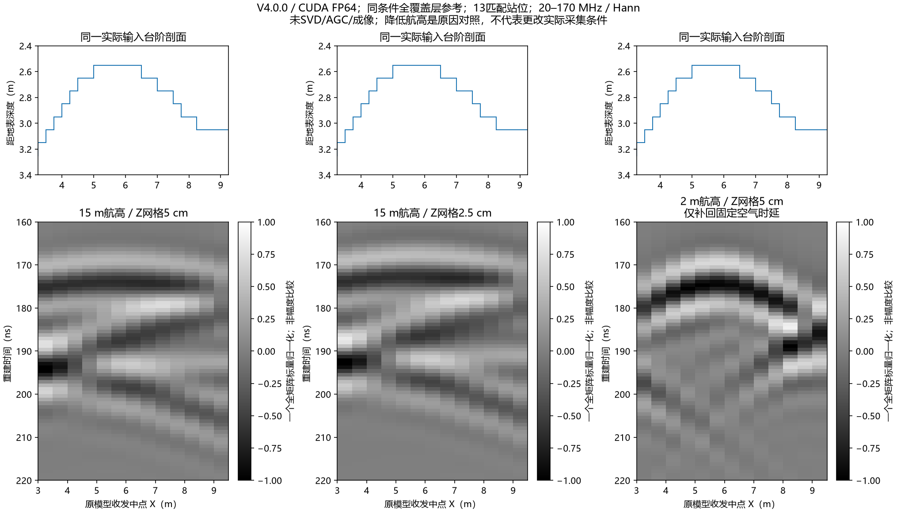
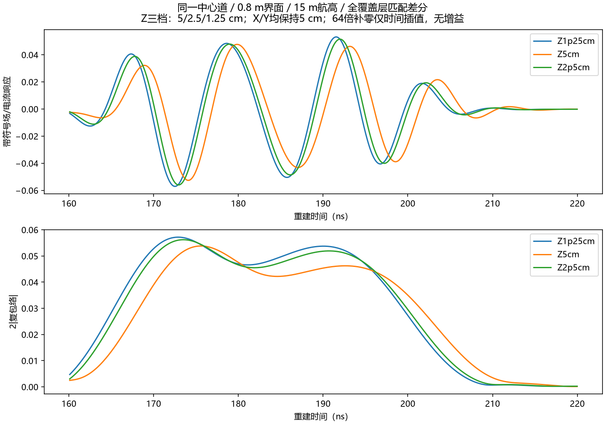
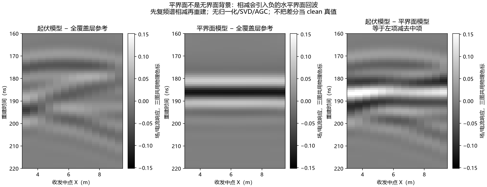

# HS4T2D 模型与 B-scan 形态差异：受控归因

用户要求“尝试锁定原因”后，分三次冻结小批次，共新增 **101 道 gprMax V4.0.0 / CUDA double** 对照。全部原始 Ey 为 float64 且有限，101 份实际单元材料网格与独立构造的预期网格相同。几何并未被画错或在求解时变成水平面。现有证据锁定了参考差分与显示机制，并直接支持离地高度相关的传播效应和有限网格的到时/相位敏感性；不能把剩余误差归于单一因素，也没有宣布完整物理验收或空间收敛。

## 最直接的形态对照



上排为相同的输入深度剖面，下排为同条件“起伏模型 − 全覆盖层参考”的地下带符号响应。左、中分别是 15 m 离地高度、竖向 5/2.5 cm 网格；右是 2 m 离地高度、5 cm 网格。每个下图只除以一个全矩阵标量以比较形状，不能跨图比较幅度；没有逐道归一化、SVD、AGC 或成像。2 m 曲线整体加回固定空气时延 `2*(15−2)/c = 86.7267 ns`，没有按道拟合/对齐。

15 m 的两档网格仍出现接近平缓的上部条带；2 m 对照呈现更明显的拱形上部条带。**降低离地高度改变了传播条件，支持这是主要形态因素之一**；它不是对实际飞行高度的建议。源随之离顶部 PML 更远，故不能把该对照解释成仅改变照射足迹的严格单因素证据。

模型辅助的 95 MHz 驻相路径诊断中，15 m/2 m 离地高度的最早路径群时延跨度分别为 **1.615/7.806 ns**，而按收发中点正下方深度得到的垂直估算跨度为 **16.762 ns**。15 m 时选中的反射位置集中在模型顶部附近 X=5.0125–6.4875 m，即不同站位并非只响应中点正下方的界面。这个路径计算忽略损耗对路径选取的影响，采用平地表和单频折射率；**最早路径不是最强包络峰的真值**。它解释了为什么 B-scan 的时间条带不应直接等同于深度剖面，不能单独替代电磁验证。

全模型起伏为 0.8 m；本次收发中点 X=3.25–9.25 m 实际覆盖的界面深度约为 2.55–3.15 m，局部起伏约 0.6 m。不能把整模型 0.8 m 直接当作每条测线覆盖的深度差。

## 确认的数值问题：5 cm 竖向网格对波形有明显影响



所有对照保持 X/Y 网格 5 cm，竖向 PML 的物理厚度保持 1 m，材料、界面位置、源电流及保存的源空间尺度一致。在地下固定窗 160–220 ns，13 站位竖向 5→2.5 cm 的带符号响应相对 L2 变化为 **67.41%**，包络为 **23.35%**。单靠这次细化仍没有恢复成清楚的模型拱形。

中心道的三档诊断使用同一 501 点、20–170 MHz、Hann 重建，64 倍补零只改善时间插值，不增加频带或原始数值精度：

|竖向网格|地下窗包络最大值时刻|相邻网格带符号相对 L2 变化|相邻网格包络相对 L2 变化|
|---|---:|---:|---:|
|5 cm|175.586 ns|—|—|
|2.5 cm|173.507 ns|60.04%|16.68%|
|1.25 cm|172.883 ns|23.28%|5.28%|

相邻峰时变化由 **−2.079 ns** 缩至 **−0.624 ns**。这说明竖向有限网格对到时/相位的影响存在，并随细化缩小；表内时刻是固定窗包络最大值，不能直接签认为界面的绝对到时。X 仍为 5 cm，1.25 cm 只核查中心配对，不构成完整空间收敛。

按当前假设覆盖层的相位波长计算，5 cm 网格在 20/95/170 MHz 分别约为 62.20/14.64/**8.27** 单元/波长。官方建模指南建议以最短波长至少约 10 个单元起步、20 个更好；这支持检查高端频带的网格敏感性，不能代替实际收敛试验。[gprMax 建模指南](https://docs.gprmax.com/en/latest/gprmodelling.html)

## 平层参考会引入自己的水平回波



三图共享同一数值色标，无幅度归一化。先在复频谱域相减，再重建带符号波形：

`(起伏 − 全覆盖层) − (平层 − 全覆盖层) = 起伏 − 平层`

数值闭合最大误差为 `3.05e−16`。平层模型包含一个真实的水平基覆界面回波，相减会将其负响应带入差分。地下窗内，平层−全覆盖层的平方范数约为起伏−全覆盖层的 **3.34 倍**；这不是可相加的物理能量分解，只说明该参考项足以主导差分的视觉形态。

因此，新版“起伏−平层”诊断中的强水平条带有明确的参考来源。**这项解释仅适用于采用平层参考的差分图**；不能倒推为此前未做这种差分的全部原始/SVD 图的原因。全覆盖层差分也只是开发侧基覆界面对比，不是完整 clean 波形或训练标签。

## 显示色标隐藏地下响应

原来的全时窗原始响应图，0–250 ns 共用色标范围约为 175.798；地下窗原始峰值只有 0.08025，为该色标的 **0.04565%**。因此地下看起来接近灰底，有直接的显示动态范围解释，不能解释为模型没有响应。

当前因果图截取固定地下窗并明确标注尺度；形态图采用每例一个全局标量，参考分解图使用同一物理尺度。它们不构成增益补偿、SNR 改善或探测深度提高的证据。

## 已排查的替代解释及边界

|对照|结果|能支持的结论|
|---|---|---|
|中心 impulse 与 95 MHz Ricker，按实际保存的源谱归一化|地下窗带符号相对 L2=`4.53e−9`；全 Hann 加权复频谱=`1.72e−6`；501 源频点均有效|快照里的宽带脉冲网格纹理不是当前带限中心 B-scan 形态的主要驱动，不能据此认证真实天线|
|13 站位域宽 12→36 m，边缘层延续、收发/中央几何相对不变|地下窗总相对 L2=7.35%，中心=1.90%；末两道为18.20%/33.24%|早期地下窗中心的侧向截断效应较小，测线边缘仍有明显不确定性|
|Ricker 中心域宽 12→24→36 m|地下窗相邻变化1.18%/1.67%|同样限于这个地下窗；全记录复谱变化仍大，不宣称域宽收敛或排除所有边界问题|
|去掉200 ns尾部渐消；改取300 ns记录、不渐消|中心地下窗变化`3.28e−6`/0.245%|这些处理选项不是该窗的主要形态因素；全记录谱指标不能与局部窗混用|
|已知曲线延时的单回波数组经过同一官方链|预期跨度16.762 ns，重建16.633 ns，最大量化偏差0.348 ns|重建链不会必然把曲线抹平；这是数组检查，不是FDTD物理真值|

加宽域也改变外部地层延续和边界位置，不是 PML 系数单独消融。不同道的固定窗最大峰会换波瓣，故不将峰时跨度用作形态验收或地层到时真值。

## 执行与证据身份

三份契约都在对应批次前冻结，输入与源码哈希见契约；记录中无求解失败。缓存仅复用相同源/编译选项/架构的 CUDA 编译产物，每道场状态重新初始化。新增13道细网格序列的中心道与先前单道细网格原始 Ey 逐元素相同，粗网格旧原版的121道精确重放证据见上一轮报告。

|阶段|契约及原始证据目录|新增道数|求解批次实测时间|
|---|---|---:|---:|
|参考/域宽/高度/中心竖向网格|`artifacts/research_checks/2026-10-03_hs4t2d_cause_controls/`|67|811.953 s|
|Ricker源/域宽与13道竖向细化|`artifacts/research_checks/2026-10-03_hs4t2d_source_controls/`|32|706.704 s|
|中心竖向1.25 cm配对|`artifacts/research_checks/2026-10-03_hs4t2d_zfine_confirmation/`|2|190.235 s|

契约 SHA-256 依次为：

```text
2aaa4521d50db25387d31e92928273c751f8e1283bda2e26808ae4a29733f76e
1cb6e3061606ebf27df836fa2cbf43c931a4dbb79ac24b9af09e68d962a5b359
c5d21d417483cf7a91f2fb66e9d118f2477339d6ea92bf618dbca351977cde80
```

原始 H5、输入、契约、审计、日志全部归档，每组归档一份实际材料网格；另外的重复几何文件保留在执行机器，其逐文件哈希和101道独立材料网格验收保留在 `completed_verification*.json`。`archive_selection.json` 区分当前可重查的代表网格与历史全道网格证据；`manifest.json` 固定归档字节。纯克隆可重新检查101份原始 H5 和17份代表材料网格，但不能声称重查了未归档几何文件。第二阶段保留全覆盖层中心精确重放检查。

分析输出分别在 `...cause_results/`、`...cause_confirmation/`、`...zfine_results/`。从原始归档再生成到新的忽略目录，三组核心数组、指标和图件的重建验证见 `rebuild_verification.json`（位于第三组分析目录）。复算入口见各控制目录 README；需要本项目固定的 V4 官方 SFCW 处理源码和 NumPy/SciPy/h5py/Matplotlib。执行契约的历史绝对路径只作执行身份记录，分析从契约所在目录读取，复算不调用求解器。

## 当前结论与接续

可以明确区分三件事：输入几何正确；当前 B-scan 不等于中点正下方的深度剖面；5 cm 竖向结果存在不能忽略的到时/相位网格敏感性。下一步若要签认几何对应关系，应在实际 15 m 采集条件下保留带符号/复谱，采用明确参考和固定地下窗，并补充 X/Z 空间收敛与可信事件路径定义。低高度对照只用于归因，不能替换实际工况；是否开展成像另行确定，不在本轮加入处理范围。

本轮仅使用二维开发模型，未读保留实测、未训练、未运行三维；二维无限线源/材料假设不等于真实有限天线和场地。G4、旧冻结契约、旧阶梯/菲涅尔签认和训练资格未更改。本轮锁定的是上述可检验影响机制，不是对所有模型的统一物理合格证。
