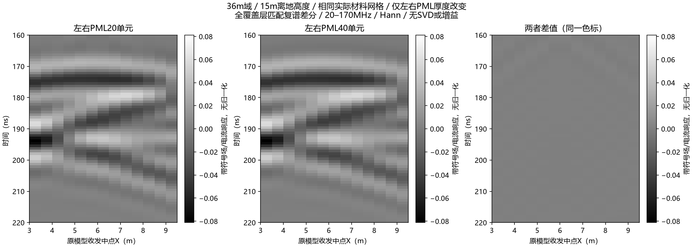

# 官方手册复核与固定几何PML对照

目标仍是解释输入起伏与B-scan条带为何不同。用户要求继续推进并读好官方手册后，本轮先纠正新合入审查的材料/到时/稳定性解释，再冻结并完成32道纯边界厚度对照。**固定几何的结果不支持侧向、顶部或底部PML是当前地下带限条带变平的主要来源；网格与传播形态的进一步核查仍未完成。**

## 官方依据及适用版本

2026-10-03阅读官方在线手册的Debye命令、PML厚度/公式/默认CFS参数、二维缩减与吸收边界间距、网格分辨率相关章节。阅读范围是这些相关正文，不宣称通读所有端口/子网格/后端章节。在线页标为4.0.1；执行仍使用本机**V4.0.0**，并逐项对照实际安装源码，不升级环境或把新增语法反套旧模型。

|主题|官方依据|本机实现及采用方式|
|---|---|---|
|Debye|[命令与水的示例](https://docs.gprmax.com/en/latest/input_hash_cmds.html#add-dispersion-debye)|`materials.py:474` 的 `DispersiveMaterial.calculate_er`；`#material`为高频项，Debye参数为增量；电导独立加入|
|二维|[建模与TM缩减](https://docs.gprmax.com/en/latest/gprmodelling.html)|实际 `grid/fdtd_grid.py:1987` 的 `calculate_dt` 对TMy仅使用X/Z导数；一单元Y为二维不变方向|
|PML|[PML参数](https://docs.gprmax.com/en/latest/input_hash_cmds.html#pml-commands)|PML在域内；实际 `pml.py` 的单项默认为alpha=0/kappa=1/四次sigma渐变、sigma上限自动；HORIPML标签不自动意味着用了两个CFS项|
|边界间距|[建模指导](https://docs.gprmax.com/en/latest/gprmodelling.html#absorbing-boundary-conditions)|15单元是基本间距建议，不是误差验收标准；宽域加厚后收发仍有充分净距|

本轮核对的是公式/参数语义与受控结果，材料仍为开发假设，不是场地实测真值。

## 修正了三项会误导归因的问题

`audit_hs4_model_correctness.py` 与 `identify_hs4_event.py` 已改为读取实际输入/原始H5身份的便携CPU入口，必须显式指定新输出文件，不覆盖旧结果。共享机制见 `hs4t2d_physics_diagnostic.py`。

1. 旧审查将18.017解释为静态介电常数、7.878解释为高频极限，导致带内速度算错。正确静态**介电实部（不含DC电导项）为25.895**；20/170MHz介电实部分别22.7676/18.1792。电导仍为0.003S/m。新计算与实际V4官方材料实现501频点复数结果的最大相对差为`7.71e−11`，由两处epsilon0常量差解释，独立检查给出该差的显式预算。
2. “z=0底反射182.57ns”公式只累加单程，不能用来签认往返回波。按其自身旧近似双程约365.15ns；使用正确材料的垂直群时延代理约**361.04–368.68ns**，并非184ns。这个修正本身也不能完成事件识别：双站斜路径、反射相位、有限带宽与波瓣切换尚在代理之外。新版输出的事件身份为**UNRESOLVED**，不再根据与局部深度相关系数低就自动判为底部回波。
3. 对二维XZ模型套三维CFL上限，不能据此判为不稳定。121道实际dt=`1.1793271683748422e−10 s`，恰好等于二维真空CFL上限；这不替代完整色散稳定性和空间收敛。正确覆盖层最短带内波长对应5cm约**8.27单元/波长**，此前9.29的计算混用了低频速度和高频频率。有限网格敏感性依然需要处理。

同时去除审查中硬编码的3D检查、未经运行复算的能量/噪声声称及固定E盘输出。真实台阶按箱体边界采样，不在箱体中心间插值；实际收发中点从H5读取。旧输出和它们的旧源码提交仍保留为历史，不改旧哈希。

便携独立检查9项通过，包括官方材料全频复数交叉核对、官方水80.1的静态极限、无色散相/群折射率极限、双程路径、实际台阶两侧采样、无效频率拒绝、二维CFL与不从相关性强判身份。`artifacts/research_checks/2026-10-03_hs4t2d_manual_corrections/`保存修正诊断与检查。

```powershell
python scripts/audit_hs4_model_correctness.py --out artifacts/local_checks/hs4_corrected_new.json
python scripts/check_hs4t2d_physics_diagnostic.py --out artifacts/local_checks/hs4_physics_checks_new.json
```

## 固定几何的PML对照

所有案例为36×0.05×33m、5cm网格、15m离地高度、1.3m收发偏移、600ns impulse、V4.0.0/CUDA double。中央12m起伏及两边既有地层延拓完全不变，实际材料数组逐道与旧36m基准相同。源/网格/材料不变，**只修改 `#pml_cells` 指定面的厚度**。20单元基准复用已完成数据；新32道完成约622.687s，无失败，不重跑已消耗attempt。

比较前使用实际保存的电流源谱归一化，在501点20–170MHz复谱做“起伏−全覆盖层”差分，再用Hann/8倍补零重建。地下窗160–220ns预先固定；同尺度图没有逐道归一化/SVD/增益。表中相对L2是两个波形的差异比例，**不是边界回波的独立能量占比或绝对误差界**。

|仅改变的边界|覆盖|地下带符号响应相对L2变化|
|---|---|---:|
|左右20→40单元|13站位|2.244%（逐道1.574%–3.598%；中心1.660%）|
|左右40→60单元|中心|0.000232%|
|底部20→40单元|中心|`1.11e−11`（比例）|
|顶部20→40单元|中心|`2.37e−8`（比例）|



平缓条带没有随着侧向PML加厚而变成模型拱形。中心40/60单元响应在声明窗口接近一致，但仍不称完整域宽/频带/空间收敛；13道60单元尚未执行。原12m窄域近边缘结果也不能直接获得这一宽域资格。

底部加厚对160–220ns的原始Ey差分逐元素不变，对带限重建只有约`1e−11`相对变化。加厚顶部虽明显改变宽带脉冲瞬时场，对同窗带限结果仍仅约`2e−8`。**这直接说明宽带快照、全记录原始场与20–170MHz产品必须分别评价。**左右20→40单元的全记录原始差分相对L2约119%，全Hann复谱约5.91%，地下带限窗仅2.24%；不能混用这些域/窗口来宣称边界影响大小。绝对范数/峰值与逐道统计均保存，避免小分母被解释为物理贡献百分比。

原始32份H5、32实际材料网格的独立执行时验收、输入/日志/冻结契约与每组代表网格归档在 `...hs4t2d_boundary_controls/`；重复几何本机保留并登记身份。分析v0.1留存，v0.2补绝对范数和40→60中心对比；第一版原源码按SHA恢复保存，不把新源码哈希覆盖旧结果。当前v0.2从原始H5重复生成的NPZ/JSON/两PNG逐字节一致，见 `rebuild_verification.json`。复算/归档检查入口见控制目录README。

## 现在能解释什么，仍要查什么

已确认：几何正确；平层参考会引入自身水平回波，显示色标会隐藏地下响应；5cm竖向结果有明显相位/到时敏感性；降低离地高度的对照改变了条带形态。本轮进一步排查了固定几何下的PML厚度，未观察到它能解释地下带限条带变平。

尚不能宣布最强条带来自同一块拱顶，也不能把形态差异全部归于真实传播。下一阶段应保持15m实际条件，以左右40单元宽域为边界参照，进行X/Z联合网格细化并保留匹配参考，再核查可信事件路径/空间响应；对比估计要保留复相位，禁止凭最大峰与局部深度相关性强判身份。新批次另冻具体方案与预算。未改G4/旧契约/训练资格，未读保留实测或启动三维/训练。
