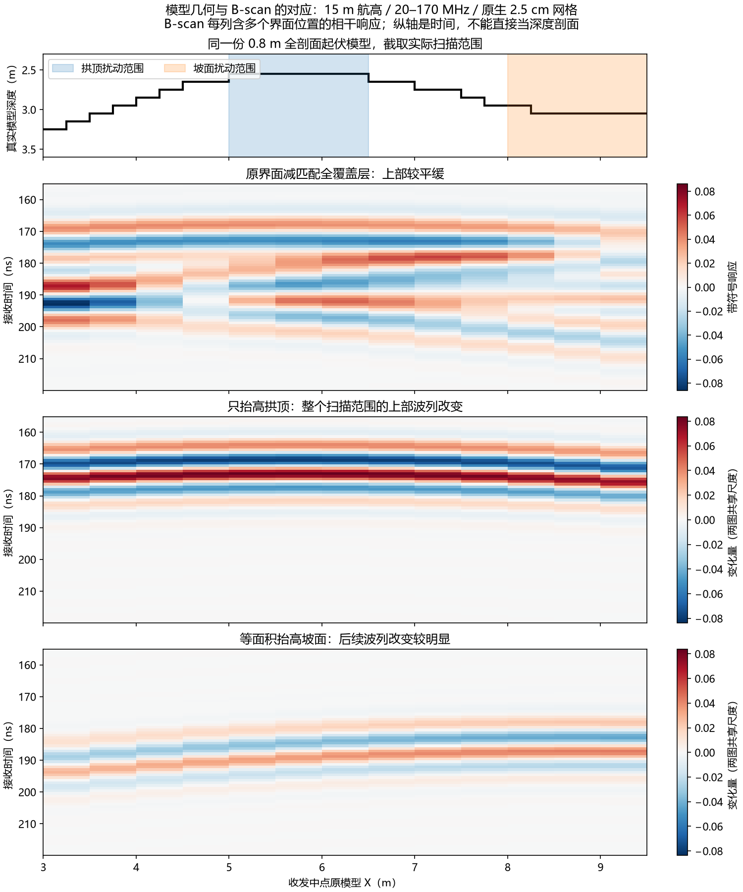
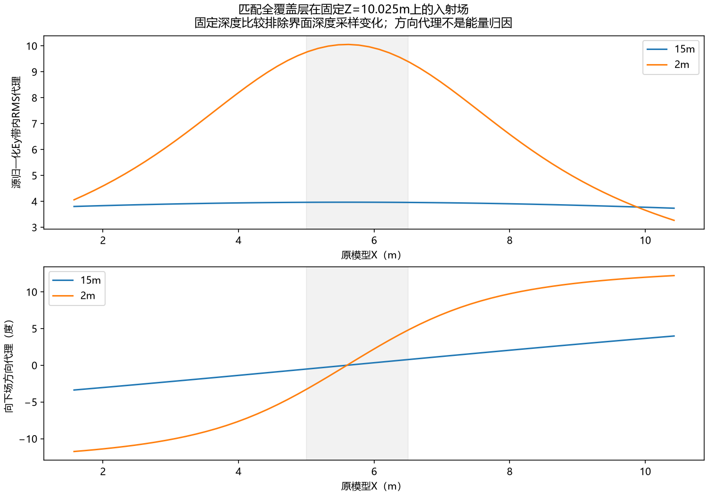
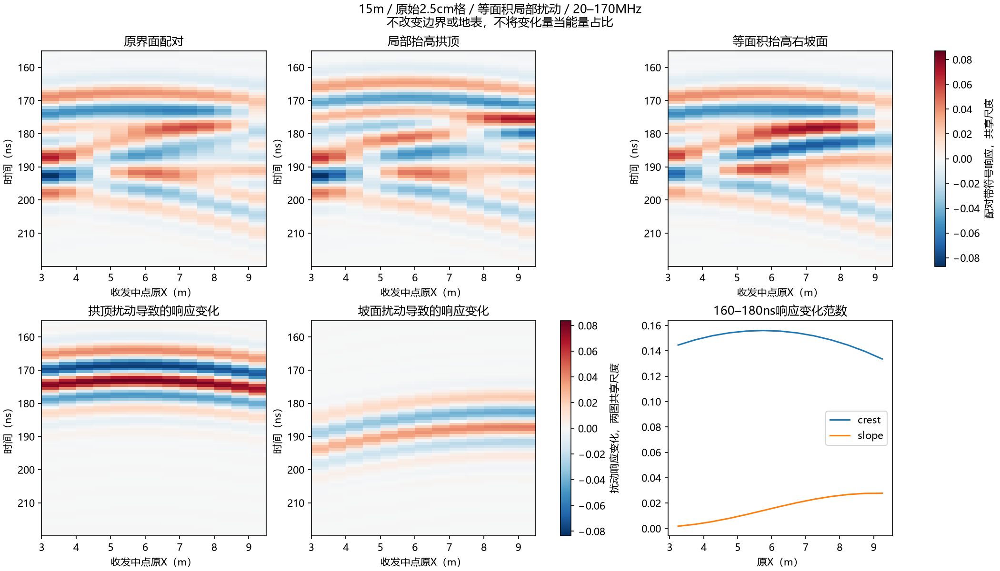
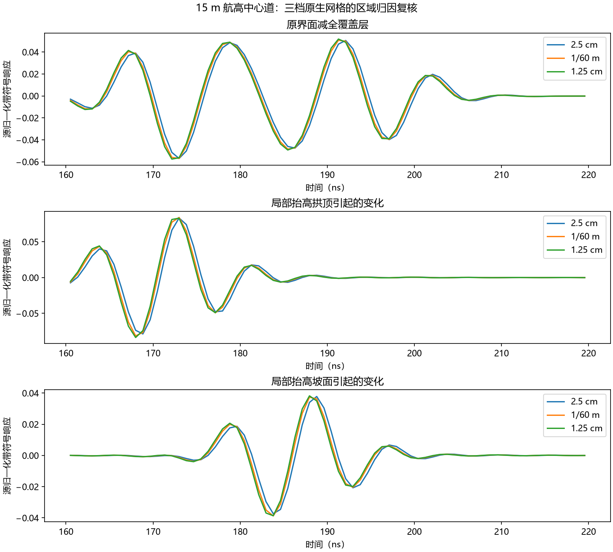

# 航高波场与局部界面扰动：模型和 B-scan 为何不长得一样

**目前二维模型的上部平缓地下波列已经有区域因果证据：15 m 航高的照射较宽，多个站位共同响应较浅拱顶；右侧坡面更多影响后续波列。**这使接收时间随站位的变化小于“各站位正下方界面深度”的变化。未成像 B-scan 的纵轴是接收时间，每列混合不同界面位置的相干响应，不是模型几何的垂直投影。

这不是凭动画观感下的判断：本单元实际完成 **47 条新 gprMax V4.0.0 / CUDA double 原始记录**、四组共 **4072 个六分量快照**，以及等面积拱顶/坡面扰动的跨站位和跨网格对照。当前归因覆盖指定二维模型、20–170 MHz 和地下诊断窗；**完整波形仍有有限网格差异，三维有限天线和实测形态尚未验收。**不能把阶段性归因写成所有数值误差、每一条回波来源和现实设备的全面验证。



## 直接证据及其解释

保持36×0.05×33 m域、平地表Z12 m、原0.8 m全剖面阶梯界面、Debye覆盖层/岩层、Tx/Rx偏移1.3 m、物理侧向2 m及上下1 m PML。原模型X=世界X−12；13个收发中点为原X3.25–9.25 m，中心Tx原X5.6/Rx6.9 m。扫描范围内实际深度差约0.6 m，全剖面起伏0.8 m。这些是同一几何的不同范围，不能混用。

### 入射场：高航高的空间权重更宽

15 m和2 m各做起伏/全覆盖层匹配对照。为了避免沿不同界面深度采样混入衰减差异，在**固定Z10.025 m平面**比较全覆盖层的源归一化带内Ey RMS代理。原生求解网格均为X/Z2.5 cm、Y5 cm。

|高度|带内RMS代理最大值|ROI左端/右端|观察|
|---|---:|---:|---|
|15 m|3.9680|3.8034 / 3.7363|9 m观察范围内相当平缓|
|2 m|10.0536|4.0605 / 3.2682|更集中在发射位置附近|

时间/空间同位后，Sx=Ey·Hz、Sz=−Ey·Hx的带内方向代理也显示高、低航高的角度差别。此处是匹配介质中的照射权重与方向诊断，**不是已分离的反射功率或各机制能量占比**。



### 局部几何扰动：共同拱顶并非仅由最早射线路径推测

选两个不延伸到边界的1.5 m支撑区：拱顶原X5–6.5 m，右坡面X8–9.5 m。两端各0.25 m箱体界面抬高0.05 m，中间四箱抬高0.10 m，**每种改变的剖面面积同为0.125 m²**；其他材料/几何/源/边界不动。实际网格而不只是输入文字均核查通过。

15 m做拱顶/坡面各13道，复用已归档同条件2.5 cm基准；2 m做基准/拱顶/坡面各左中右3道，共35条新记录。比较的是复数频谱差及重建波形变化，未逐道归一化，未使用SVD/AGC。

* 高度15 m，160–180 ns固定窗中，拱顶扰动对**全部13个站位**产生显著变化；其复波形变化L2为同面积右坡面扰动的 **4.814–79.140倍**，中心8.965倍。
* 同高度180–220 ns，右坡面变化更强，拱顶/坡面L2比约0.31–0.52。说明后续波列中坡面影响明显，不能把整段地下记录全称为拱顶反射。
* 降至2 m，在扣除固定空气双程时延86.7267 ns对应的诊断窗，左/中/右站位的拱顶/坡面变化比为3431.05/115.41/**0.5204**。右端对邻近坡面更敏感，符合空间权重更局部的解释。固定空气时延只用来定义对照窗，不是完整传播校正或事件配准。

这些L2比是**几何变化引起的波形敏感性比**，不能说拱顶独占某百分比能量，也不证明一个孤立反射事件。带限前后振铃和各位置相干叠加仍存在；单个包络最大值也可能跳到另一个波瓣。



### 原生网格复核：区域结论稳定，精确相位仍有剩余误差

另冻中心1/60 m拱顶/坡面两次、2.5 cm反向拱顶一次；再冻1.25 cm中心基准/全覆盖层/拱顶/坡面四次。物理PML、收发位置及箱体边界保持一致，未将界面重新平滑。

|中心检查|2.5 cm → 1/60 m|1/60 m → 1.25 cm|
|---|---:|---:|
|基准配对160–220 ns带符号相邻差|16.596%|7.586%|
|拱顶变化的带符号相邻差|22.477%|9.987%|
|坡面变化的带符号相邻差|22.744%|10.030%|
|基准配对包络模值相邻差|3.966%|1.674%|

分母均为相应较粗档固定窗范数，不是绝对误差预算。160–180 ns中心拱顶/坡面变化比依次 **8.965 → 7.923 → 7.556**。区域因果关系保持，差异收缩；第三档仅中心，不能认证全扫描收敛，也不能给出没有推导的Richardson误差界或训练标签。

反向拱顶扰动只作为补充压力检查。保相位、正实幅度的固定窗模板拟合，抬高拱顶残差约82%，不能将拟合出的−3.69 ns当作真实孤立事件时移；降低拱顶残差约25%。此例进一步说明复合波列不能简化为一个最大峰或一个刚性平移。



## 与此前边界、显示链结果的关系

[固定几何PML控制](2026-10-03_hs4t2d_manual_and_boundary_findings.md)已完成：地下带限13道在左右20→40单元时变化2.244%，上部条带仍平缓；中心40→60约0.000232%，上下加厚也没有解释该条带。与本轮局部几何扰动一起，证据**不支持“目前上部平缓条带主要是侧边PML回波”**。宽带原始场有边界敏感性，此结论不能移到任意频带/时间窗/旧窄域。紧凑波场ROI看不到外侧PML，未靠动画中看不到反弹来排除边界因素。

此前已修复的载频/时间轴/相位门禁问题见[显示链修复](2026-10-03_hs4_bscan_repairs.md)。原去1阶残差的最强条带主要在地表窗；本轮讨论的是**匹配全覆盖层复差分的地下160–220 ns**，不能拿这个机制替所有处理阶段的每条条带命名。全覆盖层差分只针对本对照去掉岩层界面的定义，不是实测clean，不作为默认生产背景扣除。

当前原5 cm网格的精确波形不宜作为数值真值；细化之后仍平缓，因此“B-scan必须和几何剖面同形”不是该场景的有效验收条件。把15 m改成贴地会改变问题而不等于验证15 m条件；2 m对照支持局部性增强，未模拟实际贴地有限天线。若研究几何重建，需要另定义航高/速度/相位和成像问题，不在此处为看起来像模型而移轴、强行去平缓反射或造clean。

## 快照与处理可信度

47条成功记录为V4.0.0且原始Ey=float64，不是后转双精度。独立输入栅格化逐道核查47实际材料图，版本/网格/2D CFL/收发格点/有限值均PASS；见[原始归档核查](../../artifacts/research_checks/2026-10-04_hs4_height_archive_verification/native_archive.json)。源/求解器文件身份沿用并核验既有V4构建，不修改环境。

连续场使用Ricker95，每组1018帧、hop10（0.589664 ns），最后E599.688 ns；快照ROI世界X13.5–22.5、Z8–28.1 m，输出0.15 m，**求解网格仍2.5 cm**。输出为单元中心插值，不是抗混叠滤波。4072×6分量float64、形状、原点、E=n·dt/H=(n−1/2)·dt及12组同位原生探针每帧空间闭合PASS。

全原生/hop5/hop10的**全501频点独立直接DTFT**对照，hop10代表探针分量最大相对差约6.67e−8；场谱同位闭合最大约7.94e−8。只覆盖12代表点，不作为全输出网格误差界。DTFT将H半步相位正确计入，200 ns尾渐消按原生样本选取；源谱用完整原生记录，实际501点20–170 MHz/0.3 MHz、单位均值Hann和8倍补零（4008点）。复数配对差后才取模值，直接时刻合成与官方IFFT差2.82e−15。

与同2.5 cm impulse比，Ricker高航高起伏/全覆盖层的Hann复谱差分别6.33e−9/3.03e−9；配对全谱7.17e−6、160–220 ns带符号差4.30e−9。低航高中心Ricker/impulse差1.27e−8。新源归一化后与现有B-scan产品吻合，未把裸Ricker动画当成设备SFCW。

* [原始因果Ricker差分动画](../../artifacts/research_checks/2026-10-04_hs4_height_wavefield_visual/raw_ricker_difference.gif)：实际传播过程。
* [源归一化同频带差分动画](../../artifacts/research_checks/2026-10-04_hs4_height_wavefield_visual/band_difference.gif)：与B-scan事件对应，有前后振铃，不能据前振铃宣称提前到达。

动画两种高度/所有帧共享尺度，弱场使用明确SymLog色标；不逐帧拉伸，不以亮度证明SNR或功率增益。

## 冻结执行、失败和资源记录

|胶囊|成功新道数|记录|
|---|---:|---|
|height_wavefield_pilot|1|无快照被动基准；首次快照输入把.h5扩展名写成额外参数，解析阶段失败，未进入FDTD；旧输入/代码/失败日志保留|
|height_wavefield_continuation|4|新契约修正文件名语法并缩小输出；全部求解完成，末尾旧检查器因两组三点探针随ROI移动而失败|
|local_patch_controls|35|高航高26、低航高9；全部完成|
|patch_refinement|3|1/60 m拱顶/坡面及2.5 cm反向拱顶；全部完成|
|patch_finest|4|1.25 cm中心基准/半空间/拱顶/坡面；全部完成|

连续场失败检查不是数值场被快照改变。独立核查按实际GridPosition配对，主接收器和30个同位置辅助记录逐元素相同；6个移动探针明确不作同名被动比较，但其新坐标的每帧空间闭合仍验收。原冻结检查器的FAILED保留，独立PASS另存，**没有重试旧attempt、补改旧契约或覆盖旧结果**。

35道监督器只观测Windows venv启动器RSS，约4 MB不是实际峰值；记录不支持“实测小于2 GiB”的声称。实际系统可用内存保护仍执行。后续新版本纳入实际子进程，1/60 m峰值约1.30 GB、1.25 cm约2.05 GB；连续场约1.44 GB。refinement契约继承的全局spacing文字有误，追加metadata_clarification，实际逐组网格/输入/材料图/原始属性验证为准，不重写已冻结文字。

串行求解使用本机GPU独占文件锁，资源不足即停止，不杀用户进程，不自动重试。未启动训练、读取保留实测或更改G4/旧签认。

## 复算、归档与06:00自主接续

原生H5、全部输入/契约/执行失败日志、代表实际材料图、结果NPZ/JSON和图件入库；4072快照、12大场谱及重复30材料图留本机，逐文件SHA记录保留，不绕过gitignore上传。克隆可CPU复算局部/三档结果；全快照审计需这些本机大文件，不能宣称纯克隆也有完整场。

```powershell
# 已消耗的执行契约禁止重新 run。以下仅CPU，输出目录必须是新的。
& D:/gprmax_v4_gpu_env/Scripts/python.exe scripts/rebuild_hs4_height_evidence_v0_2.py --out artifacts/local_checks/height_rebuild_new
# 本机持有忽略的大场与全部实际材料图时追加 --full-local。
```

验收结果见[CPU复算核查](../../artifacts/research_checks/2026-10-04_hs4_height_archive_verification/rebuild_verification.json)：35文件中33逐字节一致，含所有场谱/NPZ、PNG/GIF及独立原始/快照核查。场摘要中8个汇总范数差至多2.65e−23，由501×36正平方项的binary64范数归约界gamma(8N)独立核验；所有其他数值/身份要求严格相同。可视化摘要只变其已核验新输入摘要的哈希。原全字节检查因此FAILED，旧脚本/原摘要/新CPU输出保留，新版不放宽科学数组/图件或其他metadata。182项纯数组回归全部通过。执行复现不替代上述数值/物理限制。

按用户本次要求，Windows一次性任务 **Codex-HS4-current-session-20261004-0600** 已注册并核验：触发 **2026-10-04T06:00:00+08:00**，恢复同一会话 `01a0fb58-13ed-75d3-a25d-5e1c99219ff9`，隐藏运行，StartWhenAvailable/WakeToRun开启，运行时限不限；没有修改已有gpr-agents调度。CLI登录、参数及PowerShell语法已核查，尚未到时执行。脚本/提示及未来事件日志留在忽略的local_checks/continuations；需用户保持登录和联网，关机/注销不保证准时执行。这是本机计划任务，不冒充原生应用Automation。

**接续优先级**：先复核本归因及Git归档；若仍需缩小精确波形不确定性，按可用RAM/VRAM另冻下一档有界中心基准/局部扰动，不重跑本轮。随后审查既有三维输入及匹配参考，确定是否具备可执行的有限三维校核资源与独立验收条件；不能将本二维区域结论直接给三维/实测签认。当前上部平缓地下波列已获得稳定的共同拱顶影响证据，剩余数值与维度问题据实保留，整体任务不冒记“彻底全部验收”。
