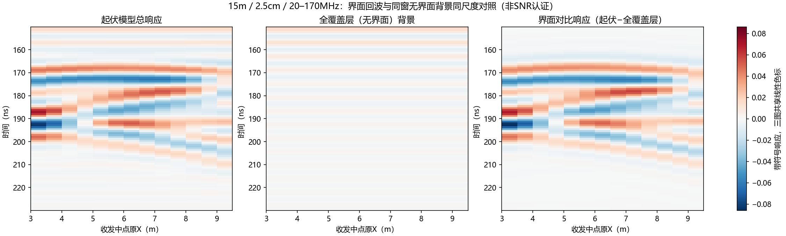
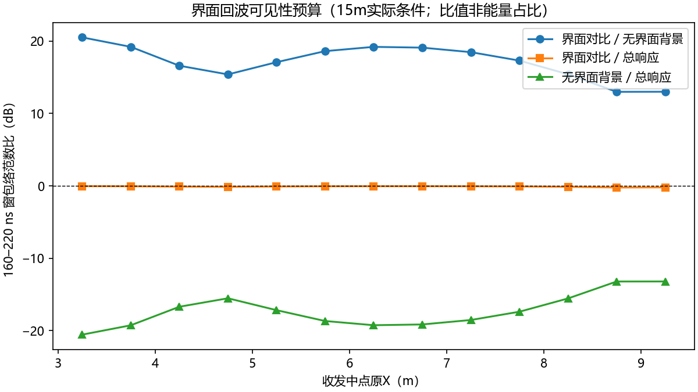

# 界面回波可见性预算：传播正常之后发生了什么（2026-10-04）

用户问题继承："3D 与对应 2D 模型仿真依旧找不到 B-scan 深层看不到基覆界面形状的问题；波场快照显示地下介质传输没有问题，但随后不清楚为什么。"本单元用**纯 CPU 复算已归档、已验收的原始 H5**（不新增求解）把"随后"这一段定量化，补齐归因链最后一环。

## 结论（先行）

**界面回波确实回来了，而且在地下窗内它是主导成分；看不到形状不是信号丢失、不是被振铃淹没，而是两层机制：**

1. **绝对电平**：整个地下窗（160–220 ns）的带符号峰值只有全记录峰值的 **0.015%–0.047%（约 −66 ~ −76 dB）**。任何与直达/地表波共享线性色标的原始 B-scan 上，地下内容必然接近灰底。这与[形态归因单元](2026-10-03_hs4t2d_cause_diagnostic.md)的显示动态范围发现一致，现按 13 站位逐道量化。
2. **形态编码方式**：在地下窗内部，界面对比响应（起伏−全覆盖层）占总响应的 **≈0 dB**（各站位 −0.23 ~ −0.05 dB），即窗内内容几乎全是界面响应；但 15 m 航高宽照射下，最强波瓣锁定在共同浅拱顶（对比包络峰时刻聚在 ~172 ns 与 ~191 ns 两簇，跨站位跨度 21.6 ns，与中点局部覆盖厚度相关仅 **0.613**），跨道变化能量占对比响应的 **60.7%** 却主要体现在 180–210 ns 较弱纹理里。**眼睛把亮带位置读成深度，而亮带是平的**——形状信息存在，但不以"几何同形亮带"的形式存在。

**振铃/背景淹没假说被排除**：同窗无界面背景（全覆盖层模型的地表/直耦带限尾巴）比总响应低 13–25 dB，比界面对比响应低 13–20 dB。

## 定量预算（15 m 实际条件，13 站位，原生 2.5 cm 网格，官方 501×20–170 MHz/Hann/8× 链）

| 量（160–220 ns 窗复包络 L2 范数比） | 早窗 160–180 | 晚窗 180–220 | 全窗 160–220 |
|---|---:|---:|---:|
| 界面对比 / 无界面背景 | +9.8 ~ +17.7 dB | +14.5 ~ +24.8 dB | **+13.0 ~ +20.5 dB** |
| 界面对比 / 总响应 | −0.74 ~ 0.00 dB | −0.19 ~ +0.10 dB | **−0.23 ~ −0.05 dB** |
| 无界面背景 / 总响应 | −10.6 ~ −17.7 dB | −14.5 ~ −24.9 dB | −13.2 ~ −20.5 dB |

跨道线性分解（带符号、全窗）：总响应共同模能量份额 **40.5%**；界面对比响应共同模份额 **39.3%**（形状份额 60.7%）。

界面对比包络峰时刻（ns）：两端站位跳至 189.6–191.3，中间站位聚在 169.7–176.3；与覆盖厚度（2.55–3.15 m，含 0.6 m 起伏）相关 0.613，同深度站位（2.55 m ×3）峰时仍分散 2.5 ns——**最强波瓣不随局部深度走**，与[航高波场单元](2026-10-04_hs4_height_wavefield_findings.md)的共同拱顶区域因果证据互相印证。

2 m 中心站对照（仅固定空气时延移窗）：界面对比/无界面背景全窗 **+12.7 dB**，与 15 m 同量级——降低航高改变的是空间权重（哪些界面位置贡献），不是这个电平预算。

## 图件



左（总响应）与右（界面对比响应）在窗内几乎是同一幅图——窗内内容就是界面响应；中图（无界面背景）接近空白。右图中 ~170–175 ns 的平亮带是共同拱顶响应，180–210 ns 的倾斜弱纹理承载主要跨道变化。



## 对项目问题的直接回答

- "传输没问题但随后不清楚"——随后是：反射正常产生并返回（窗内 ≈0 dB 主导），但在原始记录尺度上比直达/地表低约 70 dB；加窗放大后看到的是"共同拱顶亮带 + 弱倾斜纹理"的复合波列，不是几何剖面。
- 因此**继续调显示、继续细网格、继续查 PML 都不会让 B-scan 长出界面形状**；PML/边界已在[边界控制](2026-10-03_hs4t2d_manual_and_boundary_findings.md)排除，网格残余误差（1.25 cm 带符号相邻差 7.6%）影响精确波形但不改变上述量级。
- 要"看到形状"只有两条路：明确参考的差分视图（本单元的对比响应即一例，但全覆盖层差分不是实测 clean），或成像/偏移（需要速度模型与相位保持，属已延期的范围外任务）。**在首版范围（背景抑制+增益）内，目标应表述为"保留界面响应"而非"恢复界面形状"**；本预算证明界面响应在窗内是主导成分，处理链要保护的对象是它。
- 三维侧结论不变（[三维形态核查](2026-10-03_hs4_3d_shape_audit.md)）：同样的采集物理叠加近 x-PML 覆盖缺口；二维线源结论不直接签认三维。

## 方法与证据身份

- 输入：15 m 十三站位 rough/halfspace 原始 H5（`2026-10-04_hs4t2d_joint_grid_remaining` + `..._joint_grid_centre`，逐文件对 capsule manifest SHA-256 核验）；2 m 中心配对（`2026-10-04_hs4_height_wavefield_continuation`，对 independent_verification raw_sha256 核验）。全部核验通过后才读取。
- 官方处理链：本机固定 V4.0.0 `processing.py`，SHA-256 复核通过（`adad556f…`）；经命名空间 shim 导入，未执行求解器栈。环境新建于忽略目录 `artifacts/local_checks/hs4_budget_env/`（Python 3.8 + numpy 1.24.4 + scipy 1.10.1 + h5py 3.11.0，本机求解环境缺失后的 CPU 复算环境，未改动任何既有环境）。
- 锚点：重建的 13 站位"起伏−全覆盖层"复频谱与已归档 `patch_arrays.npz` 基线相对 L2 差 **1.98e−11**（numpy/scipy 构建差异的环境浮点噪声，门禁 1e−9，非物理阈值）。
- 复算：r1/r2 两遍 summary.json、全部数组、两张图**逐字节一致**。
- 复现（CPU，输出目录必须新建）：

```powershell
& artifacts/local_checks/hs4_budget_env/Scripts/python.exe scripts/analyze_hs4_interface_echo_budget.py --out artifacts/local_checks/echo_budget_new
```

## 边界与限制

- 比值是窗内波形范数比，不是能量占比、SNR 或可探测性认证；未做成像、未逐道归一化。
- 2.5 cm 网格未认证全空间收敛；精确波形/相位残余误差据实保留。
- 全覆盖层差分只隔离"基覆界面存在与否"的几何替换响应，不是实测 clean 参考。
- 未读取保留实测、未训练、未改 G4/冻结契约；三维与实测形态不作本单元签认。

产物：`artifacts/research_checks/2026-10-04_hs4_interface_echo_budget_r1/`（r2 同构）：summary.json、budget_arrays.npz、两张图。脚本：`scripts/analyze_hs4_interface_echo_budget.py`。
