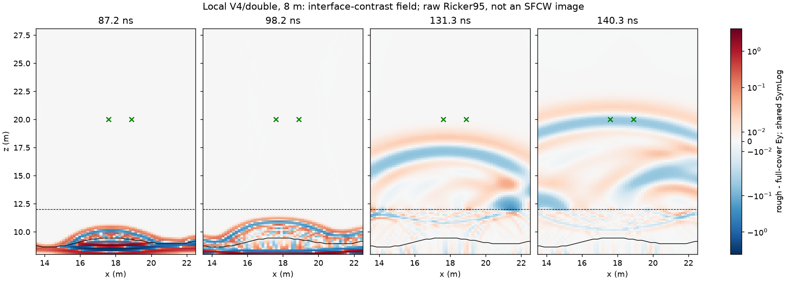

# 本机 V4 双精度波场复验：已执行结果

用户要求“你本地跑个仿真验证一下”。按[执行前方案](2026-10-04_hs4_local_wavefield_validation_plan.md)，本机已新冻并实际完成三组正演：8m航高中心起伏、匹配全覆盖层、起伏无快照被动对照。原始接收器和两组共1,198帧六分量快照与另一台电脑归档的文件 SHA-256 全部相同。本机补齐了此前缺失的数值波场，并完成逐频空气传播锥及时间窗敏感性复算。

这验证了此模型在两种构建/硬件上的执行复现性，并支持“界面响应能返回空气、较高处高空间频率份额显著降低”的诊断；不认证“UAV-GPR必然无法看出形状”、全部数值误差已排除或三维/实测有效。

## 实际执行与身份

- 新胶囊：`artifacts/research_checks/2026-10-04_hs4_local_wavefield_validation_r1/`；契约 SHA-256 `800a22796743f6c94d51538ee300a2283c25d05ebd26a942135c76c117f2dd82`。本批一个 attempt，无失败/自动重试；旧 attempt 未复用。
- 本机 `D:\gprmax_v4_gpu_env\Scripts\python.exe`，Python3.12.0，gprMax4.0.0；该入口是目录链接，契约保存解析后的 `D:\自动处理\artifacts\local_checks\gprmax_v4_gpu_env\Scripts\python.exe`。RTX3060Laptop 6GiB，CUDA11.8，本机 MSVC 编译库。319个Python源码文件与参考相同，25个编译库不同，实际身份逐个入契约。版本字符串没有替代哈希核验。
- 三份输入与原8m胶囊逐字节相同：36×0.05×33m域，X/Z2.5cm网格，二维不变Y的Ey线源；原Debye覆盖层/岩石、原PML、600ns时窗、Ricker95MHz；收发Z20m、地表Z12m、收发间距1.3m。快照ROI X13.5–22.5、Z8–28.1m，60×1×134格，每17原生步约1.002428ns，共599帧/道。没有缩域、降精度或改几何。

| 实际求解 | 完成耗时 s | 峰值所属进程 RSS GiB | 快照数 |
|---|---:|---:|---:|
| 中心起伏 | 82.734 | 0.949 | 599 |
| 匹配全覆盖层 | 80.485 | 0.946 | 599 |
| 起伏被动对照 | 74.187 | 0.730 | 0 |

监督器启动时可用RAM约2.19GiB，逐道执行、独占GPU锁、原生double；结束事件为COMPLETED。独立验收PASS，核查实际网格/材料/CFL/收发格点、原生float64、全部六分量帧身份/形状/时间/有限值、E/H半步及空间插值后的探针闭合（Ey/Hx/Hz最大差均0）、被动对照逐比特一致。验收文件 SHA-256 `5b55a9c295c96d613db6bd50551772353bdb0a7dd06392550fb8d2c1c337abfc`。

三份接收H5与原电脑文件哈希一致，原生Ey最大差及相对L2均0；起伏/全覆盖层每组599/599帧文件哈希一致。正式接收器链另经官方处理源码核验，501个20–170MHz频点源有效，使用实际源归一化、原200ns尾窗和单位均值Hann/8倍补零；先复数差分后重建。跨构建501复响应和113.301–173.301ns固定窗复包络相对L2均0。这是这个离散模型的跨机复现，不能代替网格收敛证书。

## 波场直接看到什么



图为起伏减全覆盖层的带符号Ey，四帧共用SymLog色标；黑实线为地下界面，虚线为地表，绿色叉为收发位置。按固定空间区域求Ey平方的峰值时刻依次为界面87.211ns、覆盖层98.238ns、低空131.318ns、天线区域140.340ns；图中能看到界面对比波场从地下出现后到达空气和天线区域。

这些是不同空间区域的峰值，不是同一条射线的精确追踪，也不是法向能流或上下行分离。差分场保留界面引起的反射、透射变化和多次相互作用，不能把全部帧或波瓣认证为唯一一次界面反射。图是原始Ricker波场，不能充当正式SFCW的B-scan，更不是新完整扫描。

## 逐频角谱更正和窗口敏感性

对匹配差分Ey作有限时间/空间Hann窗FFT，在60–140MHz各实际频率按 `|kx| > 2πf/c_air` 分别分类。下表是各行自身电场谱平方中落在空气传播锥之外的份额，**不是入射功率损失、全反射百分比或透射率**。覆盖层行Z11.975在地表下，空气两行分别约离地4.025和7.925m。

| 时间窗 ns | 覆盖层 Z11.975 | 空气 Z16.025 | 天线附近 Z19.925 |
|---|---:|---:|---:|
| 90–170，主分析 | 55.513% | 1.550% | 0.276% |
| 80–180 | 50.802% | 1.203% | 0.145% |
| 100–180 | 72.919% | 3.538% | 0.655% |

三个窗口都保留“空气高处的锥外份额很小”的方向，具体比例有明显窗口敏感性，不应固定成普适常数。同一窗在不同高度截取不同波包；9m有限ROI、时窗长度和Hann会导致谱泄漏，低份额不等于数学严格为零，也不证明所有几何细节已消失。

使用同一份90–170ns新数组，但恢复旧95MHz固定界限，得到61.462%、3.404%、0.196%，复现旧文档的61.5/3.4/0.20。更正后55.513/1.550/0.276表明固定载频界限在不同频率会向两侧错分；旧数值不再用于逐频物理解释。

独立CPU检查用保存的原始行gather和直接复指数矩阵DFT重算，不调用FFT分析助手。三窗口九组谱平方与保存FFT的相对L2最大1.15e−15，比例一致；三种非法时间窗及历史输出覆盖均被拒绝。12项既有角谱/同分频形态反例本轮再次通过，没有重复不相关的整套环境重建或训练检查。

物理解释依据沿用[角谱修正报告](2026-10-04_hs4_analysis_corrections.md)：空气中的逐频传播界限可用于场谱诊断。法向功率需要E/H与方向信息；Poynting表达式见[MIT6.013讲义](https://live.ocw.mit.edu/courses/6-013-electromagnetics-and-applications-spring-2009/d3be4ea78b036a6362230fb41780cf54_MIT6_013S09_notes.pdf) §2.7、印刷页57–58式2.7.12/2.7.17，相关章节阅读。本轮虽保存六分量，尚未做方向分解或完整功率预算。

## 结论、限制与下一项

本机复验支持：回波存在且能传播到接收高度；运行机/构建变化没有解释本次异常观感；角谱高频份额随高度减少在三个窗口下方向一致。这与已有宽照射、不同位置相干叠加及动态范围证据相容，不能把未成像B-scan亮带直接当几何剖面。

本批没有新改变侧PML，因此没有新增“边界全部排除”的证据。已有固定几何PML对照不支持该地下带限条带主要来自侧边反弹，仍按该对照的模型/时间窗解释。两端2.5→1.25cm波形差27.16%/32.10%、三维匹配背景/扩X控制、实际有限天线与收发布局缺口仍在；本次只有8m中心三道，不能认证1cm或全扫描收敛。处理首版范围、G4、训练和留用实测不变。

下一项接[既有跨电脑任务](2026-10-04_hs4_cross_pc_task.md)，优先1cm及匹配三维/边界控制；本机资源低于其3.75/8GiB门槛，不改几何强行运行。此次0.43GiB原始快照留在本机，新胶囊按帧哈希归档；Git包含契约/输入、接收H5、实际几何、日志、全部帧验收哈希、可移植行gather、结果图与复算脚本，不上传密集帧或CUDA缓存。

## 复核入口

已消耗本批不可再次执行 `run`。本机无需求解的验收和CPU重算命令（结果目录须新建）：

```powershell
$hs4Python = 'D:\gprmax_v4_gpu_env\Scripts\python.exe'
& $hs4Python scripts/analyze_hs4_local_wavefield_validation.py --capsule artifacts/research_checks/2026-10-04_hs4_local_wavefield_validation_r1 --out artifacts/local_checks/hs4_local_wavefield_recheck
& $hs4Python scripts/analyze_hs4_height8m_surface_filter.py --capsule artifacts/research_checks/2026-10-04_hs4_local_wavefield_validation_r1 --out artifacts/local_checks/hs4_local_aircone_recheck --window-ns 90 170
& $hs4Python scripts/check_hs4_local_wavefield_analysis.py --out artifacts/local_checks/hs4_local_analysis_recheck
& $hs4Python scripts/check_hs4_analysis_metrics.py
```

前两项波场身份复核/重算需要本机保留的原始帧；纯Git克隆可运行后两项，利用保存的行gather独立复算角谱与反例。另机新正演先用新目录freeze，核查本机运行时/资源/输入后另执行，不把这里的绝对路径和旧attempt照搬过去。CLI的verify沿用旧验收函数，会确定性重写胶囊内验收JSON；本轮接续用上述新目录分析，不靠重写已有证据文件。
