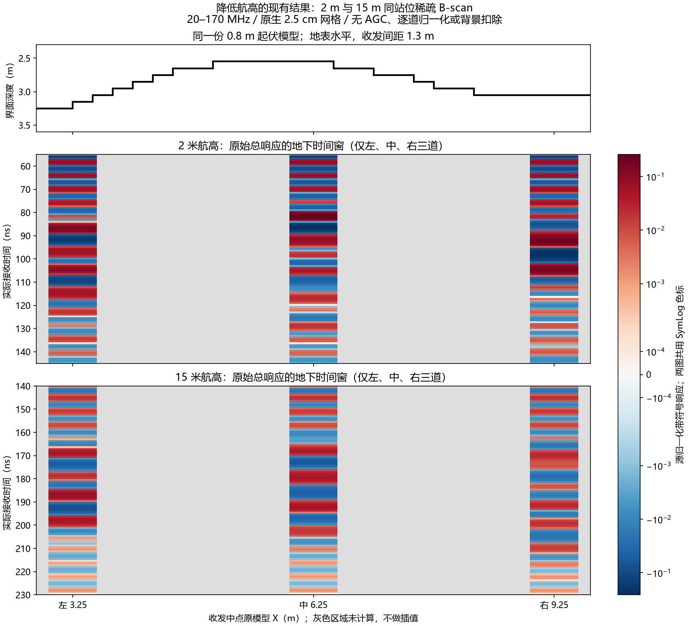

# 2米航高已有三道稀疏剖面

用户要求查看降低航高的B-scan。本次只用已完成的原始H5作CPU重建，未新增求解。



上图为同一0.8m起伏模型，中图2m航高，下图15m航高。双方选同一左/中/右收发中点X=3.25/6.25/9.25m，原生X/Z2.5cm网格、同介质/几何/源、1.3m收发偏移。**2m目前只有这三道，不是完整连续扫描**；窄色条对应实际采样站位，灰色空白未计算、不插值，色条绘图宽度不是照射范围。

20–170MHz/501复频点、原生200ns尾渐消、单位均值Hann/8倍补零；源归一化后取官方带符号响应。图示为原始总响应，包括地表/直耦及带限旁瓣，**未做背景扣除**，不同于此前用于地下区域归因的起伏减全覆盖层结果。未做AGC、逐道归一化或时移，纵轴均为实际接收时间；2m选55–145ns、15m选140–230ns地下观察窗，不能将不同时间窗冒充事件精确对齐。双方共用明确标注的SymLog色标，它只用于显示弱响应，不改变保存的数值。

六份原始H5哈希核对已归档身份，版本V4.0.0、实际采集格点/高度、原始float64和同网格检查通过。2m三道的频谱与带符号波形从原始H5重建后，和已归档`patch_arrays.npz`逐元素一致。[图件元数据与来源SHA](../../artifacts/research_checks/2026-10-04_hs4_low_height_sparse_view/summary.json)、[全时窗数值数组](../../artifacts/research_checks/2026-10-04_hs4_low_height_sparse_view/raw_height_arrays.npz)。

复现（CPU，不跑求解，输出目录必须新建）：

```powershell
& D:/gprmax_v4_gpu_env/Scripts/python.exe scripts/plot_hs4_low_height_sparse.py --out artifacts/local_checks/hs4_low_height_view_new
```

三道只能展示站位差异，不能据此验收完整曲率或断言2m B-scan已复制模型形状。要看连续曲线，需要另冻低航高完整扫描及匹配参考；它未在此前55道归因单元中完成。现有[跨电脑任务](2026-10-04_hs4_cross_pc_task.md)中1cm/三维后续状态不变，本次未消费它们的执行契约。
