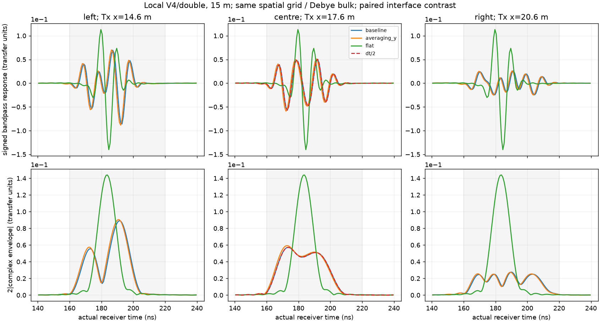
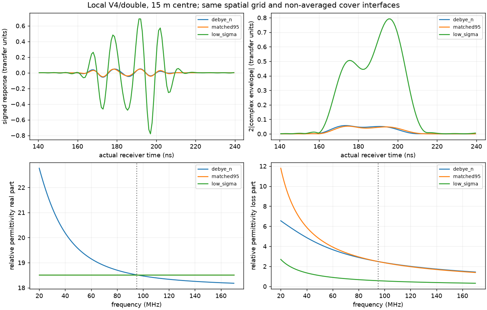

# V4手册复核及15道因素控制：网格、界面离散、损耗和峰选择

用户问“网格真的是影响因素吗？会不会有其他原因？读取gprMax手册V4，再进行仿真，找到因素”。本轮先读本机V4手册/源码，再新冻11道数值/几何控制和4道材料控制，全部V4.0.0/CUDA原生float64求解完成、独立验收PASS，无失败或重试。**空间离散确实影响精确波形，但现有证据不支持把B-scan观感主要归咎于网格。材料损耗显著改变回波强度和主峰选择，模型几何差异在数据中实际存在；已有高航高宽照射/区域扰动证据仍是形态解释的重要部分。**

## 手册读取与实际实现

读取本机 `D:\gprMax-v.4.0.0\docs\source\gprmodelling.rst` 全文；`input_hash_cmds.rst` 的time-step、Debye、普通/色散介质平均章节；`features.rst` 介质平均节。对照实际安装的config.py、cmds_singleuse.py、cmds_multiuse.py、geometry/box.py、materials.py及model.py相关实现。手册文件SHA-256已冻结在11道契约中，安装包319个Python文件和25个编译库逐个冻结。执行环境为用户指定的本机包，native H5确认为4.0.0；没有自动升级。

在线[官方建模指导](https://docs.gprmax.com/en/latest/gprmodelling.html)和[命令手册](https://docs.gprmax.com/en/latest/input_hash_cmds.html)目前标4.0.1，仅作补充，不把latest的版本替代本机4.0.0身份。关键核查如下：

- 十格/最短波长是起始建议，二十格更准确；曲面以阶梯表示，不是收敛证明。按当前Debye复折射率，在正式20–170MHz带内最短相位波长0.413282m，2.5cm为16.531格/波长。它满足十格起点，但不能认证误差已小；冲激源无限带宽，求解器日志明确跳过自动源色散分析，本计算只覆盖正式频带。
- 空间细化同时改变CFL时间步，需要分开控制。原生2D步长58.966ps，tau/dt=109.498，没有发现本模型tau小于dt的违规。默认单层Y域是受支持的二维TM旧写法，Ey是无限Y方向的线源，不等同三维实际有限天线。
- 普通材料的几何介电平均默认开；**色散介质平均默认关**。config.py `dispersive_averaging=False`；DispersiveAveraging构造器的默认参数True仅在明确调用该命令时生效，不能误读为模型默认开。原Debye的cover表为smoothable=False；本轮开y的实际日志出现cover/rock、cover/air的半权重混合本构，tau保留、Delta与电导按权重平均。
- 因此此前“去掉Debye、保留epsilon_inf和DC电导”的实验不仅改变物理复介电谱，还改变界面平均。旧结果是复合敏感性，不能单独证明“色散造成20dB”；本轮专门消除此混杂。手册默认关是受支持选项，不能据此声称原模型非法或存在软件bug。
- PML要求源/接收器避开吸收区。当前有效X/Z平面内，源到侧PML至少12.6m、到上PML5m，均远超过手册15–20格的布置建议；介质延续至边界。不变Y方向没有PML符合二维约简。这是布置核查，吸收误差仍以固定几何PML对照定量，不能凭格数宣布完全无边界影响。

## 实际仿真与审计

[11道执行前方案](2026-10-04_hs4_v4_factor_controls_plan.md)、[4道追加材料方案](2026-10-04_hs4_v4_material_controls_plan.md)均在对应批次执行前保存。所有保持36×0.05×33m、X/Z2.5cm、原15m航高/1.3m收发、侧2m/上下1m PML、600ns、冲激及double；物理变量仅按各对照声明改变。没有缩域、降精度或重新消耗旧attempt。

| 新批次 | 道数 | 唯一受控变量 | 监督耗时累计 s | 峰值所属RSS GiB |
|---|---:|---|---:|---:|
| 数值/几何 | 11 | 左中右界面平均y六道、中心dt/2两道、左中右平界面三道 | 936.891 | 0.725 |
| 材料 | 4 | 中心非色散匹配95MHz复本构配对、同实部低电导配对 | 252.781 | 0.639 |

使用RTX3060Laptop 6GiB/CUDA11.8和既有进程树监督器，逐道/独占GPU、启动RAM1.25GiB/VRAM3.5GiB、运行系统余量0.2GiB/RSS1.75GiB、600s/道，批次2400/1200s上限；全部未触发停止。契约SHA分别`19305c76da665488bf14ccdc3ca94d7d44448a24a758fd75893c32b12da95140`、`cdfdca06186bd3967e24ca2bf798c8989e6fb8a7da63f5b2cf1677e9800c5f2b`。

独立核查全部原生V4/float64/有限值、实际源接收格点、CFL/dt与完整时窗、输入哈希和全材料cell-map（独立CSV/解析构造），实际bulk几何在未声明改变时相同；开启平均要求日志明确enabled。验收SHA分别`f4835e98eeefada286481cdfdbb8d8968c9e183d15f0a81bd4b54565bf6a1424`、`09aedda9ef6fb926675807ae472ddd80bba2c2736db746ae3ff464bcdf6f3fa8`。改变电场边缘本构不会改变导出的bulk cell-map，审计没有把cell-map相同误作组件本构相同。

接收器全部按实际保存电流与半步时间做源归一化、501点20–170MHz/0.3MHz、200ns尾窗、单位均值Hann/8倍补零，先复数起伏−全覆盖层再重建。单位为Ey/源电流，即(V/m)/A；二维空间尺度0.05m保持，图中transfer units依此定义，不是端口S21/dBm或仪器SNR。所有501源频点有效。

## 空间离散影响相位，时间步影响很小

下表均为固定160–220ns匹配界面对比。空间细化列复用已验收原生H5（本轮没有重跑），同时保持原0.8m阶梯物理几何/PML厚度；界面平均列是本轮同网格直接干预。

| 对照 | 左/中/右带符号波形相对L2 | 左/中/右包络模值相对L2 | 整体幅度范数变化 |
|---|---|---|---|
| 2.5→1.25cm原默认平均 | 27.160% / 24.261% / 32.096% | 8.458% / 5.667% / 8.756% | +0.172~+0.232dB |
| 同2.5cm只开色散平均y | 38.349% / 36.249% / 40.401% | 8.729% / 5.757% / 8.462% | +0.096~+0.197dB |
| 同空间网格、中心dt减半 | 中心0.386% | 中心0.160% | −0.003dB |

空间细化与平均开关的差异主要表现为相位/约一个0.832ns重建采样的峰时变化，模值远小于带符号差异。dt减半不改变中心峰时；不支持时间离散是当前主因，也不支持仅凭“波形差30%”认定地层形状错了。只有两个相邻网格，不能将敏感性直接当真实误差，更不能因平均y接近一档细网格就宣布连续解已验收。

## 匹配平界面与起伏模型实际不同



新平界面对照为Z9.05m，ground仍Z12m；原0.8m起伏属于地下界面，地表仍平。平界面在左/中/右的地下包络主峰全为183.799ns，带符号窗内相对中心差仅2.71e−10/2.88e−10，满足当前窗的平移负控。起伏模型分别191.284/173.819/189.621ns，跨度17.465ns；开平均后190.452/172.987/189.621ns，跨度仍17.465ns。**原回波确有几何差异；平均或dt调整没有把它变成平界面响应。**这是三离散站位的匹配对照，不是十三站完整扫描或成像反演。

图中起伏有多个波包，平界面更集中。不能只盯160–180ns上部一条亮带，或假定每个站位的全窗最大峰都来自正下方同一个界面点。已有[局部区域扰动](2026-10-04_hs4_height_wavefield_findings.md)仍支持15m早波包对共同浅拱顶更敏感、坡面更多影响较晚响应；本轮未按材料重新做区域归因，不能把新的晚峰单独认证为某一坡面的纯一次反射。

## 独立材料控制：损耗明显改变回波权重与最强峰

本轮非色散匹配模型取epsilon_real=18.5139256522、sigma=0.0131217988415S/m，在95MHz与原Debye的完整复介电常数严格相同（冻结核验误差0）；匹配的是一个载频，不是全频带。第二组固定相同实部，只把sigma改为0.003S/m。四道全部cover box显式n，保持原Debye关闭平均的组件分配；DC损耗只计一次。

| 比较，固定160–220ns | 幅度范数变化 | 包络模值相对L2 | 全窗最强峰 |
|---|---:|---:|---|
| 原Debye→匹配95MHz常数模型 | −0.587dB | 16.261% | 173.819→174.651ns |
| 同实部常数模型，仅降低sigma | **+22.426dB（13.222倍）** | 1225.838% | **174.651→195.442ns** |

第二行是唯一电导变量的直接仿真干预。在早窗160–180ns增幅19.580dB，晚窗180–220ns增幅23.661dB，后者多4.081dB。早/晚窗内部峰仅174.651→175.482ns、193.779→195.442ns，分别约0.832/1.663ns；全窗20.792ns变化来自最强峰换到晚波包，不是地层界面移动20.8ns对应的深度。这里的幅度量是同定义事件窗复包络范数，不是入射/反射功率比例。



原中心界面对比峰约为完整总响应峰的0.0314%，−70.067dB；仅开界面平均后仍−69.748dB。匹配高损耗常数为−70.754dB，低电导为−47.232dB。原高动态范围显示会把地下变化压得很弱；把单条“最亮峰”作为剖面会受损耗改变波包相对强度的影响。降低电导是机制对照，不是建议改场地参数让图好看，电性假设需独立场地约束。

新实验支持更精确的表述：**本模型覆盖层损耗是回波变弱及主峰权重变化的重要因素；材料的频率依赖还影响相位和晚波包，但此前把整个约20dB笼统归为“色散”的解释应由本轮受控结论替代。**不能把介质损耗变化当时间增益必能逆转的真值。

## 独立复算及窗函数因素

直接读取H5源/接收器实际SampleInterval与TimeSampleOffset，用复指数矩阵求和在每道7个跨全带频点重新归一化，与官方CZT最大相对L2 8.42e−13；没有调用官方FFT/CZT或工程DFT助手完成该复算。事件相对L2由标量平方和重算，最大绝对差1.78e−15；反相（模值差零但有符号/复差为2）与倍幅（+6.0206dB）两项数组反例通过。这些认证处理/身份一致性，不认证连续介质真值。

因为低损耗可能增加晚时尾波，另作CPU处理敏感性：尾窗200/100/0ns的Hann结果中，sigma效应均22.425773~22.425774dB、最强峰换包不变；矩形频窗为21.974968dB，仍保留该方向。矩形窗的峰选择为172.987→197.106ns，说明有限带宽/窗函数也影响峰时；正式Hann参数未改，设备导出窗未知，不能将本诊断峰直接当实测深度或默认Hann就是设备真值。

## 当前判断与下一步

把影响分开更符合新证据：

1. **精确相位/波形**：空间离散和Debye界面组件分配是已检出的敏感因素；需分别收敛，不能只看模值或要求网格改变后马上出现几何同形条带。
2. **可见性及主峰权重**：高损耗、总响应动态范围和频窗是已检出的因素；22dB损耗结果在尾窗变化下稳健。主峰能换波包，不能将所有峰值漂移解释为界面移动。
3. **未成像形态**：已有高航高宽照射与局部扰动证据，加上本次平界面负控，支持多位置响应叠加和不同波包权重共同影响亮带；未成像B-scan不是几何剖面。此处依据多个控制综合推断，未认证唯一全部反射路径。
4. **侧PML**：本轮未改PML；沿用[固定几何吸收对照](2026-10-03_hs4t2d_manual_and_boundary_findings.md)2.244%/0.000232%地下带限差，结合新平界面平移负控，不支持它是此现象的主要来源。结论限定这些模型/窗，未宣称边界完全零贡献。

下一步数值验收应在**显式且一致的界面平均策略**下做空间网格序列，并按既有跨机任务补匹配三维/边界/实际收发布局。前述细化保留0.25m分段/5cm高程阶梯，没有验证平滑母曲线的几何逼近误差；若测试这种误差，须另声明几何变量并与三维母模型核对，不能替换模型以提高观感。新后续契约明确n/y，不手改原胶囊或把开y包装成已验证物理修复；1cm/三维仍须独立资源/输入冻结，当前本机未做三维。二维线源、有限天线和实际电性/导出链缺口保留；G4、训练、保留实测与处理首版范围不变。

## 接续与复核

两批attempt已消耗，不重复run。Git归档原生H5、契约/输入、日志、全材料审计哈希、两组比较数组及图、窗敏感性、独立检查和反例；重复cell-map与CUDA缓存留本机，只保留新平界面中心actual map。CPU克隆可复算分析/检查；完整几何verify还需本机被忽略的实际cell-map。

```powershell
$hs4Python = 'D:\gprmax_v4_gpu_env\Scripts\python.exe'
& $hs4Python scripts/analyze_hs4_v4_factor_controls.py --capsule artifacts/research_checks/2026-10-04_hs4_v4_factor_controls_r1 --out artifacts/local_checks/hs4_factor_recheck
& $hs4Python scripts/analyze_hs4_v4_material_controls.py --capsule artifacts/research_checks/2026-10-04_hs4_v4_material_controls_r1 --out artifacts/local_checks/hs4_material_recheck
& $hs4Python scripts/check_hs4_v4_factor_evidence.py --out artifacts/local_checks/hs4_factor_independent_recheck
& $hs4Python scripts/check_hs4_v4_factor_metric_guards.py --out artifacts/local_checks/hs4_factor_guards_recheck
& $hs4Python scripts/analyze_hs4_v4_window_sensitivity.py --out artifacts/local_checks/hs4_window_recheck
```

所有输出目录须不存在。执行前计划、失败纪律、版本/预算按对应契约；当前最新结果以本报告和START_HERE首条为准，旧报告保留历史数值及较强归因的来源。
