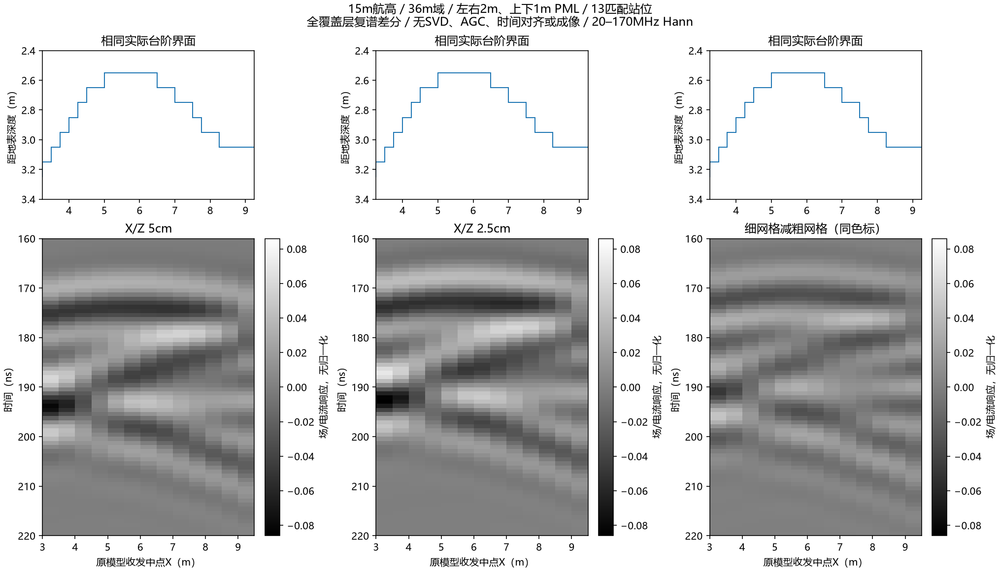
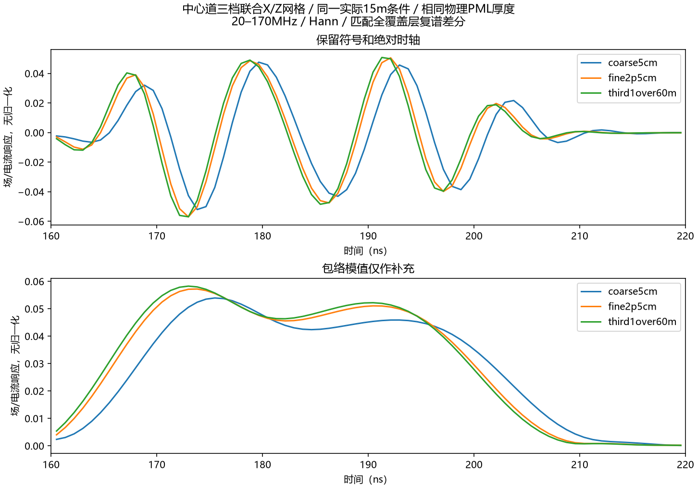
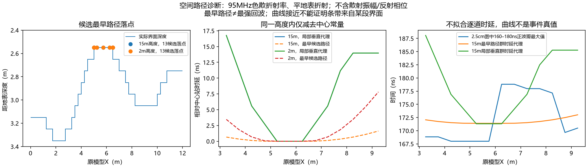

# X/Z联合网格检查与空间路径诊断

用户“做吧”后，本轮完成**28道gprMax V4.0.0 / CUDA double**：2.5cm中心2道、其余站位24道，再加1/60m（约1.67cm）中心2道。既有5cm宽域/侧向2m PML的13匹配站位直接复用，中心不重复求解。**5cm网格明显影响相位和到时；联合细化后上部条带依然平缓，因此“换细网格便会得到模型拱形”的解释不足。传播几何是可检验的候选机制，最强事件的界面来源仍未认证。**

## 模型与独立验收

[先冻后跑方案](2026-10-04_hs4t2d_joint_grid_design.md)保留原36×0.05×33m域、15m离地高度、1.3m收发偏移、材料、0.8m全剖面台阶起伏、Y方向0.05m线源定义与600ns impulse。原扫描中点3.25–9.25m内的界面深度约2.55–3.15m，约0.60m起伏；不能将全剖面0.8m当作这段扫描下的局部起伏。PML物理厚度侧向2m/上下1m，X/Z间距改变时相应增加单元数。

28份原始Ey均为float64、有限值、V4.0.0，dt/样本数/实际收发格点独立核验。全部实际材料数组同时对照原剖面CSV和已完成粗网格：2.5cm沿X/Z各重复2倍、1/60m各重复3倍，**原阶梯界面未平滑、未移位**。源仍为electric_current/A、spatial_scale=0.05m；不同dt下先除各自实际保存的复源谱再比较。全部501点源归一化有效。

运行时间：中心先导211.844s、剩余24道566.641s、第三档中心274.797s。无失败和重试。第三档日志估计约1.1GB host/1.9GB device；没有测量1.25cm容量。第三档契约中1.25cm显存描述只是此前保守外推，不当作实测容量限制。其继承用途文字在首次求解前更正，输入未改变；原准备源码/预检契约/预检报告保留，不重写旧身份。

## 同一地下窗口的变化

使用固定20–170MHz/501点/Hann/8倍补零/200ns尾部渐消，先做“起伏−全覆盖层”复谱差分，再重建；地下窗口160–220ns。相对L2为两个数值响应的差异比例，**不是噪声能量占比、绝对误差界或地质保真分数**。

|比较|范围|带符号响应相对L2|保相位复包络相对L2|包络模值相对L2|
|---|---|---:|---:|---:|
|5cm→2.5cm|13站位|69.395%|69.395%|23.857%|
|5cm→2.5cm|中心|61.291%|61.289%|17.121%|
|2.5cm→1/60m|中心|16.596%|16.593%|3.966%|

中心固定窗的采样包络峰依次175.482、173.819、172.987ns，变化−1.663/−0.832ns；重建时间步约0.832ns，峰可以切换波瓣，不能将采样峰直接当精确界面到时。第三档与第二档更接近，说明有限网格差异减小；两次细化比例不同（1/2与2/3），不据此给Richardson阶数、绝对误差预算或完整空间收敛证书。第三档只查中心，不能外推为所有13站位收敛。



图中三列共用物理色标，无SVD/AGC/逐道归一化、时移或成像。地下相位、到时和强度改变明显，但上部条带仍较平缓，不能直接视为输入界面的垂直投影。另一方面，不能因为模值看起来接近，就忽略更大的带符号/相位差异。



与[固定几何PML对照](2026-10-03_hs4t2d_manual_and_boundary_findings.md)合看：本例对联合网格细化更敏感，PML加厚未使条带变成拱形。这是有限对照的事实，不是各机制能量份额的拆分，亦非所有网格/PML误差均已排除。

## “可能响应同一片浅界面”的含义与限制

接收器移动，不意味着只接收到正下方一个点的回波。本轮在实际阶梯剖面上复算95MHz折射路径：穿过平地表时按相折射率寻找驻相路径，在这些路径上报告群时延。允许候选反射点遍历界面，而不是强行固定在收发中点下方。

15m高度下，13站位的**最早候选路径**落在原模型X约5.0125–6.4875m的较浅拱顶段，群时延变化约1.615ns；只使用各站位正下方深度的垂直代理则变化16.762ns。降低到2m高度，同一最早路径代理变化约7.806ns。这解释了此前那句话的几何含义：不同站位都可能接收到来自同一片较浅区域的较早回波，条带到时便可能比局部深度变化平缓。

**这仍不证明它是本次B-scan的最强条带。**路径代理没有计算散射振幅、反射相位、有限带宽干涉或强多次散射。既有降航高正演支持传播条件会改变形态，但不能单独签认某个反射点。图中的160–180ns正值最大值会在不同波瓣之间切换，完整160–220ns的包络最大值也会跳；这些窗口最大值都不是已追踪的同一事件，不拿它们与局部深度相关性来签认来源。



官方[二维模型说明](https://docs.gprmax.com/en/latest/gprmodelling.html)中的一单元不变轴对应线源；当前结论限于该二维开发模型，不能代替有限三维天线的方向图或实测结果。阅读范围为该页相关二维/网格/边界章节；在线4.0.1与实际V4.0.0实现分开记录。

## 归档、复算和下一项归因

三份控制胶囊为 `...joint_grid_centre/`、`...joint_grid_remaining/`、`...joint_grid_third/`。28原始H5和8组代表实际网格归档，20份重复网格本机保留并登记其原身份与逐道材料验收。各目录README提供只读归档复核入口；新克隆不宣称重新读取未归档的重复网格。

中心、全扫描、第三档的CPU重建分别保存在 `...joint_grid_centre_results/`、`...joint_grid_results/`、`...joint_grid_third_results/`。**11份核心JSON/NPZ/PNG和3份manifest重建逐字节一致**，独立复算记录单列在 `...joint_grid_rebuild_verification/`，不修改被第三档结果引用的全扫描manifest。没有重复调用求解器。

```powershell
python scripts/analyze_hs4t2d_joint_grid.py --centre artifacts/research_checks/2026-10-04_hs4t2d_joint_grid_centre --remaining artifacts/research_checks/2026-10-04_hs4t2d_joint_grid_remaining --out artifacts/local_checks/joint_grid_new
python scripts/analyze_hs4t2d_joint_grid_third.py --third artifacts/research_checks/2026-10-04_hs4t2d_joint_grid_third --scan-results artifacts/research_checks/2026-10-04_hs4t2d_joint_grid_results --out artifacts/local_checks/third_grid_new
```

联合网格核查已完成本轮；仍未确认最强条带的唯一来源。下一项应先设计并冻结**局部界面扰动对照**，分别小幅改变拱顶和坡面，比较固定站位带限响应；避免制造贯穿到边界的竖直材料终止面，并对选定扰动检查网格敏感性。差分是受控几何敏感性，不自动等于某片界面的独立回波能量。尚未运行这项新扰动，未启动三维/训练、未读保留实测、未改G4或旧冻结契约。
