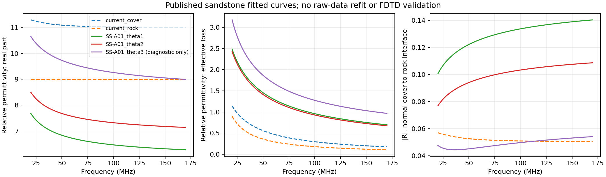

# 覆盖层和基岩实测介电谱：可拟合来源与采用边界

2026-10-06。用户问“目前的基覆界面不是色散的吧？要不要研究一轮有没有实测的参数可以拟合”。本单元完成原输入复核、9组原始来源及数据入口调查、已发表砂岩参数的20–170MHz连续介质频谱重建。没有新FDTD、训练、现场拟合、旧材料/执行契约更改。源码起点8e8a387；来源和阅读范围见[台账](2026-10-06_measured_dielectric_sources.json)。

**建议研究两侧材料的复介电谱，而不是给几何界面增加一个独立色散参数。存在实测来源；覆盖层优先矿质粉壤土的实测拟合参数，基岩优先带含水条件的砂岩参数。当前配方只是机制假设，尚不是现场标定。** 尚不能据这些来源断言“材料是实测/仿真差距的主因”，也不能承诺加色散就让B-scan更好。

## 1. 当前模型究竟有没有色散

直接读取已执行fine2m输入`artifacts/research_checks/2026-10-05_slope_bscan_2d_fine2m_r1/slope_rough_s00/profile.in`：

```text
#material: 9 0.001 1 0 rock
#material: 11 0.001 1 0 cover
#add_dispersion_debye: 1 0.5 6.4567e-09 cover
```

覆盖层有单极Debye：ε∞11、Δε0.5、τ6.4567ns，加独立DC电导0.001S/m。基岩没有极化弛豫项：εr9、电导0.001S/m。但固定电导也使有效复介电常数的虚部随频率变化，不能把它称为完全没有频率依赖。当前材料图中不存在独立薄层的“界面材料”。

采用`exp(+jωt)`、有效介电常数`ε*=ε′−jε″`：

`εcover*=11+0.5/(1+jωτ)−j0.001/(ωε0)`；`εrock*=9−j0.001/(ωε0)`。

局部平面正入射电场反射`R=(√εcover*−√εrock*)/(√εcover*+√εrock*)`已经是频率相关复数。实际斜坡B-scan还包含斜入射、传播、相干叠加、源与窗口，不等于这条R曲线。

旧[2026-09-28色散参数](2026-09-28_dispersion_parameters.md)用的是7个文献综合锚点，并非同一样本的原始实测频谱；当前[低损耗配方](2026-10-05_cover_low_loss_design_review.md)是用户提出的工程设计。两者都不能更名为“现场实测拟合”。

## 2. 哪些来源真能用，拿到了什么

| 来源 | 实测范围/材料 | 本轮取得程度 | 建议用途 |
|---|---|---|---|
| [Szypłowska等，IEEE DataPort参数集](https://doi.org/10.21227/qrdw-kw76)，2023，更新2024 | 20MHz–3GHz；粉壤土、砂壤土、壤砂土；567个实测谱的三极Debye+DC拟合 | 官方页面、文件清单和说明已取得；参数xlsx需订阅，尚未取得 | **覆盖层首选**；粉壤土比近饱和纯黏土更接近当前“粉质黏土”假设，但并非同一土类/现场 |
| [Szypłowska等，Measurement2026](https://doi.org/10.1016/j.measurement.2025.118808) | SetA567谱，SetB120谱，SetC158谱；矿质土不同含水/温度/盐度/密度 | 阅读相关在线正文节选；式5、§2.1–2.2及参考29确认数据集和拟合方法；未取得全文PDF | 明确三极Debye+体电导拟合路线；全论文数据“on request”，不能说全部公开 |
| [Bore等，JRMGE2025](https://www.jrmge.cn/abstract-2142.html) | GP5Hz–30MHz、VNA1MHz–3GHz；同一完整岩样，多种含水状态 | **出版社16页PDF已取得**；Table1–3、式23、相关方法/结果/结论已读；实测逐点文件入口未核验取得 | **基岩首选**；已发表CPCM可重建，再做20–170MHz多极Debye近似 |
| [Schmidt等，JGR2026及公开数据](https://zenodo.org/records/15473270) | 多种近饱和纯黏土；原始S2P实际300kHz–5GHz | 已有公开ZIP和论文；此前审计15份/每份1601频点，其中351点落在20–170MHz；本轮重读反演条件 | 强色散/高损耗压力案例；先做夹具反演，不能直接拿S21拟合ε |
| [González-Teruel等，Sensors2020](https://doi.org/10.3390/s20226678) | 1MHz–6GHz；真实矿质黏性土/纯黏土 | 已有PDF和相关章节；原始ε数表下载未核验 | 覆盖层物性范围与机制；图片数字化只能作标明误差的次级路线 |
| [West等，WRR2003](https://doi.org/10.1029/2001WR000923) | 75–1000MHz；含水/含黏土砂岩 | 相关在线方法/结果/讨论已读；逐点数据未取得 | 说明砂岩“弱色散”有条件；20–75MHz不能无依据外推 |
| [González-Teruel等，2025校准数据](https://data.mendeley.com/datasets/cvjkkns97g/1) | 2MHz–6GHz；标定液和湿粉壤土的反射 | 官方描述已读；文件下载枚举403；论文仅摘要/元数据 | 次级路线；描述里的已反演ε谱是异丙醇，不能误称直接土壤ε数据 |
| [Loewer等，GJI2017](https://doi.org/10.1093/gji/ggx242) | 高频1MHz–10GHz；黄土粉质黏土/其他土/饱和砂岩，另有低频SIP | 相关理论、样品和测量章节在线读到；本轮未审计拟合参数表 | 有效电导/有效介电损耗统一表达，避免DC重复计入 |

2022低成本开口探头论文另作仪器有效频段依据：实用可靠区间50–700MHz，不能用其仪器“起于1MHz”证明20MHz可靠，详见台账M06。

**覆盖层数据取得的具体缺口**：IEEE官方页面列`TableD1.xlsx`（378.17KB）和`D2-dens.xlsx`（25.88KB），含参数标准误、RMSE、含水量/温度/润湿液电导及密度。粉壤土在TableD1的386–574行。页面明确`Subscription Required`、未登录；本轮没有下载这些文件、没有购买或绕过访问限制。这里是“已经定位到实测拟合参数”，不是“已经获得567套可运行材料”。

## 3. 已取得的砂岩参数重建，是否值得继续拟合

Bore2025中砂岩孔隙率约16.9%，SS-A01的体积含水量为6.68%、10.72%、15.28%。Table3提供P1介电Debye、P2介电Cole–Cole、P3电导Cole–Cole及σ0；因此**不能把三个过程直接当作三个gprMax Debye极点**。原表σ0为μS/m、P1时间为ps、P2为μs、P3为ms；入库全部转换SI，按式23计算，不额外重复加入现有0.001S/m。

| 岩样/水状态 | ε′20MHz→170MHz | 有效ε″20MHz→170MHz | 固定当前覆盖层的局部正入射\|R\|20→170MHz | 原作者全频拟合RMS |
|---|---:|---:|---:|---:|
| 当前固定εr9基岩 | 9→9 | 0.899→0.106 | 0.0569→0.0504 | 无实测拟合 |
| SS-A01，θ6.68% | 7.675→6.271 | 2.484→0.697 | 0.1005→0.1403 | 13% |
| SS-A01，θ10.72% | 8.496→7.138 | 2.424→0.673 | 0.0768→0.1086 | 11.1% |
| SS-A01，θ15.28%，仅诊断 | 10.657→8.997 | 3.176→0.967 | 0.0475→0.0541 | 10.7% |

这是**重建作者已发表的拟合模型**，不是对原始实测点重新拟合，也不是现场参数或数值FDTD验收。全频RMS不能当作20–170MHz误差条。它说明只改εr为一个数并保持σ不变，可能同时错过频率相关的反射幅度、相位和损耗；但并不证明我们的场地必须取这些数。

发现需保留的来源问题：Table3声明P3时间拟合边界0.01–1ms，却列SS-A01第三状态13.3ms（其他岩样也有越界值）。不自行改为1ms或猜小数点；第三状态只作诊断，正式候选需确认原表/勘误。SS-A02中间状态作者列RMS138%，本轮未擅自改成13.8%；不用该样本宣称精确拟合。干砂岩跨方法的虚部差异60.1–123.9%，低损耗数据相对误差大，不优先用它校准精细损耗。



## 4. 下一步应怎样拟合

1. **优先取得M02矿质粉壤土参数；基岩用M01已核验SS-A01前两种状态做来源明确的候选。** 如果M02权限持续不足，可走开放黏土S2P的夹具反演路线，角色是材料压力测试；不能静默把纯膨润土改名现场覆盖土。含水/盐度状态按样品物理条件预声明，不按B-scan好看程度挑选。
2. 先还原`ε′(f)`和总`ε″(f)`，同时保留含水量、温度、密度、矿物/粒级、测量方法和误差。明确哪个σ是体材料DC，哪个是孔隙水/润湿液；不把后者直接填入`#material`。
3. 对20–170MHz复谱联合拟合正参数多极Debye与一次DC项；比较固定ε+DC、1/2/3极的频谱/传播误差。对已有CPCM而言这是**作者模型的带限代理拟合**，需另报作者原拟合误差，不能把代理误差小称为实测误差小。极点数不是越多越好，限频数据可能不唯一。
4. 验证独立频点及20m单程/40m双程的传播幅度、相位、群时延差，并检查复反射系数。权重/阈值在拟合前声明；不从目标B-scan调回物性，不用ε′曲线接近代替损耗/传播验证。
5. 核对目标机V4具体材料更新实现、dtype、τ/Δt和频带精度，再冻结一组**保持几何、航高、网格、源、PML、时窗和SFCW窗相同**的材料控制。当前安装的`cmds_multiuse.py`明确不强制τ>Δt，不能把旧手册规则说成本机硬性拒绝；皮秒P1仍需要时间离散精度核验，或经过误差验证的带内等效近似，不直接照抄全频参数就签认。

这条路线能让“覆盖层/基岩的电性是否可信”成为可检查的问题。数值材料更有来源并不直接认证现场B-scan或唯一根因；要区分材料适用性、传播数值精度、观测链和实测验证。

## 5. 复现与检查

```powershell
python scripts/review_measured_rock_spectra_v0_1.py --out artifacts/research_checks/2026-10-06_measured_rock_spectra_fresh
```

脚本只依赖NumPy/Matplotlib、已归档参数台账与旧输入，无求解器导入/调用。拒绝覆盖输出；核查当前材料身份、零色散DC特例、电导Cole–Cole指数1与Debye的等价特例、有限性及带内被动性。独立标量cmath复算1503个砂岩复频点，最大相对差3.765e-16；5份来源缓存哈希一致，复跑旧目录被拒绝且输出哈希不变。r1首次草图的第三幅颜色序号在省略覆盖层后错位；r2显式固定每条曲线颜色并标明第三状态仅诊断，两版CSV逐字节一致。最终使用r2。PDF参数表已渲染目视核查。缓存与数据页保留在忽略的`artifacts/research_sources/`，不上传论文或现场原始资料。

本轮完成研究和作者模型解析重建；**没有新多极Debye拟合结果**，没有替换当前材料、生成新的求解批次或改变G4/训练资格。下一研究单元可先做SS-A01带限代理拟合；覆盖层真实参数文件取得后再做同样审计。
