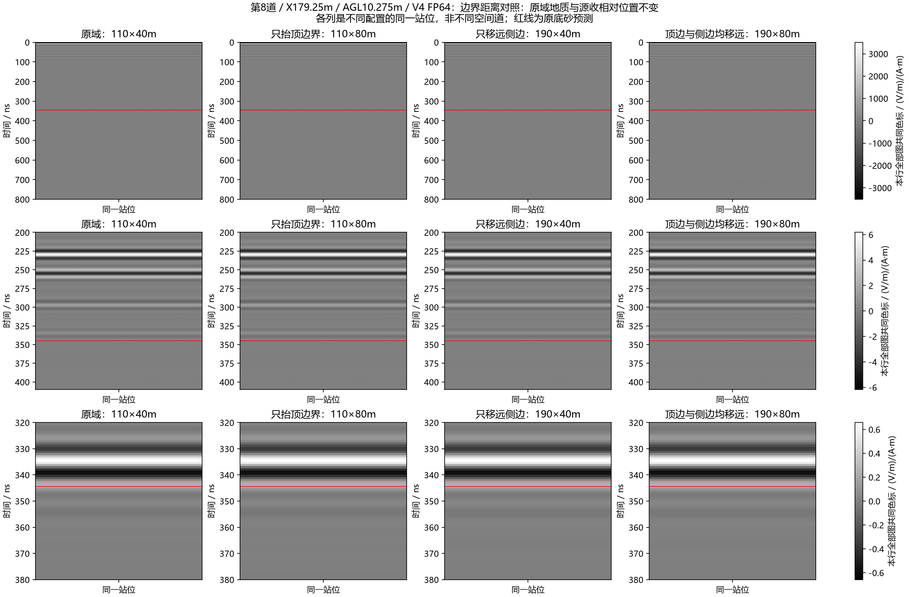
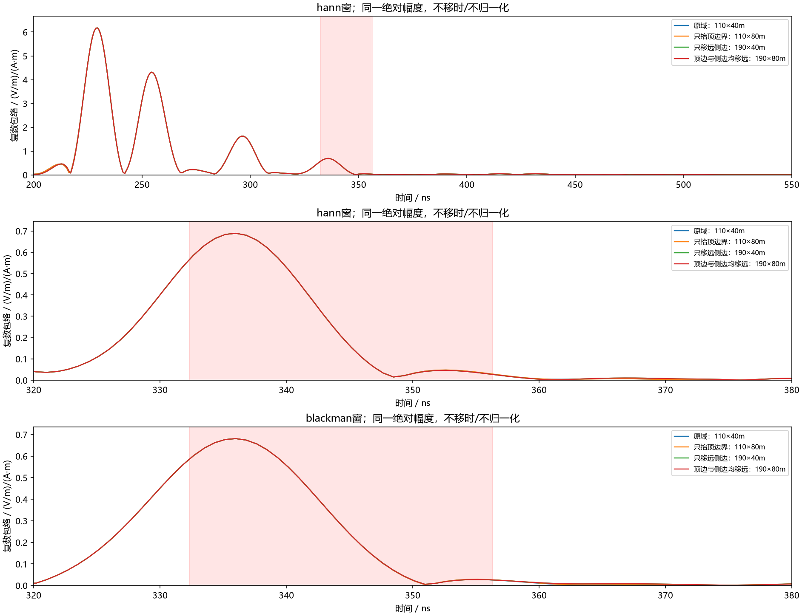

# 第8道剩余回波：边界距离的受控验证

2026-10-08。延续用户“研究明白”及自主SSH仿真授权，研究对象是前一批移除底部砂岩后H0仍有的约335ns强响应。当前目标是区分边界距离敏感与地下层栈自身响应，不能预先把原因命名为PML反弹或不可避免的UAV效应。

## 求解前冻结的四项比较

全部为第二包第8道H0：剖面X179.25m、AGL10.275m、Tx/Rx间距1.3m、2.5cm网格、800ns、40A impulse、相同材料数据库与色散/界面平均、V4原生FP64、HORIPML80格。四项都不记录快照，先重算原域核对“移除被动观察器”不改变结果。

| 模型 | 域 / m | 科学变量 |
|---|---|---|
| base | 110×40 | 原H0，无快照重复 |
| top40 | 110×80 | 仅在原域上方添加40m空气，收发点及原体素完全不变 |
| sides40 | 190×40 | 左右各延40m、采用边缘列水平延续；收发点与原内域一同平移40m |
| joint40 | 190×80 | 上述两因素组合，检查是否相互影响 |

侧向扩展同时改变外域地质延续和边界位置，不能独立认证吸收系数。顶边扩展只增加自由空间，是更干净的顶边距离控制；底边本轮不变。所有原始4400×1600×1体素在各新域共同部分逐点相同，新增顶部全为空气；材料文件哈希不变。已通过本机构建核对及V4原生输入解析。

保留原生网格/时间步/源及Yee偏移，精确20–170MHz、0.3MHz、501点，无尾渐消/AGC/移时/逐道归一化，Hann与Blackman分别比较。沿用前批已定义的底砂332.311–356.311ns、浅部217.541–267.323ns窗，不用控制结果移动窗。主要量为窗内复数场差异、范数及波形相关；它们不叫SNR或杂波能量百分比。若原域无观察器重复不匹配既有原生H0，先查数值可重复性，不跳到边界归因。

## 执行记录

独立远端目录`E:/line9_basal_pair_20261008_r1/boundary_controls_r1`，不修改目标机原仓库。使用上一批已核验V4/Python/MSVC/CUDA/GPU，冻结实际代码、环境、输入及编译器哈希。合同SHA256：`0261cd20802510f8036e91b3577afdcaa061ddde85ed8d897cf200039dc64d0d`。一次串行最多4项；失败attempt保留，不原地重试。单道≤30min、批次≤60min，600s会话心跳与USER_STOP，RAM/VRAM门禁及共享GPU锁沿用。最大190×80m域约2432万格，冻结采用420bytes/格+2GiB设备预留约11.51GiB的保守预算，实际运行后记录峰值。

部署ZIP本机/远端SHA256均为`7b5091bc86e245f2ddb0a709ac93fd2c1d262dc14b899dc67d9ac7266ffdb129`。原模型、旧失败H0及上一批两份完成结果都保留。

四项现已全部完成，无失败或重试。原域77.734s、上扩152.344s、侧扩137.094s、组合252.875s；最大进程树RSS约6.29GiB。原域无观察器重复与既有H0整个原生H5的SHA256完全一致，说明本次被动快照未改变接收信号。

原生审计SHA256为`767875bfbba1c768b2c6e0920a4733463b514ae9f90d490492d048ced4964256`。原生Ez与激励均float64、13569点、dt=5.896635841874211e−11s。精确频点独立DFT及直接逆变换、原生哈希/域/收发坐标/事件表独立审核通过；这认证执行和复数计算，不替代物理解释。

## 完成结果及解释

预定义底砂窗内，Hann复数变化范数相对原H0，上扩40m约0.0698%、侧扩各40m约0.3020%、联合约0.3025%；Blackman分别约0.0767%、0.2949%、0.2949%。三者包络峰仍为335.994677ns。这里是复数场差的相对范数，不能称“PML能量百分比”，也不能从三项之和推导全部边界贡献。

本次强峰对大幅改变顶/侧距离不敏感，不支持它主要来自这些边界返回。后续底边及地质消融进一步见[完成报告](2026-10-08_line9_interbed_attribution.md)。结论仅针对选定站位、频带与时间窗，不推广所有测线/PML设置。

全部数值、原生审核、执行日志及独立交付检查位于`artifacts/research_checks/2026-10-08_line9_boundary_results_r1/`；私有H5与完整输入留忽略目录及ROG，不入Git。
