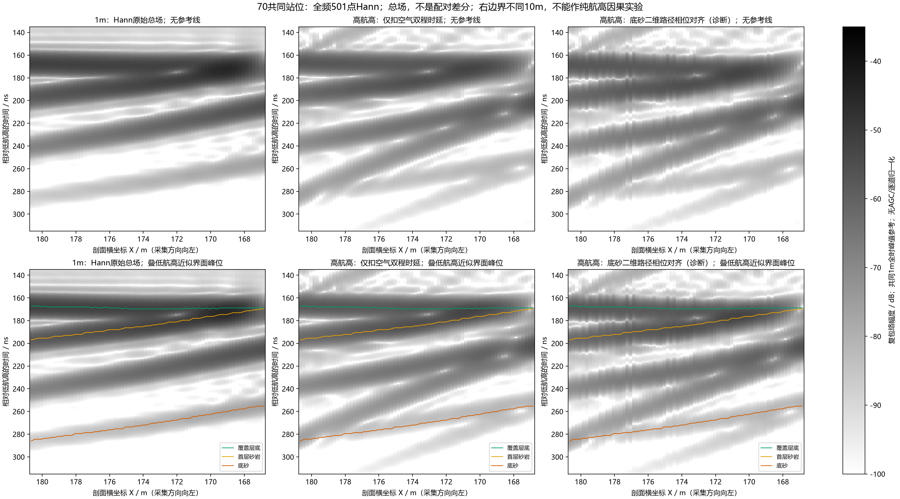
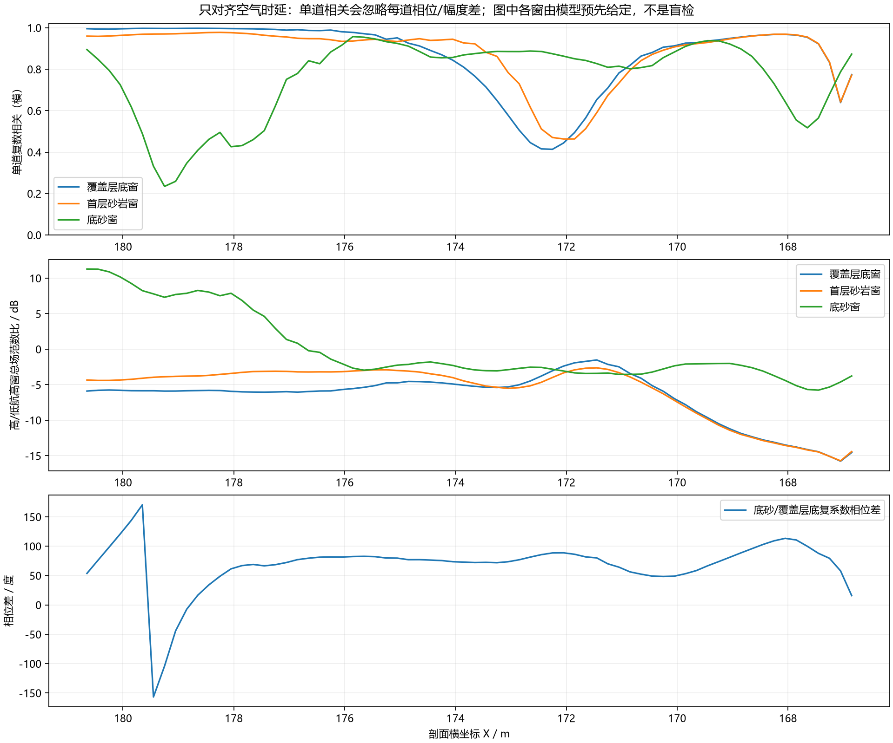
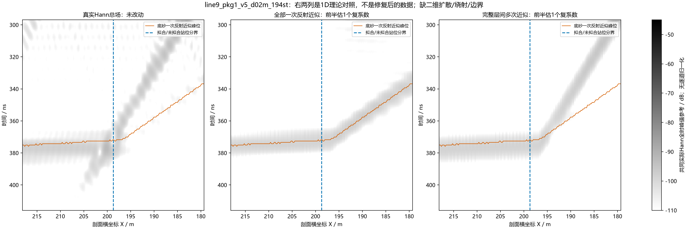

# 三包续查：高航高相位差、二维路径与完整层间反射

2026-10-08；基于`d2fbf2896cda132b1fabb825d2ce2462e267a350`。用户要求“继续解决”，沿此前本地后处理排查继续，**没有启动新FDTD、远程计算或训练**。原包、材料及既有修正数值不变。本轮计算只是解释现有场的理论对照，不能当新正演或生产校正。

## 本轮结论

较高航高两包尚未彻底解决，但原因范围进一步缩小：

1. **简单航高延时、单一增益/相位不能解释全部失配。** 70个共同站位按空气双程时间对齐，高低航高底砂窗的单道复数相关中位数约0.845，整段只有0.589。只在浅层窗拟合每道复比例，预测深部的相对L2误差为1.012，失败。这里的每道相关忽略各道独立的复比例，整段相关则保留相位、幅度沿线变化；不能混用。
2. **偏离天线正下方的二维路径解释部分波形差异，但不能单独解决。** 路径相位对齐把上述单道中位数提高到0.919，整段仍只有0.590；Blackman整段反而由0.611降到0.595。不能据此推出一个有效的整线校正。
3. **8m/v5包的深部斜纹，有“多界面叠加和层间多次反射”的新支持。** 完整1D层栈近似与底砂参考窗相关由一次底界近似的0.558提高到0.734，另一频窗为0.740。不过前半拟合、后半验证仍仅0.355/相对误差1.237，不能确认其为唯一主因，更不能按包络相减删掉。
4. **1m包的浅部也不能逐条亮纹对应单一界面。** 覆盖底/首层砂岩的单界面一次近似相关约0.740/0.825，叠加全部界面一次反射后为0.978/0.977。在本地1D近似内，主要改善来自界面响应叠加，而不是多次反射。底砂一次对应约0.980的既有证据不变。

因此，“B-scan应该长得像地质剖面的轮廓”这个逐条对应假设需要修正：图中是带限复电磁场的叠加响应，部分界面相互影响，部分斜纹可能对应更长路径。**这不等于高航高不可用，也没有把剩余问题归给PML。** 较高两包仍缺少独立目标消融和精度收敛证据。

## 70共同站位的真实比较条件

pkg2的前70道与pkg3全部70道，剖面横坐标180.65→166.85m，间距0.2m。核对native源/收位置的局部x相同、逐道层序/界面高度相同，完整公共体素区域逐点相同；四材料哈希相同。pkg2固定模型y35m、共同段AGL10.2–10.9375m，pkg3跟随地形AGL1m。两者右侧域边界仍差10m，**不是只改航高的因果对照**。

20–170MHz、0.3MHz步长、501复频点，保留源时间和空间归一化、无尾渐消的既有复缓存；native仍是FP32，后处理复数精度不升级求解精度。没有AGC、逐道归一化、去背景、深部逐道延时拟合或模型导引删除。

空气对齐量`2*(AGL_high-AGL_low)/c`为61.376–66.296ns。只做复谱相位推进，幅度谱不改。

|底砂±12ns模型参考窗，高/低航高|Hann|Blackman|
|---|---:|---:|
|仅空气时延：整段复数相关|0.5890|0.6106|
|仅空气时延：单道相关中位数|0.8449|0.8596|
|底砂二维路径相位推进：整段相关|0.5897|0.5954|
|底砂二维路径相位推进：单道中位数|0.9191|0.9326|
|浅层每道复比例预测深部：相对L2|1.0122|1.0161|
|底砂/浅层拟合复系数的相位差中位数|76.28°|76.76°|

窗中心由低航高实际材料的完整Debye一次反射近似生成，不按观测调参。窗总场范数比不是独立底砂振幅或SNR；其中甚至有高航高更强的列，不能把它们解释为穿透改善。浅层复比例试验使用另一份低航高仿真作参考，不是单份实测可以直接使用的校准。



上排无参考线，下排叠同一低航高近似峰位；共用1m全时峰值参考。第三列只适用于底砂路径假说，其浅层位置不宜用来评价浅层校正。



## 二维Fermat路径试验及限制

从真实H5提取界面，在包含天线中点的同层序连通区内优化发射→各界面→底砂→各界面→接收的95MHz实折射率光程。五个初值，中点及其±5/±10m，取成功收敛者中最短；不是全局最优证明。折射路径按原生网格半格长度采样核对沿途材料：界面两格（0.05m）以内明确保留未分辨区，外部若穿错材料则拒绝。149条路径没有检出该范围外的材料不一致，不代表界面处已被认证。

对pkg1固定9站，pkg2/3各70共同站；不能把9站或70站结果写成194/142道整包结果。模型沿该路径用完整复折射率传播，保留正入射Fresnel近似；未包括角度相关系数、几何扩散、绕射、频率相关路径弯曲或PML。

|底砂Hann相关，相同选站|局部层近似|二维路径，界面采样0.1m|
|---|---:|---:|
|pkg1，9站|0.5345|0.5927|
|pkg2，前70站|0.5863|0.5999|
|pkg3，70站|0.9795|0.9679|

界面采样0.2→0.1m，两次路径时间最大变化为0.782/1.343/1.050ns；多初值收敛候选的最大时间跨度分别22.79/8.72/31.85ns，说明有局部极小值，不能宣称路径已数值收敛。两档的总体结果均不支持“只改反射位置就解决”。高低底砂路径相对纯空气对齐的95MHz额外变化约−4.23至−0.68ns，确实足以影响载波相位，但不是剩余相位差的完整证明。

## 完整局部层栈：哪些纹理可能来自叠加

每站以真实体素列的层序/厚度、完整复Debye谱，递归计算各界面反射及无限次内部往返的1D正入射反射率；另算全部一次反射之和。相同空气传播与一个小的地表双站位相位修正施于两种近似。下方半空间取最后一层材料，不包括有限底边界。

采用独立输入导纳/传输线递推复算全部406站×501点，两种完整层栈计算的最大相对L2为2.80e−16以内。它证明公式实现一致，**不是2D全波仿真验证**。

|整包底砂模型参考窗复数相关|底砂单界面一次|全部界面一次叠加|含全部层间多次|
|---|---:|---:|---:|
|pkg1 / 8m / v5 / Hann|0.5580|0.5752|0.7344|
|pkg1 / Blackman|0.5773|0.5815|0.7397|
|pkg2 / 固定y35m / v3 / Hann|0.4955|0.4949|0.4954|
|pkg3 / 1m / v3 / Hann|0.9795|0.9736|0.9732|

8m包的图形更接近，不能忽略未通过的复相位验证：仅在前97站参考窗拟合一个复比例，后97站完整层栈相关0.355、相对L2误差1.237（Blackman0.366/1.299）。底砂真实回波与多次候选共同叠加、二维效应和其他未建模场仍未拆开。

本次“多次分量”在**底砂窗**的相关0.697，与上一轮在**多次自身峰位窗**得到约0.486不是同一指标，不能说原结论被一个更高数值推翻。模型内多次/总场范数也不是观测能量占比，不用于判定应删除多少信号。



左列始终是实际Hann总场；中、右列是理论近似，各自在前半参考窗估一个全局复系数，蓝线划出后半验证区。右两列不是去多次/恢复后的数据。

另附[pkg2完整层栈对照](../../artifacts/research_checks/2026-10-08_line9_layer_stack_r2/line9_pkg2_x160-110_agl35_142st_stack_comparison.png)、[pkg3完整层栈对照](../../artifacts/research_checks/2026-10-08_line9_layer_stack_r2/line9_pkg3_x160-120_agl1_70st_stack_comparison.png)。

## 验证、失败及下一步

- 纯数组检查：平层双站位射线和斜面镜像时间误差小于1e−4ns；已知延时恢复误差9.3e−17、相位推进幅度误差3.4e−16以内；零延时恒等；公共复增益跨深度可恢复，独立深部90°变化正确产生√2误差。
- 层栈：二层/薄层闭式、等介质零反射、半空间及全部406站独立导纳公式通过。首次半空间自检发现实数数组原地乘复数的dtype错误，计算真实数据前已拒绝，入口统一复数类型后通过。
- 独立按道累加内积/平方和，复核70站整段相关、逐道相关、浅层拟合深部误差，与主报告差异小于1e−12。
- 406份native后验SHA-256全部不变；两份射线结果、层栈、配对报告绑定的源码/材料/几何/缓存哈希一致。所有派生结果另存。
- 现有纯数组回归182项通过，输出`artifacts/local_checks/2026-10-08_line9_height_workspace_checks_r1`；不是FDTD或物理认证。
- 高低配对r1有一个延时字段以秒保存却命名ns的元数据错误；r2修为ns并增加独立量纲检查，相关计算使用的秒值正确，数值/图不变。r1和初版层栈数值归档私有`artifacts/local_checks/2026-10-08_line9_height_attempts/`；公开交付只引用r2。射线r1/r2均保留作采样敏感性对照。

当前生产交付仍用上一轮修正的全频Hann/复数原场，不把底砂路径相位推进或层栈拟合变为正式去背景/去多次操作。已找出并修复的后处理错误继续有效；本轮进一步说明仅凭轮廓不对应就认定底界消失不成立。

**下一步应针对代表站位拆分实际路径与弱场可信度，而不是继续扩道。** 优先选择8m包多次候选与底砂到时接近/分开的站位，及高低70站中相似度低谷；先冻结同域同站位、精度与目标保留/移除的有界控制，再做最少量求解。该步骤未执行，本轮没有绕过用户先本地排查的要求。不能在没有控制的情况下宣称边界、损耗、航高或多次中的某个因素已唯一锁定。

## 复现入口与产物

脚本：`diagnose_line9_refracted_paths.py`、`diagnose_line9_height_pair.py`、`diagnose_line9_layer_stack.py`、`check_line9_height_hypotheses.py`，均在`scripts/`。需私有原包解压目录/无尾渐消复缓存和既有聚合审计，仅Git不足以重建。依赖已安装NumPy/h5py/SciPy/Matplotlib及V4工具箱，无新环境安装。

```powershell
$line9Root='artifacts/local_checks/2026-10-07_line9_three_packages_review_r1'
$line9Review='artifacts/research_checks/2026-10-07_line9_three_packages_review_r3'
$line9Cache='artifacts/local_checks/2026-10-08_line9_postprocessing_cache_r1'
D:\gprmax_v4_gpu_env\Scripts\python.exe scripts/diagnose_line9_refracted_paths.py --root $line9Root --review $line9Review --cache $line9Cache --out artifacts/local_checks/line9_ray_reproduce --stride 4
D:\gprmax_v4_gpu_env\Scripts\python.exe scripts/diagnose_line9_height_pair.py --root $line9Root --review $line9Review --cache $line9Cache --ray artifacts/local_checks/line9_ray_reproduce/refracted_paths.json --out artifacts/local_checks/line9_height_reproduce
D:\gprmax_v4_gpu_env\Scripts\python.exe scripts/diagnose_line9_layer_stack.py --root $line9Root --review $line9Review --cache $line9Cache --out artifacts/local_checks/line9_stack_reproduce
D:\gprmax_v4_gpu_env\Scripts\python.exe scripts/check_line9_height_hypotheses.py --root $line9Root --review $line9Review --cache $line9Cache --pair artifacts/research_checks/2026-10-08_line9_height_pair_r2/height_pair.json --ray1 artifacts/research_checks/2026-10-08_line9_refracted_paths_r1/refracted_paths.json --ray2 artifacts/research_checks/2026-10-08_line9_refracted_paths_r2/refracted_paths.json --stack artifacts/research_checks/2026-10-08_line9_layer_stack_r2/layer_stack.json --out artifacts/local_checks/line9_hypotheses_check_reproduce
```

输出目录必须不存在。最后一条复核本次交付；复核另一次重建时替换对应JSON路径。0.2m射线敏感性对照另用`--stride 8`生成新目录。

公开数值：[70站配对](../../artifacts/research_checks/2026-10-08_line9_height_pair_r2/height_pair.json)、[射线0.2m](../../artifacts/research_checks/2026-10-08_line9_refracted_paths_r1/refracted_paths.json)、[射线0.1m](../../artifacts/research_checks/2026-10-08_line9_refracted_paths_r2/refracted_paths.json)、[完整层栈](../../artifacts/research_checks/2026-10-08_line9_layer_stack_r2/layer_stack.json)、[独立复核](../../artifacts/research_checks/2026-10-08_line9_height_hypotheses_checks_r1/independent_checks.json)。
