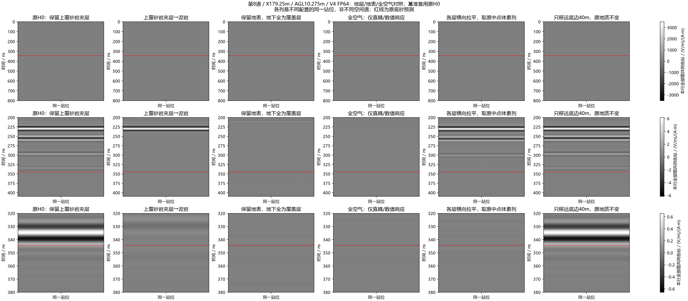
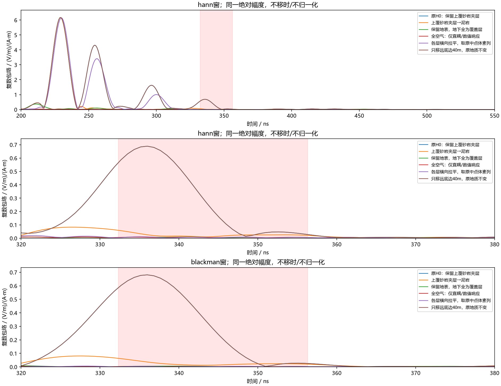
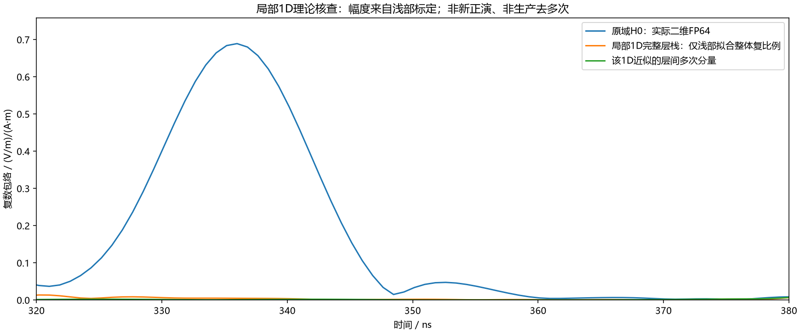

# 第8道约335ns强响应：上覆夹层与侧向几何的受控归因

2026-10-08。延续用户SSH开跑及“研究明白”的授权。本单元新增9次FP64单站求解，全部完成；不是9个空间测点，也不是整线B-scan。结论是：**本次约335ns剩余强响应主要依赖上覆砂岩夹层及其横向几何；上、侧、下边界距离不是此站目标窗内的主要原因。** 尚未定位到某个确切尖灭点或区分单次绕射与二维复杂传播，不把结论推广为实测与三维已解决。

## 与前批的关系

前批同站H1/H0只去掉与底边连通的底砂，保留上覆砂岩夹层。已确认底砂差场在约343ns，被H0约335ns更强响应叠加并部分相消。当前从H0出发，域110×40m、2.5cm、800ns、1.3m收发、X179.25m、实际中点离地10.275m，冻结材料、40A impulse及V4.0.0原生FP64。求解宽带场后按精确20–170MHz、0.3MHz、501点进行源时间/空间归一化，保留复相位，Hann/Blackman并列，无AGC、尾渐消或生产性模型导引删改。

四项边界控制见[原任务及完成记录](2026-10-08_line9_boundary_distance_controls.md)。第二批增加五项：①上覆砂岩ID3全部改泥岩ID2；②保留地表，地下全覆盖层；③全空气；④各层横向拉平，重复原中点第3170列；⑤下方延40m并把原体素/收发整体上移40m。⑤保持原地表、顶边及收发相对关系，添加底部材料延续。①④改变了外域/PML材料及传播交互，不能称纯单界面回波。

第二批执行合同SHA256：`017f2d8dd2c6abb58d3de1154985af0498ad426d31d236ee29a5d695777de62b`；原生审核SHA256：`332cdbe0e4f2ce2e192328a6ab9fcdf5fff870fd1f1fe315d5be8178139809bf`。五次分别84.390/72.203/72.204/85.406/145.859s，无失败/重试。独立目录`E:/line9_basal_pair_20261008_r1/remaining_geology_r3`，不修改ROG原仓库。r1是未执行准备稿，r2准备时发现扩展数据集形状错误、在任何求解之前修复；r3为唯一执行版本，旧准备稿留本机。

## 固定窗内复数响应

评价窗沿前批固定332.311–356.311ns，未随结果移动。下表由`analysis.json`的复数场范数计算，并经独立脚本从私有复数H5复算；各项不是能量占比或SNR。

| 对照 | Hann 剩余范数 / H0 | Blackman 剩余范数 / H0 | Hann 变化范数 / H0 |
|---|---:|---:|---:|
| 上边+40m | 100.0035% | 99.9985% | 0.0698% |
| 左右各+40m | 99.9896% | 100.0113% | 0.3020% |
| 上边与侧边同时扩展 | 99.9896% | 100.0113% | 0.3025% |
| 去上覆夹层 | 6.3887% | 6.6484% | 96.1426% |
| 地下全覆盖层 | 1.6064% | 0.9609% | 99.5867% |
| 全空气 | 1.6092% | 0.6645% | 99.7323% |
| 层序横向拉平 | 1.6975% | 0.7071% | 99.5083% |
| 底边+40m | 99.9985% | 100.0006% | 0.0309% |

单独去上覆夹层只剩约6.4–6.6%的窗内场范数；保留完整垂向层序但横向拉平后只剩约0.7–1.7%。这支持侧向非平层几何相关响应压过弱底砂，不能只用“本地垂直层间多次”解释。全空气及全覆盖层剩余也很小，排除了此窗由单纯直耦/地表带限旁瓣主导。全空气残余依然存在，不把它自动称为数值噪声。

底边移远40m变化约0.031–0.034%；配合上、侧对照，不支持本次强峰主要由边界返回。边界控制包含有限外域延续，因此结论是本次响应对这些受控边界距离改变很小，不是对所有PML的普遍认证。

作为非求解补充，原中点完整1D层栈的两种独立递推计算一致约2.5e−16；仅以浅部拟合一个整体复系数，深部预测范数约原H0的0.75%、其中内部多次部分约0.31%。该近似遗漏二维扩散、入射角谱与地形，失败不能排除所有地层多次，但与拉平FDTD控制共同反对“单纯本地1D层栈足以解释335ns强峰”。

## 图件与审核







执行事件、冻结合同、原生审核、解析数值和独立交付审核位于`artifacts/research_checks/2026-10-08_line9_boundary_results_r1/`和`artifacts/research_checks/2026-10-08_line9_geology_results_r1/`。每张图的SHA256在`delivery_audit.json`。复现入口：

```powershell
python scripts/analyze_line9_boundary_controls.py --source <retrieved-private-batch> --reference <prior-H0.h5> --out <fresh-public> --numerical <fresh-private.h5> --parent-manifest <basal-preparation-manifest> --materials <unchanged-material-json>
python scripts/audit_line9_control_delivery.py --private <retrieved-private-batch> --public <public-analysis>
```

独立检查覆盖原生float64/形状/时间步/收发坐标/哈希与完成事件，另按不同时间采样直接求和复算逆变换和全部窗内范数/复相关/峰值。DFT误差约1e−12、逆变换约1e−13；无核心处理代码修改、无训练或实测调参。原始及派生场地几何/native H5不入Git。

## 后续仍需解决

当前上覆砂岩在local x约51m附近变薄/中断，距收发约28m，存在远处侧向响应候选。但“删除整层”与“拉平全域”只能指向结构类别，不能定位确切尖灭回波。下一批预先冻结远处x45–60m与近处x65–90m夹层局部替换，以及同域AGL1m的H1/H0配对；保留ROI切边引入散射、低航高到时近似和单站选择的限制，不先按猜测去除真实地下回波。

二维TMz仍是横向无限延伸的线源/地质假设，不能把源归一化后的Ez称端口S21，也不能由本单站直接断言真实UAV必然如此。需要在定位后再判断二维线源、有限三维结构与天线方向性的作用。历史图片里把环纹直接命名为PML反弹的解释在此站不获支持。
