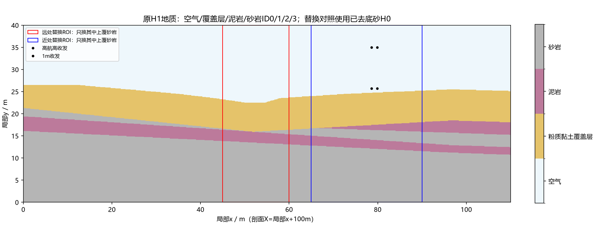
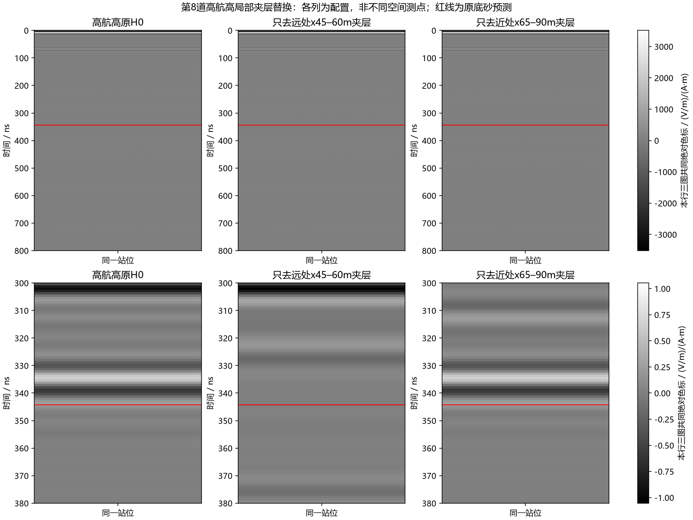
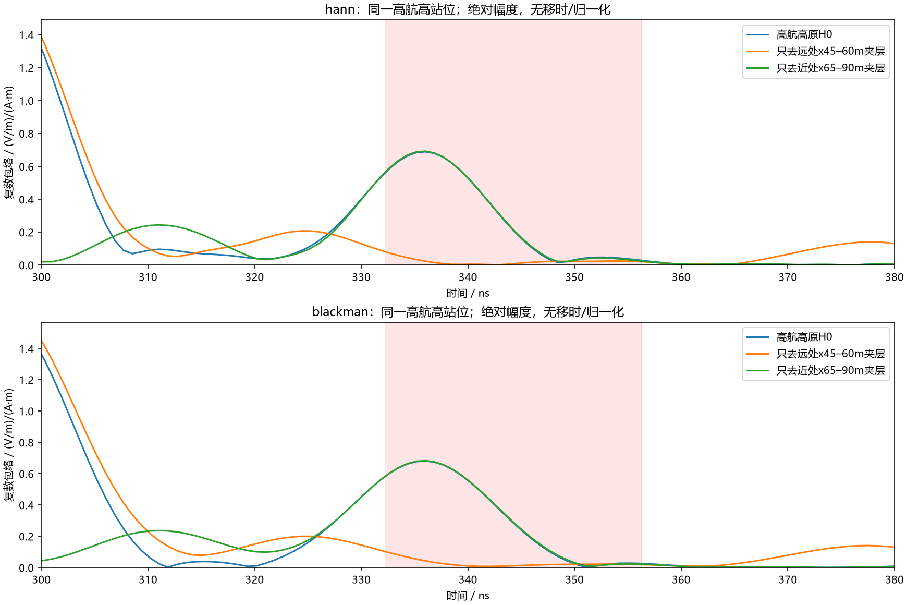
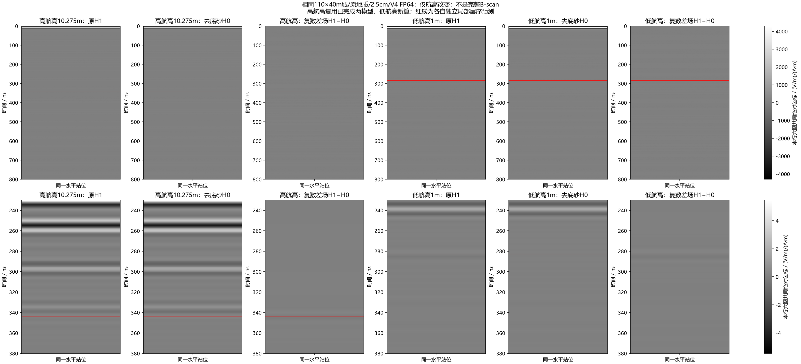
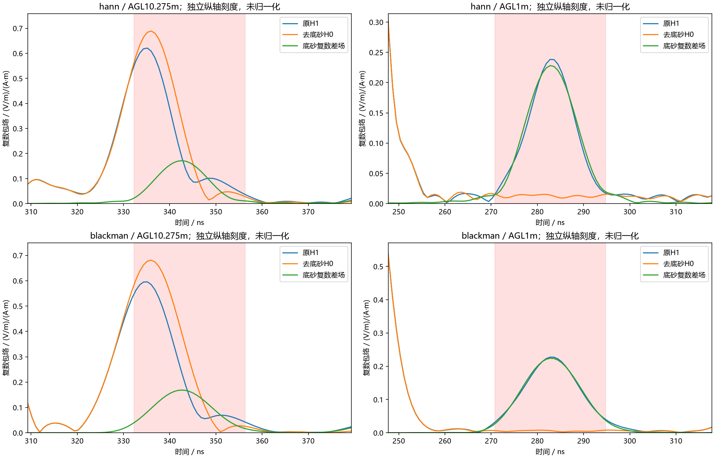

# 远处夹层定位与相同域航高配对

2026-10-08。用户授权SSH求解及自主研究后，沿[九项控制](2026-10-08_line9_interbed_attribution.md)继续。新增四项均为原站X179.25m、110×40m域、2.5cm网格、800ns、原材料、HORIPML80格、V4.0.0原生FP64，不加快照、不扩整线。高航高H1/H0复用此前已审核结果，不重复求解。所有原始资料及既有输入不改。

## 求解前冻结的区分

| 新模型 | 改动 | 要区分的问题 |
|---|---|---|
| far_interbed_removed | H0中仅local x45–60m的上覆砂岩ID3→泥岩ID2 | 远处夹层区域是否控制335ns强峰 |
| near_interbed_removed | H0中仅local x65–90m的上覆砂岩ID3→泥岩ID2 | 收发点附近夹层是否控制该强峰 |
| low_H1 | 原完整H1，Tx/Rx y35→25.725m | 同域离地1m的原总场 |
| low_H0 | 原H0，Tx/Rx同样下降 | 同域低航高底砂配对与遮挡程度 |

收发中点local x79.25m，因此远处ROI距中点约19.25–34.25m，近处包含收发点正下方。剖面X=local x+100m，远处对应X145–160m。两ROI以外体素逐点不变，局部替换只动上覆砂岩，底砂此前已去掉。局部替换会引入ROI切边并改变传播交互，因此识别的是敏感区域，不能把差场当某个尖灭点的纯一次绕射。

低航高H1/H0与高航高对应模型的整个域、地质和PML都相同，仅收发高度变化，修复此前外来高低航高包右边界差10m的因果缺口。离地1m是中点值，Tx/Rx各自因地表台阶略有差异。高航高335ns固定窗沿用332.311–356.311ns；低航高预先记录空气延时近似窗270.433–294.433ns，另外由原地质与完整材料谱独立生成底砂一次反射近似，峰±12ns评价，不从观测强峰调整模板。

合同SHA256：`64c4f6ed211a19d602772190cbeaf168a7610f27a6c2dd60e9d773dcae2de731`。部署ZIP两端SHA256：`4c7ca3d87c1c628017e6bff093e19ff083113c25d41c5ad37d0e6f12521cc80e`。独立目录`E:/line9_basal_pair_20261008_r1/localized_height_r1`；GPU锁、600s会话心跳、USER_STOP及原生审计沿用。初始启动器因PowerShell数组拼接把命令拆行，进入空Python交互、未启动求解/未生成执行日志；只停止核验过的所属进程树，保留原启动日志，新启动器r2使用同一冻结科学合同，实际求解attempt以execution.jsonl为准。

## 完成与数值

四项4/4完成，无求解失败/重试；仅一次启动器错误发生在任何求解之前。最终原生审核SHA256：`30c5a431f25e0051dec9e34444ee05f4e36f77a213ebc4a0a0202dfc05059657`。两端结果ZIP SHA256：`6d143dd93c8001faa91f1eeda44994d7f042f079807a916aebd620fd27beb9f6`。

| 模型 | 求解秒数 | 进程树RSS峰值 / GiB |
|---|---:|---:|
| far_interbed_removed | 83.812 | 2.060 |
| near_interbed_removed | 77.703 | 2.034 |
| low_H1 | 77.750 | 2.022 |
| low_H0 | 78.281 | 2.034 |

高航高原固定底砂窗内：

| 局部替换 | Hann剩余范数 / 原H0 | Blackman剩余范数 / 原H0 |
|---|---:|---:|
| 只换远处x45–60m | 6.4968% | 8.1193% |
| 只换近处x65–90m | 100.5036% | 100.4887% |

远处替换使强峰显著下降，近处替换基本保留原强峰（复相关均约0.9999）。结合整层与拉平控制，**335ns主要响应定位到远处夹层区域，而非正下方底砂或主要边界返回**。尚不能把该区域内某个点/单一绕射/传播阶次当作已认证来源。

| 航高与频窗 | 原总场/底砂模板复相关 | 差场/底砂模板复相关 | H0剩余 / 底砂差场范数 | 差场峰 / ns |
|---|---:|---:|---:|---:|
| 10.275m / hann | 0.274938 | 0.961556 | 3.700729 | 342.648037 |
| 1m / hann | 0.985956 | 0.990500 | 0.089560 | 282.767798 |
| 10.275m / blackman | 0.452632 | 0.975742 | 3.627641 | 342.648037 |
| 1m / blackman | 0.993381 | 0.994231 | 0.038185 | 282.767798 |

离地1m时底砂模板预测峰及配对差场峰同为282.767798ns，总场与模板高度一致；H0在底砂窗内的相对覆盖明显降低。原总场不需要模型导引删改即可出现对应波形。低航高说明本次回波混合改善，不代表整个时窗所有杂波消失。底砂差场在本窗的量级与总场接近并不等于纯一次反射或独立检出能力。

预声明空气时移窗270.433–294.433ns独立复算，H0/差场为0.089560/0.038185，与模型模板峰±12ns的结论一致；详见`predeclared_low_gate_check.json`。

原生dtype/形状/域/时步/收发坐标/激励与事件哈希审计，以及独立直接逆变换和配对范数/相位复算通过。独立DFT误差约1e−12、逆变换约1e−14。可复现入口：

```powershell
python scripts/analyze_line9_localized_height.py --source <retrieved-private-batch> --prior <prior-pair-results> --parent <basal-preparation> --out <fresh-public> --numerical <fresh-private.h5>
python scripts/audit_line9_localized_delivery.py --private <retrieved-private-batch> --public <public-analysis> --prior <prior-pair-results>
```

全部中文图、`analysis.json`、事件日志、合同、原生审核和`delivery_audit.json`位于`artifacts/research_checks/2026-10-08_line9_localized_height_results_r1/`，原始/几何/数值H5留私有目录。

后处理为精确20–170MHz/0.3MHz/501点，实际激励及Yee时间归一化、2D源长度0.025m归一化，无尾渐消/AGC/移时/逐道增益。先复数差分再计算包络；两种窗并列。对照不用于从实测中删除地层、训练或宣称SNR。

## 中文图件











## 解释边界与下一步

这是被模型与前批提示选出的一个站位，局部替换定位不能直接推广全线；上覆夹层单次散射/绕射、地层多次与地形传播的具体分配仍需波场/路径及其他站位核查。底砂差场包含底部材料替换的全部交互与下部PML材料延续，不是实测clean或纯一次反射。即使低航高对应更好，也只证明该模型此站航高导致了响应混合程度变化，不等于真实UAV必须贴地或高航高不可行。

gprMax开发者明确解释二维源实际为无限长线源、扩散损耗与三维不同，二维A-scan不能简单当真实三维天线的定量幅度；同时提醒冲激响应截断和源/电场半时间步错位需要量化。[作者2023年说明](https://groups.google.com/g/gprmax/c/hZQrvyrMzh8)。[官方建模指南](https://docs.gprmax.com/en/latest/gprmodelling.html)的二维定义与此一致。当前在线指南标4.0.1，本批运行时是经原生文件验证的4.0.0。阅读范围为相关正文段，未把最新文档的功能当成本机已实现。上述来源只给适用限制，**本次侧向来源由实际受控求解支持**。

定位后优先核验受限站位的来源稳定性及同样精确频带下源型/时窗敏感性，再决定有限三维和真实天线方向性对照；不通过删除夹层制造好看的模型，不按猜测做生产去多次。
