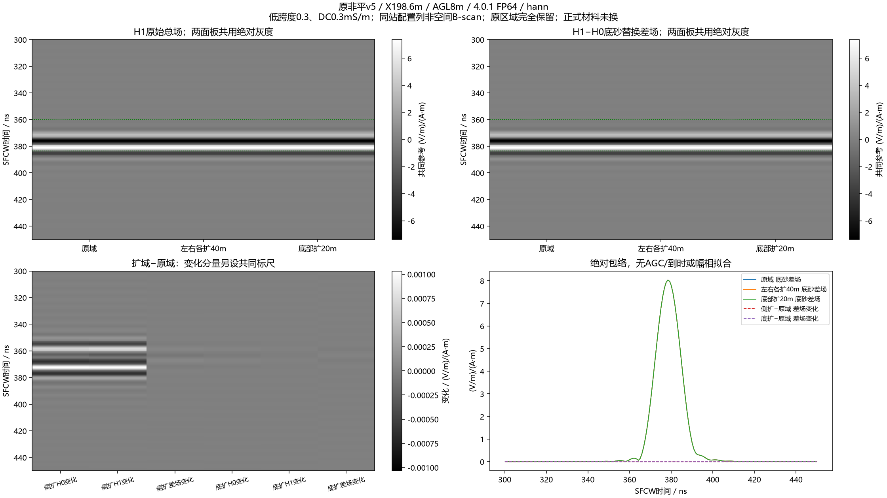
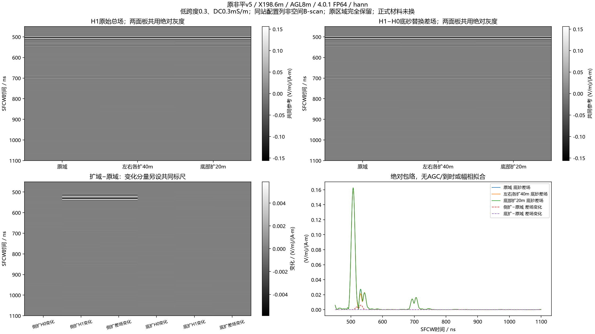
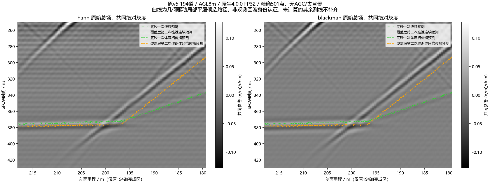

# 低损耗非平模型的侧向与底部扩域对照

本批4/4新FP64求解一次完成，复用原域2份native。低损耗站底砂主窗对两种扩域稳定，未支持“低损耗增强只是侧/底边界返回”的解释；晚窗有有限侧向敏感性。正式材料未替换、整线/有限三维/实测差异未解决。

## 求解前冻结方案

接续极化/DC四组对照，不改变正式材料。复用跨度0.3、σDC0.0003 S/m、中心ε′95=12、τ8ns的原v5/198.6m/AGL8m H0/H1原生配对。仅新增左右各扩40m的H0/H1及向下扩20m的H0/H1，四个新求解各一次attempt，无重试、无快照。原210×42.5m体素逐位保留；侧扩为290×42.5m，延续最外列；底扩为210×62.5m，延续底行。相应平移原模型和收发器，物理站位/相对几何保持。此控制把域外延续和PML距离同时改变，不叫单独PML误差分解；没有联合扩域，不认证全局收敛。

固定2.5cm、dt、1200ns、20352点、FP64、40A/100MHz Ricker、HORIPML80格、界面平均和完整材料JSON。侧扩19.72M格、底扩21M格，保守预算约10GiB设备内存；冻结时检查ROG实际空闲GPU/内存/活跃进程，预计四项约20–24分钟。保持源/接收Yee时间偏移和共同0.025m参考尺度，精确20–170MHz/0.3MHz/501点，Hann/Blackman，先复数差分再取幅值。无AGC、去背景、尾部taper或幅相/到时拟合。

事前固定底砂窗359.756487–383.756487ns和300–450ns宽窗；另给0–120ns早窗和450–1100ns晚窗诊断。按H0、H1和底砂差场分别报告扩域复数相对L2变化，并把H0变化除以原底砂范数，避免“总场很稳定”掩盖弱目标。输出中文同站灰度及变化分量图，明确配置列不是空间测线；原生版本/FP64/源/整数格位/材料/体素/独立DFT和逆求和审核后追加实际结果，不预设必须通过某个物理阈值。低损耗材料仍只是机制对照，未校准现场；后续不同厚度/坡度站位、有限三维与实测匹配尚未完成。

## 实际求解、结果和证据边界

ROG官方4.0.1，实际GPU为RTX4090 Laptop；四项均原生Ez=float64、20352点、dt=5.896635841874211e−11s。累计1265.750s（21.10min，不含准备/传输/审核），4次启动/4次完成/0次失败或重跑。本批无快照；求解后实查本任务python进程数0。独立比较原区域、域外边列/底行、收发坐标、源、材料完整字节及原生头一致性通过。

定义δ=H1−H0，H0仅底连通砂岩替换为泥岩，包含与其他结构交互的变化，不能自动称实测clean。复数变化为`||δ扩域−δ原域||₂ / ||δ原域||₂`，先按完整501点重建复数场，再在事前窗比较，无拟合。

| 控制 | 底砂窗δ变化 Hann / Blackman | 300–450ns δ变化 Hann / Blackman | 450–1100ns δ变化 Hann / Blackman |
|---|---:|---:|---:|
| 左右各扩40m | 0.0008284% / 0.0008002% | 0.0008678% / 0.0008372% | 3.7999% / 3.4957% |
| 向下扩20m | 0.0002933% / 0.0002833% | 0.0003077% / 0.0002971% | 0.05151% / 0.05237% |

三域底砂峰均378.409847ns。原域H0/δ为0.002208/0.001801，扩域后仍约0.002；总场和底砂差场的复相关均>0.999998。侧扩令微弱H0自身改变5.91%/6.63%，但H0变化仅为原δ的0.01306%/0.01195%；底扩相应仅0.0004956%/0.0004787%。必须结合绝对尺度：不能把H0相对变化百分比直接叫目标被污染相同比例，也不能因主峰稳定就宣布晚窗无影响。

此结果支持上一轮材料损耗机制在本低损耗单站主窗不依赖此次侧/底延伸。两个延伸同时改变外部地质延续和PML距离，没有联合延伸，也未重做低损耗顶部控制；不单独分配PML能量、不认证全局收敛，不向原高损耗全线或v3其他地质自动迁移。晚窗变化可能含外延结构、边界及其交互，尚未分解，不能全部叫PML反弹。





图中列是同一站的三个配置，不能解释成水平地层或完整B-scan。总场和δ共用绝对灰度；下排变化分量另设明确共同标尺，未逐列归一化。另交付同名`blackman_target_gray.png`、`blackman_late_gray.png`（均带`low_loss_boundaries_`前缀）。

0–120ns原生时域前缀四个新结果对各自原域全部逐位一致；带限SFCW早窗仍有微小变化，因为全时段带限逆变换并非时间局部操作。早窗δ极弱，H0/δ达到10⁷–10⁸量级，不拿该比值给实际早时底砂检出结论。

独立501点直接DFT审核九个列（H0/H1/δ×三域），最大相对L2为4.32e−12；直接逆求和对主/宽/晚窗指标最大绝对误差2.37e−11。早窗大比值最初触发统一1e−8绝对容差，修正为`误差/max(1,|指标|)<1e−8`后通过，同时原样记录绝对误差（最大0.03986）及尺度归一误差（最大3.26e−9）；这是处理复算精度检查，不是物理验收阈值，没有重跑求解器。完整审核见`independent_audit.json`。

## 身份、归档及复现

公开产物目录`artifacts/research_checks/2026-10-08_v401_low_loss_boundary_r1/`包含方案清单、冻结契约、预检、原生完成审核、执行事件、分析、独立审核和四张图。冻结契约SHA256：`f56c1264a1c8b5c9f7dbdd360832ed794d92b26374f871d3d762e5073e939574`；准备清单：`73f046161cf77b7cf12674351c936308d8ef5aa5ca991dc702a6e24aaa123c5e`。完整输入、native和SFCW数值H5仍在忽略目录，原始资料不上传。

| 新配置 | 耗时 / s | 原生SHA256 |
|---|---:|---|
| sides40_H0 | 307.609 | a31344c288d03e74f223db07036d4bb201f4964da88760b86f57066c4232b272 |
| sides40_H1 | 309.188 | 01bb4f832bc6cb09ccd8a5fd364cbb3b1201814656ad07e345a52cc9460bd7ec |
| bottom20_H0 | 324.219 | abc3b6ef721d3ed8e4c120702d2e29a3e1d0f80ece2eeb75147c96f4f0d9e254 |
| bottom20_H1 | 324.734 | ffe56a8f7dec5b5c0f84481624f3b810ca7f0a1c787c871ebdcc52019c82feb3 |

回传ZIP先与ROG核对SHA256 `4e1fdfcace5aba6c7e4406dcbe5c3da61b5c643f07137214df17c0c3b14979d1`，再解包。私有结果：`artifacts/local_checks/2026-10-08_v401_low_loss_boundary_results_r1`；私有准备方案使用`..._prepared_r2`，不是冻结版本检查修订前的r1。

```powershell
$py = 'artifacts/local_checks/gprmax_v401_gpu_env/Scripts/python.exe'
$pkg = 'artifacts/local_checks/2026-10-08_v401_low_loss_boundary_prepared_r2'
$native = 'artifacts/local_checks/2026-10-08_v401_low_loss_boundary_results_r1'
$public = 'artifacts/research_checks/2026-10-08_v401_low_loss_boundary_r1'
# 分析会拒绝覆盖已有结果；另选新的输出目录和数值H5名称。
& $py scripts/analyze_line9_low_loss_boundaries.py --source $native --package $pkg --out '<fresh-public-dir>' --numerical '<fresh-numerical.h5>'
# 审核既有输出需新的审核文件名；sfcw.h5需与分析保存路径一致。
& $py scripts/audit_line9_low_loss_boundary_results.py --source $native --package $pkg --parent artifacts/local_checks/2026-10-08_v401_polarization_prepared_r1 --public $public --out '<fresh-audit.json>'
```

`scripts/line9_v401_low_loss_boundaries.py`提供prepare/freeze入口，输入审核为`scripts/audit_line9_low_loss_boundary_inputs.py`。旧契约只用于复核，不重新启动已耗attempt；新求解须另冻新目录和有界契约。未修改通用处理算子，本批不重复宣称182项数组回归或实测验证。

## 既有194道的候选路径叠图（CPU诊断，无新求解）



原包实际完成区仅218→179.4m，原生4.0.0/FP32；全计划966站不等于已算966站。复用已修正的保相位501点SFCW，Hann/Blackman共享绝对灰度，没有AGC、去背景、叠道或按模型删改信号；complex128处理不能把原始FP32升级成FP64证据。

逐道从原体素取层厚，按既定复材料谱预测底砂一次反射与覆盖层第二次往返的到时，另加法向Yee体传播对照。1.3m双站间距通过95MHz Snell几何校正；这是局部平层近似，未包含完整坡度、角谱、非局部返回、其他多次和离散界面误差，曲线不是观测事件身份真值。Hann连续预测128/194站的两候选峰差不超过1/B=6.667ns、140/194站不超过2/B；只是描述性尺度比较，不能当该频窗下已认证的分辨率或分类阈值。强斜条纹没有完整跟随任一候选，尚不能统称覆盖层多次。

审核绑定全部194份native哈希，逐道七个精确频点直接DFT相对L2最大1.85e−12。独立审核另用透射系数乘积、Brent法Snell根、复数Newton离散传播根及完整直接逆求和，四组194站预测峰时差均0ns，选频传播根相对误差最大1.50e−16。此项验证近似数学和处理一致性，不认证实际条纹来源。

产物及复现入口：`artifacts/research_checks/2026-10-08_v5_path_overlap_r1/{analysis.json,independent_audit.json,v5_original_194_path_time_overlay.png}`，`scripts/diagnose_line9_v5_path_overlap.py`、`scripts/audit_line9_v5_path_overlap.py`。新FDTD=0、训练=0。

## 下一批空间站位设计（尚未冻结或启动）

复用198.6m低损耗站作参照，新增190、180、146.4m三站的H0/H1配对候选；以模型层厚变化选点，不从处理后的强条纹挑站位。低损耗配方沿用机制对照，正式材料不变。拟仍用210×42.5m原域、2.5cm、1200ns、原生FP64、40A/100MHz Ricker及精确501点处理。各站对应8m目标AGL，原计划格位有不足一格的量化误差，保持原计划收发坐标，不另拟合。

| 剖面里程 / m | 覆盖层 / m | 泥岩 / m | 底砂深度 / m | 局部模板峰 / ns |
|---|---:|---:|---:|---:|
| 190 | 6.575 | 7.100 | 13.675 | 362.608 |
| 180 | 5.475 | 7.275 | 12.750 | 342.648 |
| 146.4 | 2.725 | 6.550 | 9.275 | 265.303 |

上述模板峰仅用于事前窗口设计，不是实测或新正演结果。`scripts/design_line9_v5_spatial_pairs.py`明确校核计划清单的20.65m为Tx坐标偏移，收发中点的剖面偏移为20m，不能混用；三站实际输入仍须生成、独立审核并另冻有界执行契约。此文和设计JSON不能作为启动器。该批拟6份新native，当前新增完成数为0；当前四项边界输出先验收，不把拟议求解计为已完成。
