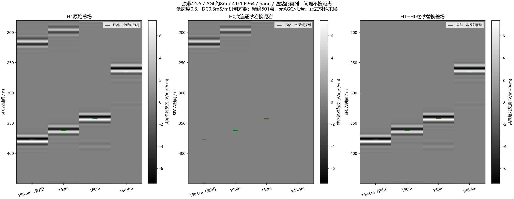
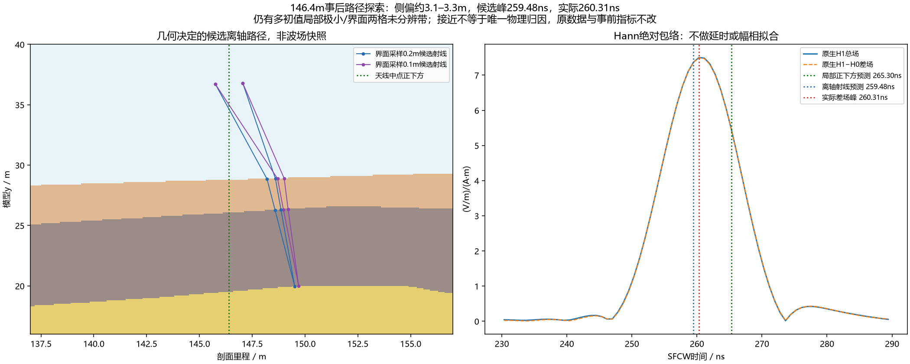

# 原非平v5低损耗四站空间跟随核查

## 完成结果与解释

新增190、180、146.4m三个站位各H0/H1，六项全部一次完成，无失败或重试，累计求解1330.299s（22.17min）；复用198.6m配对，共八份原生FP64。ROG任务退出后本任务Python进程数为0。输入、原生身份、完整501点直接DFT、独立Snell/Fresnel模板、直接逆求和与缺道掩码审核通过。

**低损耗机制对照在约8m航高下出现随地层变薄而提前的底砂响应，而且在未去背景的总场中就可见。** 四站H1总场与底砂差场的峰完全相同，亦为公共180–450ns窗内各自的最大峰，Hann/Blackman一致。这不支持“UAV抬高后必然看不到地层”的解释，但不是原高损耗材料已经修复，更不是现场参数认证。

| 剖面里程 / m | 局部正下方模板峰 / ns | 实际H1及差场峰 / ns | 实际−模板 / ns | 主窗H0/差场范数 Hann / Blackman |
|---|---:|---:|---:|---:|
| 198.6（复用） | 376.747 | 378.410 | +1.663 | 0.221% / 0.180% |
| 190 | 362.608 | 361.776 | −0.832 | 0.149% / 0.0642% |
| 180 | 342.648 | 341.816 | −0.832 | 0.148% / 0.0679% |
| 146.4 | 265.303 | 260.313 | −4.990 | 0.354% / 0.174% |

主窗H1与差场复相关全部大于0.999994；差场与局部一次模板相关，前三站Hann为0.9761–0.9874、Blackman为0.9844–0.9916，146.4m降至0.8417/0.8893。宽窗H0/差场仍全部小于1%，差场/模板相关范围0.8289–0.9865和0.8735–0.9906。四站峰均不在固定主窗边缘，公共窗亦保留相同到时。相对198.6m锚点的实际到时变化与模板之差依次0、−2.495、−2.495、−6.653ns。因此支持空间跟随，不能宣称精确正下方层位对应，146.4m约5ns差异需要继续解释。

### 146.4m事后路径诊断（仅CPU）

观察到上述残差后，单列既有二维Fermat射线工具的探索，事前指标及原始数据不改。按原体素提取分段线性界面，95MHz相位路径五初值搜索，界面采样0.2m与0.1m分别得到反射点相对天线中点侧偏+3.115m与+3.300m；用完整复介电谱合成候选峰，两种频窗均为259.481ns，比实际260.313ns早0.832ns，优于局部正下方265.303ns的预测。这提供“天线响应来自侧方界面”的具体候选解释。

这不是唯一物理归因：采用既有优化器而非独立全局求解；两种采样最优相位时间差0.252ns，五初值收敛结果跨度分别0.140ns和4.847ns，存在局部极小；两格界面接触带未分辨长度约0.499m；未包含完整斜入射系数、扩散、绕射、频率依赖射线或全离散界面理论。独立路径长度/材料谱/透射乘积/直接逆求和复核只认证数学一致性（复谱相对误差约2.3e−14、峰误差0），不认证实际波场的唯一传播路径。诊断脚本不调用求解器，无新波场快照。

### 图件与展示约定

以下路径均以仓库根目录为基准；图内逐项中文标注材料、H1总场、H0替换场、复数差场和模板。主灰度三行共用物理幅度尺度，不做AGC、去背景、逐列归一化或延时/幅相拟合。配置图四列等距仅为便于对比，明确不是空间距离；真实坐标稀疏B-scan在262个0.2m位置中仅四站有数据，258站缺失全部mask，无插值，不能称完整测线。

- `artifacts/research_checks/2026-10-08_v401_spatial_pairs_r2/spatial_pairs_hann_station_gray.png`
- `artifacts/research_checks/2026-10-08_v401_spatial_pairs_r2/spatial_pairs_blackman_station_gray.png`
- `artifacts/research_checks/2026-10-08_v401_spatial_pairs_r2/spatial_pairs_hann_sparse_bscan.png`
- `artifacts/research_checks/2026-10-08_v401_spatial_pairs_r2/spatial_pairs_blackman_sparse_bscan.png`
- `artifacts/research_checks/2026-10-08_v401_spatial_pairs_r2/spatial_pairs_hann_envelopes.png`
- `artifacts/research_checks/2026-10-08_v401_spatial_pairs_r2/spatial_pairs_blackman_envelopes.png`
- `artifacts/research_checks/2026-10-08_v401_spatial_pairs_r2/spatial_pairs_geometry_stations.png`
- `artifacts/research_checks/2026-10-08_v401_spatial_pairs_r2/posthoc_off_nadir_geometry_and_arrival.png`





首轮绘图r1以`masked_all`创建未计算位置，底层未初始化数据触发Matplotlib归一化警告；改为明确NaN加mask后新建r2，无警告，科学数值不变，未重跑FDTD。r1图/数值及对应旧分析源码完整保存在忽略目录`artifacts/local_checks/2026-10-08_v401_spatial_deploy_r1/plot_attempt_r1`，不覆盖历史。

### 审核与下一步

八份原生的12列复谱直接DFT最大相对L2误差4.312e−12，独立局部模板误差3.069e−14，直接逆求和指标最大归一误差3.843e−12。六个输入只移动收发，H0/H1全局几何、材料与源均与既有低损耗组保持，独立体素/层厚/位置/AGL核对通过。完成与事件证据、协议、输入清单及图入库；未重复通用182项数组回归，不将此称训练或实测验证。

回传ZIP SHA256 `1389c0978d34069b25823900b3abe68c896633eeb4b08b1126e55acb8a783822`；完成核验SHA256 `0bb719d2a035bcb3e5349a9fd347fed2285d8ab0a59f75fd99cb5fd99229beb4`；主分析SHA256 `43a14a95e549a4050b655b3bfe5e240d1fc63c4a590ba1ead3bb39d92edf26a5`；私有复谱文件SHA256 `bcca1cc25a09aeb6d6e70369bf6048a85bf06c4fd8b5f3cb32910deb0bad112f`。完整native、输入H5、数值H5、ZIP和环境留忽略目录，不上传原始资料。

下一步先继续解释原高损耗194道强斜条纹，区分非局部一次与多次/其他剩余返回；146.4m候选侧向路径需独立传播验证。正式材料未替换，不由对照好看来敲定物性；四站不代替完整测线、有限三维、网格/边界全窗收敛或现场校准。本单元不追加FDTD、整线或训练。

## 求解前范围与冻结

用户明确“做”，执行上一单元三站提案：原v5/AGL约8m，新算190、180、146.4m的H0/H1，共六次single attempt，无重试、无新快照；复用198.6m已完成低损耗H0/H1。三站按模型层厚变化选取，不由处理图强峰挑站位。新方案全局几何和材料字节与上一单元相同，只移动收发位置。H0仅底连通砂岩替换为泥岩，差场包括替换引起的全部交互；不是实测可获得clean。

保持210×42.5m、2.5cm、20352点、dt=5.896635841874211e−11s、1200ns、40A/100MHz Ricker、HORIPML80格、界面平均、原生FP64 Ez，精确20–170MHz/0.3MHz/501点。源与接收Yee时间偏移保留，共同0.025m参考尺度；Hann/Blackman，先复数差分，无尾taper/AGC/去背景/逐列归一化/幅相或时间拟合。泥岩实部跨度0.3、σDC0.0003 S/m仍是反事实机制对照，正式配方不改，非实测参数定稿。

| 剖面里程 / m | 覆盖层 / m | 泥岩 / m | 模板峰 / ns | 事前底砂窗 / ns |
|---|---:|---:|---:|---|
| 198.6（复用） | 7.300 | 7.000 | 376.747 | 359.756487–383.756487（沿用既有窗） |
| 190 | 6.575 | 7.100 | 362.608 | 350.608–374.608 |
| 180 | 5.475 | 7.275 | 342.648 | 330.648–354.648 |
| 146.4 | 2.725 | 6.550 | 265.303 | 253.303–277.303 |

三站实际收发中点AGL依次7.9875、8.0125、7.9875m，来自既有格位量化，不另调高度。计划清单的20.65m偏移属于Tx，收发中点偏移20m，收发水平间距1.3m。二维输入z=0.0125m，而原生2D元数据z=0，两者按既有求解器约定分别记录，不把消失维坐标误判为物理变动。

独立输入审核：六卡只允许title/Tx/Rx变化，其余命令字典完全一致；所有H0/H1全局体素和材料分别与已审计原域字节一致，底砂替换5,606,675体素。独立从实际材料列计数层厚，核查收发在空气、网格整数对齐、非PML、里程和AGL。审核通过后才传输冻结；payload ZIP SHA256 `90540f2e50a3ffb01a24bde2a0fb46ae1495971af9179e57f4c1627f4837cc1e`，远端核对后解包。准备清单SHA256 `611d9c7debce2fec4b7fa21d422f216c91329e6918a72100e2a621e660744a47`。

ROG独立目录`E:\line9_basal_pair_20261008_r1\v401_spatial_low_loss_r1`，官方4.0.1/CUDA原生FP64、RTX4090 Laptop；运行前确认无既有科学求解树、空闲显存约15.2GiB/可用RAM约48GiB。冻结契约SHA256 `2f3de5dd5377ff5c1a1317ff3db510e4d908b2297383b60a866fea2864fce427`，最大六项、每项1800s/批3600s、无重试、600s会话租约、USER_STOP仅停止本任务树。主仓库和既有结果不动。

## 事前分析规则

`configs/research/line9_v401_spatial_diagnostic_v1.json`在新站结果分析前声明：各站事前底砂窗及宽窗（新站模板峰±60ns；锚点既有窗中心±60ns），另公共180–450ns范围。分别报告H0/δ、H1与δ及局部模板的复相关、实际峰与模型峰差、相对锚点的到时变化误差，以及峰是否落在窗边；不给任意物理PASS阈值。

模型模板为完整复材料谱的局部法向一次反射加95MHz双站路径校正，不含几何扩散、完整坡度/角谱、非局部返回、内部多次或完整离散界面理论。与模板吻合只能支持该模型解释，不是盲测检出或现场物性认证。不同站位改变层厚/坡度及相对边界距离，不是单独厚度控制。

交付中文四站配置灰度（明确横向列不按距离）、实际物理坐标稀疏B-scan（0.2m网格未算位置全部mask、不插值）、各站原场/H0/差场包络及事前窗。以上为冻结时的计划，六项实际完成结果见文首。

## 复现和私有文件

准备包`artifacts/local_checks/2026-10-08_v401_spatial_prepared_r1`，完整回传已存`artifacts/local_checks/2026-10-08_v401_spatial_results_r1`；native、输入H5和ZIP留忽略目录。脚本生成/分析/审核都拒绝覆盖已有输出；复跑分析选新目录和数值文件，不能用已耗执行契约重跑求解。

```powershell
$py = 'artifacts/local_checks/gprmax_v401_gpu_env/Scripts/python.exe'
$pkg = 'artifacts/local_checks/2026-10-08_v401_spatial_prepared_r1'
$native = 'artifacts/local_checks/2026-10-08_v401_spatial_results_r1'
$public = 'artifacts/research_checks/2026-10-08_v401_spatial_pairs_r2'
# 以下是本单元实际目录；已有结果时分析/审核分别选新的输出路径。
& $py scripts/analyze_line9_spatial_pairs.py --source $native --package $pkg --out $public --numerical "$native/sfcw.h5"
& $py scripts/audit_line9_spatial_results.py --source $native --package $pkg --parent artifacts/local_checks/2026-10-08_v401_polarization_prepared_r1 --public $public --protocol configs/research/line9_v401_spatial_diagnostic_v1.json --out "$public/independent_audit.json"
& $py scripts/diagnose_line9_spatial_ray_followup.py --package $pkg --public $public --numerical "$native/sfcw.h5" --out "$public/posthoc_ray_followup.json"
```

新输入由`scripts/line9_v401_spatial_pairs.py prepare`生成，`scripts/audit_line9_spatial_inputs.py`独立审计，随后在新远端目录执行freeze。分析保留实际源的复频谱，独立审核不调用生产SFCW或逆变换函数；另用直接DFT、直接逆求和、Brent法Snell根和正反方向透射系数乘积复算。未修改通用算子，本批不重复宣称182项数组回归、训练或现场验证。
