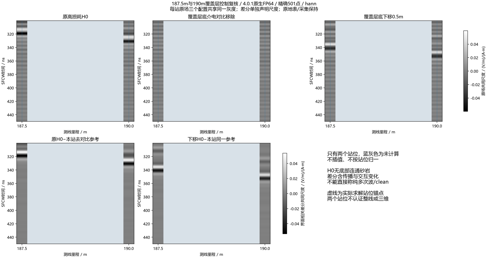

# 187.5m复核：覆盖层界面依赖与重复往返响应在第二站保持

**第二站复现了190m的主要响应。** 187.5m去掉覆盖层底介电对比后，原强峰位置的幅度仅剩7.97–15.45%；底界面整体下移0.5m后，共享无对比参考的早、晚界面相关波包分别延后10.812ns、22.455ns，两种频窗均一致。它们接近声明材料的一次/两次新增覆盖层往返约11.048/22.097ns。对当前母模型这两个锚点，重复往返机制已有较强支持；不能外推整条线、唯一反射路径或实测等效。

[Blackman双锚点图](../../artifacts/research_checks/2026-10-09_cover_interface_18750_results_r1/two_anchor_comparison/two_anchor_blackman_sparse.png) · [187.5m同站原场三配置](../../artifacts/research_checks/2026-10-09_cover_interface_18750_results_r1/interface_hann_return.png) · [晚到界面相关差分](../../artifacts/research_checks/2026-10-09_cover_interface_18750_results_r1/interface_dependent_diagnostic/interface_dependent_hann_late.png)。只有187.5/190m两列有数据，中间9个位置留空；无插值/逐道归一。原场六列共享尺度，界面差分另列共同尺度，蓝虚线为真实求解站位锚点。

## 接续与输入身份

用户在[190m控制完成](2026-10-09_cover_interface_control_results.md)后要求“继续”，本单元执行当时规划的187.5m两项新A-scan。没有恢复旧17项/四波场或重试中断项。

已完成187.5m高损耗H0来自被停止的密采样批次：native SHA为`7aed2c9fbbdbf979b6ea21581bf613a373f38851e7f97b82a90c2c31e67cd679`。原批未完整完成，本单元以该站唯一COMPLETED收据、停止证书中的该站原生哈希、导出与完整501点独立审核核对，**没有把部分批次包装成完整父批证书**。

该站原geometry/material与190m逐字节一致，分别为`c1e308ff73119f2c366d42efcf3526646d5fe8e76c6a692a7113a5b1148985a6`、`128fd48459f632c714fc066ee787cff30081c8af7553d3b9f4006b952f79249e`。两个控制几何也与190m原控制逐字节一致，不重新绘制地层。只使用187.5m自己的原卡：Tx(166.85,38.825)m，Rx(168.15,38.9)m，约8m AGL；名称/波形/几何读取等整张卡在本批三配置间逐字节一致。没有复制190m源卡冒充第二站。

两个控制仍为全泥岩ID2→同覆盖层ID1（7,649,220体素），和每列覆盖层底下移20格/0.5m（168,000体素）；原地表/空气、域、网格、材料参数表、FP64、PML及采集保持。全替换改变下部传播和底PML介质，差分含传播/散射交互，不能叫纯多次波或clean。

## 预先固定的复核与结果

维持20–170MHz、0.3MHz、501点、实际复源谱与Yee时间偏置归一、0.025m参考电流矩，Hann/Blackman均值归一。没有移峰、幅相拟合或AGC。共同宽窗300–450ns不变；原峰±12ns窄窗从旧187.5m H0单独确定，冻结前为306.529607–330.529607ns。底砂比较窗使用该站旧模板340.628077–364.628077ns，H0中并不存在底砂。

120–250ns界面差分早窗在190m是事后探索；**在本次187.5m新求解前已写入合同固定复核**。这属于同一母模型的跨站重复，不是独立地质母模型/实测盲验证，也没有新设物理验收阈值。

|187.5m原场，300–450ns|Hann|Blackman|
|---|---:|---:|
|原H0强峰|318.530ns|317.698ns|
|去对比后原峰位置幅度/原幅度|15.4482%|7.9681%|
|去对比后宽窗复L2/原范数|38.7909%|20.0063%|
|去对比后宽窗复波形变化/原范数|90.6196%|96.6896%|
|界面下移后原场宽窗主峰|335.995ns|336.826ns|

去对比后宽窗最大值在约301.065ns，不能把它命名为原318ns事件平移。去对比后底砂比较窗H0范数仍有约89–98%，晚窗仍保留其他响应；不能说所有回波都消失。新旧原生前120ns逐位一致，源/直耦/最早地表响应保持；SFCW早窗因带限全时支撑有2.6e−7至6.7e−7的相对变化，原生与SFCW指标不可混用。

以本站同一个“地表之下全覆盖层”参考R比较D原=原H0−R、D移=下移H0−R：

|站位/界面相关差分|原峰|下移后峰|延后|
|---|---:|---:|---:|
|187.5m早窗120–250ns|190.452ns|201.264ns|10.812ns|
|187.5m晚窗300–450ns|316.035ns|338.490ns|22.455ns|
|190m早窗（前次探索）|196.274ns|207.086ns|10.812ns|
|190m晚窗（前次既定）|327.678ns|350.133ns|22.455ns|

两种窗函数的四组峰坐标一致。局部垂直未拟合预测的一次新增往返20–170MHz范围11.029–11.088ns、两次22.058–22.177ns，95MHz分别11.048/22.097ns。与厚度变化相符的1:2响应在第二站保持，削弱了仅凭单站偶合得出的解释。

仍不认证精确阶次/唯一路径：差分含材料传播交互，峰可能包含不同驻相支；8倍补零的0.832ns峰采样不是物理分辨率或误差预算，不能把小于一格的预测偏差当作亚纳秒物理精度。二维无限线源、非局部坡面散射、斜入射以及数值相位误差仍有适用边界。[既有快照](2026-10-09_single_station_dual_roi_wavefield.md)及[非局部候选](2026-10-09_nonlocal_cover_candidate_and_controls.md)的限制保持，不通过本轮两站改写为完整路径认证。

## 对“B-scan为什么不像模型”的解释范围

两个锚点支持同一个关键来源：高损耗总场的显眼晚波主要依赖覆盖层相关重复往返，深部底砂另有更弱的配对响应；两者叠加/局部相消使总场最显眼峰不直接跟随底砂形状。此前降低泥岩损耗显著增强底砂、约8m AGL下低损耗总场随底砂变化的证据继续有效。因此不能把本模型问题简单归为“UAV抬高必然失败”或仅用显示增益解决。

本轮没有测得实际泥岩/覆盖层复介电谱，也没有证明诊断低损耗配方代表现场。两个锚点不覆盖整线，PML主导解释只由190m已有顶/右扩域对照削弱，不能直接迁移成187.5m全边界认证。真实天线、有限三维及实测导出链尚未匹配；当前结论可以解释这个模型中的强峰来源，尚不是实测差距的完整解决。

## 执行和验收

ROG RTX4090 Laptop16GiB、gprMax4.0.1 CUDA原生FP64，210×42.5m/8400×1700×1，dl0.025m，100MHz Ricker/40A、1200ns/20352样本、dt5.896635841874211e−11s，HORIPML80及界面averaging保持。

|新配置|监督器耗时|owned峰RSS|native SHA256|
|---|---:|---:|---|
|去界面对比|181.500s|3,393,187,840字节|`05e0b81dc7ec6ccdee0e63c6ff66ef576b574d1688fff3060fc35e480877f090`|
|界面下移0.5m|219.625s|4,079,472,640字节|`3f7a916a02b8dabac2a25d322593a9d27c80262fa0bebbf364c375521c94b9aa`|

两项合计401.125s，约6分41秒；均一次完成，0失败/重试，stderr为空。外部观察显存3764MiB（首项），不是峰值证书。合同`a9b2cbcc2a676072486f920e66be77596957fc32f2b2da80ec2e2d6a21a120e2`，完成证书`de69321d59af79a7d85eb9e492c8a5a0985b40e9a99ca7a5a7cfd0b81a8b6da0`。

独立原生shape/dtype/版本/dt/坐标/源审核通过，全部501点直接DFT最大相对差约1.051e−13；直接逆求和复算全部既定窗、原峰点和解析群延时通过。界面差分再由独立native DFT/逆求和复核。六项CPU拒绝检查（Tx/材料/空气/厚度/未完成依赖/额外案例）通过，原停止收据和前次冻结代码未改。共享GPU锁、600s租约及USER_STOP保持；本机控制器/远端owned求解进程退出。

十四张中文图、分析/独立审核、合同/证书/日志位于`artifacts/research_checks/2026-10-09_cover_interface_18750_results_r1/`，启动/输入/CPU检查位于`artifacts/research_checks/2026-10-09_cover_interface_18750_launch_r1/`。完整模型/native/复谱留本机忽略目录`artifacts/local_checks/2026-10-09_cover_interface_18750_*`和ROG `E:\line9_basal_pair_20261008_r1\v401_cover_interface_18750_r1`。公共克隆不含私有原始资料，不能声称可完整复现正演。

## 下一步建议

优先用一个190m原H0观察运行加少量**原生全时序场探针**，布在已有非局部候选区域及地表/覆盖层底附近。它比再次保存全域大量快照省空间，可检查第一、第二次界面相关返回实际经过哪些位置；先从安装4.0.1源码核对Rx各分量的Yee空间/时间位置，再设计探针。只增加观察，主Rx/源须与既有结果逐位一致，先冻结一attempt、不重试。

这是接续方案，**尚未准备/冻结/运行**。场分量未同位/同时时不直接计算能流或反射能量占比；两种模型的差场也不当作单独守恒的纯波。基于探针结果再决定局部路径控制或有限三维预算，不补整线、不改正式材料或训练标签。
