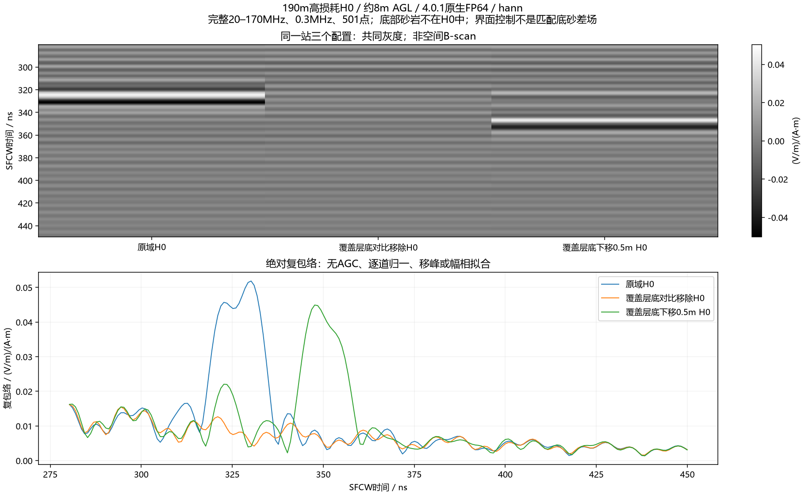
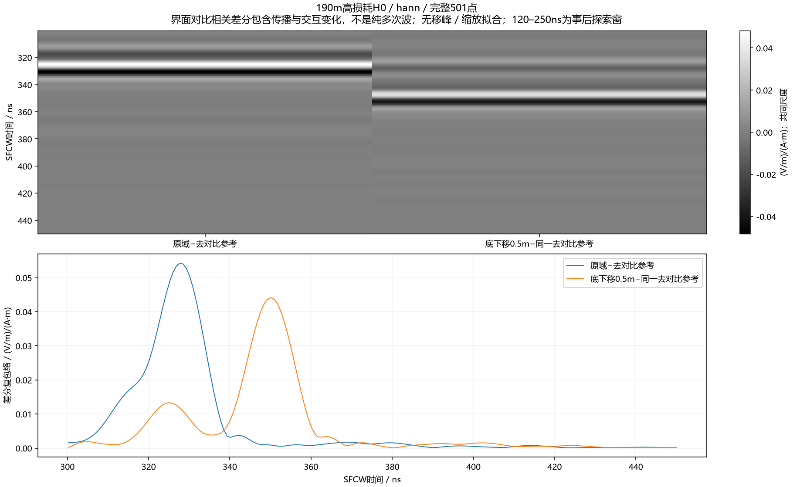

# 190m晚到强峰的覆盖层来源：两项界面控制完成

**现在已有受控证据表明：本站高损耗H0的约330ns强峰主要依赖覆盖层底介电对比及相关传播交互。** 去掉该对比后，原峰位置的复包络只剩约5–9%；将覆盖层底下移0.5m，强波包明显延后。对同一无对比参考作复差后，早、晚界面相关波包分别延后10.81ns和22.46ns，接近当前材料的一次/两次覆盖层往返预测。这支持重复往返机制，尚不认证唯一射线路径或整线/有限三维/实测解释。

不是新的空间B-scan：三列是190m同一站的三个配置。原图的强峰与深部砂岩不是同一响应，因为本次三个H0均没有底部连通砂岩。真实底砂的配对回波存在但较弱，见[此前两锚点验收](2026-10-09_dense_echo_review_and_next_plan.md)。本批不修改正式模型电性，也不把对照差分用于生产去多次波或训练clean。

## 为什么这比只看快照更有说服力

此前[顶部+20m](2026-10-09_high_h0_top20_boundary_result.md)及[右侧+40m](2026-10-09_high_h0_right40_boundary_result.md)均保留了目标强峰，其SFCW宽窗分别仅变约0.20–0.22%和1.62–1.65%，原峰幅度变化更小。右扩确实改变了另一个原生约270–285ns波包，因此没有宣布所有边界无影响。

本次沿用190m原210×42.5m高损耗H0，仅运行两个新的有界A-scan：

|配置|具体改变|保持不变|
|---|---|---|
|覆盖层底对比移除|所有原泥岩ID2改为覆盖层ID1，共7,649,220体素|空气、原地表/覆盖层体素、材料参数表、源/收发、域、网格、时窗、FP64、PML设置|
|覆盖层底下移0.5m|每列原泥岩顶部20格改覆盖层，共168,000体素|地表/空气、其余泥岩、材料参数表及所有采集/数值设置|

两项不是纯反射系数调整：全泥岩替换同时改变下部传播和底PML介质，界面移动也改变沿途衰减和散射交互。独立审核原空气/地表、每列精确改变的位置及卡文件逐字节一致，排除了航高、源、显示归一等混杂；不能从全域替换独自宣称纯多次波。两个新attempt均一次完成，没有恢复旧17项或四波场流水线。

## 完整原场的比较

精确20–170MHz、0.3MHz、501点，实际复源谱/Yee时间归一、参考电流矩0.025m，Hann和Blackman均值归一。先比较复谱/复波形，之后显示实部和包络；无AGC、峰对齐、逐道缩放或幅相拟合。

|既定300–450ns窗|Hann|Blackman|
|---|---:|---:|
|去对比后，在原峰坐标的幅度/原幅度|9.0713%|5.1906%|
|去对比后，宽窗复L2范数/原范数|40.9289%|20.5828%|
|去对比后，宽窗复波形变化/原范数|92.0051%|98.3838%|
|原域主峰|330.173ns|328.510ns|
|下移0.5m后的原场宽窗主峰|347.638ns|349.301ns|
|下移后，宽窗范数/原范数|86.1438%|83.6489%|

去对比后的宽窗最大值位于约300–301ns窗边，不能将它当作原330ns事件简单平移过去。去对比后原345.618–369.618ns窗中的H0范数仍有约97–98%；这再次说明窗里可同时存在带限尾部和其他响应，不能说“所有杂波消失”或把该窗剩余认作砂岩。

原生前120ns两项均与基准**逐位一致**，直耦和最早地表返回保持；带限前120ns会受晚到谱的全时支撑影响，变化约2.1e−7至5.2e−7，不能要求带限重建也逐位相同。原生250–450ns去对比/下移的范数比分别0.6704/1.5034，不能与SFCW指标混用。[原生曲线](../../artifacts/research_checks/2026-10-09_cover_interface_results_r1/native_controls.png)显示原生约340ns波包在去对比后显著减弱、下移后向约360ns移动，同时其他宽频返回仍在。

## 界面相关差分的延时核查

使用同一“原地表之下全覆盖层”参考R，定义D原=原H0−R、D移=下移H0−R。差分在复频域进行，保留相位；它包括界面相关的传播/交互变化，**不是纯多次波、配对底砂差场或实测clean**。

[完整120–450ns差分（早波包强，晚波包在共同全尺度下较弱）](../../artifacts/research_checks/2026-10-09_cover_interface_results_r1/interface_dependent_diagnostic/interface_dependent_hann_full.png) · [Blackman晚到差分](../../artifacts/research_checks/2026-10-09_cover_interface_results_r1/interface_dependent_diagnostic/interface_dependent_blackman_late.png)。晚图单独声明300–450ns共同尺度，未按两配置分别归一。

|差分波包|D原峰|D移峰|延后|当前材料的局部垂直预测|
|---|---:|---:|---:|---:|
|早波包，事后探索120–250ns|196.274ns|207.086ns|10.812ns|一次底反射新增往返约11.048ns（95MHz）|
|晚波包，既定300–450ns|327.678ns|350.133ns|22.455ns|两次底反射新增往返约22.097ns（95MHz）|

两种频窗的差分峰坐标均相同。预测来自已声明覆盖层Debye+DC的β实部对角频率导数，与原结果无拟合：20–170MHz一次新增往返范围11.029–11.088ns，两次22.058–22.177ns。100/1000/10000Hz有限差分与独立解析导数核对通过。

早窗是查看本批结果后新增的探索分析，不冒充冻结门禁；晚窗沿用此前定义。差分延时大致呈1:2响应，和覆盖层重复往返相符，结合介电对比移除及此前快照，比单纯看像圆弧的波前更有机制依据。峰采样0.832ns来自补零，不将预测和峰坐标差小于一格写成亚纳秒精度或网格收敛认证。

尚不能唯一确认次数/路径：差分含交互，坡面非局部驻相支、斜入射、混合波包与峰竞争均可能影响到时；此前几何候选存在多局部极小和接触采样敏感性。[候选路径研究](2026-10-09_nonlocal_cover_candidate_and_controls.md)仍按探索证据解释，不因差分327.678ns与其中一个候选相近就倒推唯一轨迹。

## 对仿真与实测差距的含义

当前可解释的组合是：强覆盖层相关晚到返回与很弱的深部底砂响应叠加，令高损耗总场峰偏离底砂形状；界面交互可造成局部相消，不能把所有条纹直接映射到一个界面。本批锁定本站强峰的主要依赖，未证明所有测线条纹同源。

此前受控低损耗模型在约8m AGL下可显示随地层变浅的底砂，泥岩损耗/色散控制可显著增强深部回波。因此“抬高后必然无法成像”不符合已有仿真对照。但低损耗是诊断假设，不是现场拟合；实测效果不能反过来允许随意降低损耗或删除覆盖层界面。二维无限线源、真实天线/仪器、有限三维、实际物性等差距仍需分开验证。

## 执行、验收与交付

ROG RTX4090 Laptop16GiB、gprMax4.0.1 CUDA原生FP64，8400×1700×1，dl0.025m，1200ns/20352样本，dt5.896635841874211e−11s，100MHz Ricker/40A，原Tx/Rx不动、约8m AGL。

|配置|监督器耗时|owned峰RSS|原始输出SHA256|
|---|---:|---:|---|
|去覆盖层底对比|189.562s|3,439,603,712字节|`22e2bd474697188ddbf21ff661560217635647ceb09a3f434f7649e1be891261`|
|覆盖层底下移0.5m|219.797s|4,079,247,360字节|`0c8de3840b224ed39d4574dfc74c6d0623cc5881cd5766e84ee08ccc590972ab`|

两次科学attempt合计409.359s，约6分49秒；运行时外部观察显存3764/4418MiB，非全程峰值证书。合同`56fa99da0d8c6b24c51f0b0ba631fd827f8f5c22185f1e3d5b5da1744c4c5904`，完成证书`0ab100439f8118fcccbda85f584f5ffdd1b24871b56c00f4b9e31068759f62b5`。

两项原生身份、float64/20352样本/dt/位置/源通过；本机独立全部501点DFT最大相对差约1.05e−13，直接逆求和复算所有既定窗与峰坐标通过；界面差分另由独立native DFT和逆求和复核。六项CPU篡改拒绝通过：Tx、材料、空气体素、错误厚度、未完成父批、额外案例。下移配置stderr为空；去对比配置stderr含PyCUDA的“CUDA compiler succeeded”及`kernel.cu`文件名诊断，编译/求解退出成功，原日志保留，不重试或改环境。0求解失败、0重试，owned求解/控制器已退出；保留600s租约、共享锁及USER_STOP。算术一致性不等于FDTD数值误差预算、真实物性或实测验证。

十二张中文图、分析/独立审核、合同/证书/日志在`artifacts/research_checks/2026-10-09_cover_interface_results_r1/`；输入/启动/六项CPU检查在`artifacts/research_checks/2026-10-09_cover_interface_launch_r1/`。新模型/native/复谱H5留私有`artifacts/local_checks/2026-10-09_cover_interface_*`与ROG `E:\line9_basal_pair_20261008_r1\v401_cover_interface_r1`，不上传原始资料。

## 下一步

优先在已有187.5m高损耗H0锚点复用这两个几何控制，只改为该站原采集坐标，另冻最多两个新A-scan，验证原约318.53ns事件是否也有覆盖层对比依赖及近似双程响应。先核验原生/输入与跨站几何身份，不能复用190m源卡冒充另一站；不补整线。

跨站证据若一致，再比较整个界面相关波包与现有非局部候选，决定有限三维/真实天线的最小检验。当前没有恢复旧中断项、训练或冻结正式全线参数；研究目标保持未完成。
