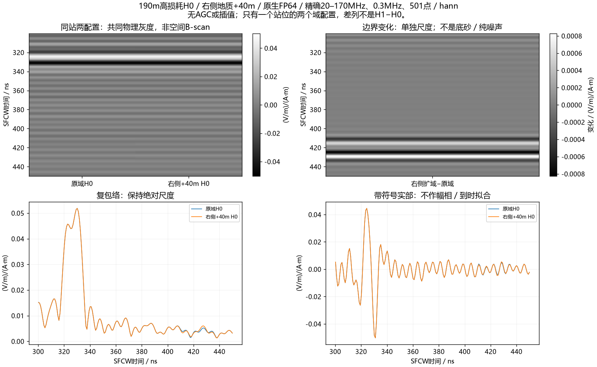
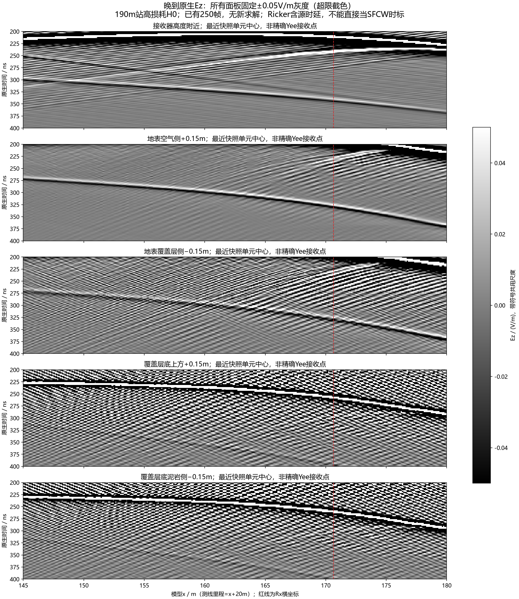

# 190m高损耗H0右侧+40m：主峰保留，部分原生回波受边界影响

右侧扩域一次完成，用时260.032秒。**20–170MHz SFCW的约330ns强峰没有消失：300–450ns复波形变化1.62–1.65%，原峰幅度仅下降0.010–0.038%。** 结合此前顶部+20m约0.20–0.22%的变化，目前不支持这两个边界主导本站目标强峰的解释。与此同时，原生宽频Ricker在约270–285ns出现明显变化，不能写成“边界没有影响”。这是190m高损耗H0单站对照，整线和实测等效问题仍未解决。

[Blackman对照](../../artifacts/research_checks/2026-10-09_high_h0_right40_results_r1/right40_blackman_return_gray.png) · [原生波形与复频谱](../../artifacts/research_checks/2026-10-09_high_h0_right40_results_r1/native_and_frequency.png) · [真实扩域示意](../../artifacts/research_checks/2026-10-09_high_h0_right40_results_r1/right40_geometry.png)。这两列为同一站位的两个配置，不是空间测线。新H0−旧H0是扩域变化分量，不是底砂差场或纯噪声。

## 结果与解释

使用501个精确频点（20–170MHz、步长0.3MHz），保留复相位、实际源谱与Yee时间偏置，参考电流矩0.025m，Hann/Blackman均值归一。没有AGC、幅相拟合或峰对齐。两组激励样本逐位一致。

|既定SFCW对照量|Hann|Blackman|
|---|---:|---:|
|300–450ns复波形相对L2变化|1.621795%|1.652233%|
|原域／右扩主峰|330.173／330.173ns|328.510／328.510ns|
|原峰坐标处幅度变化|−0.037688%|−0.010272%|
|原峰坐标处复相位变化|−0.006877°|+0.008093°|
|既有345.618–369.618ns窗中H0变化|0.123990%|0.106940%|
|450–1100ns晚窗复波形变化|0.262712%|0.494909%|

数值由主分析、独立直接DFT/逆求和以及固定原峰诊断脚本生成。百分比不是边界能量占比；0.832ns峰采样间隔来自8倍补零，不是亚纳秒物理分辨率。H0已去掉底部连通砂岩，所谓“底砂窗”仅为既有比较坐标，不能把H0中的该窗回波解释为底砂。

原生250–450ns相对L2变化为**50.0509%**，最大差0.0430447V/m，主要集中于约270–285ns；约340ns波包仍重合。前120ns逐位一致，原生450–1100ns变化约0.3871%。原生宽频波形与源谱归一的20–170MHz结果是不同域和时标，不能混用50%与1.6%的数字。尚未分解变化波包的具体频率与路径，不凭带限主峰稳定否定宽频边界作用。

此前[顶部扩域对照](2026-10-09_high_h0_top20_boundary_result.md)与本次右扩均保留了关注主峰。下一步应检验非局部覆盖层/地表候选，不能继续把所有条纹统称为“侧边反弹”。左边、底边、有限三维和实测材料/天线仍未由这两个高损耗单站对照认证。

## 已有快照的CPU补充观察

另外复用[单站双视野快照](2026-10-09_single_station_dual_roi_wavefield.md)，没有新增求解。远端逐文件重新核验250帧局部Ez哈希，在接收器高度、地表两侧、覆盖层底两侧提取五条时空取样线；本机重新读取已有14帧原生H5，派生样本逐位一致。其余236帧依赖远端哈希核验，不声称全部在本机重读。

[完整原生时窗共同对数灰度](../../artifacts/research_checks/2026-10-09_wavefield_probes_r1/native_log.png) · [实际取样线](../../artifacts/research_checks/2026-10-09_wavefield_probes_r1/probe_geometry.png)。图为单次源激发在不同x位置的快照时空观察，不是移动天线的B-scan。晚到波包在接收器左侧附近可见，支持继续检验非局部传播；总场Ez叠加不能认证反射次数或唯一来源。

快照按0.1m单元中心取样，目标y附近最近中心误差≤0.05m，接收器高度探针实际y39.05m而原Yee Rx为39.025m。没有插值、逐帧归一或E/H功率计算。时间间隔约2.005ns：对高于约249MHz的原生分量可能存在时间混叠，不能由细条纹反推路径或速度。图中的斜率还是波前与取样线的交点轨迹，不能直接当材料波速。Ricker包含源时延，不能直接把原生340ns标成SFCW330ns。

## 输入、执行和验收

- 新域250×42.5m、10000×1700×1；原210×42.5m、8400×1700×1内部逐位不变。新增1600列、2,720,000体素按原右边缘列延续。因此实验包含新增外部地质的影响，不能称为纯PML反射系数测量。
- 原地表、材料文件、Tx(169.35,38.95)m、Rx(170.65,39.025)m、网格0.025m、100MHz Ricker/40A、1200ns和HORIPML80保持。右PML入口x208→248m，Rx净距37.35→77.35m；顶部保持原位。
- ROG RTX4090 Laptop16GiB，gprMax4.0.1 CUDA原生float64，20352样本，dt5.896635841874211e−11s。监督器耗时260.032s，内部求解255.586s，全仿真258.8029s；owned峰RSS4,805,025,792字节，约4.475GiB，非VRAM峰。运行时外部显存观察5049MiB，不是全程峰值证书。
- 1/1科学attempt完成，0求解失败、0重试。原生metadata、shape、位置、dtype和源样本通过。独立501点DFT最大相对差约1.05e−13，直接逆求和复算既定窗和峰坐标通过；这认证处理算术，不认证FDTD收敛或现场真值。
- 六项CPU拒绝检查通过：改Tx、改材料、改原体素、错误边缘延续、未完成父批、额外案例。stderr为空，运行时/冻结源码未改；本机控制器和远端owned求解进程退出。

合同SHA：`0f17c9727d07e32bb07e49f09094961411de000c37153cd2ac0db4f870b939ae`；完成证书：`27e809ce8d94110ef285389abfd978f7873d2fd0d4f03c7aa161fb0da06c080d`；新native：`6d4fffa90cd5aaff1fe8a6aa082d0745f924746cac9ba974b7b2f6176dc0e2a1`。旧H0：`87075c0bbc8ea419b0d0d49047c0c59712ed8180c94cf0885030e2b39caff331`。

第一次本机分析误用了默认Python，缺少V4的`gprMax.toolboxes`，在创建结果前失败；随后使用已冻结4.0.1环境完成分析，没有重跑正演或改环境。快照图的单位字体缺字在入库前改为V/m；旧未发布图另存忽略目录，数据不变。

## 接续设计

保持190m高损耗H0原域，拟先做两个单A-scan控制：（1）原泥岩ID2全部替换为同覆盖层ID1，移除覆盖层底介电对比；（2）将覆盖层底整体下移0.5m，仅把每列泥岩顶部20个体素改成覆盖层。源、地表、空气、网格和处理链不变，每个新输入独立审核，再冻结最多两次且不重试。

第一个检验界面参与，不独自认证多次波；第二个检验路径长度响应，不能只挑接近预期的新峰就宣布反射次数。消融会改变传播和材料交互，底PML材料可能跟随替换，解释须核查相应到时。先分析完整复波包，再决定是否需要第二锚点验证；不恢复旧17项/四波场或补391道。**此处两个控制为接续方案，本报告交付时尚未执行；研究目标保持未完成。**

## 交付

右扩六张中文图、日志、合同/完成证书、输入/数值/峰点/交付审核位于`artifacts/research_checks/2026-10-09_high_h0_right40_results_r1/`；启动证据位于`artifacts/research_checks/2026-10-09_high_h0_right40_launch_r1/`。三个快照取样图与审计位于`artifacts/research_checks/2026-10-09_wavefield_probes_r1/`。

模型、native、复谱H5和探针NPZ留忽略的本机`artifacts/local_checks/2026-10-09_high_h0_right40_*`、`2026-10-09_wavefield_probes_r1/`及ROG独立目录`E:\line9_basal_pair_20261008_r1\v401_high_h0_right40_r1`。公共克隆不含私有原始模型/native，不能声称完整正演可在纯克隆复现。
