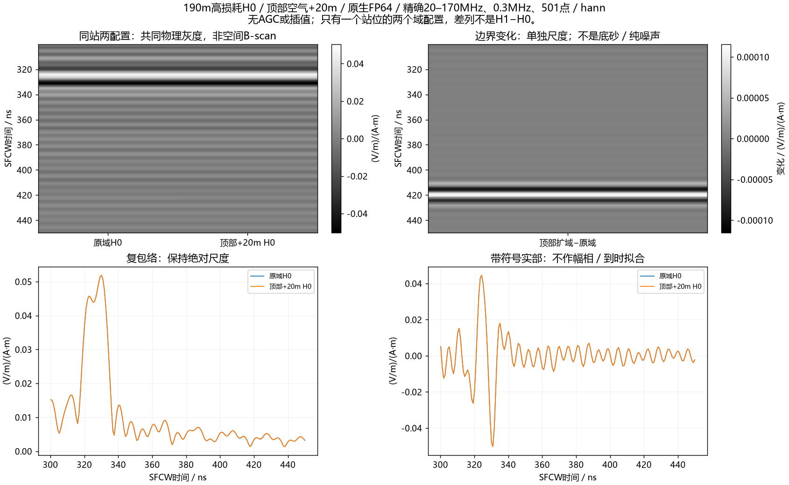

# 190m高损耗H0顶部+20m：强返回保留，顶部主导解释受削弱

用户在单站波场验收后明确“做吧”，本单元只新增190m高损耗H0一次A-scan求解，顶部空气域从42.5m扩到62.5m；材料、原内部体素、源、收发坐标、网格、PML厚度／形式、时窗及精度保持不变。**一次完成，约330ns的SFCW强返回没有消失或移峰，300–450ns复波形只变化约0.20–0.22%。本结果不支持顶部PML主导该站该频带强峰的解释，但不是所有边界的收敛认证。** 没有追加快照、H1、右侧控制、第二站或整线续跑。



[Blackman共同灰度](../../artifacts/research_checks/2026-10-09_high_h0_top20_results_r1/top20_blackman_return_gray.png) · [原生接收／复频谱](../../artifacts/research_checks/2026-10-09_high_h0_top20_results_r1/native_and_frequency.png) · [顶部扩域二维模型](../../artifacts/research_checks/2026-10-09_high_h0_top20_results_r1/top20_geometry.png)。图中两列是同一站位的两个域配置，不是空间B-scan；变化列为新H0−旧H0，不是H1−H0底砂差场或纯噪声。

## 实际结果与解释范围

数值由入库分析／独立直接DFT、逆求和和峰点诊断脚本生成，未作幅相、到时拟合、AGC或逐图归一。20–170MHz、0.3MHz步长、501频点，实际复源谱／Yee时间偏置归一，参考电流矩尺度0.025m，分别采用均值归一Hann和Blackman。新旧激励历史逐位一致。

|SFCW对照量|Hann|Blackman|
|---|---:|---:|
|300–450ns复波形相对L2变化|0.197139%|0.218264%|
|原域／顶部扩域宽窗峰|330.173／330.173ns|328.510／328.510ns|
|原峰坐标处包络幅度变化|+0.001256%|−0.000102%|
|原峰坐标处复相位变化|−0.000517°|−0.000472°|
|既有345.618–369.618ns窄窗中H0变化|0.005275%|0.004619%|
|450–1100ns晚窗复波形变化|0.026739%|0.056981%|

这些百分比都是指定窗／峰的数值对照，不是边界能量占比或通用验收阈值。窄窗只是既有底砂比较窗中的H0响应，不表示H0含有底砂。峰坐标间隔0.83167ns来自8倍补零，不能从两峰坐标相同宣布亚纳秒物理精度。

原峰幅相另在`peak_diagnostic.json`记录：以原域宽窗峰为固定坐标，直接复数逆求和比较，不把新峰对齐或缩放回旧峰。它补充说明宽窗均值没有掩盖主峰变化，但没有引入新的物理门禁或奖励标签。

原生Ricker时间域250–450ns相对变化约**3.6405%**，450–1100ns约0.4580%；前120ns相对变化4.1613e−8，非逐位一致。原生差异图的最大变化约0.003177V/m、主要集中在约270–285ns，而原生约340ns主波包仍重合。**不能把原生宽频Ricker的3.64%和正式20–170MHz SFCW的0.20–0.22%混成同一个指标。** 带限、实际复源谱归一与时间参考不同；本批没有按频率／传播路径分配原生差异的成因，也没有由显示窗裁剪排除带限尾部泄漏。

顶部边界位置确实能影响部分返回，但对本次重点强峰的影响很小。这使上一波场的“非局部地表／覆盖层传播”候选更值得继续检验，仍不足以确定反射次数、唯一界面或排除右侧边界的间接参与。[前次全域／局部快照与限制](2026-10-09_single_station_dual_roi_wavefield.md)保持原结论，不因这一次控制改称已认证多次波或已解决实测等效问题。

全复频谱相对变化约9.1517e−7，但其范数被早期强直耦主导，不能代替弱晚到窗的比较。原域／扩域H0仍使用假设材料、二维理想偶极及当前网格；本批既不校准现场材料，也不等价于真实天线／仪器验证。

## 输入、执行与独立验收

新模型8400×2500×1，原8400×1700×1内部数组逐元素一致；上加800行、6,720,000个空气体素，所有非data数据集、材料文件和坐标基准保持。输入卡只改变`#domain`一行，源／接收行包括名称保持原样，没有任何新`#snapshot`。官方输入解析及独立体素／材料／卡核查通过。H0仍只有空气、粉质黏土覆盖层、泥岩，底部连通砂岩已移除。

|执行量|实际证据|
|---|---|
|设备／运行时|ROG RTX4090 Laptop16GiB，gprMax4.0.1 CUDA原生FP64|
|原域／新域|210×42.5／210×62.5m；dl0.025m；TMz／Ez|
|Tx／Rx|模型(169.35,38.95)／(170.65,39.025)m，约8m AGL；无坐标平移|
|源／时窗|100MHz Ricker、40A、1200ns、20352样本，dt5.896635841874211e−11s|
|边界|HORIPML80保持；顶部PML入口由y40.5移至60.5m，接收器净距约1.475→21.475m|
|监督器单attempt耗时|313.297s，即5分13.3秒；求解器内部solve308.264s，整个仿真312.390s|
|owned峰RSS|5,846,573,056字节，约5.45GiB；不是VRAM峰|
|显存外部观察|运行时5955MiB，约5.82GiB；非全程峰值证书|
|额度与退出|1/1完成，0求解失败、0重试；本地SSH监督器退出，远端owned进程为0|

新冻结合同`213d8f77d48267feff111cfc9e238899e478673853623a1dbf2e25ece2e2f63e`。完成证书`6f9225e5707ac69fb78831818b3d59a9332bb049795c8b42bfb427f2d2a3e068`。新native为`efb5e4929a23489a47f7249f1340697e2a279a33d1299a5954b897d96203526f`；复用旧H0为`87075c0bbc8ea419b0d0d49047c0c59712ed8180c94cf0885030e2b39caff331`。

旧单站观察已完整结束且源／接收不受观察器影响，是新对照的依赖；不调用旧17项或四波场流水线。冻结前核对前批owned退出、原源码／扩展／模板身份与上一站一致、GPU／RAM和保守显存预算；沿用共享GPU锁、600s租约、USER_STOP、1800s单组／2100s批上限和no_retry。

六项无求解拒绝检查通过：改Tx、改材料、改原内部体素、上加区域不是空气、父批未结束、额外案例。该检查不含新的求解或训练。两端原生metadata、shape、dt、20352样本、源／接收位置和原始float64通过；新旧源与时间偏置一致。

本机独立DFT最大相对差约1.0499e−13，独立直接逆求和复算全部既定窗的变化及峰坐标通过；这是算术一致性，不是FDTD误差预算。求解器仍明确有损色散介质无法提供原生相位误差估计，不能据此签认网格收敛。新求解stderr为空，无科学失败。部署阶段SSH捕获的非UTF8诊断字节触发本机解码线程提示；远端退出0、冻结合同已取回核验，采集器随后改为保存原始字节并显式解码，没有重跑冻结／科学attempt或修改运行时。

## 下一步

建议剩余的一项边界对照采用**同190m高损耗H0，复用原210×42.5m基准，只向右增加40m**，原坐标、源、网格、材料、时窗和FP64不变；先只收A-scan。顶部沿用原高度，避免把两项边界变化混合。新增外部地质须明确沿边缘列延续并核对原内部逐位一致，这属于有限扩域敏感性，不能把改变外部地质的结果单独命名为纯PML反射系数。

若该站右扩后强峰也基本保留，则后续优先设计能区分覆盖层内往返与非局部散射的控制；若变化明显，先检查影响时段／方向和新增地质终止，不跳到“所有强条纹都是侧边回波”。再以187.5m针对性复核跨站解释，按新证据规划，不补全17项或391道。

**右侧控制仍只是建议，未准备／冻结／运行。** 当前单站顶部任务完成，原停止状态仍保留，整线／有限三维／现场等效／强条纹唯一路径研究目标没有宣称完成。

## 交付与复现

图与结果位于`artifacts/research_checks/2026-10-09_high_h0_top20_results_r1/`，包含六张中文图、原始日志、合同／完成证书、主分析、独立审核、峰幅相诊断和交付哈希；启动与六项拒绝检查位于`artifacts/research_checks/2026-10-09_high_h0_top20_launch_r1/`。

新native、旧native／原模型包、派生复谱H5保留忽略的本机`artifacts/local_checks/2026-10-09_high_h0_top20_*`及ROG `E:\line9_basal_pair_20261008_r1\v401_high_h0_top20_r1`，不入Git。入库脚本为`line9_high_h0_top20.py`、`audit_line9_high_h0_top20_inputs.py`、`check_line9_high_h0_top20_inputs.py`、`analyze_line9_high_h0_top20.py`、`audit_line9_high_h0_top20_results.py`、`diagnose_line9_top20_peak.py`。只复算、不重新求解的本机入口：

```powershell
& artifacts/local_checks/gprmax_v401_gpu_env/Scripts/python.exe scripts/analyze_line9_high_h0_top20.py --source artifacts/local_checks/2026-10-09_high_h0_top20_results_r1/source --package artifacts/local_checks/2026-10-09_high_h0_top20_package_r1 --out artifacts/local_checks/2026-10-09_high_h0_top20_recheck_NEW --numerical artifacts/local_checks/2026-10-09_high_h0_top20_recheck_NEW.h5
```

公共克隆只具合同、哈希、脚本与图件，不含私有原模型／native，不能伪称纯克隆可完整复现正演。
