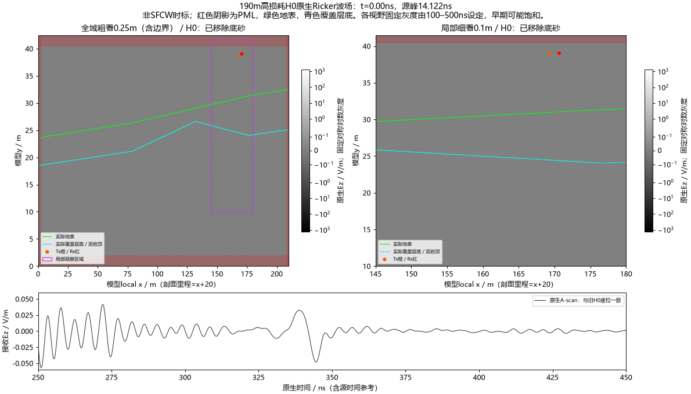
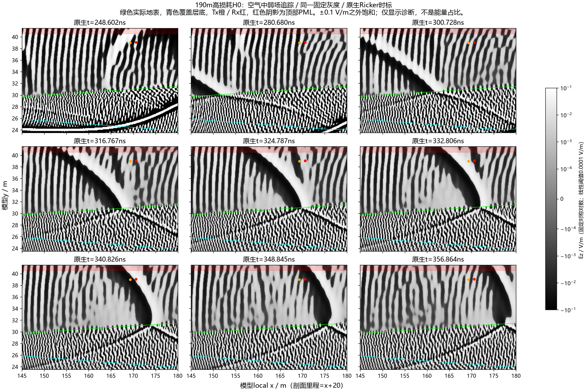
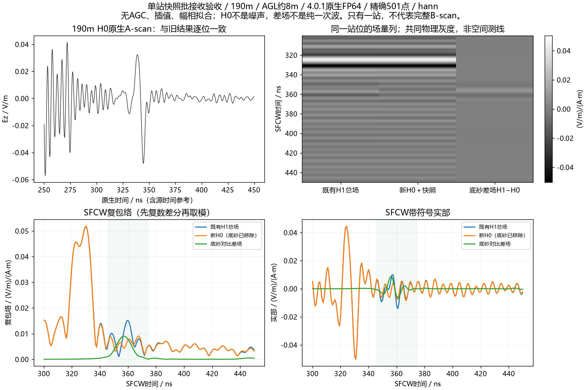

# 190m单站双视野波场：执行完成，传播归因仍需控制

用户在“只需要跑A-scan吗”后明确“做吧”，本单元仅新增190m高损耗H0一次求解，同时记录全域与局部快照。**一次完成，快照观察没有改变接收波形；已经看见晚到波包斜向接近接收器，但尚未认证唯一次数／路径或排除PML参与。** 原17项接续及旧四波场流水线保持停止，不补缺道、不重试中断attempt，没有新增消融、第二站或三维。

## 直接看图

下面都是本批真实输出。动画同步显示原生接收曲线与时间游标；红色阴影为PML，绿色为实际地表，青色为覆盖层底／泥岩顶。H0移除了底部连通砂岩，图中不存在底砂界面。







[Blackman同尺度图](../../artifacts/research_checks/2026-10-09_single_wavefield_results_r1/single_station_blackman.png)。三列灰度分别是同站不同场量，不是三站B-scan；新求解只有一站，完整空间测线图沿用[前批已完成部分验收](2026-10-09_user_stopped_partial_acceptance.md)，没有插值补齐。

## 此次观察实际增加了什么证据

1. 远端全部500份快照的六分量、原生float64、形状、有限值、时刻、原点／采样及哈希通过审核；另外取回其中20份，在本机独立读取全部六分量复核通过。这不等于把全部约3GB原场下载到本机重读。
2. 新H0接收历史和源历史与旧190m高损耗H0逐位一致，整个原生H5的SHA-256也相同。本机按实际源参考／Yee时间偏置重新计算20–170MHz、0.3MHz步长的501点复响应，仍逐位一致。因而本批图形来自既有响应的观察，不能把快照采样变化当成原仿真改善。
3. 全域200–249ns图可见覆盖层附近返回支路、向深部透射以及向空气传播的波前；300–357ns弱场序列中，一组斜向波包从接收器左下方方向接近，原生约340ns经过Rx。这是帧间图像观察，支持非局部地表／覆盖层路径的候选解释，不是能量占比、精确射线、反射次数或某个界面唯一贡献的证书。
4. 强返回保留在无底砂的H0中。新旧相同的SFCW结果继续表明高损耗总场的最强晚到峰和底砂差场峰不是同一个事件。不能因强条带显眼就把它直接当作模型底砂界面。

|300–450ns宽窗峰／独立算术检查|Hann|Blackman|
|---|---:|---:|
|既有H1总场峰|330.173ns|328.510ns|
|新H0峰|330.173ns|328.510ns|
|H1−H0复差场峰|356.786ns|356.786ns|
|直接逆求和与补零FFT相对L2差|1.6811e−10|1.7838e−10|

表的数值来自`analysis.json`。源归一使用实际复源谱和0.025m参考电流矩，先作复差再取模，无AGC、逐帧归一、幅相拟合或空间插值。0.832ns仍是8倍补零后的峰坐标采样间隔，不是新增物理分辨率。H0包含地表、覆盖层、泥岩及相互作用，不能称为纯噪声；H1−H0也不是纯一次波。

**目前可以缩小原因范围，不能称“彻底解决”。** 此批没有改变材料、边界或几何，不能凭总场动画从叠加场中唯一分离覆盖层多次返回与边界参与。右侧及顶部PML都在全域观察范围内；观察到波进入PML，不等于量化回到Rx的贡献。既有低损耗／其他站位边界结果不能直接移植为本190m高损耗H0的签认。FDTD网格、材料假设、二维线源／真实天线以及现场导出链的限制也仍保留。

## 保持不变的模型与本批资源

|项目|实际配置／结果|
|---|---|
|位置、角色|剖面190m，高损耗H0；底部连通砂岩替换为泥岩|
|求解器|ROG上的gprMax4.0.1、CUDA原生FP64；源码／扩展／模板及运行脚本身份冻结|
|域／求解网格|210×42.5m，8400×1700×1，dl=0.025m，TMz／Ez|
|源／接收|100MHz Ricker，40A；Tx(169.35,38.95)，Rx(170.65,39.025)m；约8m AGL，收发水平间距1.3m|
|材料|覆盖ε∞11、Δε0.5、τ6.4567ns、σ0.001；泥岩ε∞11.7395102493、Δε6.2003682478、τ8ns、σ0.003 S/m；保留原诊断假设|
|时窗／步长|1200ns、20352样本，dt=5.896635841874211e−11s|
|边界／平均|HORIPML80，原dispersive averaging设置保持|
|单attempt监督时间|232.781s，即3分52.8秒；求解器日志内部solve为218.725s，整个仿真为231.472s|
|owned进程峰RSS|10,438,557,696字节，约9.72GiB；不是VRAM峰|
|VRAM|运行期间外部观察约4.45GiB；不是带全程采样证书的峰值|
|新增求解额度|1/1完成，0失败、0重试；远端该单元owned Python检查为0|

求解器日志明确提示有损色散介质不提供原生数值相位误差估计。不能从完成或float64签认网格收敛。stderr只有CUDA编译成功附带`kernel.cu`提示，无求解错误；原始stdout／stderr保留在忽略的本机目录，并在交付审核中记录哈希。

快照为两个同时观察区域，250帧／区域、0–499.21ns左右，步号0,34,…,8466，间隔约2.005ns：

- 全域x0–210、y0–42.5m，观察采样0.25m，数组840×170×1。
- 局部x145–180、y10–41.5m，观察采样0.1m，数组350×315×1。

两个区域共500份、六场量数组3,036,600,000字节，原生GPU→主机流式保存；粗观察采样没有改变2.5cm求解网格。电场时标nΔt、磁场(n−0.5)Δt；本单元没有计算Poynting通量／能量比例。

GIF采用每隔一份观察记录显示，125帧、约4.01ns帧间隔，文件14,502,772字节。全域和局部各自固定对称对数灰度，从100–500ns显示帧的峰值设定，线性阈值为其1e−4；早期场可能饱和，两个视野灰度限不同，不能用亮度比较能量。弱场九宫格另用所有面板相同的±0.1 V/m及0.0001 V/m线性阈值，强场饱和，属于事后显示诊断。r1弱图截到y27m、覆盖层底多在窗外；r2只扩显示下界到23.5m使实际界面可见，旧图／旧审核保留，没有重算FDTD。

原生Ricker源峰为14.122ns；动画原生时标与源归一后SFCW时标不同，约340ns原生波包不能机械等同于330ns快照，亦不以减一个固定源峰认证所有到时。

## 新依赖与执行门禁

新增`line9_single_wavefield.py`仅接入“前批已终止＋相关190m原生与完整SFCW已审核”的部分批依赖。明确验原28项批末尾`SESSION_LEASE_EXPIRED`、接续末尾`USER_CANCEL_REQUESTED`、37新完成收据及相关锚点哈希；未把39份有效数据伪称完整46项，也未使用要求完整45／46证书的旧波场runner。

本机六项无求解拒绝检查通过：未终止父批、未绑定分析、改变旧native、重复完成收据、改变物理输入、改变观察采样。首份临时测试夹具事件顺序构造有误已修正后复测通过，仅测试夹具修正，没有失败科学attempt或旧合同改写。

新卡除追加500条`#snapshot`外逐行保持旧卡，geometry／materials按原合同哈希核对，官方解析器通过。远端冻结前检查旧owned求解退出、RAM至少24GiB、空闲VRAM至少9GiB、磁盘至少原数组＋2GiB；实际冻结空闲RAM约48GiB、VRAM约14.9GiB。沿用独占GPU锁、600s心跳／USER_STOP、1800s单组与2100s批上限、no_retry。监督器和求解进程已退出；此次完成仅解除单站观察任务，不恢复旧自动接续。

## 下一步如何选择

建议下一项优先**同190m、高损耗H0，只把顶部空气域增加20m**，保持原内部体素、材料、原网格、收发／源、原生精度及SFCW链，先只收A-scan。它回答这组返回对顶部边界位置是否敏感；不能复用220m低损耗或198.6m其他损耗控制来代答。本批200ns附近已有向顶部传播的分支，顶部比笼统重新跑全线更适合先检查。

先独立核查新输入与坐标不变，再冻结一次attempt和目标机资源；比较原生返回时段与复SFCW共同窗，保持源参考及物理共同尺度。若变化明显，再由全域方向选右侧边界或覆盖层路径控制，最多再一项；若顶部变化很小，仍不能只凭一项宣布所有PML无影响，后续应在剩余额度中选右侧控制或更有针对性的覆盖层对照。消融新造区域竖边／层底会引入散射，须单列限制。传播候选得到控制支持后再考虑187.5m一次针对性复核，而不是先补17项／391道。

**以上后续只规划，未准备／冻结／启动求解。** 本单元交付为1次观察任务和验收，材料未改为现场定值、强条纹唯一路径未认证、整线／三维／实测等效未完成。

## 文件与复现

- 公共结果：`artifacts/research_checks/2026-10-09_single_wavefield_results_r1/`，含GIF、11帧全域／局部静态图、两窗SFCW同站灰度／曲线、弱场r1/r2、合同、500哈希完成证书、独立分析及20原快照本机复核、交付哈希。
- 启动／拒绝检查：`artifacts/research_checks/2026-10-09_single_wavefield_launch_r1/`。冻结执行合同SHA-256为`73b285960717fc6eee66bde92da97e22b211610ff3afcdcdfbf942fd5dea821b`；完成证书为`346b85a7ba64d9e1731d0bd513cfdffd6ba3c10ccdff0b98a5b907be506663e9`。
- 新旧H0 native共同SHA-256为`87075c0bbc8ea419b0d0d49047c0c59712ed8180c94cf0885030e2b39caff331`。原始快照仍在ROG `E:\line9_basal_pair_20261008_r1\v401_single_wavefield_r1\package\observer_H0\cases\observer_H0\profile_snaps`，未上传Git；本机native／所选原快照／下载ZIP位于`artifacts/local_checks/2026-10-09_single_wavefield_results_r1/`。
- `render_line9_single_wavefield.py`读取完成证书渲染；`analyze_line9_single_wavefield.py`调用独立native_response重新DFT及直接逆求和；`inspect_line9_single_wavefield_samples.py`只读20份选中快照作本机六场量复核并渲染弱场r2。输出指定新的目录／版本，历史证书保持。

本机CPU复算命令（路径对应本单元私有缓存，不运行求解）：

```powershell
& artifacts/local_checks/gprmax_v401_gpu_env/Scripts/python.exe scripts/analyze_line9_single_wavefield.py --source artifacts/local_checks/2026-10-09_single_wavefield_results_r1/source --baseline artifacts/local_checks/2026-10-09_v401_user_stop_results_r1/source --previous artifacts/research_checks/2026-10-09_v401_dense_loss_user_stop_r2 --out artifacts/local_checks/2026-10-09_single_wavefield_cpu_recheck_NEW
```

公共克隆只具可审计合同／哈希和图件，不含私有约3GB快照或模型资料，不能伪称纯克隆可复现完整正演。
