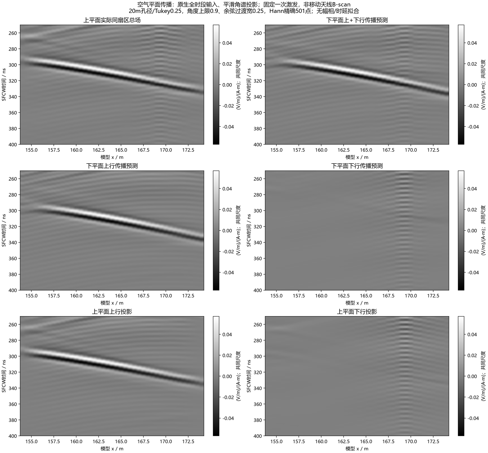
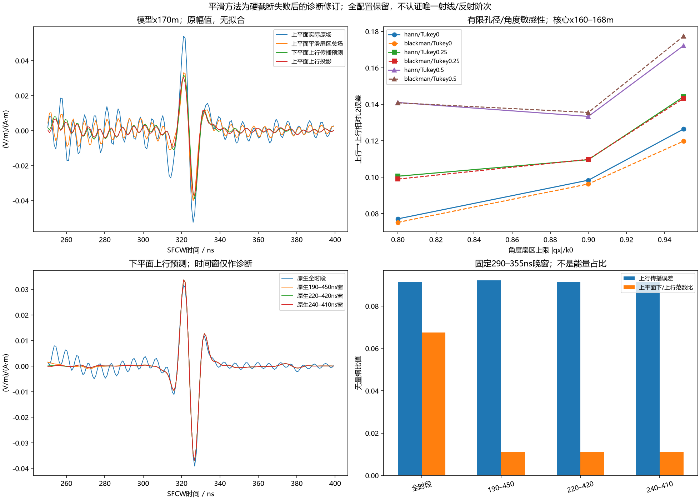

# 空气中的晚波向上传播得到闭合支持；覆盖层内仍需分波

2026-10-10，继续自主研究。复用190m高损耗H0的原生全时序观察，没有新增gprMax求解、远端任务或训练。原正式SFCW、材料和旧停止测线不变。

**本轮把晚波的空气传播段检验得更直接。** 从y=34.025m空气观测线的上行分量出发，不拟合振幅、相位或时延，按空气波动方程传播4m，在主配置的290–355ns晚窗与y=38.025m的上行投影复相关为0.99669/0.99666，场幅相对L2误差约9.12%/9.36%（Hann/Blackman）。支持该晚波主要通过向上的空气传播到达近接收高度。有限20m观测孔径仍有约束，不能将其升级为唯一地表出射点、覆盖层反射次数、完整空间能量或现场认证。

两张图的仓库相对路径分别为`artifacts/research_checks/2026-10-10_air_smooth_closure_r3/smooth_air_plane_gray.png`、`artifacts/research_checks/2026-10-10_air_smooth_closure_r3/smooth_air_plane_sensitivity.png`。它们是同一次激发的空气平面时空诊断，**不是移动天线B-scan**；灰度图六面板共用物理幅度尺度，中文标明实际投影、传播预测、上/下行及处理条件。正式单站SFCW灰度仍见[原观察批次](2026-10-10_native_probe_observer_results.md)。

## 为什么同列峰值不能直接串成唯一射线

对41列既有原生探针做全量事后探索，晚期上行Sy极值窗固定为：覆盖层下部220–290ns、中部250–315ns、上部275–340ns、地表空气280–350ns；每个极值附近±4ns积分Sx/Sy，保留所有方向及窗边极值。

模型x160m的候选依次约237.811、269.299、296.601、299.726ns。中部→上部相差27.301ns，和此前垂直群速近似相容；但下部极值附近净Sy仍向下，上部/中部总场方向分别约138.83°/143.82°，空气方向却约41.78°。这表明局部总场峰受相向波/尾部叠加影响，不能靠时间先后把所有峰叫作同一射线。

全部41列的四层±4ns窗口，正净Sy分别为0/37/40/38列；上部正净Sx只有10列，空气正净Sx为41列。尤其下部存在正瞬时Sy峰却41个窗口全为负净Sy，明确保留这种反例。数据没有支持“每列极值都是独立上行脉冲”。本轮没有把负窗口改成零，也没有改变此前地表首次再次反射的已核验时序。

## 空气平面分波和传播模型

两条已有空气观测线x154–174m、每0.5m一点，共41列。原几何逐体素验证：两条线及其间的本观测区均为自由空间，源y=38.95m在上平面上方，所比较的中间空气层没有源。沿用原生Yee邻点/半步同位，不改变接收或源数据。

对时间和横向空间谱，取exp(+iωt)约定；保留传播扇区，`ky=sqrt(k0²−qx²)>0`。TE分量满足上行`Hx=ky Ez/(ωμ0)`、下行符号相反。因此

`E_up=(E+ωμ0 Hx/ky)/2`，`E_down=(E−ωμ0 Hx/ky)/2`；

向上比较Δy=4m时，分别乘`exp(−i ky Δy)`和`exp(+i ky Δy)`。这是同一空气传播方程的诊断投影，不是将二维波形乘经验衰减，也没有拟合位移或反射阶次。

20m孔径外的数据不存在，不能当完整无限平面。主配置为Tukey0.25空间窗、512点空间补零、传播扇区上限|qx|/k0=0.9、余弦过渡宽0.25：比值≤0.65保持，0.65–0.9平滑降为零。掠射/消逝及孔径外贡献被排除；不是原场全分量分解。ky=0附近不加任意eps，直接排除不满足扇区条件的模式。

频率仍取精确20–170MHz/0.3MHz/501点，沿原源/共同0.025m尺度归一，保持原生相位；Hann/Blackman复逆变换。这里新增的角谱投影仅用于研究，未替换正式B-scan处理链。主配置原场与扇区场在晚窗仍有27.5%–32.2%的相对差，不能把该投影当全部实际场或无损滤波。

## 主结果和敏感性

|输入/频窗|290–355ns上行→上行相对L2误差|复相关幅度|上平面下/上行范数比|
|---|---:|---:|---:|
|原生全时段，Hann|0.091200|0.996688|0.06747|
|原生全时段，Blackman|0.093616|0.996660|0.02972|
|原生190–450ns诊断窗，Hann|0.092138|0.996607|0.01106|
|原生220–420ns诊断窗，Hann|0.091464|0.996675|0.01106|
|原生240–410ns诊断窗，Hann|0.091462|0.996675|0.01106|

下/上行量为复场幅范数比，不是反射能量占比；窗口改变会移除早期场的带限尾部，不能将其当因果独立脉冲的精确能量切割。三个诊断窗均用明确Tukey0.25时间窗；主结果保留原生全时段，没有依赖先清掉早期场才得到上行传播相容性。

54项全时段敏感性（3空间补零×3孔径窗×3角度上限×2频窗，过渡宽0.25）在同一晚窗/核心x160–168m的上行传播误差为6.17%–19.57%，复相关0.98483–0.99936。所有配置入库，未挑最优替换主配置。主空间补零512→1024，Hann误差0.0911997→0.0911986、Blackman0.0936161→0.0936151；256点仍约14%误差。补零只细化横向波数采样，不增加实际孔径。

宽窗250–400ns主误差约11%，原生时间窗及过渡宽0.1/0.4另存全部结果。约9%不是FDTD误差预算或全空间收敛证书，仍包括孔径截断、角度投影、源归一尾部与离散场影响。

## 必须保留的失败结果

第一版硬角度截断R1不支持传播认证：其主配置在250–400ns窗的投影相对原场变化为60.16/67.77倍，输出的下/上行预测范数比约3.13/3.01。不能把这些量叫强下行反弹。独立重新计算时，仅对原生晚段加明确窗口，同一硬截断相对原场变化降至约0.31–0.32，下/上行预测比约0.033–0.036。这显示全时段强早期场与硬空间/频率投影共同带来的晚窗尾部污染，不是原仿真/正式SFCW已经发生的这个处理错误。

平滑过渡是观察到硬截断失败后的方法修订，不能声称为事前冻结的物理门禁；新R3在计算前冻结全部配置，并保留失败R1。R1图仅展示失败诊断的输出，未作为原地层或上下行证据。所有对应数字、解释和源哈希保留。

R2另在CPU保存阶段因私有输出目录缺失失败，未产生分析图或新求解attempt；原契约/错误记录保留，旧脚本存忽略目录。创建输出父目录后另起新R3 CPU分析，不覆盖R2，不重跑gprMax。

## 独立复算和下一项

16项硬投影、15项平滑投影已知周期平面波检查通过，覆盖两方向传播、相向叠加、幅相/扇区边缘及异常拒绝；只认证数学实现。独审直接重读H5，四输入时间版本、两空气线、三个频率的656组场DFT最大相对差4.63e−15；164个层内晚期极值/方向窗口重读最大差3.06e−16。

独审以显式41→512空间矩阵求和、独立余弦窗和直接复逆求和替代FFT/IFFT，复算主配置四输入×两频窗的8份完整比较窗轮廓，相对差≤6.69e−11；16组主窗指标最大尺度化差1.24e−12。源码/原生/派生哈希和空气无源支撑均核对。处理差不是物理传播误差。

新脚本入口：`line9_air_angular_transport.py`、`check_line9_air_angular_transport.py`、`analyze_line9_air_plane_closure.py`；平滑跟进为`line9_air_smooth_transport.py`、`check_line9_air_smooth_transport.py`、`analyze_line9_air_smooth_closure.py`；独审为`audit_line9_air_plane_closure.py`，均在`scripts/`。公共R1/R2失败/R3见同日期`artifacts/research_checks/`目录。私有原生不变，新复谱/轮廓在`artifacts/local_checks/2026-10-10_air_plane_closure_r1/`及`2026-10-10_air_smooth_closure_r3/`，不上传。

下一项已有具体且经几何检查的方案：在原观察模型内增加y=27.025/28.525/30.025m三条平行覆盖层观测线，每条41点，共123逻辑点、369原始Rx；所有三点同位邻域均在覆盖层，保留原287逻辑点及主Rx。合计1231原始Rx，GPU接收历史下界约1.12GiB，新增保存场下界约100MB；这不是总显存预算。用完整复泥岩/覆盖层谱核查覆盖层内上/下行传播，而不凭曲线强行数阶次。

方案由`scripts/plan_line9_cover_plane_observer.py`生成，见R3的`next_cover_plane_proposal.json`。**只是经几何核验的提案，输入卡/新执行契约尚未准备、冻结或运行。** 下一单次求解前仍需独立输入/负例、运行时源码及设备容量、owned进程和停止/心跳核查；一次新attempt，不恢复旧测线。完成后应核对原源、主Rx和全部既有观察场逐位不变，交付中文可视化。实际有限三维、真实天线/仪器和现场损耗缺口保持，研究目标active。
