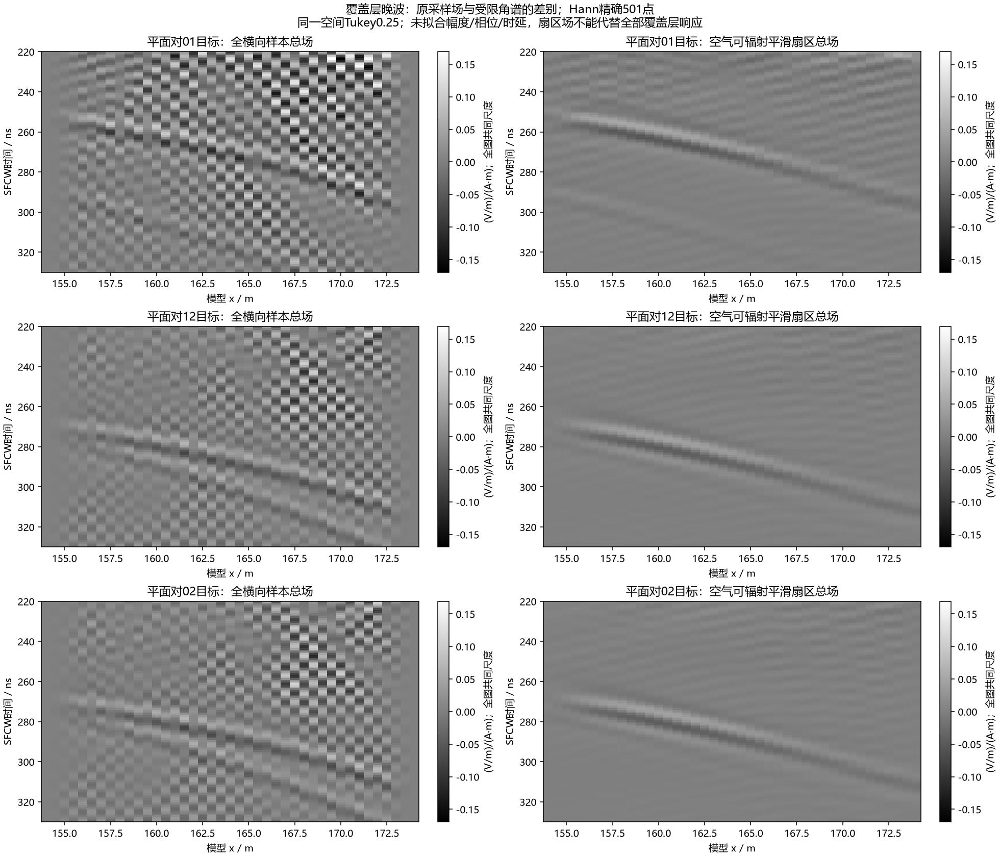

# 覆盖层三平面观察：晚波分波尚未闭合，观测采样存在限制

2026-10-10。在用户“持续推进直到研究明白”的授权下，完成一次新冻结的190m高损耗H0观察。gprMax4.0.1原生FP64，227.063s，无求解重试；模型、材料、网格、源、主Rx及287个既有逻辑观察点保持。新增三条水平覆盖层线，123个逻辑点/369个原始Rx，合计410逻辑点/1231原始Rx。新旧源及1436个原有场通道逐字节一致，主Rx完整501频点SFCW复响应也逐位一致。

**新结果没有证明完整晚回波沿某条唯一的层内路径往返。** 受限分波中早期下行传播较好吻合，但晚期上行传播误差明显较大；采用空气可辐射角度范围后，覆盖层晚窗复场变化超过90%。该分波只能描述受限分量，不能代替全部覆盖层响应。0.5m是本次观测点间距，求解网格仍为0.025m；需要先改善观察采样，不据此宣称FDTD网格导致原B-scan异常。

## 图件与输入

每行是一对平面的目标端；左列保留所有已采样横向分量，右列保留平滑空气可辐射扇区，两列使用同一空间Tukey窗及全图共同幅度尺度。精确20–170MHz、0.3MHz、含端点501频点，Hann固定窗，没有幅度/相位/时延拟合。**这是固定一次激发的观测图，不是移动天线测线B-scan。**

五张中文图随本批入库：

- `artifacts/research_checks/2026-10-10_cover_plane_closure_r1/native_three_cover_planes.png`：原生40–400ns总Ez及Sy，各列共同物理尺度，保留强早波。
- `artifacts/research_checks/2026-10-10_cover_plane_closure_r1/native_cover_late_shared_scale.png`：原生220–350ns弱晚场，共同±0.75V/m及±0.005W/m²，各面板注明截色比例；没有增益。
- `artifacts/research_checks/2026-10-10_cover_plane_closure_r1/conditional_cover_split_gray.png`：27.025→30.025m，受限扇区实际/总预测/上行预测/下行预测/目标分波六图，共同色标。
- `artifacts/research_checks/2026-10-10_cover_plane_closure_r1/cover_pair_waveforms_and_invariant.png`：三对平面模型x164m原幅值波形及原H0/新增探针H0/零差的单站配置列。
- `artifacts/research_checks/2026-10-10_cover_plane_closure_r1/cover_sector_excludes_late_gray.png`：本报告首图，显示受限扇区不能代表全部已采样覆盖层晚场。

观察线为模型y=27.025/28.525/30.025m、x154–174m，每0.5m一列，41列/平面。新增点的三个锚点及3×3空间支撑均由原H5直接核验为覆盖层材料1，不接触界面/PML。原模型210×42.5m、0.025m网格、1200ns、20352原生样本、约8m离地收发保持。H0仍不含底部连通砂岩，不能称为噪声或clean。

源为原100MHz Ricker/40A离散z偶极。Ez/Hx/Hy继续采用空间四邻平均、原生相邻H时间步平均，与E同位同时，舍弃最后E样本，得到20351点。Sy=EzHx是总场能流估计，不是各独立波包的能量，也不是唯一反射阶次证书。

## 方法和数值结果

覆盖层实际冻结配方为ε∞=11、σ=0.001S/m、Δε=0.5、τ=6.4567ns、μr=1。以exp(+iωt)约定使用

`ε(f)=11+0.5/(1+iωτ)−iσ/(ωε0)`。

DC损耗仅计一次。此处是已有研究材料，不是新增现场电性标定。TM角谱分波采用`E±=(E±ωμHx/ky)/2`，`ky²=(ω/c)²ε−qx²`，取实部正、虚部非正的被动出射分支；上行向上传播乘`exp(−ikyΔy)`，下行外推乘`exp(+ikyΔy)`。没有按无损实介电常数丢弃材料损耗，也没有加入任意eps补丁或拟合参数。

为了与已核查空气方法对照，本轮主配置仍限定`|qx|/k_air<0.9`，余弦过渡宽0.25，空间Tukey0.25、补零512、核心x160–168m。三个平面对分别是0→1、1→2、0→2，距离1.5/1.5/3m。固定比较早窗50–220ns、晚窗220–330ns、宽窗50–400ns；细窗和此分波为观察后的探索，不是物理验收门槛。

下表由入库脚本从完整指标生成，原表见`primary_metrics.md`。“扇区对原采样复场变化”为两者差的相对L2范数，**不是被去掉的能量比例**；复相关高也不代表幅度误差小。

|平面对|窗函数|早窗下行误差|晚窗上行误差|晚窗上行复相关|扇区对原采样复场变化|
|---|---|---:|---:|---:|---:|
|[0, 1]|hann|1.65%|36.09%|0.940401|95.44%|
|[0, 1]|blackman|1.51%|20.80%|0.979065|97.02%|
|[1, 2]|hann|2.12%|34.94%|0.941636|92.20%|
|[1, 2]|blackman|1.51%|20.02%|0.980225|93.05%|
|[0, 2]|hann|4.10%|57.48%|0.859174|92.20%|
|[0, 2]|blackman|2.98%|31.31%|0.953090|93.05%|

早窗下行场很强，目标下/上行范数比约10–52；上行较弱，其误差约10–14%，不能把强下行闭合推广成所有弱分量认证。全部三对、27个空间/补零/扇区组合、Hann/Blackman共162个全时段配置完整保留；晚窗上行相对误差范围9.10%–78.83%，不能只展示较好的配置。

另做原生40–230、180–400、220–380ns三个Tukey0.25时间窗诊断，固定主配置/三平面对/两频窗，全数发布。晚窗上行误差对截取条件敏感；220–380ns时间窗某些结果改善，但不能将该窗认作无误差事件隔离或修改正式SFCW。早时间窗仍可在晚SFCW坐标产生有限带宽尾部，不能把投影后的每段弱纹理都认作独立晚事件。

所有原始总场、正式SFCW、受限分波与时间窗诊断分开保存。新数据没有推翻此前覆盖层界面对比/厚度移位及空气上行传播证据，但**晚期覆盖层完整模式传播仍未闭合**。

## 为什么接下来加密观测

已有0.5m横向采样的Nyquist波数为6.283185rad/m，而该覆盖层20–170MHz最大传播实波数为11.822833rad/m。空气中此间距的采样结论不能直接移到介电常数约11的覆盖层。受限空气扇区又主动丢弃较大横向波数。当前图中的棋盘状纹理可能含原场较快空间变化及其混叠，不能仅凭图把它定义为数值振荡、导波或PML反弹。

CPU已经核查下一最小提案：在相同三平面将观察间距补至0.125m，保留全部1231旧Rx，只增加360逻辑点/1080Rx，总770逻辑点/2311Rx。新点三锚及3×3支撑全部为同材料；新观测Nyquist波数25.132741rad/m高于当前频段覆盖层传播波数上限。**不改变0.025m求解网格、不插值已有场、不改地质界面、不降低频带。**

六通道GPU接收历史保守估计2,257,606,656字节；网格/模型、固定余量和接收历史合计10,402,690,304字节。此为估计，下一运行前仍须实时显存/RAM/磁盘、冻结源码与单次契约核验。方案仅为`DENSE_COVER_GEOMETRY_VERIFIED_PROPOSAL_NOT_PREPARED_FROZEN_OR_RUN`，没有启动第二次求解。

下一检验完整覆盖层传播扇区及其近掠射/倏逝限制，并将密观测明确抽取回0.5m，与保留旧点逐位比较，以区分采样混叠、有限孔径、界面外部散射和实际传播。源/主Rx以及旧2051场通道须不变；不能由加密观察自动宣称唯一路径或次数。旧整线和停止的尝试保持停止。

## 独立检查、执行和失败记录

- 两机各11个重新计算哈希的错误输入均被拒绝：改源、主Rx、旧Rx、几何、两个H邻点、空气中观察线、重名、SFCW步长、错时及重试设置。输入正例为1231Rx/三个均匀覆盖层平面。
- 15个独立写出的被动有损平面波解析例、空气极限及10个异常输入检查通过。这认证公式和方向/损耗符号，不认证非平地完整场。
- 本机独立重读369个新增同位场及1436个原场逐位不变；984个五频点场组、8组显式空间DFT/时间复求和轮廓、72个主配置窗口指标复算通过。显式轮廓每组47个时间点；这不是对所有敏感性配置的完整独立物理复现。
- 主Rx正式SFCW仍用完整501点；官方实现与独立DFT、两固定窗逆求和通过，新旧复响应逐位不变。输出哈希`a601791ce1cd85585d9f5cad24fd026ccdd03baa3e55cf1b0ff7f281cec3ac26`，336,857,499字节；原生保存为float64。
- 单次求解227.063s，峰owned RSS5,471,019,008字节。远端完成证书、所有原生哈希取回核验；SSH租约监督器结束exit0，完成后实时检查本批owned进程0。CUDA日志仅成功编译信息，没有求解错误。
- 首次冻结因Windows venv父启动器被误判为旧科学进程而拒绝，未建执行契约、未启动求解。修订只排除当前脚本/完整参数相同的祖先启动器，旧失败ZIP/代码哈希保留，改用新独立目录冻结；没有绕过其他科学进程检查或重试已消耗求解attempt。
- 补充绘图曾因NumPy高级索引形状不兼容停止，数据分析已完成且未受影响；失败脚本/第一张草图另存，修复后生成两张最终图，无重跑求解，记录在`failure_history.json`。

本单元支持受限扇区的部分层内传播，并识别了不足以支撑完整晚波归因的观察条件。没有进行训练、现场标定、实际起伏有限三维或真实天线/仪器建模，研究目标仍active。

## 复现与产物

准备/冻结/运行：`scripts/line9_cover_plane_observer.py`；输入正/负检查：`scripts/audit_line9_cover_plane_inputs.py`、`scripts/check_line9_cover_plane_inputs.py`；分析/独审：`scripts/analyze_line9_cover_planes.py`、`scripts/audit_line9_cover_planes.py`；公式/解析：`scripts/line9_cover_angular_transport.py`、`scripts/check_line9_cover_angular_transport.py`；补充图/下一提案：`scripts/plot_line9_cover_diagnostics.py`、`scripts/plan_line9_dense_cover_observer.py`。各入口`--help`给出参数。本机使用已验证的`artifacts/local_checks/gprmax_v401_gpu_env/Scripts/python.exe`。

公共输入清单、执行契约、完成证书、日志、全部配置数字、独立审计、解析控制、图和下一提案均在`artifacts/research_checks/2026-10-10_cover_plane_closure_r1/`。原生H5与数组留在忽略目录`artifacts/local_checks/2026-10-10_cover_plane_results_r1/`；没有将私钥、原始地质/实测资料或大数组提交Git。
