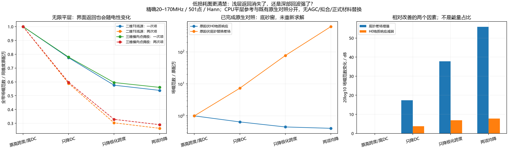

# 低损耗图更清楚：深层增强与浅层返回减弱分别有多大作用

2026-10-10，继续自主研究。复用已经完成的198.6m四配方原生对照及冻结材料JSON，只做CPU分析。新增gprMax求解、远端任务及训练均为0；正式材料和旧停止测线不变。

**低损耗并没有令H0地质响应消失。** 在原先固定的底砂窗，极化跨度和DC同时降低时，Hann H0幅值范数还保留40.81%，底砂替换差场却增强620.22倍。图中深层结构相对突出，主要来自深层回波增强。另一个作用是材料复谱同时改变界面反射，覆盖层重复返回也减弱；不能把所有变化都归为泥岩内传播吸收。

图的仓库相对路径：`artifacts/research_checks/2026-10-10_material_return_balance_r1/material_return_balance.png`。左面板为无限平层CPU参考，右两面板为已有实际起伏模型对照的范数复核，明确分开；不是新测线B-scan。真实灰度仍见[原四配方批次](2026-10-08_mudstone_polarization_dc_factorial.md)及[停止批次验收](2026-10-09_user_stopped_partial_acceptance.md)。

## 已有实际起伏对照的幅值收支

原站位198.6m、AGL约8m、覆盖层7.3m/泥岩7m，原四配方已于10月8日执行。两种极化跨度3/0.3均保持ε′95=12、τ8ns；DC分别0.003/0.0003S/m。改变跨度必然同时改变其他频率的实部和极化虚部，并非纯损耗开关。

本轮从已有501点复谱H5直接逆求和，分别复算H0和δ=H1−H0；保留原359.756487–383.756487ns底砂窗、300–450ns宽窗和Hann/Blackman。不选新窗、AGC、幅相/到时拟合。H0包含真实浅层地质响应及交互，δ仅为底连通砂岩替换的定义差场，均不叫全部实测clean或噪声。

|Hann底砂窗配方|H0范数 / 原H0|底砂δ范数 / 原δ|深层增强dB|H0减弱dB|
|---|---:|---:|---:|---:|
|原跨度3 / DC3mS/m|1|1|0|0|
|只降DC至0.3mS/m|0.6468|7.3448|17.320|3.784|
|只降跨度至0.3|0.4502|77.3468|37.769|6.932|
|两项均降低|0.4081|620.2159|55.851|7.784|

量为场幅范数，采用20log10，不是能量占比。相对可见性比值满足直接代数关系：

`(原H0/原δ)/(新H0/新δ) = (新δ/原δ)/(新H0/原H0)`。

两项均降时，Hann底砂窗该比改善1519.73倍，即63.635dB，其中55.851dB来自底砂差场增强、7.784dB来自H0减弱。此为同模型受控诊断的对数分解，不是仪器SNR或现场动态范围标定。也不把两个范数平方相加成实际总场能量，H1还含复干涉。

Blackman同窗H0仍保留约37.27%，δ增强628.31倍；较宽300–450ns窗Hann/Blackman H0仍保留约59.70%/45.01%，δ增强648.94/667.52倍。浅层分量并未清零，窄窗与宽窗必须分开解释。以上不是对全线强斜条纹逐道的消失认证。

## 材料改变也会改变浅层界面反射

继续[上一单元的二维/三维平层参考](2026-10-10_surface_returns_and_planar_3d_reference.md)，取本198.6m中点的实际局部层厚、收发高度总和16m及水平间距1.3m。无限空气/覆盖层/泥岩栈，只替换四份已经执行过的泥岩复谱；覆盖层、空气、砂岩JSON逐项保持。二维TE线源与三维横向水平点偶极分别比较自身原配方，不比较不同维度的绝对源强度或单位。

该栈的覆盖层一次项为`(1−r01²)r12 p`，两次项为`−(1−r01²)r01 r12² p²`，`p=exp(−2i ky_cover d_cover)`。传播段在覆盖层，泥岩在此项里通过复反射系数r12参与。因此泥岩损耗参数不仅影响穿越泥岩的深层波，也会改变未穿过整层泥岩的浅层返回。这里的明确分量只属于无限平层数学栈，不能直接给实际起伏总场贴反射次数标签。

95MHz覆盖层→泥岩正入射反射系数幅度：原配方0.038598；只降DC为0.029994；只降跨度为0.022583；两项均降为0.021216。虽然四组泥岩ε′95都是12，虚部不同，复反射也不同；20MHz实部的变化更明显。本轮未构造删除虚部的非因果求解材料。

精确501点/Hann加权全带场幅范数相对原配方：

|配方|二维一次项|二维两次项|三维一次项|三维两次项|
|---|---:|---:|---:|---:|
|原配方|1|1|1|1|
|只降DC|0.7750|0.5887|0.7793|0.5962|
|只降极化跨度|0.5758|0.3034|0.5951|0.3285|
|两项均降|0.5383|0.2636|0.5601|0.2897|

重复返回仍存在；材料变化在两个源维度下都减弱了它。平层项与实际起伏H0时间/组成不同，不能据约26%–29%宣称实际强斜条纹恰好减少同样比例，也不能据620倍反推低损耗为现场真值。

## 核验与接续

新的分析/独审入口：`scripts/analyze_line9_material_return_balance.py`、`scripts/audit_line9_material_return_balance.py`。私有四材料与准备清单逐字节匹配既有公开证据；全部四组501点复谱按独立实部/虚部表达复算，最大相对差3.98e−16。256/512阶Gauss比较最大6.78e−9；另用稳定几何级数和自适应积分对三频×四材料共12配置复算，最大分量差7.31e−9。16组原生范数收支用直接复求和复核，最大相对差5.18e−11；不将此当FDTD误差预算或现场验证。

公共契约/数值摘要/独审/图在`artifacts/research_checks/2026-10-10_material_return_balance_r1/`。私有新平层复谱为`artifacts/local_checks/2026-10-10_material_return_balance_r1/response.npz`，原生四配方复谱仍为`artifacts/local_checks/2026-10-08_v401_polarization_results_r1/sfcw.h5`。均未上传。当前gprMax4.0.1环境未改，无新依赖。

现在可以把“图为何不像深部模型”解释为一个有控制证据的组合：假设的泥岩复损耗显著压低深层，覆盖层相关重复返回/侧偏接收又占据总场。后处理链的已有独立核验、边界对照、原生地表再反射证据与本轮幅值收支相互支持；没有依据把全部现象归为单一PML反弹或UAV不可避免。

仍需研究实际晚波的侧偏分支，以及真实天线照射/接收方向性和仪器链如何改变相对强弱。本项目没有现场同状态复介电谱，不能靠好看的模拟冻结现场电性。下一可负担任务是用已有原生探针的窄时间窗核查侧偏晚波是否能闭合到地表出射、覆盖层内的时间序列，明确能观测和仍无法区分的分支；先不恢复整线、不启动未经二维裁域/网格保留核查的昂贵三维。目标active，不宣称彻底解决。
