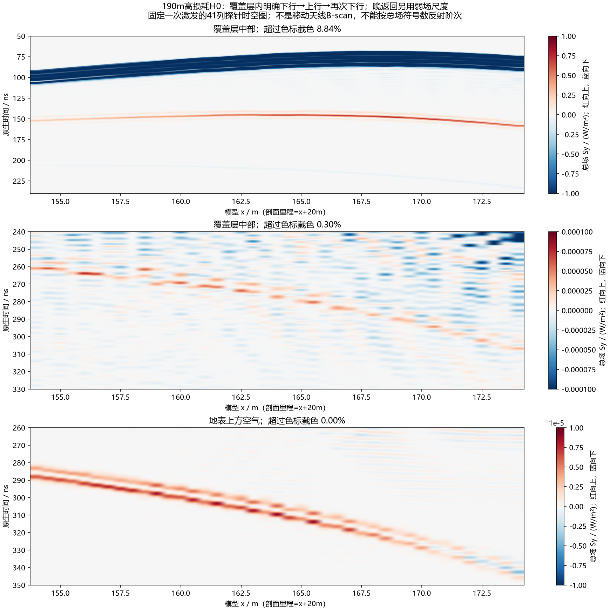

# 原生全时序探针：覆盖层内重复反射与非局部晚波

2026-10-10。用户“继续研究明白”授权下，新冻结并完成190m高损耗H0的一次观察任务。仅增加接收记录，未改原模型、材料、源、主Rx或原停止测线。gprMax4.0.1原生FP64，226.579s，无重试；原生源和主Rx逐位不变，精确501点SFCW复响应也逐位不变。

**本轮直接看到覆盖层中的下行、上行、再次下行，以及较弱的连续晚期上行条带。** 地表晚返回仅补几何空气传播时延，与主Rx原生300–370ns晚波的带符号余弦相关最高0.92567；模型x160–165m的11个相邻观察点均超过0.8。此阈值只是描述本轮平台，不是验收门禁或定位置信度。结合此前界面消融、厚度移位和扩域控制，当前受支持的解释是：覆盖层相关重复返回与侧偏接收参与了强晚条纹，高损耗深部响应偏弱。不能将该条纹等同于天线正下方基覆界面的形状；仍不认证唯一往返阶次、真实出射点、现场物性或三维/实测差距已经解决。

图的三行依次是覆盖层中部早段、覆盖层中部晚段、地表上方空气晚段。红为向上、蓝为向下；三个不同时间窗采用各自注明的固定物理色标，超限截色比例显示于标题。**它们是同一次激发的时空观察，不是移动天线B-scan。**

五张中文图均随本批入库：

- `artifacts/research_checks/2026-10-10_native_probes_results_r3/native_cover_transport.png`：上述传播序列。
- `artifacts/research_checks/2026-10-10_native_probes_results_r3/native_seven_bands_late.png`：七组探针晚段共用±3e−5 W/m²物理色标。
- `artifacts/research_checks/2026-10-10_native_probes_results_r3/native_midcover_signed_examples.png`：四个事后示例位置的首次上行、再次下行，同尺度。
- `artifacts/research_checks/2026-10-10_native_probes_results_r3/native_surface_rx_and_sfcw.png`：完整41位置相关、原幅值双轴波形、全窗单站配置列。
- `artifacts/research_checks/2026-10-10_native_probes_results_r3/native_observer_sfcw_late_acceptance.png`：单站晚窗原生/两固定频窗验收灰度；原H0、探针H0、差值共用尺度，差列为零，配置列不是连续测线。

## 执行与场分量定义

模型210×42.5m、2.5cm网格、1200ns、20352原生时间样本，Δt=5.896635841874211e−11s。源/主Rx沿用190m约8mAGL高损耗H0。H0不含底部连通砂岩，却保留空气、覆盖层和泥岩响应，不能称为噪声或clean。

模型x154–174m，每0.5m一列，共41列；每列记录地表上方空气、覆盖层上/中/下部、底界面下方泥岩、固定空气y=34.025/38.025m。287个逻辑点，每点三个原始接收器，加原主Rx共862个。新增接收器仅保存需要的Ez/Hx/Hy分量，原生H5为235,866,315字节。接收记录GPU估计含全部六默认通道，不能按磁盘保存子集低估显存。

读取并冻结安装的GPU接收存储/接收器/H5输出源码身份。原始各Rx记录的是Yee索引锚点：以Ez(i,j)为中心，Hx平均(i,j)和(i,j−1)，Hy平均(i,j)和(i−1,j)。原生H时间早半步，进一步平均H[n]与H[n+1]与E[n]对齐；最后E样本舍弃，共20351同位同时样本。所有三点及附近支撑均处于同一材料、避开接触/PML。相比2.005ns快照间隔，本次使用约0.059ns原生时间步，不再靠粗帧插值；仍有空间/时间插值误差，未建立FDTD误差预算。

TM总场估计为Sx=−EzHy、Sy=EzHx，单位W/m²。不是分离波的独立能量，未完成离散能量守恒闭合。瞬时符号可能含驻波/反应性分量，不能按每个峰的正负数反射次数。

冻结窗仍为120–250、300–370、0–500、500–1100ns。下面细窗、极值选取、±4ns方向窗及相关平台均为**观察后探索**，不作预声明验证门禁。全部287点冻结窗读数和41个相关结果完整发布，没有只保存最佳点。

## 新观察与因果边界

覆盖层中部模型x160m示例，原生Sy极值为：

|观察|原生时间ns|Sy W/m²|
|---|---:|---:|
|初次明显下行|85.206|−860.3745|
|明显上行|146.885|+0.41922|
|再次明显下行|207.444|−0.04164|
|弱晚期上行候选|269.299|+5.8385e−5|

弱晚期上行在x160m附近±4ns有正的净Sy积分；并非所有点局部极值都如此。底界面附近仍叠加强下行尾部，在那里选择一个正峰可能得到负的窗口净积分；因此不把七组极值串成唯一射线。连续时空条带比单点极值更有解释力。

地表上方x160/162/164m的晚期上行Sy峰分别299.726/304.915/309.573ns，加未拟合几何空气延时45.039/39.757/34.893ns，得到约344.765/344.673/344.467ns；主Rx原生晚窗|Ez|峰为344.540ns。x162m附近±4ns总场方向约44.249°，几何指向Rx为43.470°。这些是相容性检查：Sy峰和Ez峰是不同算子，宽相关平台、多方向/多路径叠加及总场相位仍限制唯一定位。x164m相关最高，但方向与直指Rx并不最吻合，不能以单个最大相关点认证出射位置。

该原生时间轴不能直接当SFCW时间轴。正式20–170MHz/0.3MHz/501点源归一复响应保持，Hann/Blackman晚窗包络峰仍为330.173/328.510ns。原源归一、相位与窗口不变，无AGC、背景扣除、逐道归一化、振幅或时延拟合；两轴不同是已有源/处理定义，不是新加校正。

此前[190m界面控制](2026-10-09_cover_interface_control_results.md)、[187.5m复核](2026-10-09_cover_interface_18750_replication.md)、[顶部](2026-10-09_high_h0_top20_boundary_result.md)/[右侧扩域](2026-10-09_high_h0_right40_boundary_result.md)与[快照方向](2026-10-10_native_wavefield_direction.md)仍是分别冻结的证据。新探针补足直接上下行观察，未将它们升级为所有边界收敛或实测校准。

## 独立核查

- 本机原生哈希与远端完成证书一致；源、主Rx和几何/时间元数据独立复读不变。287×三个锚点名称/坐标/分量、FP64/有限值/20352长度、半步偏移逐一核查。
- 独立脚本用四邻值等权重直接重读原生场，1435项场数组对照最大相对L2差1.42e−16；1148个冻结窗方向差最大2.85e−14°。41个相关用手工分数索引插值再算，最大差5.56e−16。
- 官方V4 SFCW与独立完整501点DFT差1.05e−13；Hann/Blackman逆变换与直接复求和差1.28e−14/1.37e−14。新/旧501点复响应逐位相同。
- 两机各六项重新哈希后的非法输入拒绝通过，覆盖源、主Rx、Hx/Hy邻点、时间对齐和重试设置；11项解析检查覆盖行波方向、仿射空间/时间同位、末样本舍弃、驻波反例和异常拒绝。它们认证算术/契约，不是物理有效性或训练资格。
- 求解日志仅一次STARTED→COMPLETED，226.579s，峰owned RSS4,870,893,568字节；完成后远端本批owned进程为0，本机SSH监督器exit0。GPU锁文件本身保留是既有锁实现，不能据文件存在声称仍在计算。

最初本机Python3.10准备遇到`hashlib.file_digest`版本要求，仅产生未完成私有暂存，没有冻结/求解attempt；改用已安装Python3.12/V4.0.1后成功。绘图草案r1/r2因字体调整另存私有目录，最终r3报告未覆盖历史已入库证据。

## 当前结论与下一步

强条纹来源已从“可能是PML反弹/处理画错”收敛到更有直接支持的**覆盖层相关重复返回和非局部接收**。高损耗抑制深部底砂响应的先前对照仍成立，但损耗参数只是研究假设；不能为了得到漂亮B-scan就将低损耗值认作现场真值。物理上层间反射与斜向接收是允许的，问题在于当前假设下各响应相对强度及二维/理想源与真实系统是否匹配。

下一单元优先用已有原生数据核查“首次明显上行是否在地表重新向下，晚上行是否只是一条唯一阶次”的歧义：分离观察窗口和局部方向、记录不能分离的支撑，而不由条带强行数次数。随后才冻结最小有限三维/二维同几何单站对照，检查二维线源/无限横向延伸是否过度保持相干返回；先核验网格、截面、源和接收定义、PML距离、FP64容量和比较量，不启动整线，不恢复旧中断attempt。真实天线/仪器导出和现场复介电谱仍需独立信息。本单元没有启动该三维求解、训练或现场校准，研究目标保持active。

## 复现与存放

准备/冻结/执行：`scripts/line9_native_probe_observer.py`；输入独审/负例：`scripts/audit_line9_native_probe_inputs.py`、`scripts/check_line9_native_probe_inputs.py`。

分析/独审/解析：`scripts/analyze_line9_native_probes.py`、`scripts/audit_line9_native_probe_results.py`、`scripts/check_line9_native_probe_collocation.py`；探索性空气段检查：`scripts/derive_line9_native_probe_air_checks.py`；晚窗图：`scripts/plot_line9_native_probe_sfcw_late.py`。各CLI `--help`列参数。分析/输入检查使用已验证的本机`artifacts/local_checks/gprmax_v401_gpu_env/Scripts/python.exe`，不是默认Python3.10。

私有原生在`artifacts/local_checks/2026-10-10_native_probes_results_r1/source/`；派生在同目录的`arrays_r3.npz`，模型输入在`artifacts/local_checks/2026-10-10_native_probes_package_r2/`。公共证书/完整时空观察数字/五图/哈希在`artifacts/research_checks/2026-10-10_native_probes_results_r3/`。公共克隆没有原生/几何，不能声称能完整复现此次正演。没有上传原始地质资料、原生H5/NPZ或SSH配置。

新契约SHA256：`8b538b98c839ccc0b74af7a00dc89b5e372fec48ce1439a9418dd0fc11612820`。

新原生SHA256：`46288bae706a5534940baf3b87748c0f68eea02ffc6e1ba6ae1ae17c6efbe68e`。
