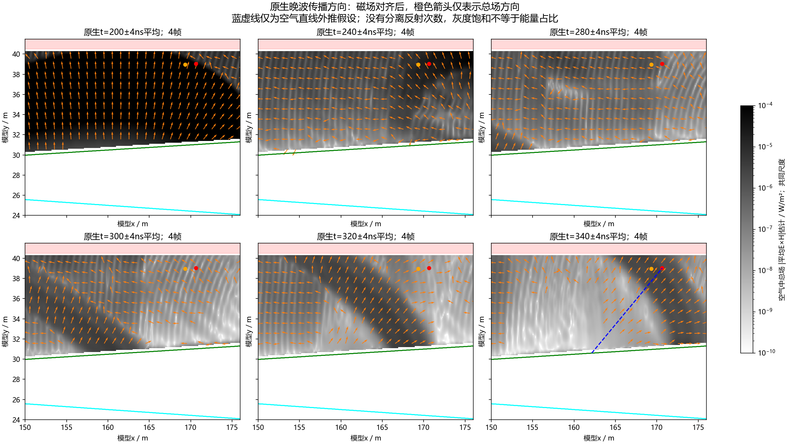

# 完整快照的方向核查：晚波从接收器左下方返回

日期：2026-10-10。本单元复用已取回的190m高损耗H0波场，新增求解0次，没有修改材料、几何、正式SFCW或旧停止批次。

**新证据是局部传播方向，而不是反射次数认证。** 在原生330–350ns晚波窗内，接收器附近总场E×H的平均方向稳定向右上方；三种磁场时间对齐、三个方形取样半宽得到约44.7–44.9°。原生300–370ns宽窗约46.4–46.7°。空气直线反向外推落到模型x约162.1–162.7m，即剖面里程182.1–182.7m；相对Rx模型x170.65m向左约8m。此结果支持非局部返回候选，不能认证该交点为实际反射位置、覆盖层往返阶次或唯一射线。

[八条实际取样线的上向总场分量](../../artifacts/research_checks/2026-10-10_snapshot_direction_r1/native_signed_vertical_transport.png) · [Rx波形与方向敏感性](../../artifacts/research_checks/2026-10-10_snapshot_direction_r1/native_rx_direction_sensitivity.png)。这是同一次激发的时空观察，不是移动天线B-scan；当前测线灰度仍见[已完成测线部分](2026-10-09_user_stopped_partial_acceptance.md)及[两锚点界面控制](2026-10-09_cover_interface_18750_replication.md)。

## 先核查实际安装实现

通过既有SSH只读取ROG已安装的`snapshots.py`及`cuda_opencl/knl_snapshots.py`原始字节。两者SHA-256与本批冻结契约的`source_identities`一致；本机副本也逐字节核对。源码粗采样分支按原生Yee位置插值到声明粗单元中心，不是将不同位置的分量直接当同位。V4 HDF5的`time`与`magnetic_time`分别记录E(nΔt)、H((n−0.5)Δt)。

本批Δt=5.896635841874211e−11s，观察每34步，约2.004856ns。半步约0.029483ns，磁场需前移观察间隔的1/68。使用下一帧内的前向线性对齐为主结果，上一帧外推线性和三点二次插值作为敏感性；舍弃首末帧，不在末尾做未经声明的外推。

TMz场按Sx=−EzHy、Sy=EzHx计算。它是插值对齐后的**总场能流密度估计**，不是各阶独立波的能量，也未做离散守恒闭合。方向箭头只归一长度供显示，不改变指标或灰度；所有图共用明确物理尺度，早期超限截色已注明。

## 实际数值

|原生时间窗|三对齐×三取样范围的方向|空气直线外推的剖面里程|
|---|---:|---:|
|150–230ns早返回|68.43–68.50°|187.425–187.438m|
|300–370ns宽晚窗|46.42–46.66°|182.657–182.722m|
|330–350ns主晚波窗|44.72–44.94°|182.141–182.208m|

角度从模型+x方向逆时针计量。取样为以真实Rx为中心、半宽0.15/0.5/1m的方形，共9/110/420个粗采样点，全部位于空气和顶部PML下方。表中小数是算术输出，**敏感性范围不是物理置信区间或FDTD误差预算**。宽晚窗与主晚窗的外推位置相差约0.5m，说明窗口包含不同总场成分，不能选择最接近旧候选的位置来称验证成功。

最近快照点(170.65,39.05)m与原Rx(170.65,39.025)m的300–370ns带符号相关为0.9995365；未拟合时延或振幅，不将二者称为同位置/逐位一致。早、晚返回方向不同，为后续分开布探针提供依据。

方向外推与此前五接触优化路径的约x158–161.5m位置**不完全一致**。前者是总场局部方向、后者是近似几何最短候选；两者都落在此前x154–164m候选区域内，但不能相互替代或据此认证优化器/实际传播身份。

## 独立复算与限制

- 主分析在本机读取250份局部原生H5，核验全部文件哈希、版本、三个TM场分量、时刻/原点/尺寸及有限值。
- 独立脚本再次从250份原生文件读取Rx周围区域，用`numpy.interp`和独立三点多项式权重复算27组方向、孔径/时间样本数及地表线段交点；另外7个时刻逐标量重读8条取样线。审核通过。
- 13项解析检查覆盖五个Maxwell行波方向、亮场驻波的零周期平均能流反例、线性/二次时间插值及非法参数拒绝。它们只认证算术和符号。
- 本观察为100MHz Ricker原生宽频时域，**不是源归一后的20–170MHz SFCW时标/能量**。2.005ns时间采样、0.1m空间采样与总场叠加仍限制精确路径/次数解释；本单元没有建立全频混叠或FDTD误差预算。
- 地表外推只是假设空气段直线传播；干涉、非平波前和多分支能流可能使其偏离实际出射点。没有现场、整线、真实天线或有限三维认证。

## 对当前问题的影响和下一步

此前覆盖层界面移位的1:2延时、去反差消融和顶/右扩域共同支持覆盖层相关重复往返。本轮方向证据补充了“接收器左侧区域”的直接波场观察，使只用天线正下方层厚预测强晚波的解释更不充分；仍不能宣布仿真与实测差距已彻底解决。

下一单元优先设计一次只增加观察器的原生全时序探针，覆盖模型x158–164m的地表和覆盖层底，以及主Rx周围；先核对各Rx分量Yee位置，以同位/同时时序观察上/下行返回，避免当前粗快照时间插值。原source/主Rx、材料/几何须保持，主Rx输出逐位核对。该项尚未准备/冻结/运行；不恢复旧中断测线或旧四项流水线。

## 复现入口与存放

主分析：`scripts/analyze_line9_snapshot_directions.py`；独立复算/绘图：`scripts/audit_plot_line9_snapshot_directions.py`；解析检查：`python scripts/check_line9_snapshot_directions.py`。

主分析与独立复算CLI的`--help`给出参数。原生输入为`artifacts/local_checks/2026-10-09_remote_retrieval_r1/full_wavefield/`；几何为`artifacts/local_checks/2026-10-09_single_wavefield_package_r1/baseline/geometry.h5`；安装源码只读副本为`artifacts/local_checks/2026-10-10_snapshot_direction_r1/`；派生数组为`artifacts/local_checks/2026-10-10_snapshot_direction_arrays_r1/aligned_probes_and_maps.npz`。以上私有/大文件未上传。公共数字、哈希、三图和独立审核位于`artifacts/research_checks/2026-10-10_snapshot_direction_r1/`。公共克隆缺私有原生数据，不能声称可完整复现正演或上述原生读数。
