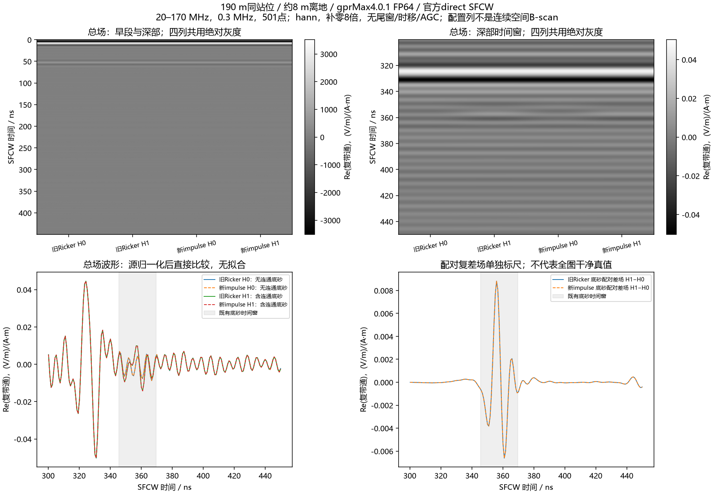
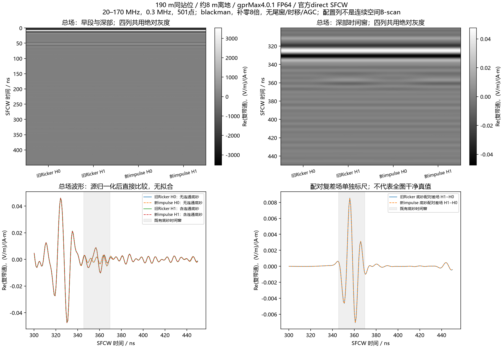
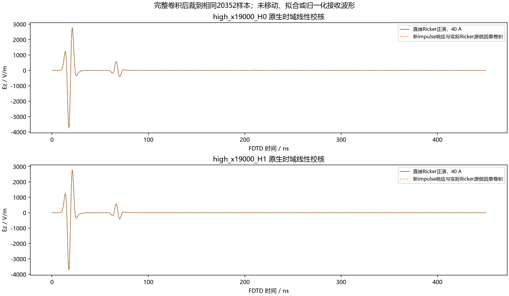

# 官方 impulse 两项正演与 SFCW 对照

2026-10-10。用户明确要求“重新用新的去开始正演”。本次另冻并完成190m站位高损耗 H0/H1 两项，没有恢复旧批或启动整线。**新官方激励已得到实际输出；重点窗与旧Ricker几乎一致，强回波尚未解决。**

## 输入、执行与复现

沿用已准备的官方 `#waveform: impulse 1 1 impulse`，幅度1 A、起始0、z向理想二维线源。域210×42.5m，0.025m网格，14.28M格，1200ns/20352样本，HORIPML80格。约8m离地、沿测线1.3m收发、材料及体素几何保持。单位源不等于现场发射功率标定；二维沿测线基线仍没有表示实际左右横向天线。

ROG实测GPU为4090 Laptop、16GB；冻结时空闲显存约15GB、内存约49GB，保守设备预算约7.59GiB，实际显存占用约4.4GB。gprMax4.0.1/CUDA/double；原生Ez与源样本均float64。H0用时219.453s、H1用时219.485s，总求解约7分19秒。两项完成后原生身份重新验收通过，求解进程已退出。

新契约SHA-256为 `c461341efbe19be06b2654aa11b599c219eb9639bdb17cd40032475ab8ebe98f`。使用[本批包装器](../../scripts/line9_official_impulse_controls.py)调用已有冻结/监督器；2项/no_retry、600s心跳过期、USER_STOP、资源与时间上限保持。源准备manifest的false仍是准备时历史状态，本次执行许可写入新契约，不覆盖旧源包或旧Ricker输入/输出。

完整输入包在本机 `artifacts/local_checks/2026-10-10_line9_official_impulse_package_r1/`。远端独立目录 `E:\line9_official_impulse_20261010_r1`；取回结果在本机 `artifacts/local_checks/2026-10-10_official_impulse_results_r1/`。公开[证据目录](../../artifacts/research_checks/2026-10-10_official_impulse_execution_r1/)含新契约、完成证书、执行/编译/控制日志、分析和图，不上传环境、密钥或原始实测资料。新的复现执行目录必须不存在；不能对已消耗attempt重复run。

## 官方链路与独立校核

依据[gprMax4.0.1官方SFCW手册](https://docs.gprmax.com/en/latest/inc_SFCW.html)的 Preparing the model、Information、FDTD impulse-convolution check、Frequency and time-window validity，采用内置单样本impulse与推荐direct。调用官方load_source/load_receiver/direct_frequency_response/reconstruct_time_response，精确20–170MHz、0.3MHz、501点；Hann/Blackman、补零8、尾窗0、时移0保持。不新增homodyne、AGC、相位/幅度拟合或删浅层。

- 原生单样本源、首半步偏移、位置/网格/版本/float64/哈希核验通过，5项相关CPU回归通过。
- 独立501点DTFT最大相对误差约1.47e−12，逆求和与官方重建核对通过。
- 对新H0实际运行官方CLI，频谱与API逐值一致，复时间剖面相对差5.11e−16；频率和时间轴一致。
- 按官方方法，将完整新冲激响应与旧输出中实际Ricker源做因果卷积，之后裁到相同20352样本。两项重现旧原生正演的相对L2误差分别9.64e−15、9.89e−15，无时移或拟合。
- 完整501频点的源归一化新旧差约0.19–0.20%。已用完整卷积被裁去的已知尾段复算该差，误差约1.47e−12；这是有限记录的变换差，不能据此证明1200ns后没有未知回波。

沿用场/电流矩参考 `/0.025m`，单位为 `(V/m)/(A·m)`，不是端口S21。图用 `Re(complex_bandpass)` 保持历史标尺；官方 `real_bandpass=2Re(complex_bandpass)` 另存于私有数值H5。

## 对照结果与限制

300–450ns窗：Hann总场相对复变化H0为0.00554%、H1为0.00523%，强峰均仍为330.173ns；Blackman总场变化约0.0023–0.0025%，峰均仍为328.510ns。底砂配对差场峰均为356.786ns，Hann宽窗变化0.00175%、既有底砂窄窗变化0.000623%。**这两例的强总场和底砂差场没有因换成官方激励而改变结构，不能将旧观感问题归因于Ricker单一因素。**

弱早段H1−H0的相对变化约4.9%，其分母很小且含带限泄漏，不将这一比值当作新浅层反射或深部回波增强证据。配对差场只表示连通底砂的模型对比，不是所有地层的clean真值。

冲激最后5%原始接收峰为−40.77/−40.65dB；旧Ricker约−132dB。**新冲激记录尚未达到官方−60dB时窗建议，CLI已提示；未用尾窗掩盖，也未自动加长时窗。** 170MHz主体材料最短波长估算约0.512m、20.5格/λ，满足官方通常至少10格的初筛建议，但不代替网格收敛。本轮是源与处理链一致性证据，不签认时窗完整性、唯一路径、现场物性或实测性能。

## 图件

三个图的配置列均来自同一站位，不是连续空间B-scan，不表示未计算测线。







下一步建议：先只对H0延长时窗并比较相同501点及固定深部窗，判断冲激尾部截断是否影响关注回波，再决定完整测线。具体新时窗/成本需另列并取得用户显性许可；本次两项之后没有继续求解。

CPU分析复现（已有取回raw；新out/numerical必须不存在）：

```powershell
& artifacts/local_checks/gprmax_v401_gpu_env/Scripts/python.exe scripts/analyze_line9_official_impulse.py --new artifacts/local_checks/2026-10-10_official_impulse_results_r1 --old artifacts/local_checks/2026-10-08_v401_dense_loss_results_r1/snapshots/1791476550430449400 --out artifacts/research_checks/impulse_review_new --numerical artifacts/local_checks/impulse_review_new.h5
```
