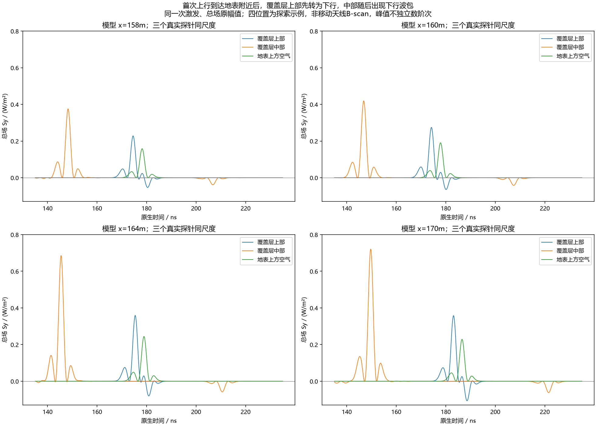
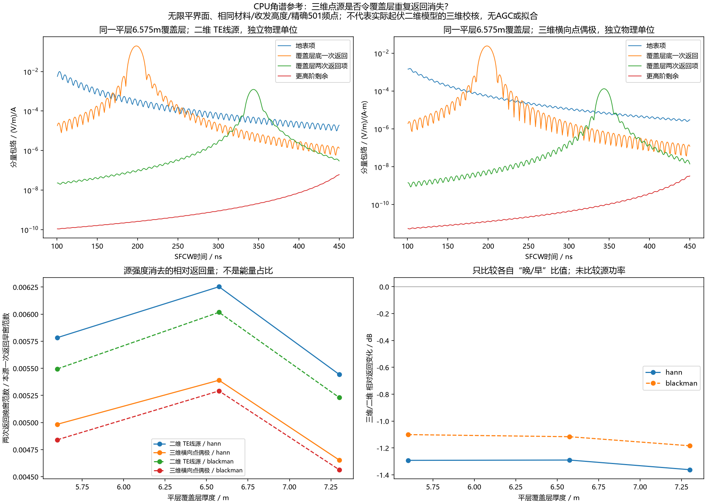

# 地表再次反射已观察到；平层三维点源不会自动消除重复返回

2026-10-10。继续目标“持续推进直到研究明白”。本单元复用上一批原生探针，仅做CPU分析及无限平层角谱参考；新增gprMax正演、远端计算和训练均为0。没有修改现场电性、正式SFCW链或已停止测线。

**两个新结果改变下一步优先级。** 原模型41列都出现中部上行→上部上行→上部后续下行→中部后续下行的原生总场序列，支持地表内反射。另在材料/收发高度相同的平层参考中，从二维TE线源换为三维横向水平点偶极子，覆盖层“两次返回/一次返回”的相对幅值范数量只降低约1.02–1.36dB，重复返回没有消失。这削弱了“换成三维自然解决强条纹”的预期；不是实际起伏模型的三维认证，也没有排除二维对某些侧向相干分支的影响。

全部图为中文标注，仓库相对路径：

- `artifacts/research_checks/2026-10-10_surface_rereflection_r1/surface_rereflection_signed_traces.png`：真实探针，四位置三条原幅值曲线，共用W/m²尺度。
- `artifacts/research_checks/2026-10-10_surface_rereflection_r1/surface_rereflection_all_positions.png`：全部41位置的探索事件时间与近界面传播差。
- `artifacts/research_checks/2026-10-10_planar_dimensional_returns_r1/planar_dimensional_return_comparison.png`：CPU平层角谱分量；二维/三维因源分布与单位不同，绝对场量分面显示；下方比较各自无量纲返回比。

这些是固定一次激发的时序/数学参考，不是移动天线B-scan。原生单站SFCW灰度见[上一批五图](2026-10-10_native_probe_observer_results.md)，没有制造一份未计算的三维测线。

## 1. 原生时序闭合到地表再次反射

沿用上一批所有输入/原生SHA身份，读取已有同位/同时Ez/Hx/Hy。原生n=0..20350，H相邻空间与半步时间对齐保持，不重新从粗快照插值。每个位置取覆盖层中部、距地表0.25m的层内上部及地表上方空气。

事后探索窗口完整声明为：中部首次上行120–175ns，上部上行160–210ns；以该上部峰为基准，后续层内上部下行+2至+15ns、中部下行+15至+70ns、空气上行0至+15ns。各极值周围±2ns检查有符号Sy积分。全部41列的中部上/下行及上部上/下行四个窗口均符合方向符号；不是把局部正负峰数成反射阶次。

模型x160m的示例：

|观察点及方向|原生时间ns|±2ns积分符号|
|---|---:|---|
|覆盖层中部上行|146.885|正|
|覆盖层上部上行|174.187|正|
|地表上方空气上行|177.902|正|
|覆盖层上部后续下行|180.142|负|
|覆盖层中部后续下行|207.444|负|

同一位置，中部上行到上部上行为27.301ns，上部下行到中部下行也为27.301ns；两点垂直距离2.475m，以完整覆盖层复谱得到的95MHz实相位群指标3.31218计算垂直单程近似27.344ns。此一致性支持沿覆盖层到地表后再返向下，不是仅靠接收器晚峰猜测。

上部正峰到负峰间隔5.956ns，而该点到地表0.25m的垂直往返近似5.524ns；41列峰间隔5.366–5.956ns。近界面入射/反射叠加、色散、网格接触和斜向传播影响峰的时刻，因此不把差值当射线误差预算或唯一反射计数。首次再反射序列更明确，但不能据此认定300–370ns弱晚波只有一条固定次数的路径。

## 2. 可负担的三维平层机制参考

复用仓库已验证符号/源归一的二维角谱和三维半空间Sommerfeld方法，增加三维水平点偶极子的平层覆盖层/泥岩栈。三维这里指完整点源矢量场的TE/TM角谱积分，**不是二维结果乘一个几何衰减系数**，也不是实际起伏剖面的gprMax三维输出。

平层基准取当前中点体素地表y=30.975m、覆盖层底y=24.4m；收发空气高度7.975/8.05m、沿测线相距1.3m。三种厚度5.6/6.575/7.3m，材料全谱相同；额外两厚度为机制假设，未用于拟合实测。三维偶极横向水平极化，即与水平收发间距垂直，对应原Ez线源的方向；不是垂直电偶极。平界面无限延续，没有横向地形或有限地质体。

对每个横向波数，使用TE/TM输入导纳及层反射递推，分出地表、覆盖层底一次返回、两次返回项与更高阶剩余。该分解只在此数学平层栈中有明确含义，不用于给实际起伏总场自动贴阶次标签。

时谐约定exp(+iωt)、复介电ε′−iε″、出射垂直波数虚部≤0。相对原半空间参考，增加层递推和方位投影：TE角因子J0+cos(2φ)J2，TM角因子−(ky0/k0)²[J0−cos(2φ)J2]。φ=π/2对应横向水平偶极；传播/消逝区都积分。Weyl归一系数逐频率−ωμ/(8π)，不是经验定标。

方法依据是[Purdue Chew Lecture35](https://engineering.purdue.edu/wcchew/ece604f20/Lecture%20Notes/Lect35.pdf)§35.1的点源角谱/Weyl/Sommerfeld表达及§35.2开头的分层TE/TM分解。原文使用exp(−iωt)，本代码按既有项目约定转换符号；本单元读取§35.1及§35.2开头，追加正文访问超时，没有声称全文通读或将本项目方位/层分量公式全部直接抄自该页。还读取[empymod点偶极API](https://empymod.emsig.xyz/en/stable/api/empymod.model.dipole.html)和[材料复谱hook说明](https://empymod.emsig.xyz/en/stable/manual/info.html)，确认另一种CPU全波平层实现路径；未安装、运行或声称复现empymod。实际采用的代码及检查如下，不以外部软件的功能介绍替代本次数值证据。

## 3. 相对返回量的结果与窗口边缘

精确20–170MHz、0.3MHz、501点，固定Hann/Blackman权重及复逆变换；不含AGC、参数拟合或仪器增益。二维E/I与三维E/(Iℓ)源分布/单位不同，禁止把绝对比值当天线增益、功率差或实测校准。

定义Q为各源类型自身覆盖层“两次返回项的范数/一次返回项范数”，先计算整个固定频窗的加权复谱范数（与整周期复轮廓范数由Parseval等价），再比较Q3D/Q2D。这是幅值范数比，不是能量占比。

|平层覆盖厚度m|Hann Q2D|Hann Q3D|Hann 20log10(Q3D/Q2D)|Blackman变化dB|
|---|---:|---:|---:|---:|
|5.6|0.007540|0.006576|−1.188|−1.020|
|6.575|0.006253|0.005390|−1.290|−1.116|
|7.3|0.005444|0.004654|−1.361|−1.183|

图中的下方面板沿用求解前冻结的150–250ns一次窗与300–450ns两次窗，其对应变化约−1.10至−1.36dB。5.6m两次峰约300–301ns，靠晚窗左边缘，截窗会改变趋势；上表另外用整周期/全频窗指标消除此影响，不把图上的厚度趋势认作普适物理关系。

6.575m两源的覆盖层两次项Hann峰均343.480ns；当前实际起伏H0晚峰为330.173ns。三维点源改变平层相对强度，没有把平层候选改到实际起伏晚波时间。这与先前侧偏地表方向/相邻出射位置平台相容，但仍不足以唯一识别起伏场中的返回分支。

包含直达/地表有限带尾部的完整H0晚窗比与单独两次项不同，尤其三维点源可能有更强的带限尾部。本单元完整保留所有分量及完整H0指标，没有据单个返回项宣称三维总场杂波只会降低，也不能把模拟接收场称为端口S21。

## 4. 独立检查与三维容量

- 205个原生极值由另一个脚本直接重读H5、四邻值等权重重建，峰幅相对差≤3.53e−16；164个有符号窗口分别复核，群指标用独立复谱有限差分重算，差7.68e−12。
- 三维参考16项检查通过：两方位PEC负镜像（相对L2≤2.70e−13）、九项角投影直接数值积分、全空气零反射、零厚层等价半空间、既有独立中点积分半空间对照（2.50e−7）及非法厚度拒绝。没有调用gprMax新求解。
- 全501点三厚度/两源/四分量，256/512阶Gauss对照最大相对L2约4.00e−10。独立自适应积分另用输入导纳、稳定几何级数剩余及尾截指数40（主分析36），复算三频×三厚度九配置，最大分量误差1.45e−9、反射导纳绝对误差≤5.98e−16。
- 24个相对指标由直接复求和和频域Parseval分别复算，最大相对差2.46e−15；上述检查认证算术/平层参考，不是FDTD/现场物理误差预算。
- 当前安装4.0.1源码证实六个FP64场数组完整上传CUDA。保留210×42.5m剖面、横向10m、2.5cm网格时，仅六场就至少256.17GiB；5cm也至少32.12GiB，尚未算材料ID、Debye历史、PML等。原Rx y=39.025m又不在5cm格点，不能称5cm为原模型完全等价替代。当前16GiB ROG及6GiB本机无法直接容纳全剖面三维；容量下界不是精确运行耗时或峰值估计。

三维容量由`budget_line9_same_profile_3d.py`按实际安装分配公式生成，不为让任务能跑而偷偷删域/换FP32。若另做裁域/粗网格三维，必须先用匹配的二维裁域、网格及接收器对照证明关注波形保留，再冻结新的资源/边界比较。不能以CPU无限平层参考代替这个实际起伏验证缺口。

## 对核心问题的影响与接续

原模型强晚条纹有覆盖层反射链、非局部接收的直接证据；高损耗下深部底砂较弱仍有既有对照支持。当前物理现象不需要“违反现实”来解释。三维也允许层内重复返回，改变维度不是自动修复；最终需要解释为何本模型中这些分量与实测的相对强弱不同。

下一单元优先复核现有高/低损耗诊断究竟改了哪些复介电部分：分开ε′、ε″、电导和传播/界面作用，核查当前泥岩Debye设计造成的频带衰减与现场代表性，避免把“介电常数实部看着合理”当整体电性合理。只用现有仿真/谱和公开物性，不以保留实测调参拟合；同时继续区分侧偏波场分支与固定阶次。实际起伏三维、真实天线与仪器导出链的缺口保留，目标active，没有恢复原停止批次。

## 存放与复现

原生时序分析：`scripts/analyze_line9_surface_rereflection.py`；三维平层参考：`scripts/line9_planar_point_layer_green.py`、`scripts/analyze_line9_planar_dimensional_returns.py`；16项检查：`scripts/check_line9_planar_point_layer_green.py`；联合独审：`scripts/audit_line9_surface_and_planar_returns.py`；容量下界：`scripts/budget_line9_same_profile_3d.py`。各CLI `--help`列参数。使用已验证的`artifacts/local_checks/gprmax_v401_gpu_env/Scripts/python.exe`。

公共结果分别在`artifacts/research_checks/2026-10-10_surface_rereflection_r1/`和`artifacts/research_checks/2026-10-10_planar_dimensional_returns_r1/`，后者`independent_joint_audit_r2.json`同时验收两个单元。私有原生仍为上一批`artifacts/local_checks/2026-10-10_native_probes_results_r1/source/profile.h5`；派生原生场为同目录`arrays_r3.npz`，本单元平层复谱为`artifacts/local_checks/2026-10-10_planar_dimensional_returns_r1/response.npz`。未上传这些私有文件，公共克隆可运行解析源/层极限检查，缺私有模型不能声称完整原生复现。没有安装新依赖或改动冻结gprMax环境。
