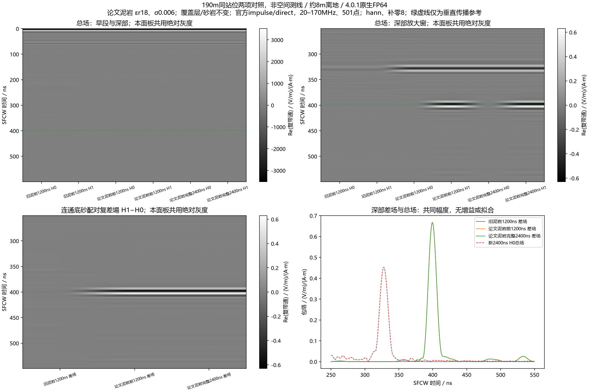
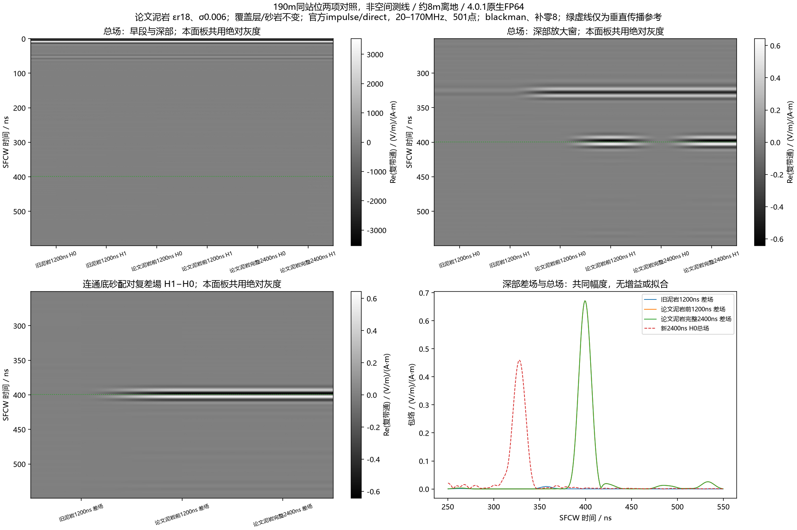
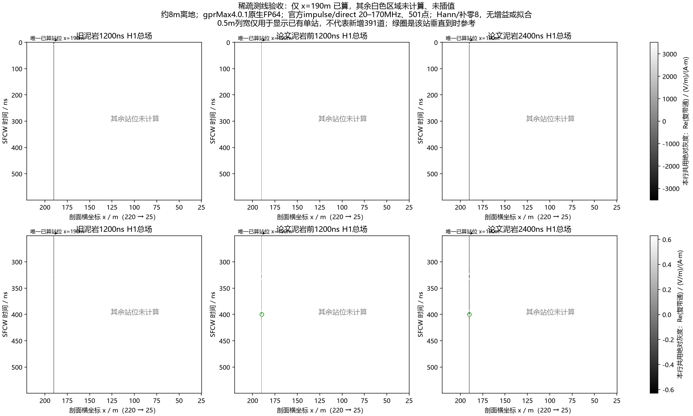
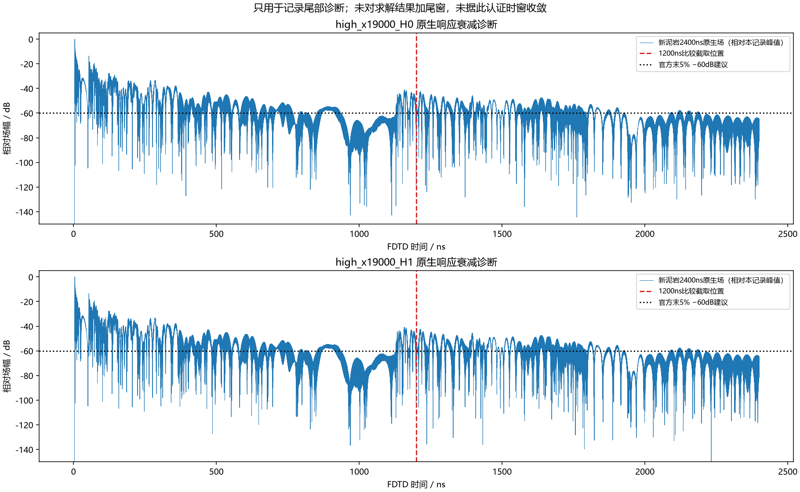

# 论文泥岩与2400ns记录：190m同站H0/H1已完成

2026-10-11，按用户具体批准“只改泥岩，跑上述两项对照”执行。两项均为gprMax4.0.1 CUDA原生FP64，已在ROG完成并取回。**底砂模型差场明显增强，并与约328ns强返回在时间上分开；强返回没有消失。延长记录对本次深部SFCW窗影响很小。** 不是完整测线或实测一致性验收。

## 本轮冻结的电性与采集

| 介质 | 本构 | σDC / S·m⁻¹ | 依据 |
|---|---|---|---|
| 空气 | εr=1 | 0 | 自由空间 |
| 粉质粘土覆盖层 | ε∞=11，单Debye Δε=0.5、τ=6.4567ns | 0.001 | 保留用户此前选定研究配方，非场地实测 |
| 泥岩 | **εr=18，无Debye极点** | **0.006** | Wang2026 Table1完整常数配方，非场地实测 |
| 砂岩 | ε∞=8.837547784813761，单Debye Δε=2.575432653759346、τ=6.4567ns | 0.001 | 保留用户此前选定研究配方，非场地实测 |

均为μr=1、磁损耗0。Debye介质的总损耗还含极化项，不能把σDC当全部频带损耗。当前数据库为[材料v0.2](../../configs/research/line9_materials_v0_2.json)，SHA256 `e23fca3d22e77b18b81fe62b77773bc9121c3c17c5825cfe0e59298a00fbd87e`；[泥岩采用依据](2026-10-10_paper_mudstone_adoption.md)保留。原准备包中的`execution_authorized=false`是当时事实，本轮新许可另冻为新契约，不改历史。

域210×42.5m，二维TMz、2.5cm均匀网格，14.28M格，HORIPML80格，界面平均保持。几何体素逐值相同，仅H5材料库标识同步到v0.2。H0/H1互相比只有5,606,675个连通底砂体素由泥岩2变成砂岩3；没有改地表、覆盖层或其他体素。H0仍含真实地质响应，配对差包含底砂及相关传播交互，不是整图clean。

单位内置`#waveform: impulse 1 1 impulse`，起始0，z向理想二维线源；收发沿剖面相隔1.3m、约8m离地。190m是本轮站位名，实际模型内部收发中点170m，加几何`profile_x_offset_m=20`得到**剖面x=190m，距220m起点30m**；不将旧manifest字段名`chainage_m`冒充累计航程。实际设备横向收发与有限三维天线尚未在本模型中表示。

只将记录从1200延长到2400ns，40703样本，dt=5.896635841874211e−11s。前1200ns比较取同一次长记录的前20352样本，不新增1200ns求解。新材料先验垂直到时参考用本站覆盖层6.575m、泥岩7.1m与95MHz复折射率群延时计算约399.429ns；没有据结果选峰、对齐或改门窗。这是局部垂直参考，不是完整地形射线真值。新宽深部窗250–550ns、历史比较窗300–450ns在求解前声明。

官方链：[gprMax4.0.1 SFCW](https://docs.gprmax.com/en/latest/inc_SFCW.html)的Preparing the model、direct、TimeSampleOffset及Frequency and time-window validity。官方load_source/load_receiver/direct_frequency_response/reconstruct_time_response，精确20–170MHz、0.3MHz、501点，保留复相位。既有Hann/Blackman、补零8、无尾窗、无时移保持，无AGC、拟合或新增homodyne。场/电流矩参考除0.025m，单位(V/m)/(A·m)，不是端口S21；灰度为Re(复带通)，官方real_bandpass另存。

## 完成、环境搬迁与一次准备失败

ROG原环境目录已由`E:\automation_djh`搬到`E:\djh`，旧venv的绝对路径因而失效。本次直接调用现有`py312conda\python.exe`，通过进程内PYTHONPATH加载搬迁后的4.0.1及原依赖；未改venv配置、未安装依赖、未替换求解器。MSVC/CUDA使用已存在的C盘真实路径；实际路径、源码/二进制哈希在契约中。现有监督器保留容量、owned进程树停止、心跳、限时与不重试保护。

R1材料库JSON文件名与新引用名不一致，在几何材料加载阶段报FileNotFoundError，**没有进入时间步进、没有原生结果**。失败包/合同/日志完整保留；没有重启已消耗的R1。修正准备器的文件命名，并增加官方数据库解析器逐材料核查后，另冻R2执行同一获准物理方案。R2两项分别一次完成：

| 情形 | 求解耗时 / s | 原生dtype | 样本 |
|---|---:|---|---:|
| H0：无连通底砂的地质对照 | 365.734 | float64 | 40703 |
| H1：包含连通底砂 | 366.250 | float64 | 40703 |

合计731.984s，约12分12秒。显存约3.7GB，owned峰值RSS约3.2GiB。两项、主接收/源、源半步、实际收发位置、网格/版本/哈希/有限值通过；ROG再次verify通过，owned PID已退出、GPU回到约1%。本轮只有两项完成求解，另有一次零时间步的失败调用；不计为三项成功。

R2远端目录`E:\djh\line9_paper_mudstone_20261011_r2`；新契约SHA256 `052cb64fabd5637c02de202b40c5654310607a7fae4644724aaaa83a14f7fcbb`。取回到本机`artifacts/local_checks/2026-10-11_line9_paper_mudstone_results_r2/`，20个文件逐字节哈希核对；原生H5/模型/数值结果保留忽略目录，公开契约、日志和图件。

## 材料变化与记录长度的结果分开看

以下峰值均在预声明250–550ns窗、共同源参考下计算；增强不是SNR或现场功率标定。

| 指标 | Hann | Blackman |
|---|---:|---:|
| 底砂差场峰：新完整记录 / 旧泥岩1200ns | 74.165倍（37.404dB） | 77.162倍（37.748dB） |
| H0强返回峰：新完整记录 / 旧泥岩1200ns | 8.728倍 | 9.228倍 |
| 差场峰 / H0峰：旧 → 新 | 0.1735 → 1.4742 | 0.1747 → 1.4609 |
| 上述模型对比比值改善 | 8.497倍（18.585dB） | 8.362倍（18.446dB） |
| 新H1总场深部最大峰到时 | 399.202ns | 399.202ns |
| 新配对差场深部最大峰到时 | 399.202ns | 399.202ns |
| 新H0强返回峰到时 | 327.678ns | 327.678ns |

旧H1总场深部最大峰约330.173/328.510ns，旧底砂差场约356.786ns。新H1总场最大峰与新底砂差场都到约399ns，接近事先算出的约399ns垂直参考。**目标增强和到时拉开都有效；不能说约328ns的覆盖层相关强返回被消掉，它反而更强。** 相同1200ns长度的新旧比较给出几乎相同的增强倍数，避免将材料效果与延长记录混同。

100MHz局部平面正入射预算：覆盖层/泥岩|R|约0.03712→0.12249，泥岩/砂岩约0.07469→0.17163；这解释为什么泥岩改动不仅降低深层吸收，也会加强覆盖层相关返回。它不认证实际地形晚波的唯一路径或往返次数。

| 记录长度比较 | H0 | H1 |
|---|---:|---:|
| 新泥岩前1200ns，末5%峰 / 全记录峰 | −41.005dB | −40.724dB |
| 新泥岩完整2400ns，末5%峰 / 全记录峰 | −62.146dB | −62.263dB |
| 250–550ns总场复波形变化（长 / 短） | 0.001418% | 0.000731% |

同窗H1−H0复差场变化仅0.0000937%（Hann），Blackman更小。完整501点复谱变化仍约0.231%/0.211%，不能把固定深部窗的微小差异外推到所有频率/晚时段。2400ns满足官方末5%低于−60dB的建议初筛；没有第三个记录长度，不能宣称无限时窗收敛。但**本轮证据不支持1200ns截断是关注深部窗异常的主因**。

0–120ns总场几乎保持，差场在该段仅约总场的10⁻⁹，相对变化较大是小分母/带限泄漏诊断，不解释为新增浅层目标。

独立501点DTFT最大相对L2约3.21e−12；独立逆求和通过。追加尾段DTFT解释全记录与短记录谱差，尾段相对误差≤1.35e−9。实际运行官方CLI处理新H1，归一化后复轮廓与API相对L2为5.57e−16；无幅度/相位拟合。相关独立核查见[交付证书](../../artifacts/research_checks/2026-10-11_line9_paper_mudstone_window_r2/delivery_verification.json)。

## 图件及交付

所有配置列都是**同一x=190m站位**，不能当连续空间B-scan。全幅总场受强直耦动态范围支配；深部放大面板共用另一绝对标尺，并未给数值结果加增益。









稀疏测线按用户220→25方向显示，仅x=190m已算，其余白色明确未算；0.5m列宽只用于显示，不是391道结果。没有新波场快照。

## 复现与下一步边界

实现：[准备与冻结](../../scripts/line9_paper_mudstone_window.py)、[官方处理与比较](../../scripts/analyze_line9_paper_mudstone_window.py)、[独立交付核查](../../scripts/audit_line9_paper_mudstone_delivery.py)、[单站稀疏图](../../scripts/render_line9_paper_mudstone_sparse.py)。准备需原只读官方impulse输入包及当前v0.2数据库，另选不存在的输出目录；freeze/run需ROG已核验运行时/编译环境，新执行目录，不对已消耗attempt复跑。

CPU分析复现（输出和numerical路径必须不存在）：

```powershell
& artifacts/local_checks/gprmax_v401_gpu_env/Scripts/python.exe scripts/analyze_line9_paper_mudstone_window.py --new artifacts/local_checks/2026-10-11_line9_paper_mudstone_results_r2 --old artifacts/local_checks/2026-10-10_official_impulse_results_r1 --out artifacts/research_checks/paper_mudstone_review_new --numerical artifacts/local_checks/paper_mudstone_review_new.h5
```

本轮材料差異得到受控数值证据，不再仅是吸收预算；**仍不把配方定为场地真值，也不宣布仿真与实测差距彻底解决**。新泥岩最短波长约0.416m、16.6格/λ只是初筛；非平地网格收敛、实际有限天线/横向基线、设备导出处理链仍有限制。单站不能证明整线脉络。

建议下一步是短测线，检查约399ns的目标是否随真实界面变化，再考虑更大批量。当前批准的两项已完成，没有启动短测线或391道。空气等效研究保持用户指定的搁置状态，旧停止批不恢复；任何新批次仍需具体显性许可。
