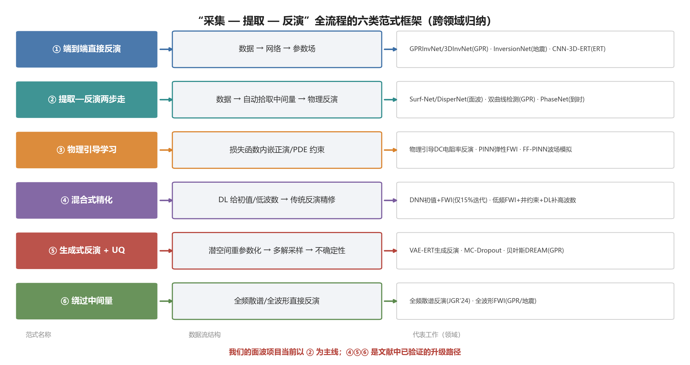
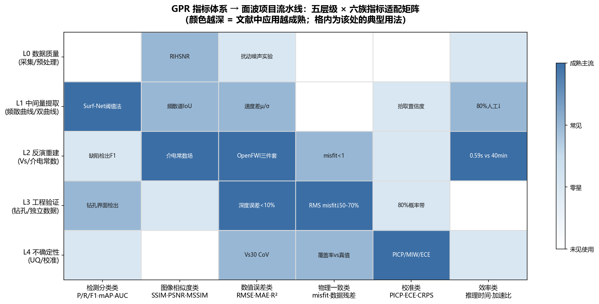
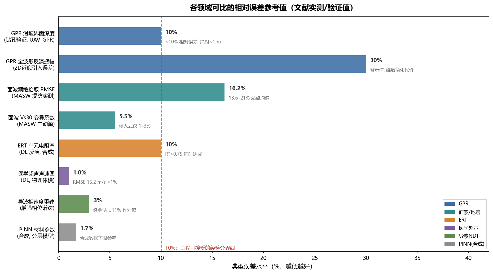

# 跨领域深度调研：面波色散"采集—提取—反演"范式的跨领域框架类比与 GPR 指标体系迁移

调研日期：2026-10-01
前置文档：`research_followup_dispersion_2026-09-29.md`（第二轮，面波色散实测数据方向）、`research_followup_2026-09-29.md`（第一轮，UAV-GPR 方向）[^2^][^1^]
调研问题：① 其他领域中与"采集 → 深度学习自动提取中间量 → 反演成像"相同思路的整体框架长什么样；② GPR 领域目前使用的评价指标中，哪些可以直接或改造后应用于我们的滑坡面波项目；③ 在沉默成本不计入的前提下，当前方向是否正确。

---

## 结论先行（TL;DR）

**方向判断：正确，且有充分的跨领域证据支撑。** 我们采用的"实测面波数据 → 深度学习自动提取频散曲线 → 反演 Vs 结构"两步走范式，在 GPR、反射地震（FWI）、ERT、医学超声、超声 NDT 五个波动类领域都有结构完全同构的对应物，且过去两年这些领域无一例外地沿同一方向演进——自动化提取中间量、端到端或混合式反演、以及不确定性量化。跨领域文献同时给出了三条可立即落地的升级路径（混合式精化、生成式反演 + UQ、全谱反演绕过中间量），以及一套成熟的五层级指标体系。GPR 领域的指标绝大多数可以直接迁移：检测分类类指标（Precision/Recall/F1/mAP）只需把"双曲线"换成"频散曲线分支"即可使用；图像相似度指标（SSIM/PSNR）可直接用于频散谱与反演剖面；钻孔验证的"绝对误差 + 相对误差 + 概率带"三件套与 Wang et al. (2026) 的做法完全同构[^1^]。

**但有三点警示**：其一，所有领域共同的最大风险是"合成数据训练 → 实测数据失效"的泛化鸿沟，NDT 领域有跨试件泛化几乎归零的反面案例[^40^]，面波领域也有 Naskar & Das (2026) 的公开批评[^2^]；其二，不确定性"看起来有"不等于"校准过"，MC-Dropout 等方法被系统性地发现过度自信，需要 PICP/ECE 类校准指标把关[^41^][^42^]；其三，中间量提取环节的误差会向下游放大，GPR 全波形反演曾因 time-zero 拾取错误导致整批结果返工更正[^47^]——我们的频散曲线拾取正是同类的单点故障位置。

---

## 一、调研范围与方法

本轮调研在前两轮文献跟进的基础上向外扩展：不再局限于面波或 GPR 单一领域，而是以"波动场数据 → 中间特征量 → 地下参数反演"这一抽象流水线为锚点，系统扫描了五个结构同构的领域——探地雷达（GPR）、反射地震全波形反演（FWI）与速度建模、电阻率层析成像（ERT）、医学超声/光声层析、超声无损检测（NDT），外加天然地震学的到时自动拾取社区（作为"中间量自动提取"最成熟的样板）。检索共执行 12 轮，覆盖各领域的框架综述、基准数据集、指标定义与实测验证案例，优先采用同行评审期刊、IEEE/AGU/SEG 系列出版物与机构报告（ORNL、USGS、KAUST、Jülich 等）。

选择这六个类比领域的理由在于物理与工程结构的相似性，而非话题相近。GPR 与面波同为近地表探测手段，共享"频散/衰减、分辨率—穿透深度权衡、钻孔验证"等工程语境；反射地震是"波形 → 速度模型"反演范式最成熟、投入最大的领域；ERT 虽然物理机制不同（位场而非波动），但其"表观数据伪剖面 → 参数场"的反演结构与面波"频散曲线 → Vs 剖面"在数学形式上几乎一一对应；医学超声与 NDT 则提供了小尺度、高信噪比环境下同类问题的"洁净实验室"参照，其验证标准（体模、离体组织、已知缺陷试块）正是地球物理野外验证的镜像。

## 二、第一部分：跨领域整体框架类比

### 2.1 六类范式框架总览

综合各领域的文献，"采集—提取—反演"全流程在方法学上收敛为六类可区分的范式框架，如图 1 所示。这六类范式不是互斥的，而是可以同时出现在一个项目的不同模块中；但它们对数据、算力、人工标注的需求差异极大，范式选择本质上决定了项目的风险结构。

**图 1** "采集—提取—反演"全流程的六类范式框架（跨领域归纳）。

| 范式 | 核心思想 | 代表工作与领域 | 对标注/合成数据的依赖 | 实测数据成熟度 |
|---|---|---|---|---|
| ① 端到端直接反演 | 数据 → 网络 → 参数场 | GPRInvNet、3DInvNet（GPR）[^5^][^6^]；InversionNet、SeisInvNet（地震）[^11^]；CNN-3D-ERT（ERT）[^15^] | 极高：需大规模配对合成数据集 | 合成上成熟，实测上普遍退化[^35^] |
| ② 提取—反演两步走 | 数据 → 自动拾取中间量 → 物理反演 | Surf-Net、DisperNet（面波）[^29^][^31^]；双曲线检测（GPR）[^3^]；PhaseNet（到时）[^20^] | 中等：中间量标注可半自动产生 | **最高**，已有大规模业务化部署[^30^] |
| ③ 物理引导学习 | 正演算子/PDE 嵌入损失函数 | 物理引导 DC 电阻率反演[^13^]；PINN/PIRNN 弹性 FWI[^11^] | 低：不需要标签，需要可微正演 | 数值实验为主，实测案例少量 |
| ④ 混合式精化 | DL 提供初值/低波数成分，传统反演精修 | DNN 初值 + FWI（仅 15% 迭代即媲美多尺度 FWI）[^9^]；低频 FWI + 井约束 + DL 补高波数[^10^] | 中等 | 高，工业地震已在用 |
| ⑤ 生成式反演 + UQ | 潜空间重参数化，输出多解与不确定性 | VAE-ERT 生成反演[^16^]；MC-Dropout 重力/电阻率反演[^46^][^13^]；贝叶斯 DREAM GPR 反演[^44^] | 中等到高 | 合成 + 少量实测 |
| ⑥ 绕过中间量 | 放弃"先拾取再反演"，直接反演全谱/全波形 | 全频散谱反演（面波，JGR 2024）[^2^]；GPR/地震全波形 FWI[^27^][^28^] | 不依赖 ML 标注，依赖正演精度 | 高（传统方法侧），计算昂贵 |

表 1 的关键读法有两层。第一，**我们的主线（范式②）恰好是目前实测数据成熟度最高的路线**：Zhang et al. (2020, IEEE TGRS) 的噪声互相关频散提取系统在 Long Beach 台阵 5340 组曲线上实现了 80% 的人工工时削减，是同类工作中业务化程度最高的案例之一[^30^]。第二，范式④⑤⑥不是替代②的竞争者，而是叠加在②之上的增强器：②的产物（频散曲线）可以作为④的初值生成器、⑤的先验约束、⑥的对照基准。跨领域证据不支持"推倒重来换范式"，而支持"以②为骨架，选择性嫁接④⑤⑥"。

### 2.2 反射地震：范式演进最完整的参照系

反射地震（FWI 与速度建模）是研究"波形数据 → 速度模型"问题投入最大的领域，其范式演进的完整度也最高，几乎每一种范式都能在这里找到十年尺度的发展史。数据驱动端到端反演从 InversionNet 起步，发展到 OpenFWI 大规模基准与 BigFWI 研究，明确建立了 MAE、RMSE、SSIM 三件套作为速度模型评价的社区标准，并辅以 Wasserstein 距离作为分布层面的侧指标[^8^]。值得注意的是 BigFWI 的作者在讨论中坦承："反演结果的评价非常复杂，有时可视化结果的差异无法被现有定量指标反映，需要开发新的评价指标"[^8^]——这说明即使是最成熟的领域，指标体系本身也仍在演化，我们不必等待"完美指标"再动手。

混合式精化（范式④）在地震领域给出了最有说服力的效率证据。Stanford SEP 的直接对比实验表明，用 DNN 预测的速度模型作为常规 FWI 的初始模型，只用 15% 的迭代次数就达到了与多尺度 FWI 相当的结果（SSIM 0.82 对 0.85），显著优于无初值的常规 FWI（SSIM 0.50）[^9^]。KAUST 的工作进一步把"低频 FWI 提供低波数背景 + RTM 图像提供高波数结构 + 井资料提供局部真值"三路信息用 DL 融合，以 MSE + 多尺度 SSIM（MSSIM）为损失和评价指标[^10^]。对我们的直接启示是：频散反演得到的 1D Vs 剖面完全可以充当"低波数初值"的角色，未来若向 2D/波形级反演升级，不需要放弃现有积累——这与用户"沉默成本不计入"的提法并不冲突，因为这条路径本来就是主流演进路线。

### 2.3 ERT：与面波结构最同构的领域

ERT 的"表观电阻率伪剖面 → 电阻率参数场"与我们的"频散曲线 → Vs 剖面"在反演结构上是六个领域中最接近的：同样是表观量、同样是病态非线性反演、同样以 1D 反演 + 横向插值为传统范式。ERT 领域的 DL 化进程因此对我们有最强的可迁移性。Vu & Jardani 的 CNN-3D-ERT 用 SegNet 编码器—解码器直接学习"表观电阻率剖面 → 3D 电阻率分布"的逆算子，训练集由地质统计各向异性高斯生成器产生，并系统测试了数据分辨率与噪声对反演效果的影响[^15^]。Gandon & Cupillard (2025) 更进一步，把观测系统元数据（电极数、排列类型、几何）作为额外输入，用灵敏度加权损失函数让网络优先保证数据约束强的区域，推理时间 <1 s，并在 PEGGHy 试验场实测数据上取得了与常规反演主结构一致的结果[^14^]。

ERT 领域在不确定性量化上的做法尤其值得整体搬用。GeoScienceWorld 2025 年发表的物理引导 DC 电阻率反演框架，将正演过程嵌入网络训练（损失直接最小化数据 misfit 而非模型 misfit），用离散余弦变换压缩模型参数以降低病态性，再用 MC-Dropout 估计不确定性，并用梯度型 MCMC 反演的不确定性做外部校验[^13^]。另一个时间序列 ERT 渗透性反演工作则给出了清晰的验收数字：全局指标 R² > 0.75、局部指标每单元百分误差 <10%、训练后推理比一次正演快至少 4 个数量级[^12^]。"全局 R² + 局部单元误差 + 加速比"这一三指标组合，几乎可以原样改写成我们项目的"全局 Vs 剖面 R² + 分层 Vs/厚度误差 + 相对传统 Monte Carlo 反演的加速比"。

### 2.4 GPR：指标体系的直接来源

GPR 是本报告第二部分的指标来源领域，其方法框架本身也值得作为范式参照。在提取层面，GPR 的双曲线自动检测与我们的频散曲线提取是严格同构的"从 2D 谱图/图像中提取曲线状特征"问题：YOLOv8/v11 关键点检测、Mask R-CNN 分割被用于 B-scan 双曲线顶点定位，以 Precision/Recall/F1/mAP@0.5 为标准评价，且文献明确给出了"高精确率低召回（YOLOv8，P=0.925/R=0.709）适合实时场景，高召回（Mask R-CNN，R=0.833）适合离线精细分析"的选型指南[^3^]。在反演层面，GPR 全波形反演的工程化程度很高：Jülich 团队在砂砾含水层 15 个跨孔剖面的实测反演中，以"相对射线法初始模型 RMS misfit 降低 50–70%"作为收敛证据，并用 CPT 静力触探数据做逐点验证[^28^]；CNN 自适应滤波的 GPR FWI 则以 MAE/MSE/SSIM/MSSIM 四指标做定量对比[^27^]。

GPR 领域对滑坡探测的直接基准是我们自己的基准文献：Wang et al. (2026, IEEE GRSM) 的"穿透深度 20 m + 钻孔绝对误差 <1 m + 相对误差 <10% + 80% 概率不确定带"四件套，目前是该方向实测验证的最高标准[^1^]。这套标准的价值在于它把"深度精度"和"不确定性表达"分开陈述——深度误差回答"对不对"，概率带回答"有多确定"。我们的面波项目最终向工程界交付时，应当对齐这个表述结构，而非只报一个反演剖面。

### 2.5 医学超声/光声：高信噪比环境下的"洁净实验室"

医学超声与光声成像面对的是与地球物理同类的波动反演问题，但拥有地球物理无法企及的验证条件：数值体模、物理体模、离体组织、直至人体在体数据，构成了四级递进的验证阶梯。深度学习声速（SoS）图估计的最新工作在物理体模上达到 RMSE 15.2 m/s（约 1% 相对误差），并以 SSIM（0.88 对常规方法 0.69）、CNR（对比度噪声比）、FWHM（半高全宽，空间分辨率的直接度量）作为重建质量指标[^18^][^17^]。更早的单侧声速反演工作还引入了一个值得借鉴的指标设计：由于 RMSE 这类 L2 范数对界面错位异常敏感，作者额外报告了"5 像素窗口内最小绝对误差"来剥离定位误差的干扰[^19^]。

这个"窗口化误差"思路对面波项目有直接价值。滑坡体上的 Vs 界面（滑面）位置误差和 Vs 数值误差是两种性质不同的误差，混在一个 RMSE 里会互相污染：一个界面偏深 0.5 m 但整体形态正确的剖面，其 RMSE 可能比一个界面位置正确但数值整体偏差的剖面更差。医学影像社区用 FWHM 度量"界面锐利度/定位精度"、用 CNR 度量"目标可分辨性"、用窗口化误差剥离错位敏感性的做法，提示我们可以把评价拆成"滑面深度误差"与"Vs 数值误差"两个独立分量报告。

### 2.6 NDT 与地震到时拾取：一面镜子和一个样板

超声 NDT 提供的是一面警示镜。ORNL 对超声焊缝缺陷 ML 分类的系统评估发现，在同类试件上训练与测试时 TPR 可达 0.88–0.95，但跨试件（不同材料、不同缺陷类型）泛化时 TPR 大面积归零，并明确给出教训："不应把同一试件的数据拆分进训练集和测试集"[^40^]。这与面波领域 Naskar & Das (2026) 对 ML 频散拾取"只在合成数据上表现好"的批评互为印证[^2^]。对我们的硬性约束是：**训练/测试集划分必须按场地/测线级别隔离，绝不能按道集或频散谱图像随机拆分**；同时，跨场地泛化测试必须作为独立的评价环节存在，而不是可选项。

天然地震学的到时自动拾取则是"中间量自动提取"最成熟的样板社区。PhaseNet 建立了该领域的指标标准：以到时残差阈值（Δt < 0.1 s 计为真阳性）定义 Precision/Recall/F1，再报告残差的均值 μ 与标准差 σ 作为系统偏差与离散度度量[^20^]；CSESnet 在此基础上把误差统计细化为 μ、σ、μ_abs、σ_abs 四个量[^21^]。更重要的是，GFZ 的跨数据集横评（"Which Picker Fits My Data?"）用 AUC 与 MCC 揭示了所有模型跨域应用时的大残差（>0.45 s/1.5 s）拾取比例可升至 10%[^22^]——"跨域退化定量报告"本身已经成为该社区的惯例。面波社区的 Surf-Net 已经直接继承了这套指标，只是把残差从时间域换成相速度域，阈值设为 1%–1.5%[^29^]。这意味着我们在提取环节采用这套指标体系时，面波社区内部已有先例，审稿接受度高。

### 2.7 合成→实测鸿沟：各领域的通用解法

所有六个领域共享同一个核心矛盾：标注实测数据稀缺，合成数据便宜但与实测存在分布鸿沟。针对这一矛盾，跨领域文献已经收敛出一套相当一致的解法谱系，其"完全体"形态是 2026 年提出的 pretrain-to-alignment 四阶段范式：大规模无标注实测数据自监督预训练 → 大规模标注合成数据监督训练 → 无标注实测数据 + 物理先验驱动的对齐精化 → 目标样本级轻量域自适应微调；该范式在 3000 个跨盆地实测数据集上验证了跨测区泛化能力[^34^]。其简化形态包括：MLReal 的线性变换域桥接（互相关 + 自相关卷积，把合成与实测映射到公共域）[^36^]；海湾墨西哥湾速度反演研究的结论"实测标注数据训练的模型全面优于合成数据训练者，合成数据的有效性取决于用先进正演与地质先验弥合域差"[^35^]；以及地震基础模型（SFM）路线——用 192 个全球 3D 地震数据体自监督预训练通用特征，再适配各下游任务[^37^]。

对我们的项目而言，这套谱系的现实意义在于它给出了"实测数据少"的分解方案：实测数据的作用被拆成三层——预训练阶段的分布学习（不需要标注）、对齐阶段的先验约束（不需要标注）、以及验证阶段的真值（只需要极少量钻孔）。也就是说，**真正稀缺的只是钻孔级真值，而不是实测波形本身**；大量无标注的野外实测记录（包括我们已有的和公开台阵的）都可以在前两个阶段发挥作用。这一点应当改变我们对"数据瓶颈"的认知和采集策略的优先级排序。

### 2.8 对本项目方向的印证与警示汇总

把 2.1–2.7 的证据汇总到方向判断上：六个领域无一例外地沿着"中间量自动提取 → 反演 → 不确定性表达"的方向演进，且提取环节的自动化是各领域公认的人工瓶颈突破口（面波 80% 工时削减[^30^]、GPR 实时检测[^4^]、到时拾取业务化[^20^]）。我们的主线范式②与各领域实测成熟度最高的路线一致，方向本身没有跨领域证据反对。

警示集中在执行层面而非方向层面：一是跨场地泛化必须作为一等公民的评价环节（NDT 与到时拾取社区的教训）[^40^][^22^]；二是合成训练必须设计域桥接机制（地震与 ERT 社区的共识）[^34^][^36^]；三是中间量误差向下游的放大必须通过"端到端一致性检查"监控——GPR FWI 的 time-zero 更正事件表明，一个上游拾取参数的错误可以使整批已发表结果被推翻[^47^]。这三点都不改变方向，但决定项目成败。

## 三、第二部分：GPR 指标体系及其迁移分析

### 3.1 GPR 指标全景：五层级结构

GPR 领域的评价指标经过约二十年的积累，已经形成了一个覆盖完整流水线的五层级结构，如图 2 的矩阵所示。L0 层是数据质量指标：SNR（典型工作范围 30–60 dB，低于 30 dB 视为差）[^38^]、垂向分辨率（λ/4 至 λ/2 经验准则）[^39^]、以及面向特定特征的 RIHSNR（双曲线可检测性信噪比）[^4^]。L1 层是中间特征提取指标：双曲线检测的 P/R/F1/mAP@0.5/mAP@[0.5:0.95][^3^]。L2 层是反演重建指标：介电常数场的 MSE/MAE/SSIM/MAPE/MRE[^5^][^6^]、数据域的 RMS misfit 下降率[^28^]。L3 层是工程验证指标：钻孔/CPT 对比的深度绝对误差与相对误差、孔隙度剖面相关性[^1^][^28^]。L4 层是不确定性指标：贝叶斯反演的 95% 可信区间宽度[^44^]、界面提取的概率带[^1^]。

**图 2** GPR 指标体系 → 面波项目流水线的五层级 × 六族指标适配矩阵。

这个五层结构本身就是可迁移的最重要资产：它告诉我们一个完整的评价体系必须覆盖从原始数据到不确定性表达的全部层级，任何一层的缺失都会成为审稿或工程验收的突破口。对照我们目前的面波工作，L0（采集质量控制）与 L4（不确定性校准）是最薄弱的两个层级。

### 3.2 逐指标迁移评估

下表对 GPR 领域的主要指标逐一评估其对面波项目的迁移方式与改造成本，这是本报告的核心操作层交付物。

| GPR 指标 | GPR 中的用法 | 迁移到面波项目的方式 | 改造成本 | 优先级 |
|---|---|---|---|---|
| Precision/Recall/F1 | 双曲线检测/顶点定位[^3^] | 频散曲线分支检测；以速度差阈值（1%–1.5%，沿用 Surf-Net[^29^]）判定 TP | **零**——面波社区已有先例 | ★★★ 立即采用 |
| mAP@IoU | 双曲线框/掩膜检测[^4^] | 频散能量带的框检测；IoU 阈值需在 f-v 域重新定义 | 低 | ★★ 分割方案时采用 |
| 关键点 P/R/F1 | 双曲线顶点（YOLO-pose）[^3^] | 频散曲线特征点（拐点、模式交叉点）定位 | 低 | ★★ |
| 残差 μ/σ 统计 | 到时拾取偏差与离散度[^20^]（地震，经 GPR 类任务共用） | 拾取相速度 vs 参考曲线的 μ/σ/μ_abs/σ_abs | **零** | ★★★ 立即采用 |
| RIHSNR | 双曲线可检测性量化[^4^] | 改造为"频散能量带可拾取性信噪比"，用于采集参数优化 | 中（需重新定义信号/噪声窗） | ★★ 采集设计阶段 |
| SNR 分级（30/50 dB 经验档） | 数据质量分级[^38^] | 频散谱 f-v 域 SNR 分级，作为是否进入反演的门槛 | 低 | ★★★ |
| SSIM/MSSIM | 介电常数场结构相似度[^5^][^27^] | 合成测试集上 Vs 剖面结构相似度；频散谱重建质量 | **零** | ★★★ |
| PSNR | 3D 介电常数图保真度（dB）[^6^] | 同 SSIM 场景，互补指标 | 零 | ★★ |
| MSE/MAE/MAPE/MRE | 介电常数数值误差[^5^][^6^] | Vs 数值误差，建议同时报告相对形式 | 零 | ★★★ |
| R² + 单元百分误差 | （借自 ERT DL）电阻率全局/局部精度[^12^] | Vs 剖面全局 R² + 分层 Vs/厚度误差 | 零 | ★★★ |
| RMS misfit 下降率 | FWI 收敛证据（↓50–70%）[^28^] | 反演后理论频散曲线 vs 实测的 misfit 及下降率 | 零 | ★★★ |
| misfit < 1（1σ 准则） | （借自面波传统社区）可接受模型筛选[^26^] | 等效模型集合定义，配合 Monte Carlo 反演 | 零 | ★★★ |
| 钻孔绝对/相对误差 | 界面深度验证（<1 m / <10%）[^1^] | 滑面/基岩面深度 vs 钻孔，完全同构 | **零** | ★★★ 最终验收标准 |
| 概率不确定带 | 80% 概率界面带[^1^] | Vs 剖面/界面的概率带，配合等效模型集合 | 低（反演框架支持即可） | ★★★ |
| 95% 可信区间 | 贝叶斯 GPR 反演[^44^] | 贝叶斯/集成反演的参数区间 | 中 | ★★ |
| FWHM/CNR | （借自医学超声）分辨率与可分辨性[^17^] | 滑面界面的垂向分辨率与低速体可分辨性 | 中 | ★ 差异化亮点 |
| 窗口化最小误差 | （借自医学超声）剥离界面错位敏感性[^19^] | 分离"滑面深度误差"与"Vs 数值误差" | 低 | ★★ 推荐 |
| 推理时间/加速比 | DL 反演 vs FWI（0.59 s vs 40 min）[^6^] | 全流程耗时 vs 传统人工拾取+MC 反演 | 零 | ★★★ 论文卖点 |

表 2 中有三项值得单独强调。第一，**优先级三星的指标全部是零改造成本的**——它们要么在面波社区已有先例（Surf-Net 阈值法[^29^]），要么与物理对象天然同构（钻孔验证[^1^]），可以不经论证直接采用。第二，misfit < 1 准则虽然来自面波传统社区而非 GPR[^26^]，但它与 GPR FWI 的 misfit 下降率[^28^]组合后恰好构成"数据域 + 模型域"双重收敛证据，这是 GPR 反演论文的标准论证结构，我们应当照搬。第三，窗口化最小误差与 FWHM/CNR 属于差异化指标，在面波文献中几乎无人使用，采用它们既是质量提升也是论文的方法学贡献点。

### 3.3 与面波社区既有指标的互补关系

GPR 指标不是替代而是补强面波社区自身的指标传统。面波工程社区已有的成熟做法包括：频散拾取 RMSE 分级（10–15 m/s 为好，15–20 m/s 可接受，>20 m/s 需人工检查；堤防实测三站点平均 18.8/19.0/32.2 m/s，对应百分误差 16.2%/13.6%/21.0%）[^32^]；Vs30 变异系数（主动源 MASW 约 5–6%，侵入式手段 1–3%）[^26^]；不确定性一致反演中 σ_ln,Vs ≈ 0.2–0.4 的经验量级，以及"Vs 剖面不确定性大但 Vs30/f0 等工程代理量稳健"的重要发现[^24^]。合成数据扰动实验（如 5% 高斯噪声扰动频散曲线后重做反演）也是社区标准的稳健性测试[^43^]。

两套指标的互补关系清晰地按层级分布：面波传统指标强在 L3–L4（工程代理量、不确定性传播），GPR/DL 指标强在 L1–L2（提取与重建的精细定量）。一个完整的我们项目的指标体系应当是两者的并集，具体组织为下一节的指标栈。

### 3.4 建议的五层级指标栈

综合以上分析，建议把项目评价体系固定为如下五层结构，每一层至少有一个主指标和一个辅指标，写入实验设计文档并在后续所有实验中保持一致，以保证跨实验可比性。

| 层级 | 评价对象 | 主指标 | 辅指标 | 参考阈值/基准 |
|---|---|---|---|---|
| L0 数据质量 | 频散谱/道集 | f-v 域 SNR（分级）[^38^] | 5% 噪声扰动稳健性实验[^43^] | SNR 档位制；扰动后 Vs 变化 <5% |
| L1 提取精度 | 频散曲线拾取 | P/R/F1（速度差阈值 1%–1.5%）[^29^] | 残差 μ/σ/μ_abs/σ_abs[^20^][^21^] | 对标 Surf-Net；跨场地单独报告[^22^] |
| L2 反演精度 | Vs 剖面（合成真值） | RMSE + SSIM（OpenFWI 三件套惯例）[^8^] | R² + 分层误差[^12^]；窗口化误差[^19^] | 合成集 RMSE 基线自建 |
| L3 工程验证 | 滑面/基岩面 | 钻孔深度绝对误差 + 相对误差[^1^] | 反演 misfit 及下降率[^26^][^28^] | **对齐 <1 m / <10%**（Wang 2026 标准）[^1^] |
| L4 不确定性 | Vs 剖面与界面 | 概率带 + PICP 覆盖率[^1^][^42^] | ECE 校准误差；Vs30 CoV[^26^][^24^] | 95% 区间经验覆盖率 ≥90%；Vs30 CoV ≤6% |

这套指标栈有两个设计要点。其一，L1 与 L2 之间必须预留"端到端误差传播"的联合分析环节：用扰动后的拾取曲线重新反演，量化拾取误差（L1）到剖面误差（L2）的放大系数——这是把两层指标串联成体系而非两张孤立报表的关键，也是对 GPR time-zero 教训[^47^]的直接回应。其二，L4 的 PICP/ECE 校准指标是刻意从 ML 不确定性社区引入的"守门员"：MC-Dropout 与深度集成被系统发现区间过窄、过度自信[^41^]，没有校准检查的"概率带"在审稿中是可被一击致命的弱点。

## 四、误差基准与验收门槛的跨领域参照

图 3 汇总了各领域文献中可比的相对误差参考值。它的读法是：10% 是多个工程领域不约而同的"可接受"经验分界线——GPR 滑坡界面深度的钻孔验证相对误差 <10%[^1^]、ERT DL 反演的单元误差 <10%[^12^]、面波 InterPacific 项目的最小变异系数设定 10%[^25^]都落在这一线上；而合成数据上的理想值（PINN 1.7%、医学体模 1%）与野外实测值（MASW 拾取 13–21%）之间的十倍差距，就是"合成→实测鸿沟"的量化形态[^32^]。

**图 3** 各领域可比的相对误差参考值（文献实测/验证值）。

对我们的项目，这张图给出两个可以直接写进目标书的数字锚点：**野外拾取与反演的端到端相对误差以 <10% 为合格线（对齐 Wang 2026 与 ERT 标准），以 <5% 为优秀线（对齐 Vs30 主动源 CoV）**；任何只在合成数据上优于 3% 的宣称都必须标注"合成"字样并附跨场地实测结果，否则在 Naskar & Das 式批评面前不可辩护[^2^]。图中 30% 的警示值（2D 近似为 GPR FWI 引入的振幅误差上限[^45^]）同样适用于我们：1D 反演 + 横向插值在横向强变速的滑坡体上的系统误差，需要通过至少一条 2D 反演测线的对照实验来量化声明，而不是回避。

## 五、方向正确性结论与行动建议

**结论：方向正确，证据等级为高。** 支持证据的结构是"多领域独立收敛"：六个物理机制与工程语境各异的领域，独立地选择了与我们相同的两步走主线（范式②），并独立地发展出结构相同的五层评价体系；这种跨领域收敛在方法学上是方向正确性的最强证据形式——它排除了"单一领域的路径依赖"这一解释。同时，文献也明确指出了主线之上的三条增强路径（混合式精化、生成式 UQ、全谱反演），它们都不否定现有积累，沉默成本在本案例中实际上大部分是"可复用资产"。

行动建议按优先级排列：**第一**，立即把第 3.4 节的五层指标栈写进实验设计文档，特别是 L1 的 Surf-Net 式阈值化 P/R/F1 和 L3 的钻孔 <1 m/<10% 对齐——前者保证提取模块可比较、可迭代，后者保证最终结果有工程界认可的验收语言。**第二**，建立跨场地泛化测试的独立环节：训练/测试按场地隔离，跨场地性能单独报告（沿用 GFZ 横评的 AUC/MCC 惯例[^22^]），这是对 NDT 泛化失败教训[^40^]与 Naskar & Das 批评[^2^]的正面回应。**第三**，在反演模块中预留等效模型集合（misfit < 1 准则[^26^]）与概率带输出能力，并用 PICP/ECE 做校准验证[^41^][^42^]——不确定性表达是 Wang 2026 确立的该方向论文新标配[^1^]，缺了它会在审稿层面处于劣势。**第四**，数据策略上区分"无标注实测波形"（用于预训练与域对齐，多多益善）与"钻孔真值"（用于 L3 验证，贵在精而不在多），按 pretrain-to-alignment 范式组织训练流程[^34^]。

---

## 注释（来源链接）

[^1^]: Wang et al. (2026), *Deep-Penetrating UAV-Based GPR for Landslide Surveys*, IEEE GRSM（工作区本地 PDF：`Wang 等 - 2026 - ...pdf`；要点见 `research_followup_2026-09-29.md`）
[^2^]: `research_followup_dispersion_2026-09-29.md`（工作区本地文件，第二轮调研，含 Naskar & Das 2026、全频散谱反演 JGR 2024 等条目）
[^3^]: [Deep Learning and Geometric Modeling for 3D Reconstruction of Subsurface Utilities from GPR Data, *Sensors* 25(20):6414](https://www.mdpi.com/1424-8220/25/20/6414)
[^4^]: [GPR Feature Enhancement of Asphalt Pavement Hidden Defects, *Materials* 18(18):4400](https://www.mdpi.com/1996-1944/18/18/4400)
[^5^]: [Deep Learning-Based GPR Inversion for Tree Roots in Heterogeneous Soil](https://pmc.ncbi.nlm.nih.gov/articles/PMC11820573/)
[^6^]: [3DInvNet: A Deep Learning-Based 3D GPR Inversion](https://haihan-sun.github.io/files/GPR11.pdf)
[^7^]: [Remote sensing inversion metrics survey, arXiv:2507.09081](https://www.arxiv.org/pdf/2507.09081)
[^8^]: [An empirical study of large-scale data-driven full waveform inversion (BigFWI/OpenFWI)](https://pmc.ncbi.nlm.nih.gov/articles/PMC11358280/)
[^9^]: [Comparing Deep Neural Network and Full Waveform Inversion (Stanford SEP)](https://sep.sites.stanford.edu/sites/g/files/sbiybj19251/files/media/file/paper-1_1.pdf)
[^10^]: [Well-log information assisted high-resolution waveform inversion (KAUST)](https://repository.kaust.edu.sa/server/api/core/bitstreams/d1f2f5a3-cd81-482d-afd2-d54e2f318b04/content)
[^11^]: [Synergizing Deep Learning and Full-Waveform Inversion, arXiv:2502.17585](https://arxiv.org/html/2502.17585v1)
[^12^]: [Deep Learning to Estimate Permeability using Geophysical Data (time-lapse ERT), arXiv:2110.10077](https://arxiv.org/pdf/2110.10077)
[^13^]: [Physics-guided deep-learning DC-resistivity inversion with uncertainty quantification, *Geophysics* 90(5)](https://pubs.geoscienceworld.org/seg/geophysics/article/90/5/E165/659830/Physics-guided-deep-learning-direct-current)
[^14^]: [Gandon & Cupillard (2025), Deep Learning based ERT Inversion, RING meeting](https://www.ring-team.org/research-publications/ring-meeting-papers?view=pub&id=125010)
[^15^]: [Vu & Jardani, CNN-3D-ERT (SegNet), HAL](https://insu.hal.science/insu-03958483/document)
[^16^]: [Deep generative inversion of ERT data (VAE), EGU 2023, NASA ADS](https://ui.adsabs.harvard.edu/abs/2023EGUGA..2515753A/abstract)
[^17^]: [Ultrasound-guided sound speed correction for photoacoustic computed tomography](https://pmc.ncbi.nlm.nih.gov/articles/PMC12890839/)
[^18^]: [Learning-based sound speed estimation and aberration correction, *Photoacoustics*](https://www.sciencedirect.com/science/article/pii/S2213597924000387)
[^19^]: [A Deep Learning Framework for Single-Sided Sound Speed Inversion in Medical Ultrasound, arXiv:1810.00322](https://arxiv.org/html/1810.00322v4)
[^20^]: [PhaseNet: a deep-neural-network-based seismic arrival-time picking method (NSF/Caltech)](https://par.nsf.gov/servlets/purl/10107941)
[^21^]: [CSESnet: deep learning P-wave detection for China Seismic Experimental Site, *Frontiers in Earth Science*](https://www.frontiersin.org/journals/earth-science/articles/10.3389/feart.2022.1032839/full)
[^22^]: [Which Picker Fits My Data? A Quantitative Evaluation of Seismic Phase Pickers (GFZ)](https://gfzpublic.gfz.de/rest/items/item_5009222_8/component/file_5009724/content?download=true)
[^23^]: [Shear wave velocity structure from MASW and microtremor arrays, *Scientific Reports* (2025)](https://www.nature.com/articles/s41598-025-90894-4)
[^24^]: [An Extension to the Procedure for Developing Uncertainty-Consistent Vs Profiles, arXiv:2607.12743](https://arxiv.org/html/2607.12743v1)
[^25^]: [Vs30 uncertainty via acceptable-misfit multi-parametrization inversion, HAL](https://hal.science/hal-01693200/document)
[^26^]: [Advances in Evaluating the Uncertainty of Vs30 (ISSMGE)](https://www.issmge.org/uploads/publications/84/130/FV_303_-_MT_2_-_FV.pdf)
[^27^]: [GPR Full-Waveform Inversion through Adaptive Filtering Using CNN, arXiv:2410.08568](https://arxiv.org/html/2410.08568v1)
[^28^]: [Gueting et al. (2017), GPR FWI of an alluvial aquifer with CPT validation, *Water Resources Research* (Jülich)](https://juser.fz-juelich.de/record/824574/files/Gueting_et_al-2017-Water_Resources_Research.pdf)
[^29^]: [Surf-Net: A deep-learning-based method for extracting surface-wave dispersion curves, *Frontiers in Earth Science*](https://www.frontiersin.org/journals/earth-science/articles/10.3389/feart.2022.1030326/full)
[^30^]: [Zhang et al. (2020), Extracting Dispersion Curves From Ambient Noise Correlations Using Deep Learning, *IEEE TGRS* (Caltech)](https://web.gps.caltech.edu/~clay/PDF/Zhang2020-IEEE-TGRS.pdf)
[^31^]: [DisperNet: Extracting and classifying dispersion curves (SUSTech)](http://ess.sustech.edu.cn/attached/file/20210813/20210813153305_66891.pdf)
[^32^]: [Active and Passive Seismic Surface Wave Methods for Levee Assessment, Sacramento–San Joaquin Delta](https://damsafetygroup.com/wp-content/uploads/2022/01/Active-and-Passive-Seismic-Surface-Wave-Methods-for-Levee-Assessment-in-the-Sacramento-San-Joaquin-Delta-California-USA.pdf)
[^33^]: [Guided Wave Phase Velocity Dispersion Reconstruction Based on Enhanced Phased Spectrum Method, *Materials* 15(4):1614](https://www.mdpi.com/1996-1944/15/4/1614)
[^34^]: [Pretrain-to-alignment learning paradigm for geophysical AI, arXiv:2605.16783](https://arxiv.org/html/2605.16783v1)
[^35^]: [Learning-Based Seismic Velocity Inversion with Synthetic and Field Data (Gulf of Mexico)](https://pmc.ncbi.nlm.nih.gov/articles/PMC10574958/)
[^36^]: [MLReal: Bridging the gap between synthetic and real data in machine learning, *Artificial Intelligence in Geosciences*](https://www.sciencedirect.com/science/article/pii/S2666544122000260)
[^37^]: [Seismic Foundation Model (SFM), *Geophysics*](https://colab.ws/articles/10.1190%2Fgeo2024-0262.1)
[^38^]: [GPR Q&A: SNR ranges and data quality (Tensense Geotech)](https://tensense-geotech.com/ground-penetrating-radar-gpr-qa/)
[^39^]: [GPR depth uncertainty (~1% velocity + quarter-wavelength), Davies Dome & Whisky Glacier, *Journal of Glaciology*](https://www.cambridge.org/core/journals/journal-of-glaciology/article/ice-thickness-areal-and-volumetric-changes-of-davies-dome-and-whisky-glacier-james-ross-island-antarctic-peninsula-in-19792006/4F4C8E5EF908B9408332746D51FAFC906)
[^40^]: [An Assessment of Machine Learning Applied to Ultrasonic NDE Data (ORNL)](https://info.ornl.gov/sites/publications/Files/Pub204710.pdf)
[^41^]: [Empirical Frequentist Coverage of Deep Learning Uncertainty Quantification Procedures](https://pmc.ncbi.nlm.nih.gov/articles/PMC8700765/)
[^42^]: [UQ metrics in spatial prediction: PICP/MIW/CE/CRPS, *Journal of Soil Future Research*](https://www.soilfuturejournal.com/uploads/archives/20250728122913_3.pdf)
[^43^]: [Open-Source MASW Inversion Tool for Vs Profiling, *Geosciences* 10(8):322](https://www.mdpi.com/2076-3263/10/8/322)
[^44^]: [FDTD-DCT-DREAM Bayesian GPR inversion for subsurface defect reconstruction (UCI)](https://bpb-us-e2.wpmucdn.com/faculty.sites.uci.edu/dist/f/94/files/2016/04/110.pdf)
[^45^]: [2.5D crosshole GPR full-waveform inversion (University of Edinburgh)](https://www.research.ed.ac.uk/en/publications/25d-crosshole-gpr-full-waveform-inversion-with-synthetic-and-meas/)
[^46^]: [Deep learning-based 3D gravity inversion with MC-Dropout UQ, *Frontiers in Earth Science*](https://www.frontiersin.org/articles/10.3389/feart.2026.1894729/full)
[^47^]: [Corrigendum: time-zero picking error in crosshole GPR FWI, *Journal of Hydrology* (Uni Halle archive)](https://geo.uni-halle.de/wp-content/uploads/2025/12/2025-12-11_094402_aa54de78.pdf)
