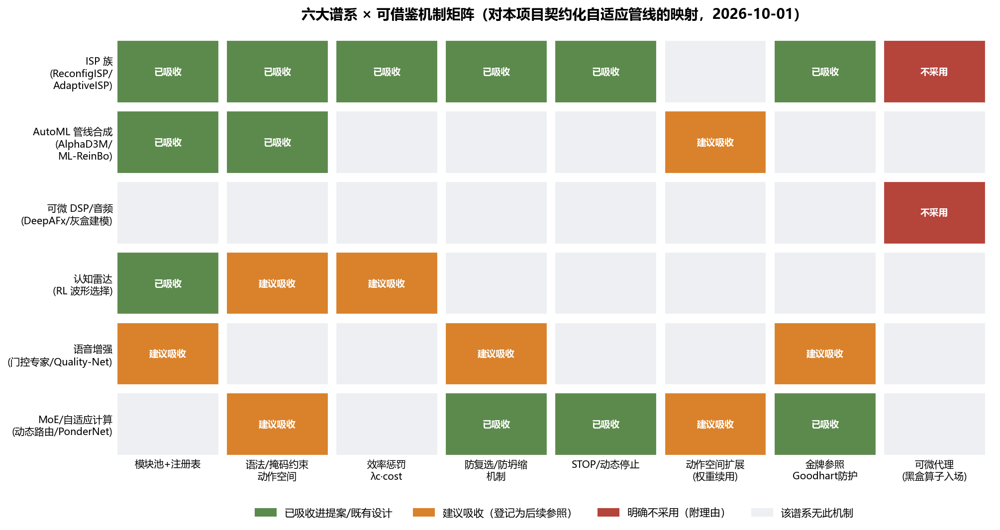
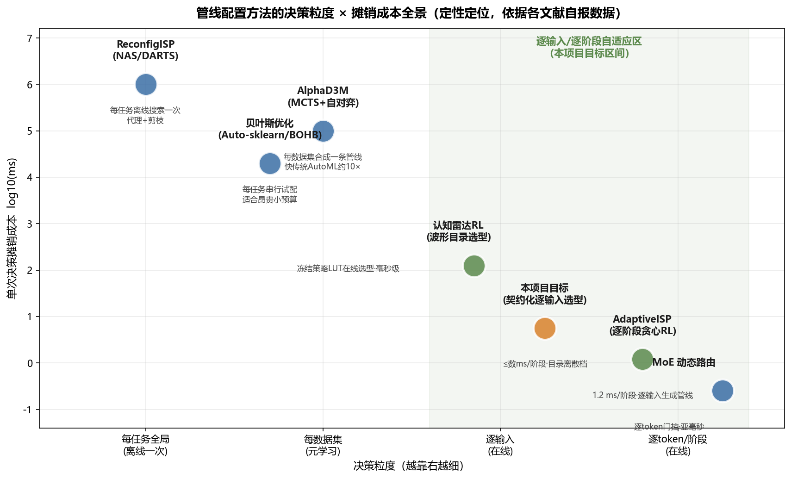

# 可扩展自适应处理管线：跨领域框架调研与借鉴清单（2026-10-01）

**性质**：纯调研文档，不含任何仓库改动；所有"吸收/不吸收"结论均已映射到 `docs/research/2026-10-01_contractual_adaptive_isp_proposal.md`（v0.1 草案，未冻结）或登记为后续参照。
**调研范围**：12 次定向检索，覆盖六个谱系——ISP 学习式配置、AutoML 管线合成、可微 DSP/音频效果链、认知雷达、语音增强门控、MoE/自适应计算——回答一个问题：**别人如何把"可扩展算子库 + 学习式管线/算子选择"做成可维护的工程体系，哪些机制值得我们借鉴**。

## 摘要（TL;DR）

"逐输入自适应选型"这一思路在六个领域均有独立先例，且已收敛出一套公共配方：**算子池（目录/注册表）+ 序列决策（RL 逐阶段贪心）+ 语法/掩码约束动作空间 + 效率惩罚 + 防坍缩监控 + 冻结参照在线校准**。我们当前的契约化 AdaptiveISP 提案与该配方高度同构，且因"奖励 = 冻结契约"而天然规避了文献中最大的失败模式（任务代理奖励的 Goodhart 过优化）。本轮调研新增三条值得吸收的机制（动作空间扩展的 CL 方案背书、负载均衡辅助损失、BO/RL 混合分工的边界确认），两条明确不采用（可微代理路线、端到端连续参数头）。

## 1. 谱系一：ISP 学习式配置——与我们最直接的血缘

### 1.1 ReconfigISP（ICCV 2021）：每任务一次的全局搜索

ReconfigISP 实现了 22 个 ISP 模块的模块池，用 CNN 代理网络把不可微模块可微化，再以 DARTS 式双层优化搜索管线架构，配合在线剪枝（逐步剪除低性能模块）与时延惩罚（损失乘时延函数）控制效率[^1^]。其关键工程事实是"**每个任务只需调数百个参数**"，且搜索到的最优管线随任务而变（目标检测任务中白平衡模块几乎无贡献而被弃选）[^2^]。

对我们的意义是双重的。正面：模块池 + 时延惩罚 + 剪枝这三件套已被我们吸收（算子目录 v0.2 即模块池；λc·cost 即时延惩罚；scope_limits 登记承担了"剪枝"的审计化变体——不删算子，而是显式登记失效区）。反面：ReconfigISP 是"每任务离线搜一条管线"，粒度停在场景族级，无法做到逐 B-scan 自适应；这正是 AdaptiveISP 和我们提案要越过的一步。其"可微代理"路线我们**明确不采用**（理由见 §7）。

### 1.2 AdaptiveISP（NeurIPS 2024）：逐输入贪心选型的完整实现细节

本轮检索补齐了原文附录中的实现细节，全部可直接对照我们的提案[^3^]：① **状态增强**——模块使用记录以 N 个额外通道（EC）输入策略网络，复用惩罚强制同一模块至多选一次，等价于我们"算子历史 one-hot + 目录合法性掩码"；② **防坍缩**——对策略输出熵加惩罚项 P_e，防止参数预测头欠学习，对应我们的"选择频率熵监控"；③ **终止设计**——T ≤ N 硬终止 + stage 通道，对应我们的 T_max=4 + STOP；④ **效率**——输入下采样至 64×64、1.2 ms/阶段，验证了我们的"≤数 ms/阶段"指标现实可达；⑤ **奖励结构**——R = D(s_i) − D(s_{i+1}) − P_i，其中 P_i = λe·熵项 + λc·时延项，与我们的 R = R_contract − λc·cost 同构，唯一实质差别是 D 为冻结 YOLO mAP（任务代理），我们换为冻结契约奖励（审计锚定）。

## 2. 谱系二：AutoML 管线合成——动作空间治理的老前辈

### 2.1 AlphaD3M：语法约束 + 序列决策 + 元学习

AlphaD3M 把管线合成为单人博弈：状态 = 当前管线 + 数据集元特征 + 任务，动作 = 插入/删除/替换原语，由手工设计的**上下文无关文法**约束合法动作集，LSTM + MCTS 自对弈搜索，比传统 AutoML 快约一个数量级[^4^][^5^]。三点直接映射到我们：① 语法规则数随原语数**线性增长**——这回答了"目录扩到 100+ 项后动作空间会不会爆炸"：只要合法性约束以 schema/语法表达而非穷举，扩展就是线性的，我们提案 §3.5 的"组合 schema 评审"正是这一机制；② 元学习跨任务迁移——状态中含数据集元特征，使策略可泛化到新数据集，对应我们"场景族参数作为状态一部分"的潜在扩展；③ 动作的可解释性——编辑操作序列本身就是审计轨迹，与我们的 r1/r2 双遍、逐 episode 锚校准纪律相容。

### 2.2 ML-ReinBo 与 BO 对照：分工边界的确认

ML-ReinBo 将管线合成显式分解为"**RL 学组合结构，贝叶斯优化调条件超参**"，在基准上优于随机搜索、TPE，并与 Irace 持平[^6^]。这一分工精确对应我们的"策略网络选（算子 ID, 离散档），目录标定管参数值"——离散档即"已被 BO/标定流程预优化过的条件超参"。纯 BO 路线（Auto-sklearn/SMAC、BOHB）适合"每任务搜一条配置"的昂贵小预算场景[^7^]，但其每次决策都要串行试配，摊销成本比 RL 策略网络高数个数量级，且天然做不到逐输入自适应（见图 2）。结论：**BO 是目录标定阶段的工具，RL 是在线选型阶段的工具**，两者在我们的体系里各居其位，不构成路线竞争。

## 3. 谱系三：可微 DSP/音频效果链——黑盒算子的入场方式及其代价

Adobe 的 DeepAFx 把第三方音频效果器插件包装为可微层嵌入深度网络，支持渐进式按链训练[^8^]；2025 年的系统综述进一步把可微建模分为黑盒（LSTM/TCN/GCN 拟合）与灰盒（Wiener-Hammerstein 结构 + 可微 FIR/IIR + 学习非线性）两路，并指出灰盒链中不同模块需要**差异化学习率**才能收敛到好的局部最优[^9^]。

这一谱系证明了"传统 DSP 算子可以被学习系统调度"，但也暴露了可微化路线的隐性成本：每个新算子入场都要先训一个代理网络并维护其保真度（ReconfigISP 的 proxy tuning 机制就是为补代理与真实算子的分布差而设[^1^]）。对我们而言，算子是确定性数组运算、RL 不需要奖励可微，因此**引入代理网络是纯增复杂度**，这是"不采用可微代理"的最硬理由。该谱系中我们仅借鉴一件事：其"按效果链分段、逐段验收"的工程组织方式，与我们批次验收惯例一致。

## 4. 谱系四：认知雷达——与 GPR 同宗的 RL 选型成熟先例

认知雷达的 RL 波形选择是最接近我们问题结构的成熟领域：波形库 = 算子目录，环境熵/跟踪误差协方差 = 状态，Q-learning/DQN 选下一时刻波形[^10^][^11^]。2024 年 TU Delft 的多智能体 RL 波形优化论文引入集中式 critic 稳定训练[^12^]；Thornton 的博士论文系统比较了 DQN、策略迭代与上下文老虎机，并给出两个对我们有直接操作价值的结论：① **冻结策略部署为查找表（LUT）**可将在线选型压到毫秒级，训练与部署解耦[^13^]；② 样本效率不足时**上下文老虎机**（无状态转移建模、只看即时奖励）是有效的降级方案[^13^]。2025 年 JSTARS 的 NLFM 认知雷达工作进一步把"熵奖励 Q-learning + 波形目录"做成硬件实测平台，证明了该范式可落地到真实射频系统[^14^]。

借鉴清单：冻结策略 LUT 部署模式登记为我们的 D2 验证参照；上下文老虎机作为"PPO 训练不稳时的降级预案"登记进训练规范的候选条款。

## 5. 谱系五与六：语音门控与 MoE——逐输入选择 + 防坍缩的独立验证

语音增强领域已出现"逐输入选择处理模型"的商用级先例：Quality-Net 方案用非侵入式质量评估网络在推理时为每段输入选择最合适的增强模型（零样本模型选择），DAEME 则用门控模块在多分支专家编码器间按输入路由[^15^]。这与我们"逐 B-scan 选算子链"是同构问题，且其门控网络结构与我们的策略网络职责一致。

MoE/自适应计算谱系贡献了两条机制级借鉴：① **负载均衡辅助损失**（Switch Transformer 式 aux loss，防止路由坍缩到少数专家）——比我们目前仅"监控熵、报警不干预"多一层主动防护，建议作为训练规范的候选增强项登记[^16^]；② **动态停止**（PonderNet/ACT 的可学习停机、early-exit 网络）——为我们的 STOP 动作提供了理论 backing：停止时机本身是可学策略的一部分，而非纯工程截断[^17^]。

## 6. Goodhart 防护：奖励篡改文献对我们护栏的校准

RLHF/奖励建模文献把 Goodhart 失败刻画为可预测的标度律：代理奖励随优化强度单调上升，真实质量先升后降，分叉点可由 KL 预算预测[^18^][^19^]。主流防护三板斧：① KL 约束/早停（限制偏离参考策略的幅度）；② **冻结的金牌参照指标**与训练奖励并行监控，分叉即报警；③ 评估器锁定（评估代码与 agent 可写空间隔离）[^19^][^20^]。

逐条对照我们的 §7 护栏：我们的 identity/oracle 结构锚逐 episode 同步评价，正是"金牌参照在线监控"的同构物，且比 RLHF 场景更强——锚是解析解而非学习的奖励模型，不存在分布外失真；"契约 JSON 冻结 + 哈希内嵌"就是评估器锁定；"禁止从训练表现倒推契约参数"切断了 KL 类约束在我们场景的对应通道（我们不调策略与参考策略的 KL，而是冻结奖励定义本身）。文献还提示一条我们尚未显式登记的：**策略坍缩的"熵报警"应同时看奖励曲线与锚读数的分叉**，建议补入训练规范候选条款。

## 7. 明确不采用的两条路线（及理由）

| 路线 | 来源谱系 | 不采用理由 |
|---|---|---|
| 可微代理 + 梯度搜索（ReconfigISP/DARTS 式） | ISP、可微 DSP | 我们的算子是确定性数组运算、RL 无需可微性；代理网络引入额外训练与保真度维护负担（proxy tuning 即为修补代理-真实分布差而生）[^1^][^3^] |
| 连续参数预测头（AdaptiveISP 原生 tanh 头） | ISP | 连续参数会绕过目录离散档的损伤阶梯标定证据；离散档纪律已在提案 §3 冻结为设计前提 |

两点都属于"别人验证过、但与本项目审计纪律冲突"的情形——不是技术不可行，而是引入的证据缺口大于收益。

## 8. 决策粒度全景与本项目定位

把七个方法按"决策粒度 × 单次决策摊销成本"定位（图 2）：NAS/BO/AlphaD3M 类停在"每任务/每数据集一条管线"（离线搜索，摊销成本小时级）；认知雷达、AdaptiveISP、MoE 占据"逐输入/逐阶段在线决策"区（毫秒级）。本项目目标区间明确落在后者：**GPR 领域目前没有同粒度的工作**——现有 GPR 深度学习处理链（如 Giannakis 组的背景去除→速度估计→RTM 全 ML 管线[^21^]）是"每步一个固定网络"，行星 GPR 综述明确指出"处理管线依赖手动调参、输出不唯一"是公认痛点[^22^]；地震工业的 ML 部署（PGS/TGS）同样是单步 ML 化而非管线级决策[^23^]，地震流程自动化中最接近的井震标定工作用的也是 BO 逐任务调参[^24^]。这确认了方向上的先发位置。

## 9. 吸收结论汇总

| # | 机制 | 来源 | 处置 |
|---|---|---|---|
| 1 | 模块池 + 目录升版 + scope_limits 登记 | ReconfigISP 模块池 / 仓库既有惯例 | **已吸收**（目录 v0.2 + 提案 §3.5） |
| 2 | 语法/掩码约束动作空间（线性扩展） | AlphaD3M CFG | **已吸收**（提案 §3 掩码 + §3.5 组合 schema） |
| 3 | 效率惩罚 λc·cost（推理期可调） | AdaptiveISP、ReconfigISP | **已吸收**（提案 §4） |
| 4 | 防复选（EC 通道 + 复用惩罚） | AdaptiveISP | **已吸收**（提案 §2 状态定义） |
| 5 | STOP/动态停止 | AdaptiveISP T≤N；PonderNet/ACT | **已吸收**（提案 §2） |
| 6 | 动作空间扩展：扩列 + 旧神经元冻结 + 新列初始化 | Action-Adaptive CL[^25^] | **已吸收**（提案 §3.5 步骤④，本轮新增文献背书） |
| 7 | 金牌参照在线监控 + 评估器锁定 | Goodhart/RLHF 文献[^18^][^19^][^20^] | **已吸收**（identity/oracle 锚 + 契约冻结惯例） |
| 8 | 冻结策略 LUT 部署 | 认知雷达[^13^] | **登记为 D2 验证参照** |
| 9 | 负载均衡辅助损失（防坍缩从监控升级为防护） | MoE/Switch Transformer[^16^] | **登记为训练规范候选增强项** |
| 10 | 上下文老虎机降级预案 | 认知雷达[^13^] | **登记为训练规范候选条款** |
| 11 | 锚读数与奖励曲线分叉报警 | Goodhart 文献[^19^] | **登记为训练规范候选条款** |
| 12 | 元学习跨场景族泛化（状态含族参数） | AlphaD3M[^4^][^5^] | **登记为后续版本候选**（B2 采样设计冻结时再议） |
| — | 可微代理 / 连续参数头 | ISP、可微 DSP | **不采用**（§7） |

## 10. 对下一步的影响

调研结论不改变既定缺口清单（A1 G4 解除、A2 S1/S3 重校准、B2/B3/B4、C1–C3、D1–D3），但为三处提供了落地依据：① 提案 §3.5 扩展规范已有 CL 文献背书，可随 B1 一并过目；② 训练规范（C3）起草时直接纳入第 9–11 条候选条款；③ D2 验证方案可按"冻结策略 LUT"形态设计。用户决策点不变：**B1 提案过目 → 冻结脚本起草；A1 G4 签认**。

## 注释（来源链接）

[^1^]: ReconfigISP: Reconfigurable Camera Image Processing Pipeline (ICCV 2021) — https://arxiv.org/abs/2109.04760
[^2^]: ReconfigISP 项目页（模块池 22 项、检测任务弃选白平衡） — https://www.mmlab-ntu.com/project/reconfigisp/
[^3^]: AdaptiveISP: Learning an Adaptive Image Signal Processor for Object Detection (NeurIPS 2024，含附录实现细节) — https://arxiv.org/html/2410.22939v1
[^4^]: AlphaD3M: Machine Learning Pipeline Synthesis — https://arxiv.org/html/2111.02508v1
[^5^]: AlphaD3M 语法约束与自对弈（AutoML WS 2019） — https://www.automl.org/wp-content/uploads/2019/06/automlws2019_Paper34.pdf
[^6^]: ML-ReinBo: RL 组合结构 + BO 条件超参（LMU 学位论文） — https://epub.ub.uni-muenchen.de/68471/1/MA_Lin_Jiali.pdf
[^7^]: BOHB: Robust and Efficient Hyperparameter Optimization at Scale（经 Semantic Scholar 条目） — https://www.semanticscholar.org/paper/e0780e40b56a11c76ce6a31adf42d4420e24aebf
[^8^]: DeepAFx: 第三方音频效果插件作为可微层（Adobe Research） — https://github.com/adobe-research/DeepAFx
[^9^]: Differentiable black-box and gray-box modeling of nonlinear audio effects（Frontiers in Signal Processing, 2025） — https://www.frontiersin.org/journals/signal-processing/articles/10.3389/frsip.2025.1580395/full
[^10^]: A Cognitive Radar Waveform Optimization Approach Based on DRL（ICSIDP 2019） — https://ui.adsabs.harvard.edu/abs/2019sidp.conf..389W/abstract
[^11^]: Adaptive waveform selection algorithm based on RL for cognitive radar（AUTEEE 2019） — https://pure.bit.edu.cn/en/publications/adaptive-waveform-selection-algorithm-based-on-reinforcement-lear/
[^12^]: Multi-agent reinforcement learning for radar waveform design（TU Delft, 2024） — https://repository.tudelft.nl/record/uuid:c5f8d40b-0035-4ec5-8834-863e451d0c0f
[^13^]: On the Value of Online Learning for Cognitive Radar（Thornton 博士论文, Virginia Tech） — https://vtechworks.lib.vt.edu/bitstreams/ad94d9f8-a980-4101-82c4-17db06afb6a8/download
[^14^]: Nonlinear Waveform Sensing for Cognitive Radar Based on RL（IEEE JSTARS 2025） — https://doaj.org/article/d8ae7c015bbf4310af3a5e681beaf0b2
[^15^]: Speaker Adaptation Using DNNs For Speech Enhancement（综述，含 Quality-Net 零样本模型选择与 DAEME 门控） — https://www.awarenessjournals.com/journal/speaker-adaptation-using-deep-neural-networks-for-speech-enhancement
[^16^]: Harder Task Needs More Experts: Dynamic Routing in MoE Models（ACL 2024） — https://aclanthology.org/2024.acl-long.696.pdf
[^17^]: Continuous Thought Machines（相关工作节系统梳理 ACT/PonderNet/动态停机） — https://arxiv.org/pdf/2505.05522
[^18^]: Scaling laws for reward model overoptimization 的综述性转述（arXiv 2507.13158） — https://www.arxiv.org/pdf/2507.13158
[^19^]: Reward Hacking in the Era of Large Models（2026 综述，统一机制与防护分类） — https://arxiv.org/html/2604.13602v1
[^20^]: Post-processing Networks: RL 优化任意模块组成的管线（arXiv 2207.12185） — https://ar5iv.labs.arxiv.org/html/2207.12185
[^21^]: Patsia, Giannopoulos, Giannakis: Background removal, velocity estimation, and RTM — a complete GPR processing pipeline based on ML（IEEE TGARS 2023，经 arXiv 2410.14386 引文 [18]） — https://arxiv.org/html/2410.14386v1
[^22^]: Investigating the Capabilities of Deep Learning for One-Shot Multi-offset GPR Data（行星 GPR，管线手动调参痛点） — https://arxiv.org/html/2410.14386v1
[^23^]: Large-scale industrial deployment of ML workflows for seismic data processing（Oukili et al., First Break 2023） — https://www.tgs.com/hubfs/Technical%20Library/Technical%20Library%20Files/fb_oukili_et_al_dec2023_ml_dataprocesing.pdf
[^24^]: Partial automation of the seismic to well tie with deep learning and Bayesian optimization（Computers & Geosciences 2022） — https://ui.adsabs.harvard.edu/abs/2022CG....16405120T/abstract
[^25^]: Action-Adaptive Continual Learning: Policy Generalization under Dynamic Action Spaces（arXiv 2506.05702） — https://arxiv.org/html/2506.05702v1
